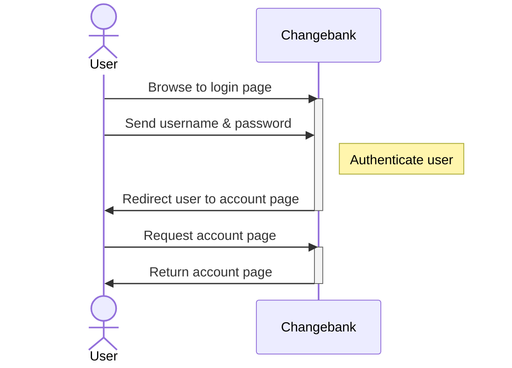
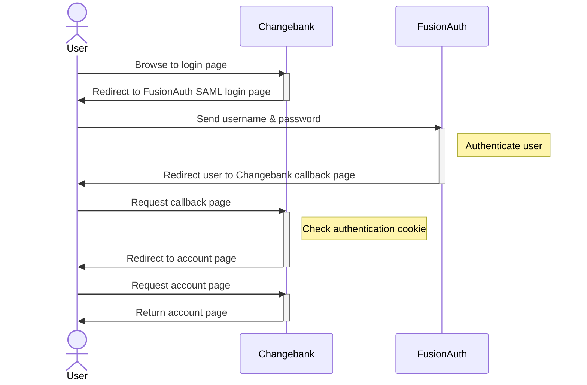
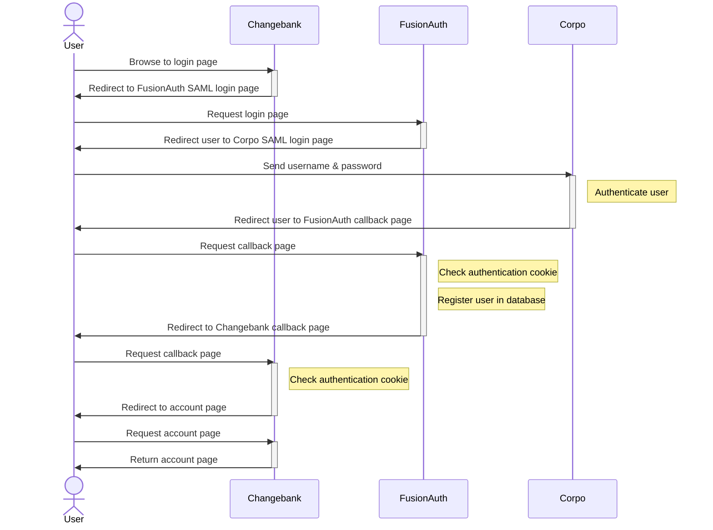

import EnterprisePlanBlurb from 'src/content/docs/_shared/_enterprise-plan-blurb.astro';
import Breadcrumb from 'src/components/Breadcrumb.astro';
import InlineField from 'src/components/InlineField.astro';
import InlineUIElement from 'src/components/InlineUIElement.astro';
import Aside from 'src/components/Aside.astro';


- [Authentication Flow Of The Examples](#authentication-flow-of-the-examples)
- [Start FusionAuth And Configure SAML](#start-fusionauth-and-configure-saml)
- [Clean Up](#clean-up)
- [TODO](#todo)

<EnterprisePlanBlurb />

This guide shows you how to authenticate users with SAML via FusionAuth with a full code example. To learn more about SAML in general, please see the [FusionAuth SAML overview](https://fusionauth.io/docs/lifecycle/authenticate-users/saml).

Consider the following example. You provide a financial service on the Internet to users who log in to your website, called Changebank.com. Until now, the website has managed its own user authentication with usernames and passwords. You haven't used FusionAuth before. You have a new corporate client, called Corpo.com, who wants all its employees to use your service, but authentication will be done with SAML, using Corpo as the identity provider (party that holds the database of users). FusionAuth can be used to add SAML authentication to your website. In this case FusionAuth will be used only as a service provider (requesting party), not an identity provider.

Let's also consider the possibility that the Corpo.com is happy to let your website act as the identity provider, as long as SAML is used. In either case, you'll use FusionAuth to manage SAML, hiding the complexity of the protocol from your website.

## Authentication Flow Of The Examples

Before configuring FusionAuth to support these examples, let's look at how the SAML authentication process works. If you used OAuth before, the flow is almost identical — it's only the underlying implementation that differs between OAuth and SAML.

First, consider the simple case when your website, Changebank.com, does its own authentication, shown below. Only two parties are involved: the user and the website.



Next, consider using FusionAuth as the identity provider for login. Instead of letting the user log in on your site, you'll redirect them to FusionAuth to log in, where an identifying cookie will be stored in their browser, and they'll be sent back to your site. Using FA as an identity provider is documented [here](https://fusionauth.io/docs/lifecycle/authenticate-users/saml).



Finally, consider the Corpo.com original business request — that Corpo acts as the identity provider. In this case, there are four parties: the user, Changebank, FusionAuth acting as a service provider, and Corpo acting as the identity provider. The authentication flow now is similar to other flow above, with one more level of redirection. Using FA as a service provider to connect to another identity provider is documented [here](https://fusionauth.io/docs/lifecycle/authenticate-users/identity-providers/overview-samlv2).



In all the cases above, if the user already has an authentication cookie, the login page will be bypassed and they will be redirected to their account page.

## Start FusionAuth And Configure SAML

Let's start the example by running a new instance of FusionAuth and configuring it to use SAML. For compatibility and safety, you'll run all code inside [Docker](https://www.docker.com/get-started/).

- Use `git clone` to clone the repository at https://github.com/FusionAuth/fusionauth-example-docker-compose, or download and unzip it.
- Open a terminal in the directory containing the repository files.
- Run the command below to start FusionAuth.
  ```sh
  cd light
  docker compose up
  ```

<Aside type="note">
If you have completed any FusionAuth tutorials before, you might need to first delete any existing FusionAuth containers with the same name and the database volumes. Run the command below to do that.

```sh
docker rm fa fa_db; docker compose down -v
```
</Aside>

This command started FusionAuth using Kickstart, which automatically creates an example application with an example user called richard@example.com. Using Kickstart saves you the time of having to configure everything yourself when following this tutorial.

- Log in to your FusionAuth web interface at http://localhost:9011/admin with credentials `admin@example.com` and `password`.
- Browse to <Breadcrumb>Reactor</Breadcrumb>.
- Enter your license key to activate Reactor and refresh the page.

<Aside type="note">
If you have any trouble with this tutorial, try replacing the FusionAuth image in the Docker compose file with `fusionauth/fusionauth-app:1.54.0`, in case future versions of FusionAuth introduced a breaking change.
</Aside>

- Browse to <Breadcrumb>Applications -> Bank -> Edit -> SAML tab</Breadcrumb>.
  - Enable <InlineUIElement>Enabled</InlineUIElement>
  - Set <InlineField>Issuer</InlineField> to `passport-saml`.
  - Set <InlineField>Authorized redirect URLs</InlineField> to `http://localhost:3000/saml/callback` (be sure to click the dropdown text that appears to confirm the entry).
  - Enable <InlineUIElement>Debug enabled</InlineUIElement>.
  - Save.
  - Click <InlineUIElement>View</InlineUIElement> for the application to see the SAML endpoints. They should like the ones below.
  ```
  SAML v2 Integration details

  Entity Id: http://localhost:9011/samlv2/d7d09513-a3f5-401c-9685-34ab6c552453
  Login URL: http://localhost:9011/samlv2/login/d7d09513-a3f5-401c-9685-34ab6c552453
  Logout URL: http://localhost:9011/samlv2/logout/d7d09513-a3f5-401c-9685-34ab6c552453
  Metadata URL: http://localhost:9011/samlv2/metadata/d7d09513-a3f5-401c-9685-34ab6c552453
  NameIDFormat: urn:oasis:names:tc:SAML:1.1:nameid-format:emailAddress
  Initiate login URL: http://localhost:9011/samlv2/initiate-login/d7d09513-a3f5-401c-9685-34ab6c552453/e9fdb985-9173-4e01-9d73-ac2d60d1dc8e

  SAML

  Enabled: Yes
  Issuer: changebank
  Audience: changebank
  Authorized redirect URLs: http://saml/redirect
  Logout URL: –
  Debug enabled: Yes
  Require signed AuthN requests: No
  Enable login hint:
  Login hint parameter name: login_hint
  AuthN response signing key: SAML key generated for application Changebank
  f0926c58-74a8-4d3c-886e-24732f11f4f6
  ```
  -

TODO

get passportjs to connect to fa

https://github.com/node-saml/passport-saml
https://github.com/gbraad/passport-saml-example
https://github.com/jaredhanson/passport

```https://www.antoniogioia.com/saml-sso-setup-with-express-and-passport/
For a basic Service Provider configuration, you need:

- Your cert keys
- Identity Provider metadata page
- Identity Provider entry point URL

And you, as the Service Provider, have to provide to the Identity Provider:

- Your metadata page
- Your callback URL
```

Create cert
```sh
mkdir app/cert
cd app/cert
openssl req -x509 -newkey rsa:4096 -keyout key.pem -out cert.pem -days 365 -nodes -subj "/CN=fa"
```
Creates `cert.pem` and `key.pem`. Keep the key secret.

- Browse to the metadata endpoint above, http://localhost:9011/samlv2/metadata/d7d09513-a3f5-401c-9685-34ab6c552453.
- You can find the public key that you need to have on your server. Find the tag X509Certificate, copy the content into a file named `idp_key.pem`, and save it in the cert folder.


```sh
docker run --platform=linux/amd64 --rm -v ".:/app" -w "/app"  denoland/deno:alpine-2.1.3 sh -c  "deno install"
docker run --platform=linux/amd64 --rm -v ".:/app" -w "/app" --name app --network faNetwork  -p 3000:3000 denoland/deno:alpine-2.1.3 sh -c  "deno run --allow-net --allow-read --allow-env --unstable-detect-cjs ./bin/www"
```

## Clean Up

To remove all the Docker volume, containers, images, and networks used in this guide, run the commands below.

```sh
docker compose down -v
docker rm fa fa_db
docker rmi postgres:16.0-bookworm fusionauth/fusionauth-app:latest denoland/deno:alpine-2.1.3
docker network prune;
```


## TODO

let user log in to fa with saml. let user log into another system via fa with saml.
add link to this guide from saml overview introduction
check bullet points and differentiate for actions

Show how admin users of a tenant can configure a SAML connection (using the API to add/update FusionAuth Identity Provider)
show how users in different tenants can log in with saml or oauth
add link to SMIL article
add link to both articles in github issue
delete contents