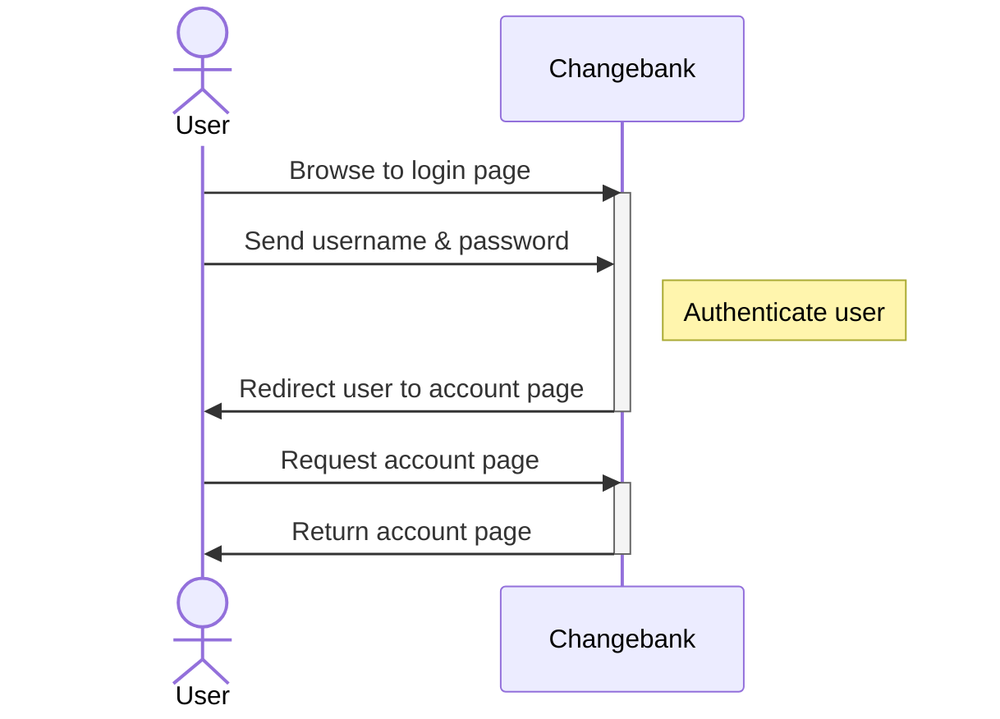
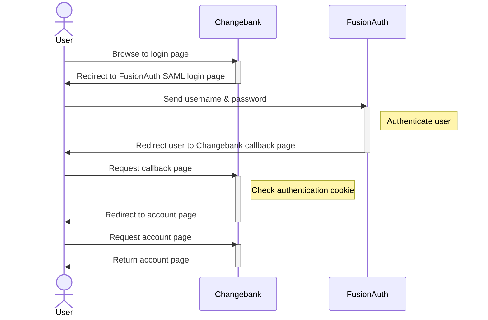
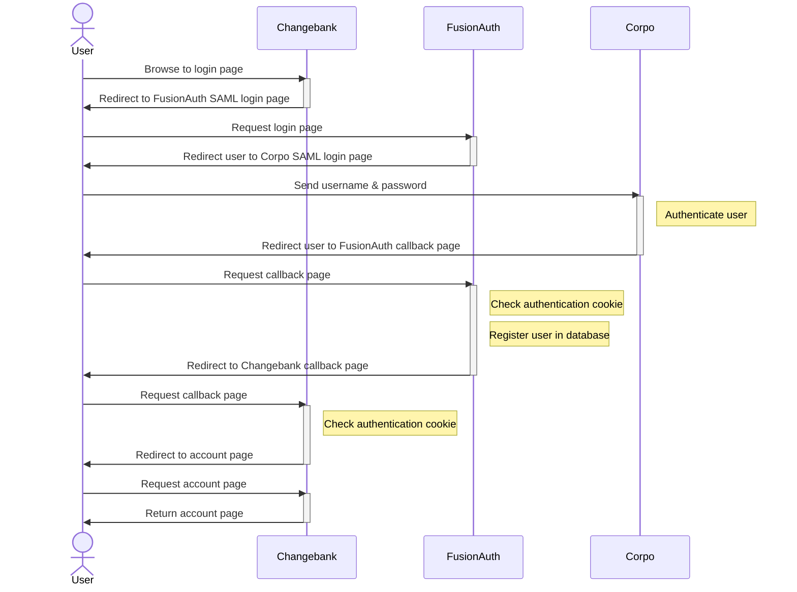

import EnterprisePlanBlurb from 'src/content/docs/_shared/_enterprise-plan-blurb.astro';
import Breadcrumb from 'src/components/Breadcrumb.astro';
import InlineField from 'src/components/InlineField.astro';
import InlineUIElement from 'src/components/InlineUIElement.astro';
import Aside from 'src/components/Aside.astro';


- [Authentication Flow Of The Examples](#authentication-flow-of-the-examples)
- [Example 1: Configure FusionAuth As A SAML Identity Provider](#example-1-configure-fusionauth-as-a-saml-identity-provider)
  - [Run FusionAuth And The Initial Website](#run-fusionauth-and-the-initial-website)
  - [Configure FusionAuth To Use SAML](#configure-fusionauth-to-use-saml)
  - [Configure The Website To Use SAML](#configure-the-website-to-use-saml)
  - [Explanation Of The New Code](#explanation-of-the-new-code)
- [Example 2: Configure FusionAuth As A SAML Service Provider](#example-2-configure-fusionauth-as-a-saml-service-provider)
- [Configure SAML With The FusionAuth API](#configure-saml-with-the-fusionauth-api)
- [Clean Up](#clean-up)
- [TODO](#todo)

<EnterprisePlanBlurb />

This guide shows you how to authenticate users with SAML via FusionAuth with a full code example. To learn more about SAML in general, please see the [FusionAuth SAML overview](https://fusionauth.io/docs/lifecycle/authenticate-users/saml).

Consider the following example. You provide a financial service on the Internet to users who log in to your website, called Changebank.com. Until now, the website has managed its own user authentication with usernames and passwords. You haven't used FusionAuth before. You have a new corporate client, called Corpo.com, who wants all its employees to use your service, but authentication will be done with SAML, using Corpo as the identity provider (party that holds the database of users). FusionAuth can be used to add SAML authentication to your website. In this case FusionAuth will be used only as a service provider (requesting party), not an identity provider.

Let's also consider the possibility that the Corpo.com is happy to let your website act as the identity provider, as long as SAML is used. In either case, you'll use FusionAuth to manage SAML, hiding the complexity of the protocol from your website.

## Authentication Flow Of The Examples

Before configuring FusionAuth to support these examples, let's look at how the SAML authentication process works. If you used OAuth before, the flow is almost identical — it's only the underlying implementation that differs between OAuth and SAML.

First, consider the simple case when your website, Changebank.com, does its own authentication, shown below. Only two parties are involved: the user and the website.



Next, consider using FusionAuth as the identity provider for login. Instead of letting the user log in on your site, you'll redirect them to FusionAuth to log in, where an identifying cookie will be stored in their browser, and they'll be sent back to your site. Using FA as an identity provider is documented [here](https://fusionauth.io/docs/lifecycle/authenticate-users/saml).



Finally, consider the Corpo.com original business request — that Corpo acts as the identity provider. In this case, there are four parties: the user, Changebank, FusionAuth acting as a service provider, and Corpo acting as the identity provider. The authentication flow now is similar to other flow above, with one more level of redirection.

Using FA as a service provider to connect to another identity provider is documented [here](https://fusionauth.io/docs/lifecycle/authenticate-users/identity-providers/overview-samlv2).



In all the cases above, if the user already has an authentication cookie, the login page will be bypassed and the user will be redirected to their account page.

## Example 1: Configure FusionAuth As A SAML Identity Provider

In this section, you'll configure FusionAuth as the SAML identity provider, where users do not have to log in with Corpo.com. This is simpler than using FA as a service provider, so you'll do that in the following section.

### Run FusionAuth And The Initial Website

Start by running a new instance of FusionAuth and configuring it to use SAML. For safety and compatibility with any operating system, you'll run all code inside [Docker](https://www.docker.com/get-started/).

- Use `git clone` to clone the repository at https://github.com/FusionAuth/fusionauth-example-saml, or download and unzip it.
- Open a terminal in the directory containing the repository files.
- Run the command below to start FusionAuth.
  ```sh
  docker compose up
  ```

<Aside type="note">
If you have completed any FusionAuth tutorials before, you might need to first delete any existing FusionAuth containers with the same name and the database volumes. Run the command below to do that.

```sh
docker rm fa fa_db; docker compose down -v
```
</Aside>

This command started FusionAuth using Kickstart, which automatically creates an example application with example users. Using Kickstart saves you the time of having to configure everything yourself when following this tutorial.

<Aside type="note">
If you have any trouble with this tutorial, try replacing the FusionAuth image in the Docker compose file with `fusionauth/fusionauth-app:1.54.0`, in case future versions of FusionAuth introduced a breaking change.
</Aside>

In addition to FA, there are two websites included in this repository. You'll work with the first one, `appIdP`, in this section and then `appSP` in the next section. `appIdP` represents the Change bank website your company owns in this example. The site currently uses OAuth for login, not bespoke authentication, which is slightly different from the example description, but unimportant — the focus of this example is switching the site to use SAML authentication.

Look at how the website currently looks before adding SAML.

- Open a new terminal and run the commands below.
  ```sh
  cd appIdP

  docker run --platform=linux/amd64 --rm -v ".:/app" -w "/app"  node:23-alpine3.19 sh -c  "npm install"

  docker run --platform=linux/amd64 --rm -v ".:/app" -w "/app" --name app --network faNetwork  -p 3000:3000 node:23-alpine3.19 sh -c  "npm run start"
  ```

These commands will install the Node.js packages in `package.json`, and run the Express.js web server on the same network as the FusionAuth server, `faNetwork`.

- Browse to http://localhost:3000.
- Log in to the Changebank website with `richard@example.com` and `password`.

### Configure FusionAuth To Use SAML

Configure FusionAuth to use SAML for the Changebank application in the FusionAuth web interface.

- Log in to your FusionAuth web interface at http://localhost:9011/admin with credentials `admin@example.com` and `password`.
- Browse to <Breadcrumb>Reactor</Breadcrumb>.
- Enter your license key to activate Reactor and refresh the page.
- Browse to <Breadcrumb>Applications -> Changebank -> Select -> Edit -> SAML tab</Breadcrumb>.
  - Enable <InlineUIElement>Enabled</InlineUIElement>
  - Set <InlineField>Issuer</InlineField> to `passport-saml`.
  - Set <InlineField>Authorized redirect URLs</InlineField> to `http://localhost:3000/saml/callback` (be sure to click the dropdown text that appears to confirm the entry).
  - Enable <InlineUIElement>Debug enabled</InlineUIElement>.
  - Save.
- Click <InlineUIElement>View</InlineUIElement> for the application to see the SAML endpoints. They should like the ones below, though your UUIDs may be different.
  ```
  SAML v2 Integration details

  Entity Id: http://localhost:9011/samlv2/d7d09513-a3f5-401c-9685-34ab6c552453
  Login URL: http://localhost:9011/samlv2/login/d7d09513-a3f5-401c-9685-34ab6c552453
  Logout URL: http://localhost:9011/samlv2/logout/d7d09513-a3f5-401c-9685-34ab6c552453
  Metadata URL: http://localhost:9011/samlv2/metadata/d7d09513-a3f5-401c-9685-34ab6c552453
  NameIDFormat: urn:oasis:names:tc:SAML:1.1:nameid-format:emailAddress
  Initiate login URL: http://localhost:9011/samlv2/initiate-login/d7d09513-a3f5-401c-9685-34ab6c552453/e9fdb985-9173-4e01-9d73-ac2d60d1dc8e

  SAML

  Enabled: Yes
  Issuer: changebank
  Audience: changebank
  Authorized redirect URLs: http://saml/redirect
  Logout URL: –
  Debug enabled: Yes
  Require signed AuthN requests: No
  Enable login hint:
  Login hint parameter name: login_hint
  AuthN response signing key: SAML key generated for application Changebank
  f0926c58-74a8-4d3c-886e-24732f11f4f6
  ```

### Configure The Website To Use SAML

FusionAuth is now ready to accept SAML logins. Next is to add the callback URL above as a page in the existing website, to configure SAML on the website, and reference FusionAuth's SSL certificate to ensure security.

The existing code uses three main files: `services/authentication.js`, which uses Passport.js to manage OAuth, `routes/index.js`, which handles HTTP requests to HTML templates or authentication callbacks, and `app.js`, which loads both of these files into Express.js.

To add SAML, you'll add the Passport strategy for SAML to `authentication.js` and add login and callback routes to `index.js`.

- Browse to the `Metadata URL` endpoint above, http://localhost:9011/samlv2/metadata/d7d09513-a3f5-401c-9685-34ab6c552453. If your URL UUID is different, use your one.
- Copy the text in between the tags labelled `<X509Certificate>`, copy the content into a file named `appIdP/cert/cert.pem`, and save it in the cert folder.
- Add the `Login URL` below from the FA metadata to `appIdP/.env`
  ```
  SAML_URL="http://localhost:9011/samlv2/login/d7d09513-a3f5-401c-9685-34ab6c552453"
  ```
- Add the line below to the top of the `dependencies` section of `package.json`.
  ```
  "@node-saml/passport-saml": "^5.0.0",
  ```
- Add the line below to the top of `appIdP/services/authentication.js`.
  ```js
  const SamlStrategy = require("passport-saml").Strategy;
  ```
- In the same file, add the line below to the end of the `setupPassport` function.
  ```js
    setupSaml(passport);
  ```
- In the same file, add the function below.
  ```js
  function setupSaml(passport) {
    const samlOptions = {
      path: "/saml/callback",
      entryPoint: process.env.SAML_URL,
      issuer: "passport-saml",
      cert: fs.readFileSync('cert/cert.pem', 'utf8')
    };
    passport.use(
      "saml",
      new SamlStrategy(
        samlOptions,
        function (user, callback) { callback(null, user); }, //for signon
        function (user, callback) { callback(null, user); }  //for logout
      )
    );
  }
  ```
- In the file `appIdP/routes/index.js` replace the current OAuth login line with a new SAML login.
  ```js
  // router.get("/login", passport.authenticate("oauth2"));

  router.get("/login", passport.authenticate("saml", { failureRedirect: "/", failureFlash: true }), function (req, res) {res.redirect("/");});
  ```
- In the same file, add the SAML callback handler below.
  ```js
  router.post("/saml/callback",
    bodyParser.urlencoded({ extended: false }),
    passport.authenticate("saml", {
      failureRedirect: "/",
      failureFlash: true,
    }),
    function (req, res, next) {
      res.redirect("/account");
    }
  );
  ```
- In the website terminal, run the Node commands again to install the new SAML package and restart the webserver.
  ```sh
  cd appIdP

  docker run --platform=linux/amd64 --rm -v ".:/app" -w "/app"  node:23-alpine3.19 sh -c  "npm install"

  docker run --platform=linux/amd64 --rm -v ".:/app" -w "/app" --name app --network faNetwork  -p 3000:3000 node:23-alpine3.19 sh -c  "npm run start"
  ```

You can now browse to http://localhost:3000 and log in in exactly the same way as before, except the underlying protocol is SAML, not OAuth. You can see the URL of the FusionAuth login page has changed.

### Explanation Of The New Code

SAML is more strict with SSL certificates than OAuth. You needed to copy the certificate from FusionAuth into your website in order for SAML to trust it.

In the authentication JavaScript file, you added SAML as a strategy. Passport.js can use multiple strategies, so you didn't need to remove OAuth. Each strategy is identified by a different label, like `saml`. The `setupSaml` function sets some options to match the settings in the SAML data from FusionAuth. The function then instantiates the new Passport SAML strategy with two functions that handle what happens to the user profile returned from the identity provider. You can process the user further in these functions, like saving her to a database, but here you are doing nothing except saying you are done. Express session storage (`express-session`) is already being used to store the user profile in a cookie that is sent to the user's browser.

The code changes to the routes file are minimal, barely changing what is in the Passport documentation. You comment out the OAuth login route because in this example the customer wanted to switch entirely to SAML. And you add a simple login route to direct the user to FusionAuth, and a callback handler to direct the logged-in user to their account.

For more information on SAML in Passport, please see the official documentation on GitHub: https://github.com/node-saml/passport-saml, https://github.com/jaredhanson/passport, and https://github.com/gbraad/passport-saml-example.

## Example 2: Configure FusionAuth As A SAML Service Provider

## Configure SAML With The FusionAuth API

## Clean Up

To remove all the Docker volume, containers, images, and networks used in this guide, run the commands below.

```sh
docker compose down -v
docker rm fa fa_db fa2 fa_db2
docker rmi postgres:16.0-bookworm fusionauth/fusionauth-app:latest node:23-alpine3.19
docker network prune;
```


## TODO

fa
let user log in to fa with saml. let user log into another system via fa with saml.
add link to this guide from saml overview introduction
check bullet points and differentiate for actions

Show how admin users of a tenant can configure a SAML connection (using the API to add/update FusionAuth Identity Provider)
show how users in different tenants can log in with saml or oauth
add link to SMIL article
add link to both articles in github issue
delete toc
readme