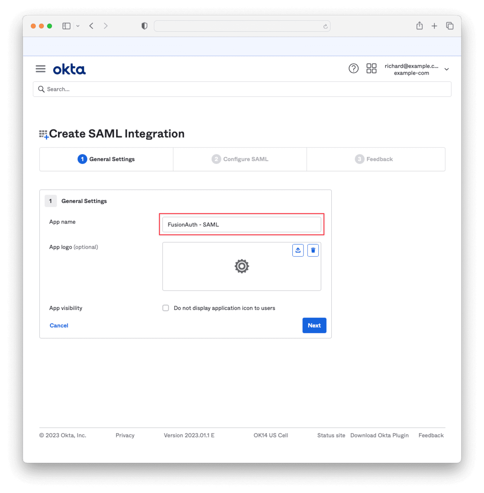
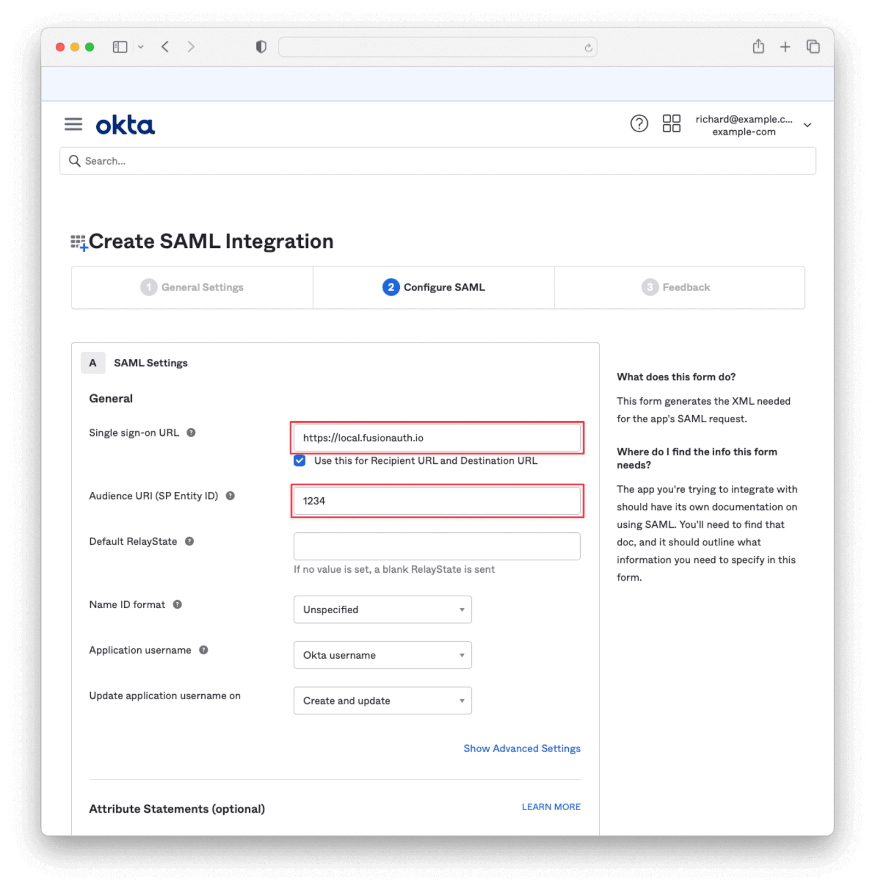

import EnterprisePlanBlurb from 'src/content/docs/_shared/_enterprise-plan-blurb.astro';
import Breadcrumb from 'src/components/Breadcrumb.astro';
import InlineField from 'src/components/InlineField.astro';
import InlineUIElement from 'src/components/InlineUIElement.astro';
import Aside from 'src/components/Aside.astro';
import Diagram1 from 'src/diagrams/docs/lifecycle/examples/saml1.astro';
import Diagram2 from 'src/diagrams/docs/lifecycle/examples/saml2.astro';
import Diagram3 from 'src/diagrams/docs/lifecycle/examples/saml3.astro';

<EnterprisePlanBlurb />

This guide shows you how to authenticate users with SAML via FusionAuth with a full code example. To learn more about SAML in general, please see the [FusionAuth SAML overview](/docs/lifecycle/authenticate-users/saml).

Consider the following example. You provide a financial service on the Internet to users who log in to your website, called Changebank.com. Until now, the website has managed its own user authentication with usernames and passwords. You haven't used FusionAuth before. You have a new corporate client, called Corpo.com, who wants all its employees to use your service, but authentication will be done with SAML, using Corpo as the identity provider (the party that holds the database of users). FusionAuth can be used to add this SAML authentication to your website. In this case FusionAuth will be used only as a service provider (requesting party), not an identity provider.

Let's also consider the possibility that Corpo is happy to let you be the identity provider, as long as SAML is used. In either case, you'll use FusionAuth to manage SAML, hiding the complexity of the protocol from your website.

<Aside type="tip">
If you use FusionAuth with corporate software, you might also want to provision users automatically when they join or leave your company. Learn how to do this with SCIM [here](/docs/lifecycle/examples/manage-user-with-scim).
</Aside>

## Authentication Flow Of The Examples

Before configuring FusionAuth to support these examples, let's look at how the SAML authentication process works. If you used OAuth before, the flow is almost identical — it's only the underlying implementation that differs between OAuth and SAML.

First, consider the simple case when your website, Changebank.com, does its own authentication, shown below. Only two parties are involved: the user and the website.

<Diagram1></Diagram1>

Next, consider using FusionAuth as the SAML identity provider for login. Instead of letting the user log in on your site, you'll redirect them to FusionAuth to log in, where an identifying cookie will be stored in their browser, and they'll be sent back to your site. Using FusionAuth as a SAML identity provider is documented [here](/docs/lifecycle/authenticate-users/saml). The flow below will look familiar to anyone who has used OAuth before.

<Diagram2></Diagram2>

Finally, consider the Corpo.com primary business request — that Corpo acts as the identity provider. In this case, there are four parties: the user, Changebank, FusionAuth acting as a service provider, and Corpo acting as the identity provider. The authentication flow now is similar to the flow above, with one more level of redirection.

Using FusionAuth as a service provider to connect to another identity provider is documented [here](/docs/lifecycle/authenticate-users/identity-providers/overview-samlv2).

<Diagram3></Diagram3>

In all the cases above, if the user already has an authentication cookie for the website, the login page will be bypassed and the user will be redirected to their account page.

## Example 1: Use FusionAuth As A SAML Service Provider

In this section you'll implement the customer's request to use their Corpo.com database as the SAML identity provider instead of Changebank's custom authentication. You'll configure FusionAuth as a service provider. Because Corpo is fictional, a free account on Okta.com will act as your SAML identity provider instead.

This example is completely separate to example 2 in the next section. You can follow each example separately without reading the other, as the initial setup instructions are repeated in both examples.

<Aside type="danger">
You might want to use a second instance of FusionAuth here as your identity provider instead of Okta, but a FusionAuth SAML service provider connection to a FusionAuth SAML identity provider doesn't work at the time of writing this guide. There is an issue logged for the problem [here](https://github.com/FusionAuth/fusionauth-issues/issues/2979).
</Aside>

### Run FusionAuth And The Initial Website

Start by running a new instance of FusionAuth. For compatibility with any operating system and safety, you'll run all code inside [Docker](https://www.docker.com/get-started/).

- Use `git clone` to clone the repository at https://github.com/FusionAuth/fusionauth-example-saml, or download and unzip it.
- Open a terminal in the directory containing the repository files.
- Run the command below to start FusionAuth.
  ```sh
  docker compose up
  ```

This command starts FusionAuth using Kickstart, which automatically creates an example application with example users. Using Kickstart saves you the time of having to configure everything yourself when following this tutorial.

<Aside type="note">
If you have completed any FusionAuth tutorials before, you might need to first delete any existing FusionAuth containers with the same name and the database volumes. Run the command below to do that.

```sh
docker rm fa fa_db; docker network remove faNetwork; docker compose down -v
```
</Aside>

<Aside type="note">
If you have any trouble with this tutorial, try replacing the FusionAuth image in the Docker compose file with `fusionauth/fusionauth-app:1.54.0`, in case future versions of FusionAuth introduced a breaking change.
</Aside>

In addition to FusionAuth, there is a website included in this repository, in the `app` directory. The website represents the Changebank website your company owns in this example, where FusionAuth is the authentication provider. The site currently uses OAuth for login, not bespoke authentication, which is slightly different from the example description, but unimportant — the focus of this example is switching the site to use SAML authentication.

Let's see how the website currently looks before configuring SAML.

- Open a new terminal and run the commands below.
  ```sh
  cd app
  docker run --platform=linux/amd64 --rm -v ".:/app" -w "/app"  node:23-alpine3.19 sh -c  "npm install"
  docker run --platform=linux/amd64 --rm -v ".:/app" -w "/app" --name app --network faNetwork  -p 3000:3000 node:23-alpine3.19 sh -c  "npm run start"
  ```

These commands will install the Node.js packages in `package.json` and run the Express.js web server on the same network as the FusionAuth server in the Docker file, `faNetwork`.

- Browse to http://localhost:3000.
- Log in to the Changebank website with `richard@example.com` and `password`.


You won't alter the website code in this example, because FusionAuth translates the SAML calls to Corpo into OAuth, so work is needed.

### Configure Okta To Use SAML

This sub-section follows the instructions from the [SAML Okta guide](/docs/lifecycle/authenticate-users/identity-providers/enterprise/okta-samlv2). However, that guide says that FusionAuth needs to be on a publicly accessible URL, which is no longer necessary. Running FusionAuth on your localhost works fine.

- Create an Okta free trial account at https://www.okta.com/free-trial.
  - You can use a personal email account. You don't need a business domain.
  - Do not browse away from the sign up wizard until all steps have been completed, or you will have to create a new account with a different email address. You will need to download the Okta authenticator mobile app and scan a QR code.
- Once you have signed in to Okta, browse to the Admin page.
  

- Browse to <Breadcrumb>Applications -> Applications</Breadcrumb> and click the <InlineUIElement>Create App Integration</InlineUIElement> button.


- Select <InlineField>SAML 2.0</InlineField> and click <InlineUIElement>Next</InlineUIElement>.


- Name the app `fa` and click <InlineUIElement>Next</InlineUIElement>.



- Enter `http://localhost:9011/samlv2/acs` for <InlineField>Single sign-on URL</InlineField> and `http://localhost:9011/samlv2/sp/e9fdb985-9173-4e01-9d73-ac2d60d1dc8e` for the <InlineField>Audience URI (SP Entity ID)</InlineField>.



- Scroll down to <Breadcrumb>Attribute Statements</Breadcrumb> and add `userId` for <InlineField>Name</InlineField> and `user.id` for <InlineField>Value</InlineField>.
- Do the same for `email` and `user.email`.


- Click <InlineUIElement>Next</InlineUIElement>. Click <InlineUIElement>Finish</InlineUIElement>.
- Scroll to the bottom of the following page and click <InlineUIElement>View SAML setup instructions</InlineUIElement>. You will need to provide the information on this page to FusionAuth, so keep it open in a separate tab.


- Return to the previous tab and browse to the <Breadcrumb>Assignments</Breadcrumb> tab.
- Click <InlineUIElement>Assign</InlineUIElement> and then <InlineUIElement>Assign to People</InlineUIElement>.


- Click the <InlineUIElement>Assign</InlineUIElement> button next to the user you would like to authenticate. Click <InlineUIElement>Save and Go Back</InlineUIElement>, then <InlineUIElement>Done</InlineUIElement>.


### Configure FusionAuth To Use SAML

- Log in to your FusionAuth web interface at http://localhost:9011/admin with credentials `admin@example.com` and `password`.
- Browse to <Breadcrumb>Reactor</Breadcrumb>.
- Enter your license key to activate Reactor and refresh the page.
- Browse to <Breadcrumb>Settings -> Key Master</Breadcrumb>.
- Click <InlineUIElement>Import Certificate</InlineUIElement> from the dropdown at the top right.


- Enter `okta` for <InlineField>Name</InlineField>.
- Copy the <InlineField>X.509</InlineField> certificate from the Okta <Breadcrumb>SAML setup instructions</Breadcrumb> tab that you left open previously. Paste the text into the <InlineField>Certificate</InlineField> textbox and click <InlineUIElement>Submit</InlineUIElement>.


- Browse to <Breadcrumb>Settings -> Identity Providers</Breadcrumb> and add a new `SAML v2` identity provider.


- Enter `e9fdb985-9173-4e01-9d73-ac2d60d1dc8e` for <InlineField>Id</InlineField>. This matches the value entered for the Okta audience URI earlier.
- Enter `okta` for <InlineField>Name</InlineField>
- Paste the <InlineField>Identity Provider Single Sign-On URL</InlineField> from the Okta <Breadcrumb>SAML setup instructions</Breadcrumb> page into <InlineField>IdP endpoint</InlineField>.
- Select `okta` for the verification key.
- Optionally, change the <InlineField>Button text</InlineField> to `Login with Okta`.
- Enable `Debug enabled` and enable all toggles for the Changebank application so that Changebank users can log in with Okta.


- Browse to the <Breadcrumb>Options</Breadcrumb> tab and enter `userId` for the <InlineField>user.Id</InlineField> and `email` for the <InlineField>user.email</InlineField> attribute statements.


- Click <InlineUIElement>Save</InlineUIElement>.

You may receive a warning after saving the identity provider.


- Browse to <Breadcrumb>Settings -> System</Breadcrumb> and add your Okta URL to the <InlineField>Allowed origins</InlineField> list.

This configures FusionAuth to send the correct CORS headers. You could disable the CORS toggle instead, as this is just a demonstration application.


### Log In With SAML

The Changebank website should still be running. If not, start it with the code below.

```sh
docker run --platform=linux/amd64 --rm -v ".:/app" -w "/app"  node:23-alpine3.19 sh -c  "npm install"
docker run --platform=linux/amd64 --rm -v ".:/app" -w "/app" --name app --network faNetwork  -p 3000:3000 node:23-alpine3.19 sh -c  "npm run start"
```

- Browse to http://localhost:3000 and click log out.
- Click log in.
- Click the <InlineUIElement>Login with Okta</InlineUIElement> button. Test logging in with your Okta username, password, and mobile authentication code. You might need to use a private browser window to clear any existing cookies.


### Remove OAuth Login Option

You have now added a SAML login to your existing website, which can be used in addition to your custom authentication scheme, or in place of it.

Currently, the user has to click login on the website, then click another button on the FusionAuth login screen to get to the SAML login. To send the user directly to the SAML login, you can edit `services/authentication.js`.

Change the line below to specify the identity provider explicitly.

```js
//authorizationURL: `${process.env.AUTH_URL}/authorize
authorizationURL: `${process.env.AUTH_URL}/authorize?idp_hint=E9FDB985-9173-4E01-9D73-AC2D60D1DC8E
```

If you restart the Node server, you can now log in with one click.

However, the OAuth page is still available. To remove it entirely, you will need to edit the FusionAuth theme for your application. Start learning about themes [here](/docs/customize/look-and-feel/). There is also a forum issue about this question [here](/community/forum/topic/2194/disable-username-and-password-fields).

### Set Up SAML Using The FusionAuth API

If you have many SAML identity providers to configure, using the web interface to create them all is tedious. You can instead use the [FusionAuth API](/docs/apis/identity-providers/samlv2) to create providers programmatically.

For example, below are the commands to reproduce all the steps in the `Configure Fusionauth To Use SAML` subsection above. (The same UUID is used for different objects, but in reality you can use any UUID you want.)

```sh
# Create a SAML signing key

curl -X POST \
  'http://localhost:9011/api/key/import/e9fdb985-9173-4e01-9d73-ac2d60d1dc8e' \
  -H 'Authorization: 33052c8a-c283-4e96-9d2a-eb1215c69f8f-not-for-prod' \
  -H 'Content-Type: application/json' \
  -d '{
  "key": {
    "algorithm": "RS256",
    "name": "okta",
    "type": "RSA",
    "publicKey": "-----BEGIN CERTIFICATE-----\nMIICrzCCAZegAwIBAQIRAPCSbFh0qE08iG4kcy8R9PYwDQYJKoZIhvcNAQELBQAwEzERMA8GA1UEAxMIYWNtZS5jb20wHhcNMjUwMTEzMDgzMDE0WhcNMzUwMTEzMDgzMDE0WjATMREwDwYDVQQDEwhhY21lLmNvbTCCASIwDQYJKoZIhvcNAQEBBQADggEPADCCAQoCggEBANhx6EDmQWjEBSvv36QCb+oryp/frikQRYPQtPsijrVkjFLuPCf/kjeZ4i83afvX3erdEodEXpVCSxNjZjdN/B5WV/IuAjacODde3trFf5OnSp3ehZ6pimkS0tA4pFGObgqEFVJsisfuUaTlqDTkuo3pVjD/RE+ow0YIS97JpsZHdorQrZIK4RapHXbyCK6emTix22zf4wVcx7yayRiG6PRmhrIaDDtK9rhw7W+zfHsgk4mqmkH3UZAA4gx12eiaykIWBy4KNLQTkgwcF8aP37LYZBS7Ytwny7wc8RxVPH25iQNj1XU9w60esWtgZw25ZutI0nGQ9+V4794YXcDSVKMCAwEAATANBgkqhkiG9w0BAQsFAAOCAQEAg5R0h1/j4/3fgLmIDmRxXNsahFnZT1MLpdNk/oNmmYr/azO24VEwePFeL+msMCieg6liUfaGxs+m2ZhGGjeou5VYyQ+mRlzKNrc6SZZGnQatMpLrzAp1shdFjeWmdLnd3AvyXtwEur3on0NLzOMEWRVpXN49Uz+coZ7iGNmpYHrCXlIEA83pFR1ODETPw0gr2TyRGGotRKV8tpYmxlGIE17f81kFh3dCLDVoQGQhUXEbPXy48F/IkzmIpIUtO7HG0phYE+q4DYM2pHfEQVf+zTZc4K0q4oHGEqo5zZ9+/TW11nSvcqaBc1y5ZQ7TbeWdGORlbiX/MSuOJte0fdvOBw==\n-----END CERTIFICATE-----"
  }
}'

# Create an identity provider

curl -X POST \
  'http://localhost:9011/api/identity-provider/e9fdb985-9173-4e01-9d73-ac2d60d1dc8e' \
  -H 'Authorization: 33052c8a-c283-4e96-9d2a-eb1215c69f8f-not-for-prod' \
  -H 'Content-Type: application/json' \
  -d '{
  "identityProvider": {
    "name": "okta",
    "type": "SAMLv2",
    "buttonText": "Login with saml",
    "idpEndpoint": "https://trial-8182522.okta.com/app/trial-8182522_fa2_1/exko6apy6xjcie11T697/sso/saml",
    "keyId": "e9fdb985-9173-4e01-9d73-ac2d60d1dc8e",
    "emailClaim": "email",
    "uniqueIdClaim": "userId",
    "debug": true,
    "enabled": true,
      "applicationConfiguration": {
      "e9fdb985-9173-4e01-9d73-ac2d60d1dc8e": {
        "enabled": true,
        "createRegistration": true
      }
    }
  }
}'
```

If you need help creating the correct curl command, the AI assistant on the FusionAuth documentation site is very useful, and trained on the API documentation.

## Example 2: Use FusionAuth As A SAML Identity Provider

In this section, you'll configure FusionAuth as the SAML identity provider to replace Changebank's custom authentication, where users do not have to log in with Corpo.com.

This example is completely separate to example 1 in the previous section. You can follow each example separately without reading the other, as the initial setup instructions are repeated in both examples.

### Run FusionAuth And The Initial Website

Start by running a new instance of FusionAuth and configuring it to use SAML. For compatibility with any operating system and safety, you'll run all code inside [Docker](https://www.docker.com/get-started/).

- Use `git clone` to clone the repository at https://github.com/FusionAuth/fusionauth-example-saml, or download and unzip it.
- Open a terminal in the directory containing the repository files.
- Run the command below to start FusionAuth.
  ```sh
  docker compose up
  ```

This command started FusionAuth using Kickstart, which automatically creates an example application with example users. Using Kickstart saves you the time of having to configure everything yourself when following this tutorial.

<Aside type="note">
If you have completed any FusionAuth tutorials before, you might need to first delete any existing FusionAuth containers with the same name and the database volumes. Run the command below to do that.

```sh
docker rm fa fa_db; docker network remove faNetwork; docker compose down -v
```
</Aside>

<Aside type="note">
If you have any trouble with this tutorial, try replacing the FusionAuth image in the Docker compose file with `fusionauth/fusionauth-app:1.54.0`, in case future versions of FusionAuth introduced a breaking change.
</Aside>

In addition to FusionAuth, there is a website included in this repository, in the `app` directory. The website represents the Changebank website your company owns in this example, where FusionAuth is the authentication provider. The site currently uses OAuth for login, not bespoke authentication, which is slightly different from the example description, but unimportant — the focus of this example is switching the site to use SAML authentication.

Let's see how the website currently looks before configuring SAML.

- Open a new terminal and run the commands below.
  ```sh
  cd app
  docker run --platform=linux/amd64 --rm -v ".:/app" -w "/app"  node:23-alpine3.19 sh -c  "npm install"
  docker run --platform=linux/amd64 --rm -v ".:/app" -w "/app" --name app --network faNetwork  -p 3000:3000 node:23-alpine3.19 sh -c  "npm run start"
  ```

These commands will install the Node.js packages in `package.json` and run the Express.js web server on the same network as the FusionAuth server in the Docker file, `faNetwork`.

- Browse to http://localhost:3000.
- Log in to the Changebank website with `richard@example.com` and `password`.


### Configure FusionAuth To Use SAML

Configure FusionAuth to use SAML as an identity provider for the Changebank application in the FusionAuth web interface.

- Log in to your FusionAuth web interface at http://localhost:9011/admin with credentials `admin@example.com` and `password`.
- Browse to <Breadcrumb>Reactor</Breadcrumb>.
- Enter your license key to activate Reactor and refresh the page.
- Browse to <Breadcrumb>Applications -> Changebank -> Select -> Edit -> SAML tab</Breadcrumb>.
  - Enable <InlineUIElement>Enabled</InlineUIElement>
  - Set <InlineField>Issuer</InlineField> to `passport-saml`.
  - Set <InlineField>Authorized redirect URLs</InlineField> to `http://localhost:3000/saml/callback` (be sure to click the dropdown text that appears to confirm the entry).
  - Enable <InlineUIElement>Debug enabled</InlineUIElement>.
  - Save.
  
- Click <InlineUIElement>Select -> View</InlineUIElement> for the application to see the SAML endpoints. They should look like the ones below.
  

### Configure The Website To Use SAML

FusionAuth is now ready to accept SAML logins. Next is to add the callback URL above as a page in the existing website, to configure SAML on the website, and reference FusionAuth's SSL certificate to ensure security.

The existing code in `app` uses three main files: `services/authentication.js`, which uses Passport.js to manage OAuth, `routes/index.js`, which handles HTTP requests to HTML templates or authentication callbacks, and `app.js`, which loads both of these files into Express.js.

To add SAML, you'll add the Passport strategy for SAML to `authentication.js` and add login and callback routes to `index.js`. (The npm packages are already in `package.json`).

<Aside type="tip">
If you have trouble following the code changes presented below, you can copy the final example from `completed-app` to `app`, where all the work has already been done for you.

You still need to update `cert/cert.pem` and the SAML URL in `.env` though.
</Aside>

- Browse to the `Metadata URL` endpoint from the SAML details FusionAuth window above, which should be http://localhost:9011/samlv2/metadata/d7d09513-a3f5-401c-9685-34ab6c552453. If your URL UUID is different, use your one.
- Copy the text in between the tags labelled `<X509Certificate>` and paste it into the file `app/cert/cert.pem`. Add the line `-----BEGIN CERTIFICATE-----` above the text and the line `-----END CERTIFICATE-----` below it, and save the file.
- Add the `Login URL` below from the SAML metadata to `app/.env`
  ```
  SAML_URL="http://localhost:9011/samlv2/login/d7d09513-a3f5-401c-9685-34ab6c552453"
  ```
- Add the line below to the top of the `dependencies` section of `package.json`.
  ```
  "@node-saml/passport-saml": "^5.0.0",
  ```
- Add the lines below to the top of `app/services/authentication.js`.
  ```js
  const SamlStrategy = require("passport-saml").Strategy;
  const fs = require('fs');
  ```
- In the same file, add the line below to the end of the `setupPassport` function.
  ```js
    setupSaml(passport);
  ```
- At the end of the same file, add the function below.
  ```js
  function setupSaml(passport) {
    const samlOptions = {
      path: "/saml/callback",
      callbackUrl: "http://localhost:3000/saml/callback",
      entryPoint: process.env.SAML_URL,
      issuer: "passport-saml",
      cert: fs.readFileSync('cert/cert.pem', 'utf8'),
      idpCert: fs.readFileSync('cert/cert.pem', 'utf8'),
      wantAuthnResponseSigned: false,
      wantAssertionsSigned: true
    };
    passport.use(
      "saml",
      new SamlStrategy(
        samlOptions,
        function (user, callback) { callback(null, user); }, //for signon
        function (user, callback) { callback(null, user); }  //for logout
      )
    );
  }
  ```
- In middle of the file `app/routes/index.js` replace the current OAuth login line with a SAML login, and add a callback function.
  ```js
  // router.get("/login", passport.authenticate("oauth2"));
  router.get("/login", passport.authenticate("saml", { failureRedirect: "/", failureFlash: true }), function (req, res) {res.redirect("/");});

  router.post("/saml/callback",
    bodyParser.urlencoded({ extended: false }),
    passport.authenticate("saml", {
      failureRedirect: "/",
      failureFlash: true,
    }),
    function (req, res, next) {
      res.redirect("/account");
    }
  );
  ```

### Log In With SAML

The FusionAuth configuration changes and Express.js code changes are done. Let's test if login works.

- In the website terminal (in the `app` directory), push <kbd>Ctrl</kbd>+<kbd>c</kbd>, and run the Node commands again to install the new SAML package and restart the webserver.
  ```sh
  docker run --platform=linux/amd64 --rm -v ".:/app" -w "/app"  node:23-alpine3.19 sh -c  "npm install"
  docker run --platform=linux/amd64 --rm -v ".:/app" -w "/app" --name app --network faNetwork  -p 3000:3000 node:23-alpine3.19 sh -c  "npm run start"
  ```

You can now browse to http://localhost:3000 and log in in exactly the same way as before, except you're now using SAML. If you see `oauth` in the browser address bar, don't worry, FusionAuth translates SAML to OAuth calls internally before returning.

### Explanation Of The New Code

SAML is more strict with security certificates than OAuth. You needed to copy the certificate from FusionAuth into your website in order for SAML to trust it.

In the authentication JavaScript file, you added SAML as a strategy. Passport.js can use multiple strategies, so you didn't need to remove OAuth. Each strategy is identified by a different label, like `saml`. The `setupSaml` function sets some options to match the settings in the SAML data from FusionAuth. The function then instantiates the new Passport SAML strategy with two functions that handle what happens to the user profile returned from the identity provider. You can process the user further in these functions, like saving her to a database, but here you are doing nothing except saying you are done. Express session storage (`express-session`) is already being used to store the user profile in a cookie that is sent to the user's browser.

The code changes to the routes file are minimal, barely changing what is in the Passport documentation. You comment out the OAuth login route because in this example the customer wanted to switch entirely to SAML. And you add a SAML login route to direct the user to FusionAuth, and a callback handler to direct the logged-in user to their account.

For more information on SAML in Passport, please see the official documentation on GitHub: https://github.com/node-saml/passport-saml and https://github.com/jaredhanson/passport.

## Clean Up

To remove all the Docker volume, containers, images, and networks used in this guide, run the commands below.

```sh
docker compose down -v
docker rm fa fa_db fa2 fa_db2
docker volume rm db_data fusionauth_config
docker rmi postgres:16.0-bookworm fusionauth/fusionauth-app:latest node:23-alpine3.19
docker network prune
```

