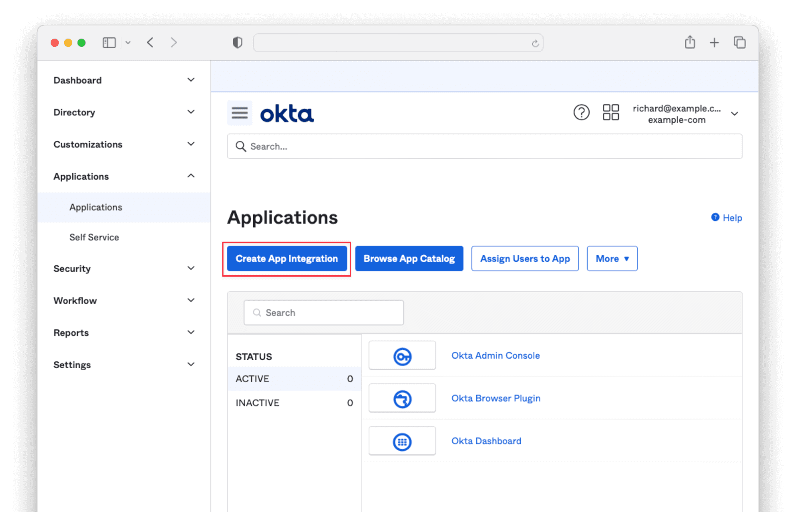
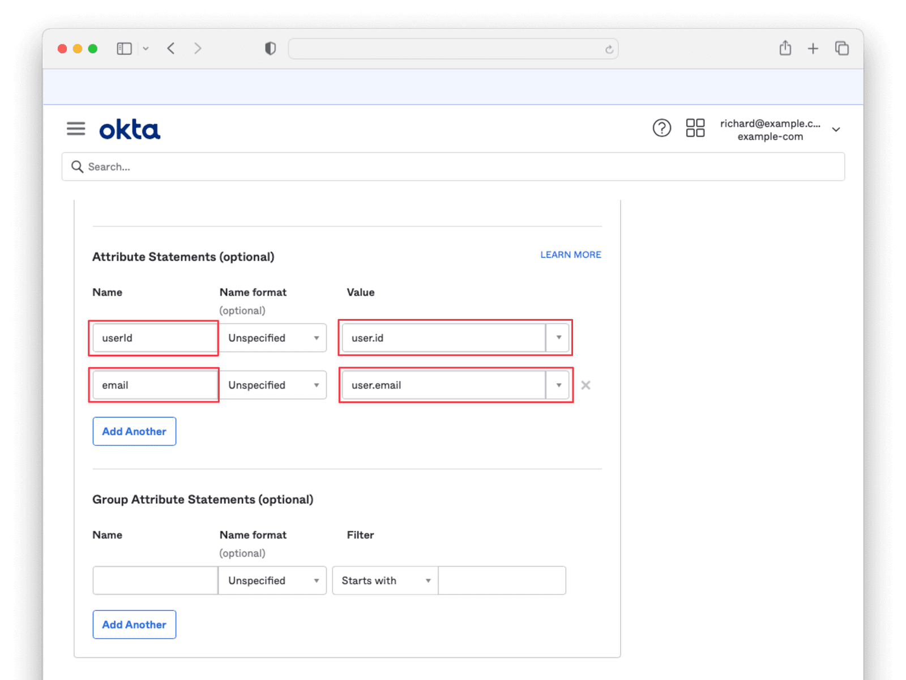
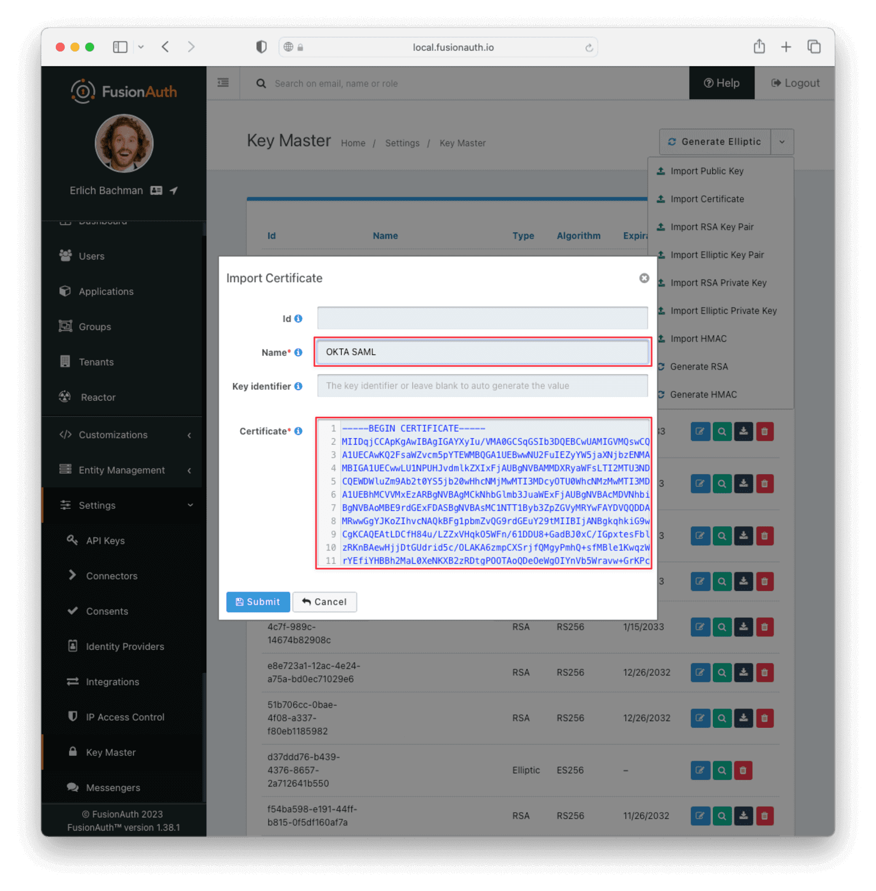
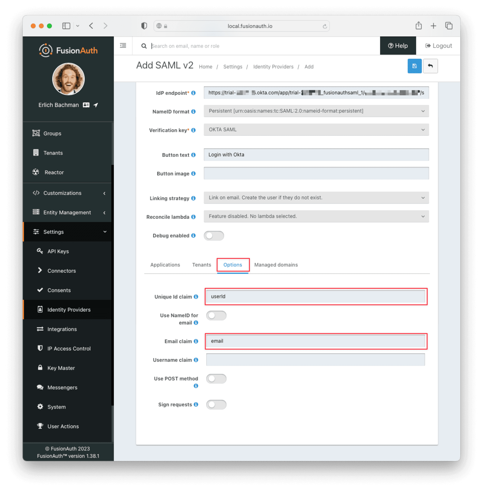
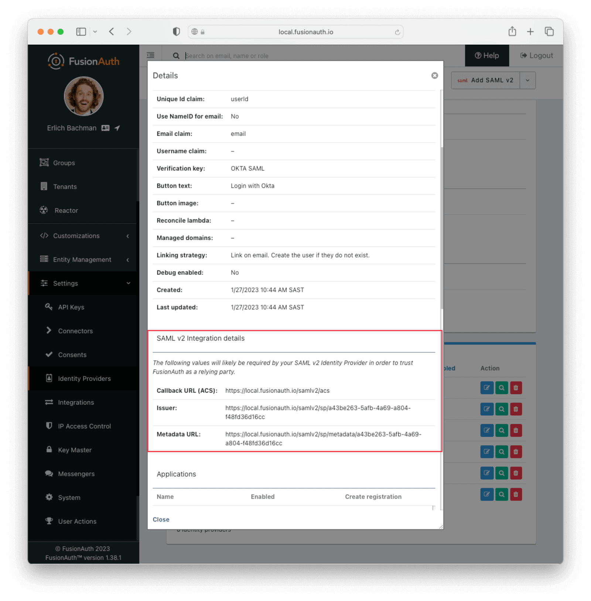
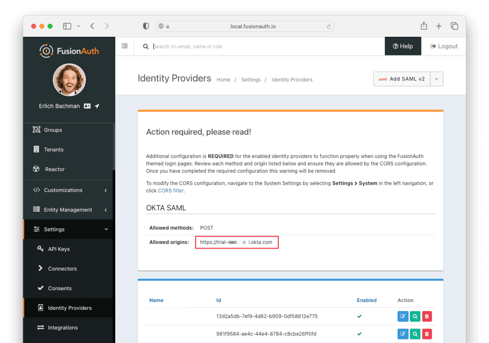

import EnterprisePlanBlurb from 'src/content/docs/_shared/_enterprise-plan-blurb.astro';
import Breadcrumb from 'src/components/Breadcrumb.astro';
import InlineField from 'src/components/InlineField.astro';
import InlineUIElement from 'src/components/InlineUIElement.astro';
import Aside from 'src/components/Aside.astro';


- [Example 2: Use FusionAuth As A SAML Service Provider](#example-2-use-fusionauth-as-a-saml-service-provider)
  - [Run FusionAuth And The Initial Website](#run-fusionauth-and-the-initial-website)
  - [Configure Okta To Use SAML](#configure-okta-to-use-saml)
  - [Configure FusionAuth To Use SAML](#configure-fusionauth-to-use-saml)
  - [Log In With SAML](#log-in-with-saml)
  - [Remove OAuth Login Option](#remove-oauth-login-option)


## Example 2: Use FusionAuth As A SAML Service Provider

In this section you'll implement the customer's request to use their Corpo.com database as the SAML identity provider instead of FusionAuth. You'll configure FusionAuth as a service provider instead of an identity provider. Because Corpo is fictional, a free account on Okta.com will act as your SAML identity provider instead.

<Aside type="warning">
You might want to use a second instance of FusionAuth here as your identity provider instead of Okta, but a FusionAuth SAML service provider connection to a FusionAuth SAML identity provider doesn't work at the time of writing this guide. There is an issue logged for the problem [here](https://github.com/FusionAuth/fusionauth-issues/issues/2979).
</Aside>

If you worked through the previous example, delete it and redownload the repository. The Changebank website does not use SAML in this example, so it remains unaltered in its original configuration to use OAuth. FusionAuth translates the SAML calls to Corpo so that Changebank can continue using OAuth.

The initial instructions below to start FusionAuth are the same ones from the previous example.

### Run FusionAuth And The Initial Website

Start by running a new instance of FusionAuth. For compatibility with any operating system and safety, you'll run all code inside [Docker](https://www.docker.com/get-started/).

- Use `git clone` to clone the repository at https://github.com/FusionAuth/fusionauth-example-saml, or download and unzip it.
- Open a terminal in the directory containing the repository files.
- Run the command below to start FusionAuth.
  ```sh
  docker compose up
  ```

This command started FusionAuth using Kickstart, which automatically creates an example application with example users. Using Kickstart saves you the time of having to configure everything yourself when following this tutorial.

<Aside type="note">
If you have completed any FusionAuth tutorials before, you might need to first delete any existing FusionAuth containers with the same name and the database volumes. Run the command below to do that.

```sh
docker rm fa fa_db; docker network remove faNetwork; docker compose down -v
```
</Aside>

<Aside type="note">
If you have any trouble with this tutorial, try replacing the FusionAuth image in the Docker compose file with `fusionauth/fusionauth-app:1.54.0`, in case future versions of FusionAuth introduced a breaking change.
</Aside>

In addition to FusionAuth, there is a website included in this repository, in the `app` directory. The website represents the Change bank website your company owns in this example, where FusionAuth is the authentication provider. The site currently uses OAuth for login, not bespoke authentication, which is slightly different from the example description, but unimportant — the focus of this example is switching the site to use SAML authentication.

Look at how the website currently looks before configuring SAML.

- Open a new terminal and run the commands below.
  ```sh
  cd app

  docker run --platform=linux/amd64 --rm -v ".:/app" -w "/app"  node:23-alpine3.19 sh -c  "npm install"

  docker run --platform=linux/amd64 --rm -v ".:/app" -w "/app" --name app --network faNetwork  -p 3000:3000 node:23-alpine3.19 sh -c  "npm run start"
  ```

These commands will install the Node.js packages in `package.json` and run the Express.js web server on the same network as the FusionAuth server in the Docker file, `faNetwork`.

- Browse to http://localhost:3000.
- Log in to the Changebank website with `richard@example.com` and `password`.


### Configure Okta To Use SAML

This sub-section follows the instructions from the [SAML Okta guide](https://fusionauth.io/docs/lifecycle/authenticate-users/identity-providers/enterprise/okta-samlv2). However, that guide says that FusionAuth needs to be on a publicly accessible URL, which is not true. Running FusionAuth on your localhost works fine.

- Create an Okta free trial account at https://www.okta.com/free-trial.
  - You can use a personal email account. You don't need a business domain.
  - Do not browse away from the sign up wizard until all steps have been completed, or you will have to create a new account with a different email address. You will need to download the Okta authenticator mobile app and scan a QR code.
- Once you have signed in to Okta, browse to the Admin page.
  

- Browse to <Breadcrumb>Applications -> Applications</Breadcrumb> and click the <InlineUIElement>Create App Integration</InlineUIElement> button.



- Select <InlineField>SAML 2.0</InlineField> and click <InlineUIElement>Next</InlineUIElement>.


- Name the app `fa` and click <InlineUIElement>Next</InlineUIElement>.


- Enter `http://localhost:9011/samlv2/acs` for <InlineField>Single sign-on URL</InlineField> and `http://localhost:9011/samlv2/sp/e9fdb985-9173-4e01-9d73-ac2d60d1dc8e` for the <InlineField>Audience URI (SP Entity ID)</InlineField>.


- Scroll down to <Breadcrumb>Attribute Statements</Breadcrumb> and add `userId` for <InlineField>Name</InlineField> and `user.id` for <InlineField>Value</InlineField>. Then do the same for `email` and `user.email`.



- Click <InlineUIElement>Next</InlineUIElement>. Click <InlineUIElement>Finish</InlineUIElement>.
- Scroll to the bottom of the following page and click <InlineUIElement>View SAML setup instructions</InlineUIElement>. You will need to provide the information on this page to FusionAuth, so keep it open in a separate tab or window.


- Return to the previous window and browse to the <Breadcrumb>Assignments</Breadcrumb> tab. Click <InlineUIElement>Assign</InlineUIElement> and then <InlineUIElement>Assign to People</InlineUIElement>.


- Click the <InlineUIElement>Assign</InlineUIElement> button next to the user you would like to authenticate. Click <InlineUIElement>Save and Go Back</InlineUIElement>, then <InlineUIElement>Done</InlineUIElement>.


### Configure FusionAuth To Use SAML

- Open a new tab and browse to the [FusionAuth dashboard](http://localhost:9011/admin).
- Browse to <Breadcrumb>Settings -> Key Master</Breadcrumb>.
- Click <InlineUIElement>Import Certificate</InlineUIElement> from the dropdown at the top right.


- Enter `okta` for <InlineField>Name</InlineField>.
- Copy the <InlineField>X.509</InlineField> certificate from the Okta <Breadcrumb>SAML setup instructions</Breadcrumb> page that you left open previously. Paste it into the <InlineField>Certificate</InlineField> textbox and click <InlineUIElement>Submit</InlineUIElement>.



- Browse to <Breadcrumb>Settings -> Identity Providers</Breadcrumb> and add a new `SAML v2` identity provider.


- Enter `e9fdb985-9173-4e01-9d73-ac2d60d1dc8e` for <InlineField>Id</InlineField>. This matches the value entered for the Okta audience URI earlier.
- Enter `okta` for <InlineField>Name</InlineField>
- Paste the <InlineField>Identity Provider Single Sign-On URL</InlineField> from the Okta <Breadcrumb>SAML setup instructions</Breadcrumb> page into <InlineField>IdP endpoint</InlineField>.
- Select `okta` for the verification key.
- Optionally, change the <InlineField>Button text</InlineField> to `Login with Okta`.
- Enable `Debug enabled` and enable all toggles for the Changebank application so that Changebank users can log in with Okta.


- Browse to the <Breadcrumb>Options</Breadcrumb> tab and enter `userId` for the <InlineField>user.Id</InlineField> and `email` for the <InlineField>user.email</InlineField> attribute statements.



- Click <InlineUIElement>Save</InlineUIElement>.



You may receive a warning after saving the identity provider.



- Browse to <Breadcrumb>Settings -> System</Breadcrumb> and add your Okta URL to the <InlineField>Allowed origins</InlineField> list.

This configures FusionAuth to send the correct CORS headers. You could disable the CORS toggle instead, as this is not a real application.


### Log In With SAML

The Changebank website should still be running. If not, start it with the code below.

```sh
docker run --platform=linux/amd64 --rm -v ".:/app" -w "/app"  node:23-alpine3.19 sh -c  "npm install"

docker run --platform=linux/amd64 --rm -v ".:/app" -w "/app" --name app --network faNetwork  -p 3000:3000 node:23-alpine3.19 sh -c  "npm run start"
```

- Browse to http://localhost:3000 and click log in.
- Click the <InlineUIElement>Login with Okta</InlineUIElement> button. Test logging in with your Okta username, password, and mobile authentication code. You might need to use a private browser window to clear any existing cookies.


### Remove OAuth Login Option

Currently, the user has to click login in the website, then click another button on the FusionAuth login screen to get to the SAML login. To send the user directly to the SAML login, you can edit `services/authentication.js`.

Change the line below to specify the identity provider explicitly.

```js
//authorizationURL: `${process.env.AUTH_URL}/authorize
authorizationURL: `${process.env.AUTH_URL}/authorize?idp_hint=E9FDB985-9173-4E01-9D73-AC2D60D1DC8E
```

If you restart the Node server, you can now log in with one click.

However, the OAuth page is still available. To remove it entirely, you will need to edit the FusionAuth theme for your application. Start learning about themes [here](https://fusionauth.io/docs/customize/look-and-feel/).

There is also a forum issue about this question [here](https://fusionauth.io/community/forum/topic/2194/disable-username-and-password-fields).