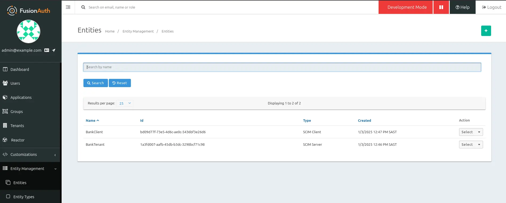
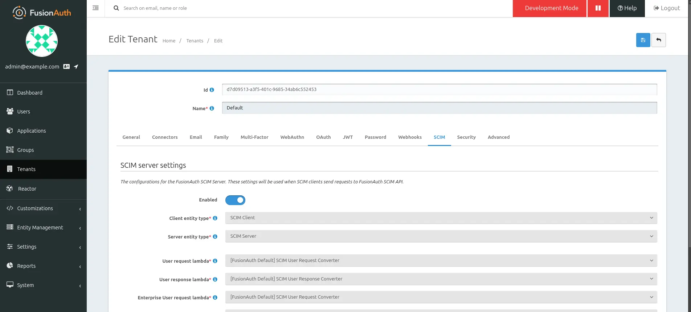
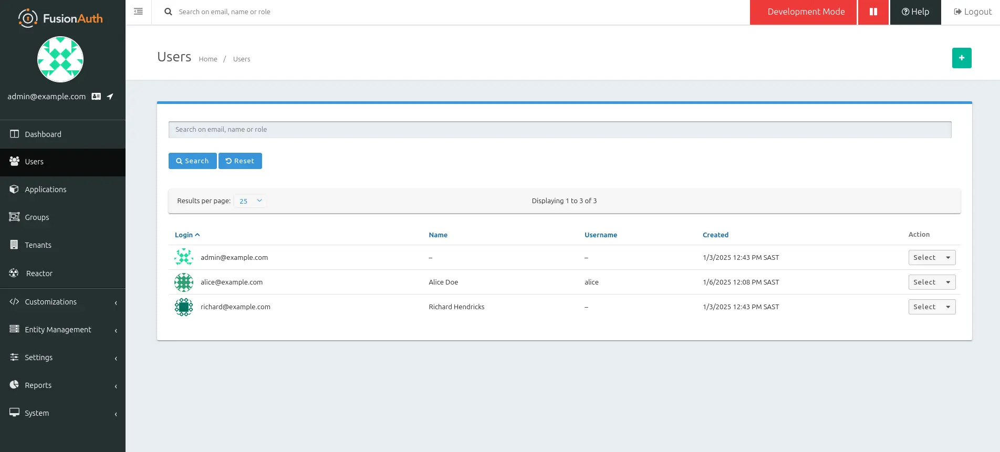

import EnterprisePlanBlurb from 'src/content/docs/_shared/_enterprise-plan-blurb.astro';
import Breadcrumb from 'src/components/Breadcrumb.astro';
import InlineField from 'src/components/InlineField.astro';
import InlineUIElement from 'src/components/InlineUIElement.astro';
import Aside from 'src/components/Aside.astro';

<EnterprisePlanBlurb />

This guide will show you how to enable SCIM for your tenant (multiple FusionAuth applications), how to create and delete users for applications, and how to map user details using a lambda. Since SCIM works at the tenant level, not the application level, you can use SCIM for any new or existing applications in the tenant.

This guide is a concrete example that integrates the information in the following FusionAuth documentation:
- [Overview of SCIM in FusionAuth](https://fusionauth.io/docs/lifecycle/migrate-users/scim)
- [FusionAuth SCIM API for Users](https://fusionauth.io/docs/apis/scim/scim-user)
- [SCIM user creation lambda](https://fusionauth.io/docs/extend/code/lambdas/scim-user-request-converter)
- [SCIM user response lambda](https://fusionauth.io/docs/extend/code/lambdas/scim-user-response-converter)


You should read the overview article before continuing. The other pages you don't need to read until you want to manage users in ways that aren't shown in this guide.

<Aside type="note" title="When to use SCIM?">
FusionAuth has an alternative to SCIM, [the user API](https://fusionauth.io/docs/apis/users), which allows you to provision users with simple HTTP calls. If you're looking for an easy way to automatically create users in FusionAuth, the API is a better choice. If you're looking for a way to automatically create a set of users when installing FA, then you can use [Kickstart](https://fusionauth.io/docs/get-started/download-and-install/development/kickstart), which is easier than both the API and SCIM.

Use SCIM in FA only when you have an existing user-management system in your organization that is primarily designed to work with SCIM. SCIM is a secure and full-featured standard, but does require more work to configure than the user API.
</Aside>

## Start FusionAuth And Configure SCIM

Let's start the example by running a new instance of FA and configuring it to use SCIM. For compatibility and safety, you'll run all code inside [Docker](https://www.docker.com/get-started/).

Use `git clone` to clone the repository at https://github.com/FusionAuth/fusionauth-example-docker-compose, or download and unzip it.

Open a terminal in the directory containing the repository files.

Run the command below to start FusionAuth.

```sh
cd light
docker compose up
```

<Aside type="note">
If you have completed any FusionAuth tutorials before, you might need to first delete any existing FusionAuth containers with the same name and the database volumes. Run the command below to do that.

```sh
docker rm fa fa_db; docker compose down -v
```
</Aside>

This command started FusionAuth using Kickstart, which automatically creates an example application with an example user called richard@example.com. It saves you the time of having to configure everything yourself when following this tutorial.

- Log in to your FusionAuth web interface at http://localhost:9011/admin with credentials `admin@example.com` and `password`.
- Browse to <Breadcrumb>Reactor</Breadcrumb>.
- Enter your license key to activate Reactor and refresh the page.

<Aside type="note">
If you have any trouble with this tutorial, try replacing the FusionAuth image in the Docker compose file with `fusionauth/fusionauth-app:1.54.0`, in case future versions of FusionAuth introduced a breaking change.
</Aside>

- Browse to <Breadcrumb>Entity Management -> Entity Types</Breadcrumb>.
  - Click the <InlineUIElement>Add</InlineUIElement> arrow, choose <InlineUIElement>Add SCIM Server</InlineUIElement>, and save.
  - Click the <InlineUIElement>Add</InlineUIElement> arrow, choose <InlineUIElement>Add SCIM Client</InlineUIElement>, and save.
- Browse to <Breadcrumb>Entity Management -> Entity</Breadcrumb>.
  - Click the <InlineUIElement>Add</InlineUIElement> button, choose <InlineUIElement>SCIM Server</InlineUIElement>, for <InlineField>Name</InlineField> enter `BankTenant`, for <InlineField>Id</InlineField> and <InlineField>Client Id</InlineField> enter `1a3fd007-aafb-45db-b3dc-3298bcf71c98`, and for <InlineField>Secret</InlineField> enter `FIjjqyyPgBRbUMKhZIE7aQ8OVQ_Mp6DipxDAHsVF2fg`, and save.
  - Click the <InlineUIElement>Add</InlineUIElement> button, choose <InlineUIElement>SCIM Client</InlineUIElement>, for <InlineField>Name</InlineField> enter `BankClient`, for <InlineField>Id</InlineField> and <InlineField>Client Id</InlineField> enter `bd09d77f-73e5-4d6c-ae0c-5436bf3e26d6`, and for <InlineField>Secret</InlineField> enter `UirdqdyvC5_1SxiDHdwlLyz7JGNxwCFJM0AL3MjUp28`, and save.
- Click <InlineField>Manage</InlineField> for the BankClient entity, and <InlineField>Add</InlineField>.
  - Search for and select `BankTenant`.
  - Enable all permissions, and save. **Scroll down** when enabling permissions, because there is a barely visible scrollbar that is easy to overlook.

You have now configured a SCIM server (representing your FA tenant) and a SCIM client (representing the app you want to allow to manage users in FA).



The next step is to enable SCIM operations in your tenant.

- Browse to <Breadcrumb>Tenants</Breadcrumb>, edit the Default tenant, and in the <InlineUIElement>SCIM tab</InlineUIElement> enable <InlineUIElement>Enabled<InlineUIElement>.
  - Choose the SCIM server and client.
  - Choose the default lambdas.
  - Save.



<Aside type="note">
You're linking the Tenant to the Entity **Type**, not the Entity, which is surprising. In FA, entities handle [machine authentication](/content/articles/authentication/service-to-service) but entities [cannot connect to users or applications](/docs/get-started/core-concepts/types-and-relationships). FA allows connecting the tenant to the entity type as a workaround to provide security for SCIM. Permissions are controlled by the SCIM Client entity. Whichever permissions are enabled in the entity grant from the client to the server entity are the permissions the tenant will allow.
</Aside>

## Create A FA User With SCIM

FA should now be ready to receive SCIM commands. To check that the SCIM client is correctly configured to create a user on the SCIM server, and that your Docker networking works correctly, run the curl command below to check the client permissions. If FA returns an access token and not an error then everything works.

```sh
curl -u bd09d77f-73e5-4d6c-ae0c-5436bf3e26d6:UirdqdyvC5_1SxiDHdwlLyz7JGNxwCFJM0AL3MjUp28 http://localhost:9011/oauth2/token --data-urlencode "grant_type=client_credentials" --data-urlencode "scope=target-entity:1a3fd007-aafb-45db-b3dc-3298bcf71c98:scim:user:create"
```
```sh
# Expected output:

{"access_token":"eyJhbGciOiJIUzI1NiIsInR5cCI6IkpXVCIsImd0eSI6WyJjbGllbnRfY3JlZGVudGlhbHMiXSwia2lkIjoiMDllOGQyMTkxIiwidXNlIjoic2NpbV9zZXJ2ZXIifQ.eyJhdWQiOiIxYTNmZDAwNy1hYWZiLTQ1ZGItYjNkYy0zMjk4YmNmNzFjOTgiLCJleHAiOjE3MzYxNTg4NTksImlhdCI6MTczNjE1NTI1OSwiaXNzIjoiYWNtZS5jb20iLCJzdWIiOiJiZDA5ZDc3Zi03M2U1LTRkNmMtYWUwYy01NDM2YmYzZTI2ZDYiLCJqdGkiOiIxYzdhZDJiYS0xYTExLTQwMzktYmZiOC1kOGJiNjk1ZjllZWUiLCJzY29wZSI6InRhcmdldC1lbnRpdHk6MWEzZmQwMDctYWFmYi00NWRiLWIzZGMtMzI5OGJjZjcxYzk4OnNjaW06dXNlcjpjcmVhdGUiLCJ0aWQiOiJkN2QwOTUxMy1hM2Y1LTQwMWMtOTY4NS0zNGFiNmM1NTI0NTMiLCJwZXJtaXNzaW9ucyI6eyIxYTNmZDAwNy1hYWZiLTQ1ZGItYjNkYy0zMjk4YmNmNzFjOTgiOlsic2NpbTp1c2VyOmNyZWF0ZSJdfX0.6SusxG40kaRboSSKMhmNH9gEYynfnsqyr7czvFtw3Yg","expires_in":3599,"scope":"target-entity:1a3fd007-aafb-45db-b3dc-3298bcf71c98:scim:user:create","token_type":"Bearer"}
```

If you want to see what the token looks like decoded, paste it into https://fusionauth.io/dev-tools/jwt-decoder.

At this point, if you have a SCIM app, you can point it to FusionAuth and see if you can create a user. The curl command above gave the URL on which to get an access token for the `scim:user:create` [permission](https://fusionauth.io/docs/lifecycle/migrate-users/scim/#permissions). The user creation SCIM endpoint is http://localhost:9011/api/scim/resource/v2/Users.

To mimic a SCIM app, you can use a JavaScript script to create a user.

- Create the file `scim.js` in the `light` directory.
- Insert the code below.
```js
import axios from "npm:axios@1.7.9";

const user = {
  "active": true,
  "emails": [{"primary": true,"type": "work","value": "alice@example.com"}],
  "externalId": "cc6714c6-286c-411c-a6bc-ee413cda1dbc",
  "name": {"familyName": "Doe","formatted": "Alice Doe","givenName": "Alice",},
  "password": "password",
  "phoneNumbers": [{"primary": true, "type": "mobile", "value": "303-555-1234"}],
  "schemas": ["urn:ietf:params:scim:schemas:core:2.0:Users"],
  "userName": "alice"
}

const token = await getAccessToken();
await makeUser(token, user);


async function getAccessToken() {
  try {
    const permissions = 'target-entity:1a3fd007-aafb-45db-b3dc-3298bcf71c98:scim:user:create,scim:user:read,scim:user:update,scim:user:delete,scim:enterprise:user:create,scim:enterprise:user:read,scim:enterprise:user:update,scim:enterprise:user:delete,scim:group:create,scim:group:read,scim:group:update,scim:group:delete';
    const formData = new URLSearchParams();
    formData.append("grant_type", "client_credentials");
    formData.append("client_id", "bd09d77f-73e5-4d6c-ae0c-5436bf3e26d6");
    formData.append("client_secret", "UirdqdyvC5_1SxiDHdwlLyz7JGNxwCFJM0AL3MjUp28");
    formData.append("scope", permissions);
    const response = await axios({method: "post", url: "http://fa:9011/oauth2/token", headers: { "Content-Type": "application/x-www-form-urlencoded" }, data: formData});
    return response.data.access_token;
  }
  catch (e) {console.dir(e, { depth: null });}
}


async function makeUser(token, user) {
  try{
    const api = axios.create({ baseURL: 'http://fa:9011/api', headers: { 'Authorization': 'Bearer ' + token } });
    const result = await api.post('/scim/resource/v2/Users/', user);                    // CREATE
    console.dir(result.data);
    const userId = result.data.id;
    await api.put('/scim/resource/v2/Users/' + userId, { ...user, "userName": "eve" }); // UPDATE
    await api.delete('/scim/resource/v2/Users/' + userId);                              // DELETE
  }
  catch (e) {console.dir(e, { depth: null });}
}
```

This code starts with JSON holding a sample user to create, then calls two functions: `getAccessToken`, which is similar to the curl call earlier, and `makeUser`, which passes the token and the user JSON to the FA SCIM endpoint. `makeUser` creates a user, stores the user UUID that FA returns, updates the user with the UUID, then deletes the user.

In `getAccessToken`, all possible token `permissions` are requested. In reality, you can remove the ones you don't need. The format is the target entity Id, followed by comma-separated permissions.

- Run the script in Docker with the command below. (The command shares the Docker FA network with the container, so the container can call FA on `http://fa`, because `http://localhost` won't work from inside a container.)

```sh
docker run --platform=linux/amd64 --rm -v ".:/app" -w "/app"  --network faNetwork denoland/deno:alpine-2.1.3 sh -c  "deno run --allow-net --allow-env ./scim.js"
```
```sh
# Expected output:

{
  active: true,
  emails: [ { primary: true, type: "work", value: "alice@example.com" } ],
  externalId: "cc6714c6-286c-411c-a6bc-ee413cda1dbc",
  id: "672963d1-142c-4587-8956-2ecbc2e96c62",
  meta: {
    created: "2025-01-06T10:08:03.410Z",
    lastModified: "2025-01-06T10:08:03.410Z",
    location: "http://fa:9011/api/scim/resource/v2/Users/672963d1-142c-4587-8956-2ecbc2e96c62",
    resourceType: "User"
  },
  name: { familyName: "Doe", formatted: "Alice Doe", givenName: "Alice" },
  phoneNumbers: [ { primary: true, type: "mobile", value: "303-555-1234" } ],
  schemas: [
    "urn:ietf:params:scim:schemas:core:2.0:User",
    "urn:ietf:params:scim:schemas:core:2.0:Users"
  ],
  userName: "alice",
  "urn:ietf:params:scim:schemas:core:2.0:Users": {}
}
```

<Aside type="tip">
Note that FA generated a new UUID for the user Id. Even if you specify an Id value in JSON, and update the FA lambda that received SCIM requests to include `user.id = scimUser.id;`, FA still won't use your Id when creating a SCIM user. This works differently to the [user API](https://fusionauth.io/docs/apis/users#request), which allows you to specify the new user's Id in the POST URL.

This limitation means that your code has to store the Id for the user returned from FA in order to issue further commands against the user.
</Aside>

- To see the the new user in the FusionAuth users page, comment out the `api.put` and `api.delete` lines in `scim.js` and run the command above again.

You should now see a user, as shown below.



## Create Registrations And Custom Lambdas

At this point, you have seen how to create, update, and delete FA users with SCIM. You should be able to use this knowledge to correctly set up and test your own SCIM app.

However, if you browse to the Registrations tab for the user, you'll see that Alice is not a member of any applications. SCIM in FA can create users, but [cannot add users to applications](https://fusionauth.io/docs/lifecycle/migrate-users/scim/#adding-registrations). Your SCIM app also might have some custom user data that you'd like to insert into FA.

Both these problems can be handled by customizing the SCIM user request lambda in FA.

### Create Custom Data Mappings

- Browse to <Breadcrumb>Customizations -> Lambdas -> SCIM User Request Converter -> Edit</Breadcrumb>
- Set a custom user data mapping by changing the top of the function to be like the code below. Note that lambdas support only a small subset of JavaScript syntax, so you can't use ` `` ` strings, `...` object notation, `await`, or `=>` functions.
```js
function convert(user, options, scimUser) {
 if (!user.data) user.data = {};
   user.data.id = scimUser.externalId;

  user.active = scimUser.active;
```
- Delete the user from the list of users in FusionAuth and rerun `scim.js`.
- Now when you browse the user data tab for the new user, you'll see that she has more data stored.


<Aside type="caution">
It may look like you can create a registration for the user by setting `options.applicationId`, but that won't work. The user creation parameters are documented [here](https://fusionauth.io/docs/apis/users#request) and [here](https://fusionauth.io/docs/extend/code/lambdas/scim-user-request-converter#lambda-structure). The code below **won't** make the user a member of the application, and also won't throw an error.
```js
function convert(user, options, scimUser) {
 options.applicationId = 'e9fdb985-9173-4e01-9d73-ac2d60d1dc8e';
 options.disableDomainBlock = true;
 options.sendSetPasswordEmail = false;
 options.skipVerification = true;
```
</Aside>

### Create A Registration From A Lambda

todo update limitations of lambdas article. graalvm link
xmlhttprequest does not work, nor does .then and .catch in fetch. have to use httpclient


SCIM Server User response converter

original
```js
// This is the default SCIM User response converter, modify this to your liking.
function convert(scimUser, user) {
  // Un-comment this line to see the user object printed to the event log
  // console.info(JSON.stringify(user, null, 2));

  scimUser.active = user.active;
  scimUser.userName = user.username;
  scimUser.name = {
    formatted: user.fullName,
    familyName: user.lastName,
    givenName: user.firstName,
    middleName: user.middleName,
    honorificPrefix: user.data.honorificPrefix,
    honorificSuffix: user.data.honorificSuffix
  };

  scimUser.phoneNumbers = [{
    primary: true,
    value: user.mobilePhone,
    type: "mobile"
  }];

  scimUser.emails = [{
    primary: true,
    value: user.email,
    type: "work"
  }];

  // Optionally return any custom extensions stored in user.data
  if (user.data && user.data.extensions) {
    for (var extension in user.data.extensions) {
      if (scimUser.schemas.indexOf(extension) === -1) {
        scimUser.schemas.push(extension);
      }
      scimUser[extension] = user.data.extensions[extension];
    }
  }
}
```


NEW:

```js
function convert(scimUser, user) {
  ...
  ...
  ...
  var applicationId = "e9fdb985-9173-4e01-9d73-ac2d60d1dc8e";
  var apiKey = "33052c8a-c283-4e96-9d2a-eb1215c69f8f-not-for-prod";

  if (isUserRegistered(user.id, applicationId, apiKey))
    return;

  fetch("http://fa:9011/api/user/registration/" + user.id, {
    method: 'POST',
    headers: {'Authorization': apiKey,'Content-Type': 'application/json'},
    body: JSON.stringify({'registration': {'applicationId': applicationId}})
  })
  .then(function(response) {
    if (!response.ok) {
      console.error("Failed to register user to application");
    }
  })
  .catch(function(error) {
    console.error("Error registering user:", error);
  });
}

function isUserRegistered(userId, applicationId, apiKey) {
  return fetch("http://fa:9011/api/user/registration/" + userId + "/" + applicationId, {
    method: 'GET',
    headers: {'Authorization': apiKey}
  })
  .then(function(response) {
    if (response.ok) return true;
    if (response.status === 404) return false;
    console.error("Error checking user registration:", response.status);
    return false;
  })
  .catch(function(error) {
    console.error("Error checking user registration:", error);
    return false;
  });
}
```

http://localhost:9011/admin/system/event-log/

```sh
curl -XGET -H "Authorization: 33052c8a-c283-4e96-9d2a-eb1215c69f8f-not-for-prod" 'http://localhost:9011/api/user/registration/00000000-0000-0000-0000-111111111111/e9fdb985-9173-4e01-9d73-ac2d60d1dc8e'

curl -u bd09d77f-73e5-4d6c-ae0c-5436bf3e26d6:UirdqdyvC5_1SxiDHdwlLyz7JGNxwCFJM0AL3MjUp28 http://9011/api/user/registration/ --data-urlencode "grant_type=client_credentials" --data-urlencode "scope=target-entity:1a3fd007-aafb-45db-b3dc-3298bcf71c98:scim:user:create"
```


### Create A Registration From A Webhook


## Clean Up

To remove all the Docker volume, containers, images, and networks used in this guide, run the commands below.

```sh
docker compose down -v
docker rm fa fa_db
docker rmi postgres:16.0-bookworm fusionauth/fusionauth-app:latest denoland/deno:alpine-2.1.3
docker network prune;
```


## TODO

- FA -> FusionAuth
- remove http in links
- add this guide to
  - [Overview of SCIM in FusionAuth](https://fusionauth.io/docs/lifecycle/migrate-users/scim)
  - [FusionAuth SCIM API](https://fusionauth.io/docs/apis/scim)
  - [FusionAuth SCIM API for Users](https://fusionauth.io/docs/apis/scim/scim-user)
  - [Lambdas to map SCIM](https://fusionauth.io/docs/extend/code/lambdas/scim-user-request-converter)
- `options` bug - https://github.com/FusionAuth/fusionauth-site/issues/3454
