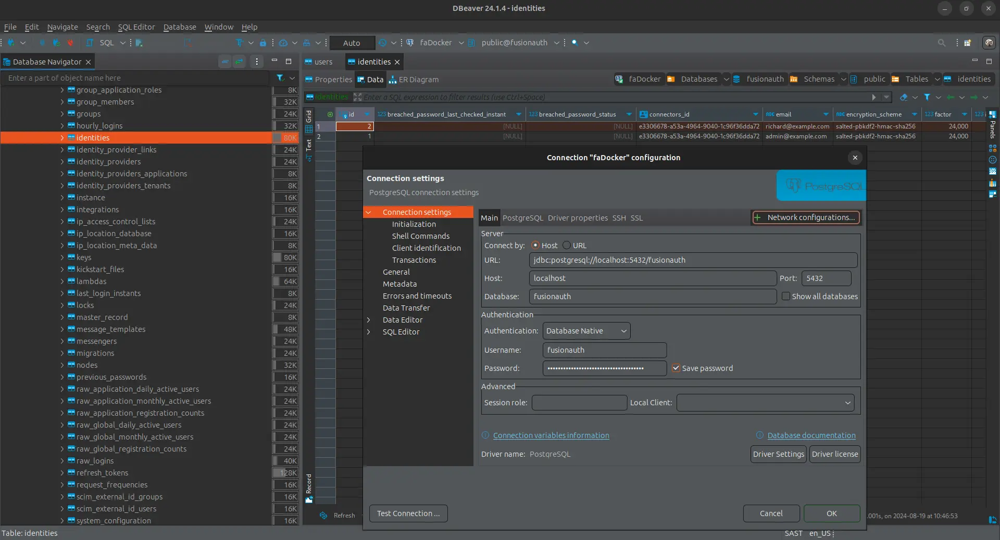

import Aside from 'src/components/Aside.astro';
import IconButton from 'src/components/IconButton.astro';
import Breadcrumb from 'src/components/Breadcrumb.astro';
import InlineField from 'src/components/InlineField.astro';
import InlineUIElement from 'src/components/InlineUIElement.astro';
import Diagram1 from 'src/components/docs/extend/segmentDiagram1.astro';
import Diagram2 from 'src/components/docs/extend/segmentDiagram2.astro';

- [Introduction](#introduction)
- [Start A Sample Instance Of FusionAuth](#start-a-sample-instance-of-fusionauth)
- [Browse The Database](#browse-the-database)
- [Online And Offline Migrations](#online-and-offline-migrations)
- [What To Export?](#what-to-export)
- [Database Schema Documentation](#database-schema-documentation)
- [Database Export Command](#database-export-command)
- [Online Migration Techniques](#online-migration-techniques)

## Introduction

This guide explains how to export your user data from FusionAuth to prepare it for migration to another system. Reasons for exporting your data include:
- Swapping from FusionAuth to another authentication service.
- Wondering if you start using FusionAuth how easy it is to leave.
- Wanting to export your users into a data warehouse for analytical investigation.

You can follow along with this guide. You will start a new FusionAuth instance with a sample user and see how to export their data. If you already use FusionAuth, you can export your data from your existing instance.

To learn about authentication migration in general, please see the [generic migration guide](docs/lifecycle/migrate-users/genericmigration.mdx) and the [migration overview](docs/lifecycle/migrate-users). The principles in these guides that explain how to migrate **to** FusionAuth can also be used to migrate **from** FusionAuth to another service. It is important to be aware of the different migration strategies to choose from, especially online and offline migrations.

<Aside type='note'>
For integration of FusionAuth data with other services, such as exporting to a customer data warehouse with [Twilio Segment](/docs/extend/examples/twilio-segment), using monitoring services like [Prometheus](/docs/operate/secure-and-monitor/prometheus) or [Elastic](/docs/operate/secure-and-monitor/elastic), please see those guides.
</Aside>

## Start A Sample Instance Of FusionAuth

In this section you will run a new instance of self-hosted FusionAuth with Docker.

- Install [Docker](https://docs.docker.com/get-docker/) if you don't have it on your machine.
- Clone the [FusionAuth example Docker Compose repository](https://github.com/FusionAuth/fusionauth-example-docker-compose) to your computer.
- In your terminal, navigate to the `light` directory in the repository.
- Run `docker compose up` to start FA.
- Browse to http://localhost:9011 to check that FA is running. You can log in with `admin@example.com` and `password`.
- Note the database connection details in the `docker-compose.yml` file and the hidden `.env` file.

## Browse The Database

While the FusionAuth Java code is closed-source, your database data is always freely available to you, unadulterated. You should not edit the data manually and risk breaking your system, but reading the data is fine. To browse your database, you can use a cross-platform database IDE like [DBeaver](https://dbeaver.io/download).

If you are using [FusionAuth Cloud](https://fusionauth.io/docs/get-started/run-in-the-cloud/cloud#accessing-user-data) (the paid cloud-hosted version of FusionAuth), you need to manually request a backup file of your database by contacting support.

Below is an example screenshot of the sample FusionAuth PostgreSQL database, using a connection string with port `5432`, database `fusionauth`, and password `hkaLBM3RVnyYeYeqE3WI1w2e4Avpy0Wd5O3s3`. If you want to connect to FusionAuth on a remote server, change the <InlineField>Host</InlineField> from `localhost` to your server name. The image shows the main user data table, `identities`.

## Online And Offline Migrations

Now that you know how to access your user data, you can write a database export script to extract the values you want and import them into your new authentication system. However, you need to consider new users, and users that update their details, after you have exported your database but before the users have joined your new system.

You have three strategy options:
- Offline migration: You take your application offline. Migrate your user data to the new system. Switch your application from pointing to FusionAuth for authentication to the new authentication system. Bring your application online again. This process could take from a few minutes to a few hours.
- Online migration: You use webhooks and the FusionAuth API to migrate users individually from FA to the new system. As each user logs in, a webhook event fires, triggering a script you write to migrate the user's data and mark them as using the new system for future logins instead of FA. This is massively more complex than an offline migration.
- Hybrid migration: Perform an offline migration without taking your application offline. Use webhooks to send any information that changes during the migration process to update your new system.

An offline migration is the simplest option to perform for most systems, but you need to warn your users your system will be offline for an hour at a convenient time. You will have to use a form of online migration if your database is massive and your application cannot afford to ever be offline.

Whichever option you choose, you will need to test the process thoroughly before running it against the live application.

## What To Export?

    User registration data, usernames and passwords
    Some of the more common features from https://fusionauth.io/docs/get-started/core-concepts/ e.g. roles, scopes etc
    Probably some email content, e.g. password reset email copy?
    Anything else?

## Database Schema Documentation

FA does not have any dedicated documentation that explains the database schema. The schema is discussed briefly in this guide, and hopefully most tables are relatively obvious from their column names. If you need help understanding something in particular, please ask the FA programmers on the [Slack channel](https://fusionauth.io/community).

## Database Export Command

## Online Migration Techniques

https://fusionauth.io/docs/apis/
https://fusionauth.io/docs/apis/users#search-for-users

https://fusionauth.io/docs/extend/events-and-webhooks
https://fusionauth.io/docs/extend/events-and-webhooks/events
