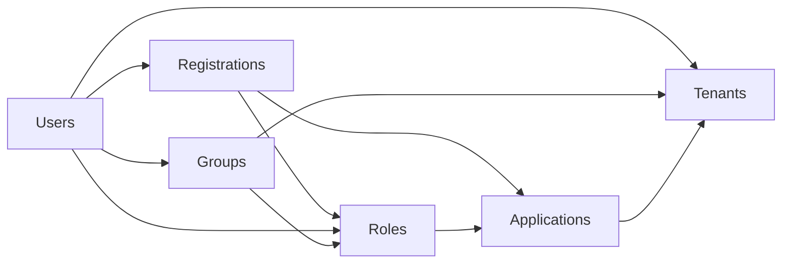
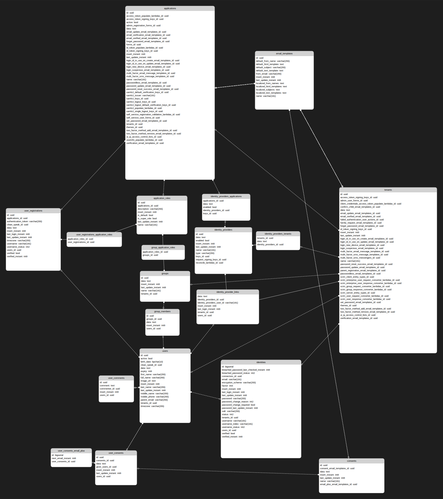

import Aside from 'src/components/Aside.astro';
import IconButton from 'src/components/IconButton.astro';
import Breadcrumb from 'src/components/Breadcrumb.astro';
import InlineField from 'src/components/InlineField.astro';
import InlineUIElement from 'src/components/InlineUIElement.astro';
import Diagram1 from 'src/components/docs/extend/segmentDiagram1.astro';
import Diagram2 from 'src/components/docs/extend/segmentDiagram2.astro';

- [Introduction](#introduction)
- [Start A Sample Instance Of FusionAuth](#start-a-sample-instance-of-fusionauth)
- [Browse The Database](#browse-the-database)
- [Online And Offline Migrations](#online-and-offline-migrations)
- [What To Export?](#what-to-export)
- [Export To Keycloak Example](#export-to-keycloak-example)
- [How To Migrate](#how-to-migrate)
- [How To Handle Differing Password Hashing Algorithms](#how-to-handle-differing-password-hashing-algorithms)
- [Social Logins like Facebook, Google, Or GitHub](#social-logins-like-facebook-google-or-github)
- [Online Migration Techniques](#online-migration-techniques)

## Introduction

This guide explains how to export your user data from FusionAuth to prepare it for migration to another system. Reasons for exporting your data include:
- Swapping from FusionAuth to another authentication service.
- Wondering if you start using FusionAuth how easy it is to leave.
- Wanting to export your users into a data warehouse for analytical investigation.

You can follow along with this guide. You will start a new FusionAuth instance with a sample user and see how to export their data. If you already use FusionAuth, you can export your data from your existing instance.

To learn about authentication migration in general, please see the [generic migration guide](docs/lifecycle/migrate-users/genericmigration.mdx) and the [migration overview](docs/lifecycle/migrate-users). The principles in these guides that explain how to migrate **to** FusionAuth can also be used to migrate **from** FusionAuth to another service. It is important to be aware of the different migration strategies to choose from, especially online and offline migrations (static versus dynamic migrations).

FusionAuth might also have a specific guide on migrating from the service you want to migrate to, [here](/docs/lifecycle/migrate-users/provider-specific/). If so, check the steps in the guide to see if there are any important differences between the two services that you need to plan for.

<Aside type='note'>
For integration of FusionAuth data with complementary services, such as exporting to a customer data warehouse with [Twilio Segment](/docs/extend/examples/twilio-segment), or using monitoring services like [Prometheus](/docs/operate/secure-and-monitor/prometheus) or [Elastic](/docs/operate/secure-and-monitor/elastic), please see those guides.

You should use different techniques, like webhooks and APIs, for sending to data such services, instead of the bulk database export discussed in this guide.
</Aside>

## Start A Sample Instance Of FusionAuth

In this section you will run a new instance of self-hosted FusionAuth with Docker.

- Install [Docker](https://docs.docker.com/get-docker/) if you don't have it on your machine.
- Clone the [FusionAuth example Docker Compose repository](https://github.com/FusionAuth/fusionauth-example-docker-compose) to your computer.
- In your terminal, navigate to the `light` directory in the repository.
- Run `docker compose up` to start FA.
- Browse to http://localhost:9011 to check that FA is running. You can log in with `admin@example.com` and `password`.
- Note the database connection details in the `docker-compose.yml` file and the hidden `.env` file.

## Browse The Database

While the FusionAuth Java code is closed-source, your database data is always freely available to you, unadulterated. You should not edit the data manually and risk breaking your system, but reading the data is fine. To browse your database, you can use a free cross-platform database IDE like [DBeaver](https://dbeaver.io/download) or [Azure Data Studio](https://learn.microsoft.com/en-us/azure-data-studio/download-azure-data-studio?tabs=win-install%2Cwin-user-install%2Credhat-install%2Cwindows-uninstall%2Credhat-uninstall#download-azure-data-studio)(ADS). If you use ADS, install the PostgreSQL extension in the sidebar before creating a database connection.

If you are using [FusionAuth Cloud](https://fusionauth.io/docs/get-started/run-in-the-cloud/cloud#accessing-user-data) (the paid cloud-hosted version of FusionAuth), you need to manually request a backup file of your database by contacting support. After receiving the backup file, import it into a PostgreSQL instance on your computer so that you can explore the data and schema.

Below is an example screenshot of the FusionAuth PostgreSQL database from the example repository in the previous section, using a connection string with port `5432`, database `fusionauth`, and password `hkaLBM3RVnyYeYeqE3WI1w2e4Avpy0Wd5O3s3`. If you want to connect to FusionAuth on a remote server, change the <InlineField>Host</InlineField> from `localhost` to your server name. The image shows the main user data table, `identities`.


## Online And Offline Migrations

Now that you know how to access your data, you can write a database export script to extract the values you want and import them into your new authentication system. However, you need to consider new users, and users that update their details, after you have exported your database but before the users have joined your new system.

You have three strategy options:
- Offline migration: You take your application offline. Migrate your user data to the new system. Switch your application from pointing to FusionAuth for authentication to the new authentication system. Bring your application online again. This process could take from a few minutes to a few hours.
- Online migration: You use webhooks and the FusionAuth API to migrate users individually from FA to the new system. As each user logs in, a webhook event fires, triggering a script you write to migrate the user's data and mark them as using the new system for future logins instead of FA. This is massively more complex than an offline migration.
- Hybrid migration: Perform an offline migration without taking your application offline. Use webhooks to send any information that changes during the migration process to update your new system. This is called dual-write — where you update changes to users in both FusionAuth and the new authentication service, until the time you disable FusionAuth completely.

An offline migration is the simplest option to perform for most systems, but you need to warn your users your system will be offline for an hour at a convenient time. You will have to use a form of online migration if your database is huge and your application cannot afford to ever be offline.

Whichever option you choose, you will need to test the process thoroughly before running it against the live application.

## What To Export?

FA does not have any dedicated documentation that explains the database schema. The schema is discussed briefly in this guide, and hopefully most tables are relatively obvious from their column names. If you need help understanding something in particular, please ask the FA programmers on the [Slack channel](https://fusionauth.io/community).

Some data types, like users, applications, and roles, are used in most authentication services. But some data is so specific to FusionAuth there is no point in trying to migrate it with a script. This includes settings for webhooks, connectors, lambdas, and user actions. There is also no point in exporting logs like daily login counts and FusionAuth instance settings like themes, because your new authentication service won't use them. You will need to manually reproduce actions and styles like these in whatever format the new service specifies.

To understand the user-related data tables in the database, you need to be familiar with [FusionAuth core concepts](/docs/get-started/core-concepts). Please read that guide before continuing. Below is a visual summary of the organisation.



In addition to the objects above, you also want to migrate identity providers, like Google OAuth, as well as user consents and email templates.

Below is the full database diagram for the tables you need to export. Though it has more fields than the diagram above, it is the same design. (You can open the SVG in a new tab to zoom in.)



Here is the full list of FA database tables you should look at for export: `application_roles`, `applications`, `consents`, `email_templates`, `group_application_roles`, `group_members`, `groups`, `identities`, `identity_provider_links`, `identity_providers`, `identity_providers_applications`
`identity_providers_tenants`, `tenants`, `user_comments`, `user_consents`, `user_consents_email_plus`, `user_registrations`, `user_registrations_application_roles`, `users`.

<Aside type="note">
If you want to browse the diagram above in DBeaver, you can download the ERD file [here](../../../../../public/img/docs/lifecycle/migrate-users/offboard/databaseDiagram.erd).
</Aside>

## Export To Keycloak Example

```sh
docker run -p 9012:8080 -e KEYCLOAK_ADMIN=admin -e KEYCLOAK_ADMIN_PASSWORD=admin quay.io/keycloak/keycloak:25.0.4 start-dev
```
- browse to localhost:9012
- tenant -> realm. application -> client.

## How To Migrate

There are dozens of alternative authentication services to FusionAuth. This guide can offer only general advice to migrate to any of them. Each service allows you to import users (and sometimes other data) in one of three ways:

- **Direct database import through SQL statements** — These services tend to be free or open source. Examples include Keycloak, the Janssen project from Gluu, Authentic, or Authelia. While free services don't have the funding to pay developers to write user-migration plugins, they allow you complete access to edit your database and insert whatever data you want. In these cases, you would write a SQL script against the FA database that generates a SQL script that is a set of INSERT statements that writes users to the target database.
- **API** — Most services will also provide an API, allowing you to manage users from a terminal. Examples include AWS Cognito, Keycloak, Gluu/Janssen, Auth0, FrontEgg, Stytch, and Authentik. Instead of writing SQL to generate SQL, write SQL to export a JSON, or YAML file of your users. Then write a script in bash, Python, or Node.js that loops through the file and calls the target service API to create a new user for each existing user.
- **Plugins** — Some of the more powerful services provide dedicated import plugins that will import your users for you, given a CSV or JSON file or a database connection. Examples include AWS Cognito, Auth0, and Frontegg. This case is similar to the API one above, requiring you to write SQL to generate a specific JSON file of users. Services that do this tend to have cloud-only offerings, that don't allow you direct access to the database.

From top to bottom, these options decrease in complexity, but also decrease in customization. In other words, if you have direct database access, you can map a lot more of your existing user data into the target system, but also have more work to do, and more chance of making database entries that cause errors in the service.

## How To Handle Differing Password Hashing Algorithms

PasswordHashProvider

## Social Logins like Facebook, Google, Or GitHub


## Online Migration Techniques

https://fusionauth.io/docs/apis/
https://fusionauth.io/docs/apis/users#search-for-users

https://fusionauth.io/docs/extend/events-and-webhooks
https://fusionauth.io/docs/extend/events-and-webhooks/events
