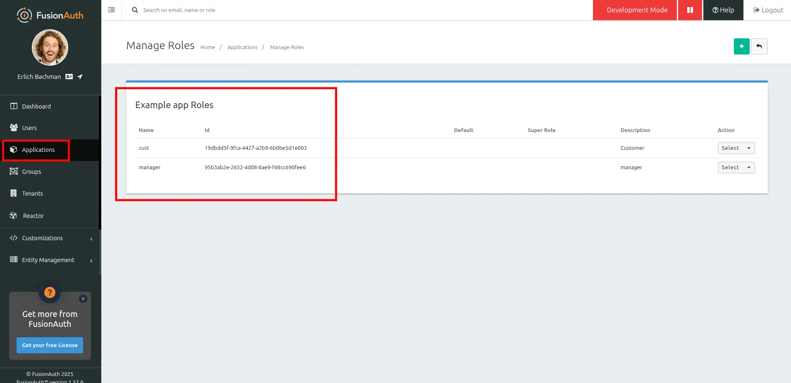
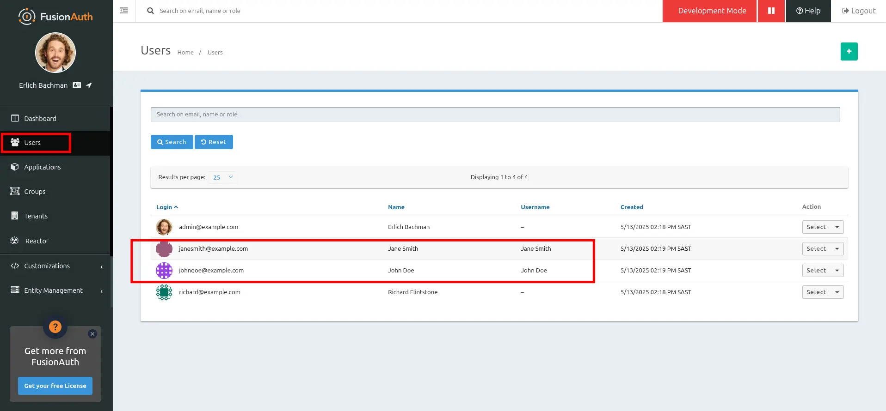
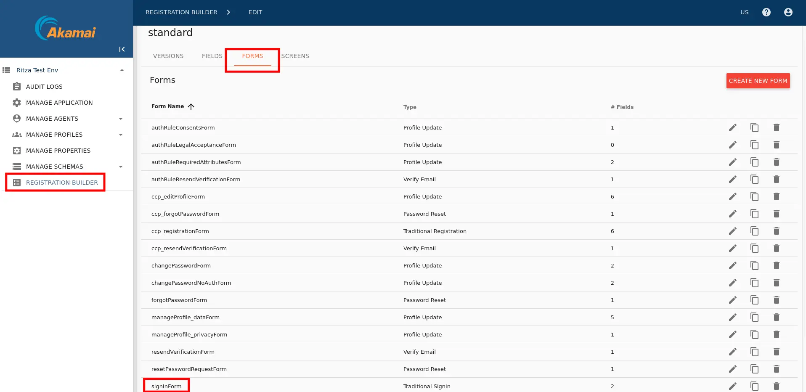
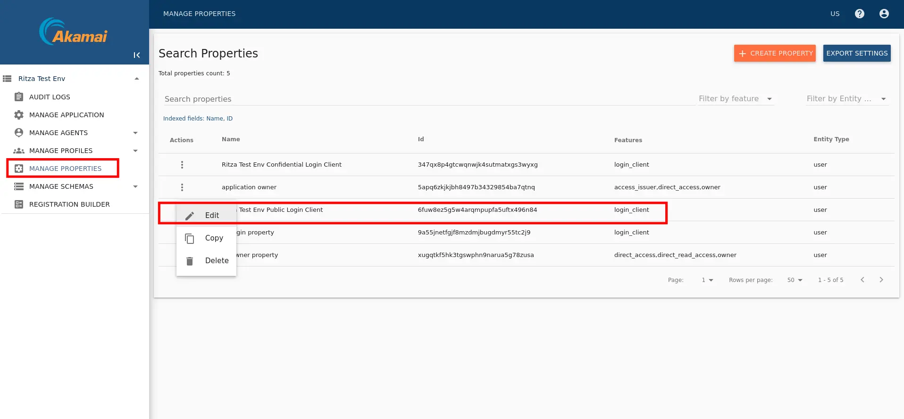
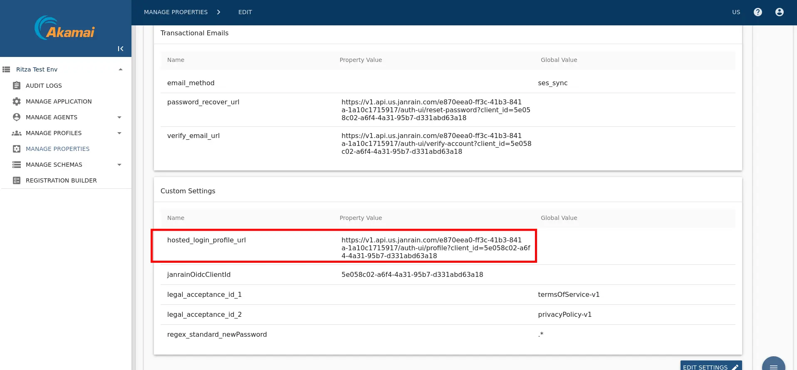
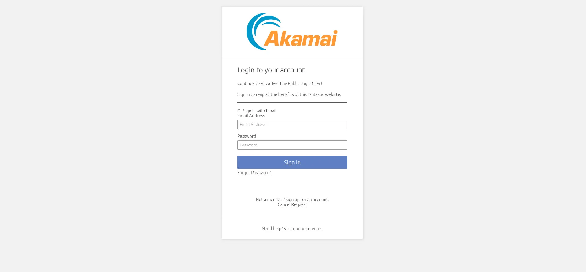

import AdditionalSupport from 'src/content/docs/lifecycle/migrate-users/provider-specific/_additional-support.mdx';
import Aside from '/src/components/Aside.astro';
import Breadcrumb from '/src/components/Breadcrumb.astro';
import InlineField from 'src/components/InlineField.astro';
import InlineUIElement from 'src/components/InlineUIElement.astro';
import MakeWebservicePublic from 'src/content/docs/lifecycle/migrate-users/provider-specific/_make-webservice-public.mdx';
import MappingUserAttributes from 'src/content/docs/lifecycle/migrate-users/provider-specific/_mapping-user-attributes.mdx';
import OtherEntitiesIntro from 'src/content/docs/lifecycle/migrate-users/provider-specific/_other-entities-intro.mdx';
import PremiumPlanBlurb from 'src/content/docs/_shared/_premium-plan-blurb.astro';
import SlowMigrationTimeline from 'src/content/docs/lifecycle/migrate-users/provider-specific/_slow-migration-timeline.mdx';
import SocialLoginMigration from 'src/content/docs/lifecycle/migrate-users/provider-specific/_social-login-migration.mdx';
import SocialLoginNote from 'src/content/docs/lifecycle/migrate-users/provider-specific/_social-login-note.mdx';
import WhatNext from 'src/content/docs/lifecycle/migrate-users/provider-specific/_what-next.mdx';

export const migration_source_name = 'Akamai';
export const migration_source_dir = 'akamai';
export const script_supports_social_logins = false;

## Overview

This document will help you migrate users from {frontmatter.technology} to FusionAuth.

This guide is a low-level, technical tutorial focusing on calling APIs and preparing data when migrating users from {frontmatter.technology}. To understand how to plan a migration at a higher level, please read the [FusionAuth migration guide](/docs/lifecycle/migrate-users/general-migration).

## Prerequisites

To follow this tutorial, you need [Docker](https://docs.docker.com/get-docker).

## Planning Considerations

{frontmatter.technology} (previously Janrain) and FusionAuth have [different words for the same concepts](https://identitydocs.akamai.com/getting-started/api-login/step1/page1-deliverables):
- Applications (e.g. a website or mobile app) are called clients in FusionAuth and properties in {frontmatter.technology}. Properties are also used as API keys in {frontmatter.technology} (called client Ids and secrets).
- User records are users in FusionAuth and profiles or entities in {frontmatter.technology}. Profiles are stored in an entity type. The default entity type is called user.
- In {frontmatter.technology}, a registration flow is called a form. Every application has a flow called `standard` to start with.

### Obtaining User Data

{frontmatter.technology} supports images, but FusionAuth does not support them, so they will not be imported in this guide.

Here is how a bulk migration process might work:
1. Export all user data from the {frontmatter.technology} API.
2. Convert the user data into FusionAuth-compatible objects and import the data into FusionAuth.

If you are willing to perform a gradual migration, also known as a slow migration, you can allow your users to log in to {frontmatter.technology} via FusionAuth, and have FusionAuth transparently migrate their data. Slow migrations in FusionAuth use [Connectors](/docs/lifecycle/migrate-users/connectors), a paid feature.

A slow migration would look like this:
1. Export all user data from the {frontmatter.technology} API.
2. Configure a FusionAuth Connector to call an intermediary web service whenever a user logs in.
3. Write the intermediary web service that will call {frontmatter.technology} with the user's credentials and save the password to FusionAuth.
4. Once you have migrated a large enough portion of your users, you can switch off the Connector and cancel your {frontmatter.technology} subscription.

This tutorial will cover all the bulk and slow migration steps.

### Mapping User Attributes

<MappingUserAttributes migration_source_name={migration_source_name} />

### Social Logins

<SocialLoginNote migration_source_name={migration_source_name} script_supports_social_logins={script_supports_social_logins} />

<SocialLoginMigration />

### Other Entities

<OtherEntitiesIntro migration_source_name={migration_source_name} other_migrated_entities="connections or roles" />

* In {frontmatter.technology}, a role is a string that can be assigned to a user. FusionAuth has [roles](/docs/get-started/core-concepts/roles) that are configured on an application-by-application basis and made available in a token after successful authentication.
* With {frontmatter.technology}, you can use schemas to separate users to manage access to clients. FusionAuth has [Groups](/docs/get-started/core-concepts/groups).

#### Identifiers

When creating an object with the FusionAuth API, you can specify the Id. It must be a [UUID](/docs/reference/data-types#uuids).

This works for users, applications, and tenants, among others.

### {frontmatter.technology} User Structure

{frontmatter.technology} has customers (that's you) called applications. Each application has digital applications called properties. Properties have schemas. Schemas contain users.

FusionAuth uses tenants to separate instances, clients to separate applications, and groups to separate users.

Permissions work slightly differently in the two systems. FusionAuth groups permissions into roles, and assign roles to users. A user then has all the permissions associated with that user's roles. However, {frontmatter.technology} has only roles, which are strings.

## Bulk Migration

This section of the guide walks you through migrating all users from {frontmatter.technology} to FusionAuth in one batch.

### Exporting User Data From Akamai

In this section, you export your {frontmatter.technology} users with the API.

- Clone or download the GitHub repository at https://github.com/ritza-co/fusionauth-import-scripts.

This repository has a directory called {frontmatter.technologyLower}, which holds JavaScript files to import users, and sample data.

- Log in to your {frontmatter.technology} account at https://console.janrain.com.
- If you don't have existing users, or wish to create ones purely for testing, browse to <Breadcrumb>MANAGE PROFILES -> user</Breadcrumb> and click <InlineUIElement>CREATE PROFILE</InlineUIElement> to add some users.

  

<Aside type="note">
{frontmatter.technology} stores users in [schemas](https://techdocs.akamai.com/identity-cloud/docs/manage-user-profile-schemas-in-console). The default schema is called `user`, but you might have another one, like `employee`. If so, change references to `user` in any calls to {frontmatter.technology} for the rest of this guide.
</Aside>

If you want to add a lot of users, you can create each user with the API call below instead of using the console. You need to replace the parameters in the request with your own URL, client Id, and flow version. You can find these in the console under <Breadcrumb>MANAGE PROPERTIES</Breadcrumb>.

```sh
curl -X POST \
https://test-env.us-dev.janraincapture.com/oauth/register_native_traditional \
	-H 'Content-Type: application/x-www-form-urlencoded' \
	-d 'client_id=955jnefgf8mzdmjugdmy55tc2j9' \
	-d 'redirect_uri=http://localhost/redirect' \
	-d 'response_type=code' \
	-d 'flow=standard' \
	-d 'flow_version=20250503165259394537' \
	-d 'locale=en-US' \
	-d 'form=traditionalRegistrationForm' \
	-d 'displayName=Jane' \
	-d 'firstName=Jane' \
	-d 'lastName=Smith' \
	-d 'emailAddress=janesmith@example.com' \
	-d 'newPassword=p@ssw0rd3xamp!e' \
	-d 'newPasswordConfirm=p@ssw0rd3xamp!e'
```

To learn what properties a user can have, look at the user schema file in the downloaded repository, in the `akamai/exampleData/1_akamaiExport` directory.

You can export your own schema from the <Breadcrumb>MANAGE SCHEMAS</Breadcrumb> page.


While you can export users from the {frontmatter.technology} web interface, it [does not export all properties](https://techdocs.akamai.com/identity-cloud/docs/why-you-only-get-back-a-limited-set-of-attributes-when-you-export-your-user-profiles) unless you [modify the search setting](https://techdocs.akamai.com/identity-cloud/docs/modify-user-profile-search-display-attributes). The problem is the setting documentation does not explain how to get lists of values for a user — like addresses and clients. It is therefore simpler to [use the API to get all information for a user](https://techdocs.akamai.com/identity-cloud/docs/search-for-user-profiles#example-1-return-all-the-users-in-an-entity-type).

To access the API you need an API key.

- Browse to <Breadcrumb>MANAGE PROPERTIES</Breadcrumb> in the sidebar and click <InlineUIElement>CREATE PROPERTY</InlineUIElement>.
- Give it any name.
- For permissions, disable `login_client` and enable `owner` and `direct_access`.
- Save using the floppy icon at the bottom right.


- Edit the property and note the client Id and secret values.


You're now done working with the {frontmatter.technology} console and have sample user data to test an export.

### Export The Users With The API

- Open a terminal and run the code below to extract all your {frontmatter.technology} users to the file `users.json`. Replace the start of the URL with your own, and use your client Id and secret from your property.

```sh
cd fusionauth-import-scripts/akamai/src

curl -X POST https://companyname.janraincapture.com/entity.find \
  -u 'clientid:secret' \
  -d type_name=user \
  -d timeout=60 \
> users.json
```

If you get the error `"error_description":"the provided client does not have authorization for this action"`, go back to the property in the console and add more permissions. If your schema is not called `user`, change it in the `type_name` parameter in the request.

If you have a large number of users, you might have to [partition your extract requests](https://techdocs.akamai.com/identity-cloud/docs/search-for-user-profiles#example-2-find-users-with-a-birthday). You can use filters to separate users into groups. For example: `-d filter="gender='male'"`

The users file should look like the abridged results below. Note that lists, like clients and roles, are kept in arrays, and the user's password hash is returned in the `password` sub-property using bcrypt.

```js
{
  "result_count": 2,
  "results": [
    {
      "accountDataRequestTime": null,
      "accountDeleteRequestTime": null,
      "birthday": "1980-05-01",
      "clients": [
        {
          "clientId": "9a55jnetfgjf8mzdmjbugdmyr55tc2j9",
          "firstLogin": "2025-05-08 09:35:22 +0000",
          "id": 130,
          "lastLogin": "2025-05-08 09:35:22 +0000",
          "name": null
        }
      ],
      "familyName": "Smith",
      "fullName": "Jane Smith",
      "gender": "Female",
      "id": 129,
      "password": {
        "created": "2025-05-08 09:35:22.555420794 +0000",
        "type": "password-bcrypt",
        "value": "$2b$10$fGr0/0QnnDkv9VG0BtyaiOj9Fb5rNQTXkrCcidzQqR061kc6e5VBu"
      },
```

To see a complete users sample, look at `akamai/exampleData/1_akamaiExport/users.json`.

### Create Roles For Your Users

Next, you're going to start FusionAuth and import the roles your users have, so they are ready for the full import.

- Open a new terminal and run the commands below to start FusionAuth.

```sh
cd fusionauth-import-scripts/akamai/fusionauthData
docker compose up
```
After a minute, FusionAuth will be running and accessible at `http://localhost:9011`. You can log in to the [FusionAuth admin UI](http://localhost:9011/admin) with `admin@example.com` and `password`. The container is called `fa`.

This configuration makes use of a bootstrapping feature of FusionAuth called [Kickstart](/docs/get-started/download-and-install/development/kickstart), defined in `fusionauth-import-scripts/akamai/fusionAuthDockerFiles/kickstart/kickstart.json`. When FusionAuth starts for the first time, it will look at the `kickstart.json` file and configure FusionAuth to the specified state. In summary, the defined Kickstart sets up an API Key, an admin user to log in with, and a test application in FusionAuth.

- Back in the original terminal in the `/src` directory, run the command below to import your user roles from `users.json`.

```sh
docker run --init  -it --rm --name "app" -v ".:/app" -w "/app" node:24.0.1-alpine3.21 sh -c  "npm install";

docker run --init  -it --rm --name "app" -v ".:/app" -w "/app" --network faNetwork node:24.0.1-alpine3.21 sh -c  "node 1_addRoles.mjs";
```

- Check that the roles have been imported by browsing to http://localhost:9011/admin/application/manage-roles?applicationId=e9fdb985-9173-4e01-9d73-ac2d60d1dc8e.



If you don't have your own `users.json` file, copy the sample from `exampleData/1_akamaiExport/users.json` to `src/`.

The code in `1_addRoles.mjs` loops through every user and every role, creates a random UUID for each role, and sends them to FusionAuth using the API key created in `fusionauthDocker/kickstart/kickstart.json`. When running this code against your real FusionAuth instance, alter the constants at the top of the file to use your URL and API key.

Note that both FusionAuth and the JavaScript files in this guide must use the same network, so that the JavaScript has access to the FusionAuth container. In the Docker compose file currently, that network is called `faNetwork`.

### Prepare Users For Import To FusionAuth

The next script, `src/2_convertUserToFaUser.mjs`, is the most complex. It maps the fields of `users.json` to FusionAuth fields. You may wish to alter this script to change which fields are ignored, or where they are mapped. For more information on the FusionAuth fields, see the [import API documentation](https://fusionauth.io/docs/apis/users#request-6). For more information on the {frontmatter.technology} fields, see the user schema file in the `exampleData/1_akamaiExport/userSchema.js`.

The script will output users to the `faUsers.json` file that are ready for import to FusionAuth.

- To run it, use the command below in the terminal you have open in the `src` directory.

```sh
docker run --init  -it --rm --name "app" -v ".:/app" -w "/app" node:24.0.1-alpine3.21 sh -c  "node 2_convertUserToFaUser.mjs";
```

The script uses `stream-json`, a JSON library that can incrementally read massive files with millions of users. It opens the `users.json` file for reading in the line `new Chain([fs.createReadStream(inputFilename ), Pick.withParser({filter: 'results'}), new StreamArray()]);`, and ignores top level properties other than the `results` array of {frontmatter.technology} users. For more information, read https://github.com/uhop/stream-json. The `processUsers()` function calls `getFaUserFromUser()` to map the {frontmatter.technology} user to FusionAuth, and then saves the user to`faUsers.json`.

The `getFaUserFromUser()` function does a few things:
- Maps as many matching fields from {frontmatter.technology} to FusionAuth as possible.
- Extracts the bcrypt password strength (10), the salt, and hash from the {frontmatter.technology} password field. bcrypt stores these all in one field, separated by `$`, but to import the fields to FusionAuth you have to send them individually.
- Stores all {frontmatter.technology} user details that don't map to FusionAuth in the JSON `data` field.
- Adds FusionAuth User Registrations (the link between a FusionAuth User and an Application) to users. You will need to change these Ids to match those of your application when doing a real migration. The roles here were imported into FusionAuth in the first script, and are matched on the `value` field.

Carefully read this function and make sure that the user information you need is imported correctly. If any information is not needed, you can comment out the related lines.

If you are uncertain about what a user attribute in FusionAuth does, read more in the [user guide](/docs/apis/users), as linked in the [general migration guide](/docs/lifecycle/migrate-users/general-migration) recommended earlier.

### Save The User Details To FusionAuth

Now you'll run the Node.js import script to import the users into FusionAuth.

- In the terminal in the `fusionauth-import-scripts/akamai/src` directory, run the command below.

```sh
docker run --init  -it --rm --name "app" -v ".:/app" -w "/app" --network faNetwork node:24.0.1-alpine3.21 sh -c  "node 3_import.mjs";
```

The script imports users individually. If this is too slow when running the production migration, wrap the `importUsers()` FusionAuth SDK call in a loop that bundles users in batches of 1000.

If you experience an error running the script on your own users, you'll need to debug. Take the example data that works, from `exampleData/2_faImport/faUsers.json`, and gradually swap out each field in that file for a field from a user in your file that fails import. This will show you which of your fields is problematic and needs adjustment.

### Verify The Import

- Log in to the [FusionAuth admin UI](http://localhost:9011/admin) with `admin@example.com` and password `password`. Review the user entries for the test application to ensure the data was correctly imported.



Manage users by clicking on the <InlineUIElement>Manage</InlineUIElement> button (black button) to the right of the user in the list of users. Review the details of the imported user’s profile. In the <InlineUIElement>Source</InlineUIElement> tab, you can see all the user details as a JSON object.

Finally, check that passwords were correctly imported by logging out of FusionAuth and attempting to log back in with a username and password from the imported users.

## Slow Migration

This step of the tutorial is optional. In this section, you'll learn how to create a Connector for FusionAuth to import your users' passwords individually as each user logs in.

<PremiumPlanBlurb />

If you don't need to do this, please skip to the [What To Do Next](#what-to-do-next) section below.

### Create A User With A Password

To test the slow migration, you need a user in {frontmatter.technology} with a password you know. To create one, follow the instructions at the top of the [Exporting User Data From Akamai](#exporting-user-data-from-akamai) section in the bulk migration tutorial above.

You can use either the console or the API request. The rest of this tutorial assumed you created a user called `janesmith@example.com` with password `p@ssw0rd3xamp!e`.

If you did not complete the bulk migration tutorial earlier, you need to complete the first steps that download the git repository with the export scripts, export your {frontmatter.technology} users, and import their roles to FusionAuth. Follow section [Exporting User Data From Akamai](#exporting-user-data-from-akamai) to section [Export The Users With The API](#export-the-users-with-the-api).

Once you have user available, test if you can verify the user's email address and password with the curl command below.

```sh
curl https://test-env.us-dev.janraincapture.com/oauth/auth_native_traditional \
     -H 'accept: application/json' \
     -H 'content-type: application/x-www-form-urlencoded' \
     -d client_id=9a55jnetfgjf8mzdmjbugdmyr55tc2j9 \
     -d flow_version=20250502165159394037 \
     -d flow=standard \
     -d locale=en-US \
     -d form=signInForm \
     -d redirect_uri=http://localhost \
     -d 'currentPassword=p@ssw0rd3xamp!e' \
     -d 'signInEmailAddress=janesmith@example.com'

# Example output:
# {"capture_user":{"accountDataRequestTime":null,"accountDeleteRequestTime":null,"birthday":"1980-05-01","clients":...},"sso_code": null, "stat": "ok", "access_token": "ksaxf732ruvsc2rw"}
```

Change the parameters above to match your application:
- The request URL to matches your Akamai hostname in your browser address bar.
- In the same way you created an `owner` property in the [Exporting User Data From Akamai](#exporting-user-data-from-akamai) section, browse back to <Breadcrumb>MANAGE PROPERTIES</Breadcrumb> and create a `login_client` property, or just use the default login property. Set the property's client Id in the command above.
- In <Breadcrumb>MANAGE APPLICATION</Breadcrumb>, get your `flow_version`.
- You should be able to leave the default form and field names. But if yours differ, browse to <Breadcrumb>REGISTRATION BUILDER</Breadcrumb> and edit the `standard` form.
  

Note that the JSON response returns the user's details in the `capture_user` field.

Any HTTP response other than code 200 is an error. Even if the response is 200, you still need to check that `"stat": "ok"`. Akamai API error messages are very descriptive and should help you find the problem with your command quickly. For example:
```
{"stat":"error", "code":200, "error_description":"no such form 'sign'", "error":"invalid_argument", "request_id":"yc4qc2u8qsz27mkb"}
```

### Configure A Connector Between FusionAuth And {frontmatter.technology}

<PremiumPlanBlurb />

Now configure a FusionAuth Connector to point to an intermediary web service between FusionAuth and {frontmatter.technology}. The web service will expose an API endpoint that can be called from a FusionAuth Connector to retrieve the user's details to be imported to FusionAuth.

<Aside type="note">
For a general overview of Connectors, please see this [video](https://www.youtube.com/watch?v=ks-ppMH6WXw).
</Aside>


In your [FusionAuth admin UI](https://localhost:9011), browse to <Breadcrumb>Settings -> Connectors</Breadcrumb>.

Click the dropdown button on the top right and select <InlineUIElement>Add Generic connector</InlineUIElement>.


Enter the field values below.

- <InlineField>Name:</InlineField> `AkamaiConnector`
- <InlineField>Authentication URL:</InlineField> `http://app`.
- Adjust the timeout values to higher values to cater for network latency when the API requests are being made, such as `5000`.
- Enable <InlineUIElement>Debug enabled</InlineUIElement>


<MakeWebservicePublic ngrok_port='6252' />

<Aside type="caution">
  In production, you will want to add some authentication to the web service.
</Aside>

Now browse to <Breadcrumb>Tenants</Breadcrumb> and do the following.
- Click <InlineUIElement>Edit</InlineUIElement> on the default tenant.
- Click the <Breadcrumb>Connectors</Breadcrumb> tab.
- Click <InlineUIElement>Add policy</InlineUIElement>.
- Select `AkamaiConnector`.
- Leave <InlineField>Domains</InlineField> with the value `*` to apply this Connector to every user.
- Enable <InlineUIElement>Migrate user</InlineUIElement> so that FusionAuth will no longer use {frontmatter.technology} for subsequent logins of the same user.
- Click <InlineUIElement>Submit</InlineUIElement>.


Move the `AkamaiConnector` policy to the top of the list. Use the arrow buttons to move the policy if necessary. With this configuration, all users are checked against this Connector the first time they are seen. If they log in, they’ll be migrated to the FusionAuth user database.

After configuration, the Connector entry form should look similar to this:


Save the changes by clicking the save icon at the top right.

### Build An Authentication Intermediary Web Service

The next step is to write the small service available that forwards the user's login Id and password to {frontmatter.technology} and returns the user details that will be saved to FusionAuth if the login is successful.

<Aside type='note'>
 Documentation on the inputs and outputs a Connector expects is [here](/docs/lifecycle/migrate-users/connectors/generic-connector).
</Aside>

make your command here
https://techdocs.akamai.com/identity-cloud-auth/reference/post-oauth-auth-native-traditional

The Connector makes a POST request to the URL you specify, and expects a JSON object back containing a user.

TODO
<Breadcrumb>MANAGE PROPERTIES</Breadcrumb>
- To find your form name, browse to <Breadcrumb>MANAGE REGISTRATIONS</Breadcrumb> and edit the standard registration. Look on the <Breadcrumb>FORMS</Breadcrumb> tab for login forms.


An example web service is in `akamai/src/4_connectorService.mjs`.

This file has an Express HTTP POST handler that gets the login Id and password from the request and forwards them to {frontmatter.technology} by calling the following function.

```js
await isLoginValid(email, request.body.password);
```

A 404 is returned if the credentials are not valid.

If the credentials are valid, the user's details stored in the `faUsers.json` file are returned. Unfortunately, the {frontmatter.technology} API method `https://docs.{frontmatter.technology}.com/reference/vendoronlyusers_verifyuserpassword` you call in the service does not return a user Id. The search for the user Id is done in the following function.

```js
await getUserDetailsFromFile(email);
```

Run this web service now using the command below.

```sh
node 5_connectorService.mjs your{frontmatter.technology}clientid your{frontmatter.technology}apikey
```

### Log In With A Test User







In the FusionAuth admin interface, browse to <Breadcrumb>Applications</Breadcrumb> and click the magnifying glass next to the <InlineUIElement>Test</InlineUIElement> application. Copy the value of the <InlineField>OAuth IdP login URL</InlineField> and open it in an incognito window in your browser (if you don't use an incognito window, you need to log out of the FusionAuth admin session to prevent the active session from interfering with the test). This URL is a login page for the Test application so that you can test the web service and Connector.


Log in with the username and password you entered earlier, such as `myemail+test@gmail.com` and `password`. Your web service should show `Request received` on the console and the login request succeeding.

<Aside type="note">
  After a successful test login, the user will be redirected to a URL like `https://example.com/?code=2aUqU0ZhQCjtz0fnrFL_i7wxhIAh7cTfxAXEIpJE-5w&locale=en&userState=AuthenticatedNotRegistered`.

  This occurs because you haven't set up a web application to handle the authorization code redirect yet. This is an important next step, but it's beyond the scope of this document. Consult the [5-minute setup guide](/docs/quickstarts/5-minute-setup-guide) for an example of how to do this.
</Aside>

If you log out and log in again with the same user, you'll notice that `Request received` will not show in the web service console. This is because FusionAuth is now using its own authentication service as the original user password has been hashed and saved in the FusionAuth database.

The user has been successfully migrated, and {frontmatter.technology} is no longer needed for them.

#### Debug The Connector Service

If you encounter errors in this process, try the following:

- View the <Breadcrumb>System Event Logs</Breadcrumb> in the bottom left of the FusionAuth web interface.
- Add `console.log` lines to the `5_connectorService.mjs` file to see where any errors are occurring.
- Adjust the timeout values of the Connector to higher values to cater for network latency between API calls.

### Estimate The Slow Migration Timeline

When using a slow migration, you can estimate how many accounts will be migrated in a given period.

<SlowMigrationTimeline />

After this period, you may want to bulk migrate the rest of the users, or treat them as inactive and not migrate them. Plan to disable the Connector and remove the tenant's Connector policy after the slow migration is complete.

Learn more about [general slow migration considerations](/docs/lifecycle/migrate-users/general-migration#slow-migration-implementation).

## What To Do Next

Check what roles and features are used in {frontmatter.technology} for your real application and create similar permissions and roles in FusionAuth. Update the sample user conversion script to map the role names from {frontmatter.technology} to the roles in FusionAuth.

<WhatNext />

## Additional Support

<AdditionalSupport />

## Further Reading

- [Docker](https://docs.docker.com/get-docker)
- [Akamai concepts](https://identitydocs.akamai.com/getting-started/api-login/step1/page1-deliverables)
- [Akamai schemas](https://techdocs.akamai.com/identity-cloud/docs/manage-user-profile-schemas-in-console)
- [Akamai user export API](https://techdocs.akamai.com/identity-cloud/docs/search-for-user-profiles#example-1-return-all-the-users-in-an-entity-type)
- [FusionAuth user import API](https://fusionauth.io/docs/apis/users#request-6)
- [FusionAuth import scripts GitHub repository](https://github.com/ritza-co/fusionauth-import-scripts)
- [JavaScript streaming library](https://github.com/uhop/stream-json)
