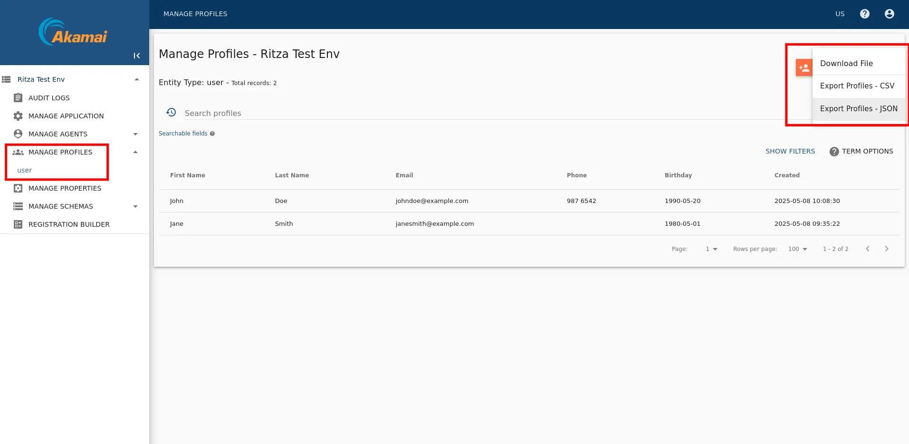
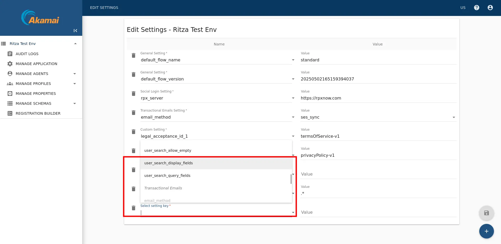

## Export Users With The Web Interface

As noted [here](https://techdocs.akamai.com/identity-cloud/docs/why-you-only-get-back-a-limited-set-of-attributes-when-you-export-your-user-profiles), the default Akamai search results won't show you all user data. Add a new settings called `user_search_display_fields`, as described [here](https://techdocs.akamai.com/identity-cloud/docs/modify-user-profile-search-display-attributes).

The problem is this documentation does not explain how to get lists of values for a user — like addresses and clients. It is therefore better to use the API to get all information for a user.

First you need to get all user attributes to export from the `user` schema. Download them as a CSV file.





<Aside type="note">
Technically, the name of this setting is `user_search_display_fields` only if you are referencing the *user* entity type. If you are working with a different entity type then you need to replace user with the appropriate entity type name. For example, suppose you have a custom entity type named *employees*. In that case, the setting name would be `employees_search_display_fields`.
</Aside>

Go to Sidebar -> MANAGE APPLICATION -> EDIT SETTINGS. Add a new setting. Do not attempt to type the name of the setting in the box. It won't work. Instead, you have to scroll through the options list and choose the field manually.



Add the value below, then save the settings using the floppy icon at the bottom right.

```js

```


## Export Users With The API

[Return all users in an entity type](https://techdocs.akamai.com/identity-cloud/docs/search-for-user-profiles#example-1-return-all-the-users-in-an-entity-type).

You API key (property) needs to have access permissions, instead of being `client_login`.


If you get the error `"error_description":"the provided client does not have authorization for this action"`, go back to the property and add more permissions.

```sh
curl -X POST https://companyname.janraincapture.com/entity.find \
  -u 'clientid:secret' \
  -d type_name=user \
  -d timeout=60 \
> users.json
```

If you have a large number of users, you might have to [partition your extract requests](https://techdocs.akamai.com/identity-cloud/docs/search-for-user-profiles#example-2-find-users-with-a-birthday). `--data-urlencode filter="gender='male'"`

The output should look like the (trimmed) results below. Note that lists, like clients and roles, are kept in arrays, and the user's password hash is returned in the `password` sub-property using bcrypt.

```js
{
  "result_count": 2,
  "results": [
    {
      "accountDataRequestTime": null,
      "accountDeleteRequestTime": null,
      "birthday": "1980-05-01",
      "clients": [
        {
          "clientId": "9a55jnetfgjf8mzdmjbugdmyr55tc2j9",
          "firstLogin": "2025-05-08 09:35:22 +0000",
          "id": 130,
          "lastLogin": "2025-05-08 09:35:22 +0000",
          "name": null
        }
      ],
      "familyName": "Smith",
      "fullName": "Jane Smith",
      "gender": "Female",
      "id": 129,
      "password": {
        "created": "2025-05-08 09:35:22.555420794 +0000",
        "type": "password-bcrypt",
        "value": "$2b$10$fGr0/0QnnDkv9VG0BtyaiOj9Fb5rNQTXkrCcidzQqR061kc6e5VBu"
      },
``


## TODO
- find old js project for frontegg
- make new js project for akamai
- import users with js


- provider-specific/akamai -> provider-specific/${migration_source_dir}
- ../../../../../../public ->