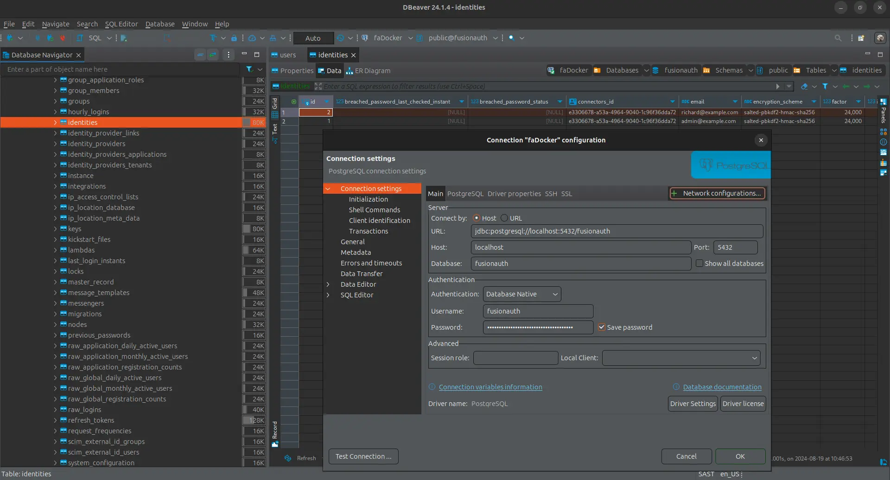

import Aside from 'src/components/Aside.astro';
import IconButton from 'src/components/IconButton.astro';
import Breadcrumb from 'src/components/Breadcrumb.astro';
import InlineField from 'src/components/InlineField.astro';
import InlineUIElement from 'src/components/InlineUIElement.astro';
import Diagram1 from 'src/components/docs/extend/segmentDiagram1.astro';
import Diagram2 from 'src/components/docs/extend/segmentDiagram2.astro';

- [Introduction](#introduction)
- [Create A New Instance Of FusionAuth](#create-a-new-instance-of-fusionauth)
- [Browse The Database](#browse-the-database)
- [What To Export?](#what-to-export)
- [Database Schema Documenation](#database-schema-documenation)
- [Database Export Command](#database-export-command)
- [Exporting from FusionAuth Cloud](#exporting-from-fusionauth-cloud)
- [Review Onboard Article And Reverse](#review-onboard-article-and-reverse)

## Introduction

This guide explains how to export your user data from FusionAuth to prepare it for migration to another system. Reasons for exporting your data include:
- Swapping from FusionAuth to another authentication service.
- Wondering if you start using FusionAuth how easy it is to leave.
- Wanting to export your users into a data warehouse for analytical investigation.

You can follow along with this guide. You will start a new FusionAuth instance with a sample user and see how to export their data. If you already use FusionAuth, you can export your data from your existing instance.

<Aside type='note'>
For integration of FusionAuth data with other services, such as exporting to a customer data warehouse with [Twilio Segment](/docs/extend/examples/twilio-segment), using monitoring services like [Prometheus](/docs/operate/secure-and-monitor/prometheus) or [Elastic](/docs/operate/secure-and-monitor/elastic), please see those guides.

To learn about authentication migration in general, please see the [generic migratino guide](docs/lifecycle/migrate-users/genericmigration.mdx). This principles in this guide that explain how to migrate **to** FusionAuth can also be used to migrate **from** FusionAuth to another service.
</Aside>

## Create A New Instance Of FusionAuth

In this section you will run a new instance of self-hosted FusionAuth with Docker.

- Install [Docker](https://docs.docker.com/get-docker/) if you don't have it on your machine.
- Clone the [FusionAuth example Docker Compose repository](https://github.com/FusionAuth/fusionauth-example-docker-compose) to your computer.
- In your terminal, navigate to the `light` directory in the repository.
- Run `docker compose up` to start FA.
- Browse to http://localhost:9011 to check that FA is running. You can log in with `admin@example.com` and `password`.
- Note the database connection details in the `docker-compose.yml` file and the hidden `.env` file.

## Browse The Database

While the FusionAuth Java code is closed-source, your database data is always freely available to you, unadulterated. You should not edit the data manually and risk breaking your system, but reading the data is fine. To browse the database, you can use a cross-platform database IDE like [DBeaver](https://dbeaver.io/download).

Below is an example screenshot of the sample FusionAuth PostgreSQL database, using a connection string with port `5432`, database `fusionauth`, and password `hkaLBM3RVnyYeYeqE3WI1w2e4Avpy0Wd5O3s3`. If you want to connect to FusionAuth on a remote server, change the <InlineField>Host</InlineField> from `localhost` to your server name. The image shows the main user data table, `identities`.

## What To Export?

    User registration data, usernames and passwords
    Some of the more common features from https://fusionauth.io/docs/get-started/core-concepts/ e.g. roles, scopes etc
    Probably some email content, e.g. password reset email copy?
    Anything else?

## Database Schema Documenation

## Database Export Command

## Exporting from FusionAuth Cloud

## Review Onboard Article And Reverse