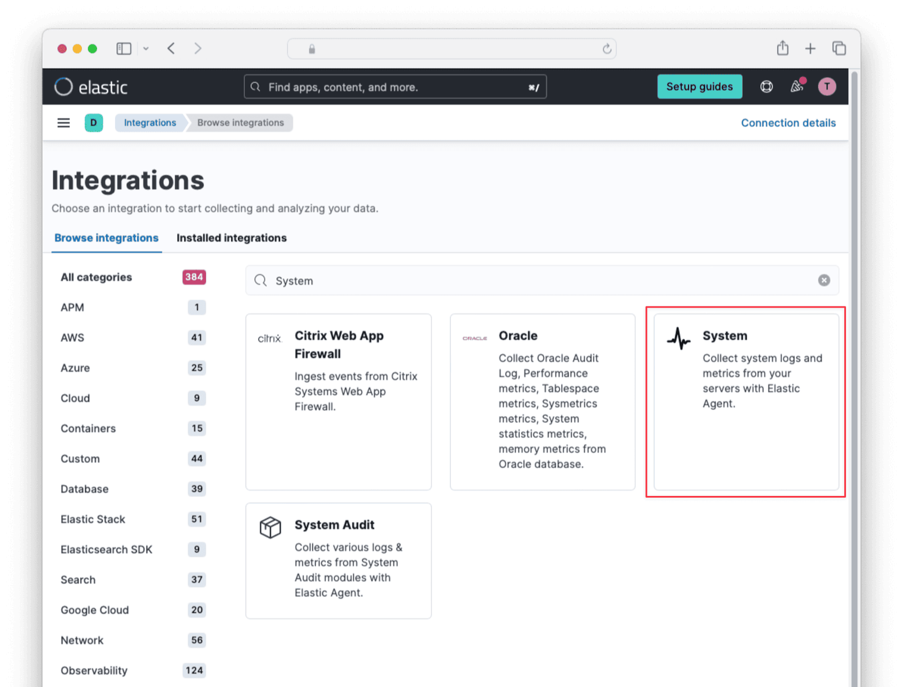
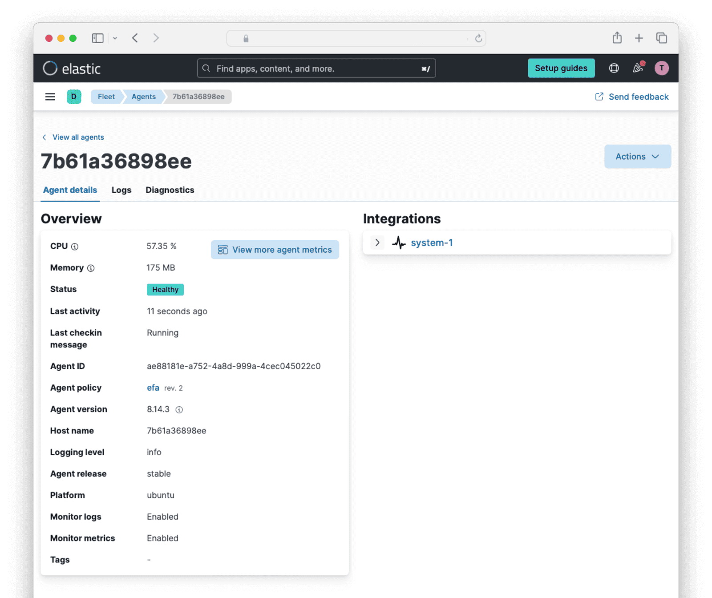
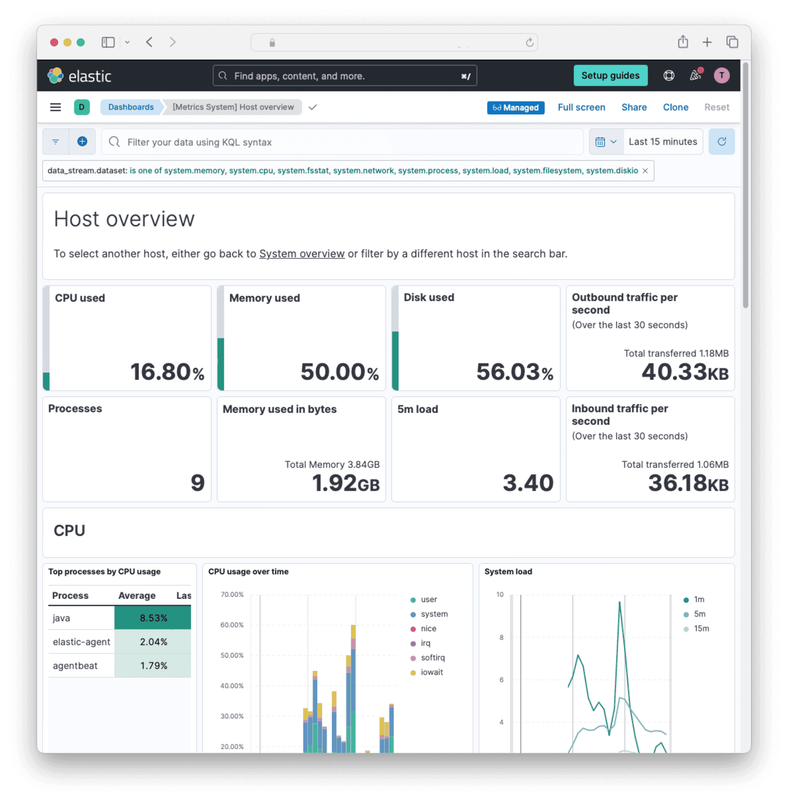

import Aside from 'src/components/Aside.astro';
import IconButton from 'src/components/IconButton.astro';
import Breadcrumb from 'src/components/Breadcrumb.astro';
import InlineField from 'src/components/InlineField.astro';
import InlineUIElement from 'src/components/InlineUIElement.astro';
import Diagram1 from 'src/components/docs/operate/secure-and-monitor/ElasticDiagram1.astro';
import Diagram2 from 'src/components/docs/operate/secure-and-monitor/ElasticDiagram2.astro';
import Diagram3 from 'src/components/docs/operate/secure-and-monitor/ElasticDiagram3.astro';

- [Introduction](#introduction)
- [Cloud Host Or Self Host?](#cloud-host-or-self-host)
- [Too Many Elastic Possibilities](#too-many-elastic-possibilities)
- [Create An Elastic Account](#create-an-elastic-account)
- [Create An Elastic API Key - TODO remove as unnecessary](#create-an-elastic-api-key---todo-remove-as-unnecessary)
- [Monitor FusionAuth With Elastic In The Same Container](#monitor-fusionauth-with-elastic-in-the-same-container)
- [Import Data To Elastic With The OpenTelemetry Linux Collector](#import-data-to-elastic-with-the-opentelemetry-linux-collector)
  - [OpenTelemetry Dashboard](#opentelemetry-dashboard)
- [FusionAuth Metrics](#fusionauth-metrics)
  - [Counts, Not Details](#counts-not-details)
  - [Which Metrics To Monitor](#which-metrics-to-monitor)
- [Mapping FusionAuth Metrics To Elastic Metrics](#mapping-fusionauth-metrics-to-elastic-metrics)
- [Write A Custom Service To Send Data To The API](#write-a-custom-service-to-send-data-to-the-api)
- [Further Reading](#further-reading)

## Introduction

[Elastic](https://www.elastic.co) is a company known for managing the ELK stack: ElasticSearch, Logstash, and Kibana. These products allow you to import (ingest) data, including observability data like logs and server metrics, organize them, and monitor them.

This guide explains how to connect FusionAuth to Elastic in various ways, as well as which FusionAuth metrics are useful in Elastic, and how to create a simple dashboard to show them.

Before continuing with this guide, please go through the [FusionAuth guide to monitoring](/docs/operate/secure-and-monitor/monitor) to get an overview of the available metrics and choose the ones relevant to your needs.

To learn more about the Elastic Observability platform, refer to the documentation [here](https://www.elastic.co/guide/en/observability/current/index.html). Pricing of the platform is available [here](https://www.elastic.co/pricing). The Standard (lowest) pricing tier includes sufficient observability features, including handling logs and metrics.

## Cloud Host Or Self Host?

Before 2021, Elastic products were open source software. In 2021, Elastic changed their licenses to [Elastic License 2.0](https://www.elastic.co/licensing/elastic-license/faq) to prevent cloud hosts (AWS, Google, Azure) from freely selling managed Elastic services that compete with [Elastic Cloud](https://www.elastic.co/cloud/shared-responsibility).

While not officially open source, the Elastic License 2.0 still allows free and open (gratis and libre) use of most Elastic products, as long as you are not selling them as your own service. So you can host the Elastic stack on your own server instead of buying Elastic Cloud. However, using [certain premium features](https://www.elastic.co/subscriptions), like AI and integrations, will still need payment to Elastic.

This guide assumes you are using the paid Elastic Cloud for monitoring. If you are instead self-hosting the Elastic Stack, you should still be able to follow the guide, but you will need to change connections that point to Elastic Cloud to point to your own server.

When reading Elastic documentation, such as their [getting started guide](https://www.elastic.co/guide/en/observability/current/logs-metrics-get-started.html), which tells you "you need an Elastic Stack deployment", remember that that does not mean you need to deploy the entire ELK stack locally alongside your application or FusionAuth instance. Their guide means that you need to have the Elastic Stack installed *somewhere*, which is probably going to be on their Elastic Cloud.

## Too Many Elastic Possibilities

[Elastic Agent](https://www.elastic.co/guide/en/fleet/current/fleet-overview.html) sends data from your server to the Elastic Cloud for processing and monitoring. To use the Cloud, you first have to install the Elastic Agent on your server.

There are various ways of doing so:
- Put the Elastic Agent in the same Docker container as FusionAuth.
- Put the Elastic Agent in a separate container and give it access to the private Docker management data for other containers.
- Install a local [OpenTelemetry](https://opentelemetry.io/) agent that sends data to Elastic, instead of using the Elastic Agent.
- Call the Elastic API directly from a local service, instead of using the Elastic Agent.

Elastic can import and visualize different types of data, including server performance, application (FusionAuth) performance, and logs.

As well as monitoring FusionAuth with Elastic, you can use Elastic to monitor your custom application too, by following steps similar to the ones in this guide.

These are an overwhelming number of ways to use Elastic. But by the end of this guide you should be able to pick the simplest combination that suits the needs of your system architecture.

## Create An Elastic Account

First, register for an Elastic account:

- Register for a trial at https://cloud.elastic.co/registration.
- Verify your email address with the link in the email Elastic sends you.
- Enter your details in the registration page and create a new deployment called `fa`. Note that your two-week free trial starts when you create the deployment.

## Create An Elastic API Key - TODO remove as unnecessary

You need an API key to upload data to Elastic.

- Browse to https://cloud.elastic.co/account/keys.
- Click "Create API Key".
- Give it a name and enable "Instance access". Select the `Admin` role for the `fa` instance.
- Click "Create API Key".
- Save the key for later use. Be careful never to commit the key to git, which can expose it on the Internet.

## Monitor FusionAuth With Elastic In The Same Container

Running FusionAuth and PostgreSQL in Docker usually looks like the diagram below (you might also run OpenSearch in another Docker container).


In this section you are going to install Elastic Agent in the same container as FusionAuth. The aim is to have a design like the diagram below.


FusionAuth and Postgresql are unchanged. The Elastic Agent in the FA container monitors the container (not the FA app), and uploads the data to ElasticSearch, where it is indexed and saved.

Kibana is a web interface the you access to view dashboards of the Agent's container's health. Note that Elastic Agent is not yet monitoring FA in this design, but if the container dies or suffers CPU or RAM overuse, that will show in the Kibana dashboard.

Fleet is the web app that tracks all Agents on all servers. It allows you set Agent Policies that tell the Agents remotely what data they should and shouldn't upload. You can also use Fleet to delete or edit existing Agents.

While this design is the simplest to implement, it violates the principle of one process per Docker container. This means it is possible for the EA process to die, while the container and FA process keep running, which will cause confusion when viewing the dashboard.

Here's how to implement this design:
- Browse to the home page of your Elastic Cloud web interface.
- In the sidebar, at the bottom, click <strong>Management -> Fleet</strong>.
- Click the "Agent policies" tab, then click "Create agent policy".
- Give it the name `efa` (ElasticFusionAuth). Review the advanced options if you like, but leave their defaults unchanged.
- Click "Create agent policy".
- Back on the agent policy list page, click the name of your new policy, "efa".
- Under the "Integrations" tab, the "System" integration should show. Click the name of the integration to open a page to edit it. If you don't see the system integration, click "Add integration" to the right, search for `System`, and add it.
  
- Disable "Collect events from the Windows event log" and leave the system collection and metric collection toggles enabled. Since your Docker instance runs Ubuntu there is no need for Windows events.
- Return to the Agents tab of the Fleet page. And click "Add Agent".
- Choose your newly created agent policy in the dropdown that appears for step 1.
- Copy the text to install the "Linux Tar" version of the agent in step 3, which will be similar to the commands below, but with different parameters.
  ```sh
  curl -L -O https://artifacts.elastic.co/downloads/beats/elastic-agent/elastic-agent-8.14.2-linux-x86_64.tar.gz
  tar xzvf elastic-agent-8.14.2-linux-x86_64.tar.gz
  cd elastic-agent-8.14.2-linux-x86_64
  sudo ./elastic-agent install --url=https://9025e4274afd63b55h64.fleet.us-central1.gcp.cloud.es.io:443 --enrollment-token=a2lB5aA1dUJ4d2daRmlNcVozang6WbgaTk5FUsE43dw==
  ```
- The last line is the most important. First, remove `sudo`, because your container user will already be root. Note the subdomain of the the URL, which is your unique Elastic Cloud home. Note also the enrollment token, which is your secret key to use Elastic. Keep the token secure and safe, and never commit it to GitHub where it can be publicly exposed.

---

- Now you are going to leave the Elastic site and work in a terminal on your own computer. Install [Docker](https://docs.docker.com/get-docker/) if you don't have it on your machine.
- Save the Dockerfile from the [FusionAuth containers repository](https://github.com/FusionAuth/fusionauth-containers/blob/master/docker/fusionauth/fusionauth-app/Dockerfile) to your computer.
- Rename to the file to `elastic.dockerfile`.
- Edit the file and insert the following lines above the comment "###### Start FusionAuth App".
  ```dockerfile
  ###### New for Elastic #################################
  RUN mkdir -p /var/lib/apt/lists/partial \
    && chmod 755 /var/lib/apt/lists/partial \
    && apt update \
    && apt install -y ca-certificates \
    && apt install nano -y \
    && mkdir -p /elastic \
    && curl -L -O https://artifacts.elastic.co/downloads/beats/elastic-agent/elastic-agent-8.14.3-linux-x86_64.tar.gz \
    && tar xzvf elastic-agent-8.14.3-linux-x86_64.tar.gz --strip-components=1 -C /elastic \
    && yes | /elastic/elastic-agent install --url=https://905e42746359ac5.fleet.us-central1.gcp.cloud.es.io:443 --enrollment-token=M29DFhVUVowUQ== \
  ```
- Change the URL and token in the last line to match your values from the Elastic website. Update the version number of the agent if yours is newer.
- Replace the last line of the file, `CMD ["/usr/local/fusionauth/fusionauth-app/bin/start.sh"]` with

- docker build  --no-cache --platform linux/amd64 -t efaimage -f elastic.dockerfile .
- docker run -it --user root --name efa efaimage bash
- docker exec -it -u root efa bash
- When you return to the Elastic web interface it should now say "Agent enrollment confirmed".
- Click "Add the integration".
- On the settings page:
  - Disable "Collect events from the Windows event log".
  - Under "Advanced options", enter an "Integration name" of `DockerFA1`.
  - Click "Confirm incoming data"
- Sidebar - Management - Fleet - Agent policies - Create agent policy - Advanced - Default to Elastic Cloud internal output
- Installs to  /opt/Elastic/Agent including elastic-agent.yml
- /elastic/elastic-agent run NO, use elastic-agent run
- 
- In the sidebar, browse to <strong>Analytics -> Dashboards</strong>. Search for and display `Host overview`.
- 
- /Library/Elastic/Agent/elastic-agent uninstall

The error below means the [Elastic Agent thinks you are using a local version of the Elastic stack, and not Elastic Cloud](https://www.elastic.co/guide/en/fleet/current/fleet-faq.html#which-es-kibana-ports-are-needed).
```json
{"log.level":"error","@timestamp":"2024-07-11T15:32:00.028Z","message":"Error dialing dial tcp 127.0.0.1:9200: connect: connection refused","component":{"binary":"metricbeat","dataset":"elastic_agent.metricbeat","id":"system/metrics-default","type":"system/metrics"},"log":{"source":"system/metrics-default"},"service.name":"metricbeat","ecs.version":"1.6.0","log.logger":"esclientleg","log.origin":{"file.line":38,"file.name":"transport/logging.go","function":"github.com/elastic/elastic-agent-libs/transport/httpcommon.(*HTTPTransportSettings).RoundTripper.LoggingDialer.func1"},"network":"tcp","address":"127.0.0.1:9200","ecs.version":"1.6.0"}
```

- add java agent apm - https://2ec4bc66a0bf4531ad2d793f7147ee24.us-central1.gcp.cloud.es.io:9243/app/integrations/edit-integration/elastic-cloud-apm?from=fleet-policy-list


```Dockerfile
#
# FusionAuth App Dockerfile
#
# Build:
#   > docker pull ubuntu:jammy
#   > docker buildx build --platform=linux/arm64 -t fusionauth/fusionauth-app:1.51.1 .
#   > docker buildx build --platform=linux/arm64 -t fusionauth/fusionauth-app:latest .
#
# Note: Substitute your target platform architecture. The above example is targetting a 64-bit ARM platform.
#       To target an Intel based platform use --platform=linux/amd64.
#
# Run:
#  > docker run -p 9011:9011 -it fusionauth/fusionauth-app
#
# Publish:
#   > docker push fusionauth/fusionauth-app:1.51.1
#   > docker push fusionauth/fusionauth-app:latest
#

###### Setup the java and fusionauth-app base #####################################################
FROM --platform=$BUILDPLATFORM ubuntu:jammy as build

ARG BUILDPLATFORM
ARG FUSIONAUTH_VERSION=1.51.1
ARG JDK_MODULES=java.base,java.compiler,java.desktop,java.instrument,java.logging,java.management,java.naming,java.rmi,java.security.jgss,java.security.sasl,java.sql,java.xml.crypto,jdk.attach,jdk.crypto.ec,jdk.dynalink,jdk.jcmd,jdk.jdi,jdk.localedata,jdk.jpackage,jdk.unsupported,jdk.zipfs
ARG TARGETPLATFORM
ARG TARGETARCH
RUN printf "Building on ${BUILDPLATFORM} for ${TARGETPLATFORM} (${TARGETARCH})."
RUN case "${BUILDPLATFORM}" in \
    linux/arm64)\
        BUILD_JAVA_SUM="eefd3cf3b3dd47ff269fa5b5c10b5e096b163f4e9c1810023abdbc00dc6cc304";\
        BUILD_JAVA_URL="https://github.com/adoptium/temurin17-binaries/releases/download/jdk-17.0.8.1%2B1/OpenJDK17U-jdk_aarch64_linux_hotspot_17.0.8.1_1.tar.gz";\
        ;;\
    linux/amd64)\
        BUILD_JAVA_SUM="c25dfbc334068a48c19c44ce39ad4b8427e309ae1cfa83f23c102e78b8a6dcc0";\
        BUILD_JAVA_URL="https://github.com/adoptium/temurin17-binaries/releases/download/jdk-17.0.8.1%2B1/OpenJDK17U-jdk_x64_linux_hotspot_17.0.8.1_1.tar.gz";\
        ;;\
    *)\
        printf "Unsupported build platform arch: ${BUILDPLATFORM}";\
        exit 1;\
        ;;\
    esac \
    && case "${TARGETARCH}" in \
    arm64)\
        JAVA_SUM="eefd3cf3b3dd47ff269fa5b5c10b5e096b163f4e9c1810023abdbc00dc6cc304";\
        JAVA_URL="https://github.com/adoptium/temurin17-binaries/releases/download/jdk-17.0.8.1%2B1/OpenJDK17U-jdk_aarch64_linux_hotspot_17.0.8.1_1.tar.gz";\
        ;;\
    arm)\
        JAVA_SUM="b1f1d8b7fcb159a0a8029b6c3106d1d16207cecbb2047f9a4be2a64d29897da5";\
        JAVA_URL="https://github.com/adoptium/temurin17-binaries/releases/download/jdk-17.0.8.1%2B1/OpenJDK17U-jdk_arm_linux_hotspot_17.0.8.1_1.tar.gz";\
        ;;\
    ppc64le)\
        JAVA_SUM="00a4c07603d0218cd678461b5b3b7e25b3253102da4022d31fc35907f21a2efd";\
        JAVA_URL="https://github.com/adoptium/temurin17-binaries/releases/download/jdk-17.0.8.1%2B1/OpenJDK17U-jdk_ppc64le_linux_hotspot_17.0.8.1_1.tar.gz";\
        ;;\
    s390x)\
        JAVA_SUM="ffacba69c6843d7ca70d572489d6cc7ab7ae52c60f0852cedf4cf0d248b6fc37";\
        JAVA_URL="https://github.com/adoptium/temurin17-binaries/releases/download/jdk-17.0.8.1%2B1/OpenJDK17U-jdk_s390x_linux_hotspot_17.0.8.1_1.tar.gz";\
        ;;\
    amd64)\
        JAVA_SUM="c25dfbc334068a48c19c44ce39ad4b8427e309ae1cfa83f23c102e78b8a6dcc0";\
        JAVA_URL="https://github.com/adoptium/temurin17-binaries/releases/download/jdk-17.0.8.1%2B1/OpenJDK17U-jdk_x64_linux_hotspot_17.0.8.1_1.tar.gz";\
        ;;\
    *)\
        printf "Unsupported arch: ${TARGETARCH}";\
        exit 1;\
        ;;\
    esac \
    && apt-get update \
    && apt-get install -y curl unzip \
    && mkdir -p /tmp/openjdk \
    && mkdir -p /tmp/build/openjdk \
    && curl -LfsSo /tmp/build/openjdk.tar.gz "${BUILD_JAVA_URL}" \
    && echo "${BUILD_JAVA_SUM} */tmp/build/openjdk.tar.gz" | sha256sum -c - \
    && curl -LfsSo /tmp/openjdk.tar.gz "${JAVA_URL}" \
    && echo "${JAVA_SUM} */tmp/openjdk.tar.gz" | sha256sum -c - \
    && cd /tmp/build/openjdk \
    && tar -xf /tmp/build/openjdk.tar.gz --strip-components=1 \
    && cd /tmp/openjdk \
    && tar -xf /tmp/openjdk.tar.gz --strip-components=1 \
    && /tmp/build/openjdk/bin/jlink --compress=2 \
           --module-path /tmp/openjdk/jmods/ \
           --add-modules ${JDK_MODULES} \
           --output /opt/openjdk \
    && curl -LfsSo /tmp/fusionauth-app.zip https://files.fusionauth.io/products/fusionauth/${FUSIONAUTH_VERSION}/fusionauth-app-${FUSIONAUTH_VERSION}.zip \
    && mkdir -p /usr/local/fusionauth/fusionauth-app \
    && unzip -nq /tmp/fusionauth-app.zip -d /usr/local/fusionauth

###### Use Ubuntu latest and only copy in what we need to reduce the layer size ###################
FROM ubuntu:jammy
RUN apt-get update \
    && apt-get -y install --no-install-recommends curl \
    && apt-get -y upgrade \
    && apt-get -y clean \
    && rm -rf /var/lib/apt/lists \
    && useradd -d /usr/local/fusionauth -U fusionauth
COPY --chown=fusionauth:fusionauth --from=build /opt/openjdk /opt/openjdk
COPY --chown=fusionauth:fusionauth --from=build /usr/local/fusionauth /usr/local/fusionauth

###### Connect the log file to stdout #############################################################
RUN mkdir -p /usr/local/fusionauth/logs \
  && touch /usr/local/fusionauth/logs/fusionauth-app.log \
  && ln -sf /dev/stdout /usr/local/fusionauth/logs/fusionauth-app.log

##### New for Elastic #################################
RUN mkdir -p /var/lib/apt/lists/partial \
    && chmod 755 /var/lib/apt/lists/partial \
    && apt update \
    && apt install -y ca-certificates \
    && cd /usr/local/fusionauth \
    && curl -L -o otel.jar https://github.com/open-telemetry/opentelemetry-java-instrumentation/releases/latest/download/opentelemetry-javaagent.jar \
    && (head -n -1 /usr/local/fusionauth/fusionauth-app/bin/start.sh; echo 'exec "${JAVA_HOME}/bin/java" -javaagent:/usr/local/fusionauth/otel.jar -Dotel.resource.attributes=service.name=fusionauth -Dotel.traces.exporter=otlp -Dotel.exporter.otlp.endpoint=http://otel:4318 -cp "${CLASSPATH}" ${JAVA_OPTS} io.fusionauth.app.FusionAuthMain <&- >> "${LOG_DIR}/fusionauth-app.log" 2>&1') > temp.sh \
    && mv temp.sh /usr/local/fusionauth/fusionauth-app/bin/start.sh;
RUN chown fusionauth:fusionauth /usr/local/fusionauth/otel.jar /usr/local/fusionauth/fusionauth-app/bin/start.sh \
    && chmod +x /usr/local/fusionauth/fusionauth-app/bin/start.sh

###### Start FusionAuth App #######################################################################
LABEL description="Create an image running FusionAuth App. Installs FusionAuth App"
LABEL maintainer="FusionAuth <dev@fusionauth.io>"
EXPOSE 9011
USER fusionauth
ENV FUSIONAUTH_USE_GLOBAL_JAVA=1
ENV JAVA_HOME=/opt/openjdk
ENV PATH=$PATH:$JAVA_HOME/bin
CMD ["/usr/local/fusionauth/fusionauth-app/bin/start.sh"]
```

## Import Data To Elastic With The OpenTelemetry Linux Collector

Instead of sending metrics manually to Elastic, you can send them automatically with OpenTelemetry. OpenTelemetry is both a protocol and software that is dedicated to monitoring, measuring, processing, collecting, and sending metrics. In this section, you will add OpenTelemetry to your normal FusionAuth instance.


You can also start FusionAuth inside Docker with [OpenTelemetry for Java](https://github.com/open-telemetry/opentelemetry-java-instrumentation). OpenTelemetry sends the metrics it reads to a collector. The OpenTelemetry Collector runs in a separate Docker container and sends the metrics to Elastic for recording. This follows the Docker principle of one process per container.

This architecture is shown in the diagram below.


The Elastic [OpenTelementry Linux Collector tutorial](https://docs.splunk.com/observability/en/gdi/opentelemetry/collector-linux/collector-configuration-tutorial/about-collector-config-tutorial.html#about-collector-configuration-tutorial) is designed for a physical machine running systemd. Docker containers don't use systemd, as they are designed to host a single process.

Instead, you'll use the OpenTelemetry Collector inside the Docker image Elastic has prepared.

First you need to modify the official FusionAuth Docker image to download the OpenTelemetry Java agent and change the script that starts FusionAuth.

<Aside type="note">
Configuration values for Java OpenTelemetry are described [here](https://opentelemetry.io/docs/languages/java/configuration).
</Aside>

Save the Dockerfile from the [FusionAuth containers repo](https://github.com/FusionAuth/fusionauth-containers/blob/master/docker/fusionauth/fusionauth-app/Dockerfile) to your computer. Edit the Dockerfile file and insert the following lines above the comment "###### Start FusionAuth App".

```
##### New for Elastic #################################
RUN mkdir -p /var/lib/apt/lists/partial \
    && chmod 755 /var/lib/apt/lists/partial \
    && apt update \
    && apt install -y ca-certificates \
    && cd /usr/local/fusionauth \
    && curl -L -o otel.jar https://github.com/open-telemetry/opentelemetry-java-instrumentation/releases/latest/download/opentelemetry-javaagent.jar \
    && (head -n -1 /usr/local/fusionauth/fusionauth-app/bin/start.sh; echo 'exec "${JAVA_HOME}/bin/java" -javaagent:/usr/local/fusionauth/otel.jar -Dotel.resource.attributes=service.name=fusionauth -Dotel.traces.exporter=otlp -Dotel.exporter.otlp.endpoint=http://otel:4318 -cp "${CLASSPATH}" ${JAVA_OPTS} io.fusionauth.app.FusionAuthMain <&- >> "${LOG_DIR}/fusionauth-app.log" 2>&1') > temp.sh \
    && mv temp.sh /usr/local/fusionauth/fusionauth-app/bin/start.sh;
RUN chown fusionauth:fusionauth /usr/local/fusionauth/otel.jar /usr/local/fusionauth/fusionauth-app/bin/start.sh \
    && chmod +x /usr/local/fusionauth/fusionauth-app/bin/start.sh
```

This script first updates Ubuntu to install basic software that FusionAuth removed to save space. The script then downloads the OpenTelemetry Java app. Next, the script edits `start.sh`, which is the command run when the container starts, to start FusionAuth with OpenTelemetry. The edit command writes the new command to the end of the `start.sh` file.

By default, the OpenTelemetry Java agent sends data to the OpenTelemetry Collector at http://localhost:4317. The code above changes this so data is sent to the container at http://otel:4318. (Elastic uses 4317 for RPC, not HTTP.)

Build the Dockerfile into a new image to use in place of the official FusionAuth one.

```sh
docker build --platform linux/amd64 -t faimage .
```

Now save the [`docker-compose.yaml`](https://github.com/FusionAuth/fusionauth-containers/blob/main/docker/fusionauth/docker-compose.yml) and [sample `.env`](https://github.com/FusionAuth/fusionauth-containers/blob/main/docker/fusionauth/.env) files from the FusionAuth containers repo. Update the `docker-compose.yaml` file to include the [Elastic OpenTelemetry](https://docs.splunk.com/observability/en/gdi/opentelemetry/collector-linux/install-linux-manual.html#linux-docker) container in your compose file by adding the content below. Replace the access token and realm with yours in the `otel` service. Note that the image on the  `fa` service is also changed to point to the one built in the previous step.

```
version: '3'

services:
  db:
    image: postgres:latest
    container_name: fa_db
    ports:
      - "5432:5432"
    environment:
      PGDATA: /var/lib/postgresql/data/pgdata
      POSTGRES_USER: ${POSTGRES_USER}
      POSTGRES_PASSWORD: ${POSTGRES_PASSWORD}
    healthcheck:
      test: [ "CMD-SHELL", "pg_isready -U postgres" ]
      interval: 5s
      timeout: 5s
      retries: 5
    networks:
      - db_net
    volumes:
      - db_data:/var/lib/postgresql/data

  fa:
    # image: fusionauth/fusionauth-app:latest
    image: faimage
    container_name: fa
    depends_on:
      db:
        condition: service_healthy
    environment:
      DATABASE_URL: jdbc:postgresql://db:5432/fusionauth
      DATABASE_ROOT_USERNAME: ${POSTGRES_USER}
      DATABASE_ROOT_PASSWORD: ${POSTGRES_PASSWORD}
      DATABASE_USERNAME: ${DATABASE_USERNAME}
      DATABASE_PASSWORD: ${DATABASE_PASSWORD}
      FUSIONAUTH_APP_MEMORY: ${FUSIONAUTH_APP_MEMORY}
      FUSIONAUTH_APP_RUNTIME_MODE: ${FUSIONAUTH_APP_RUNTIME_MODE}
      FUSIONAUTH_APP_URL: http://fusionauth:9011
      SEARCH_TYPE: database
      FUSIONAUTH_APP_KICKSTART_FILE: ${FUSIONAUTH_APP_KICKSTART_FILE}
    networks:
      - db_net
    ports:
      - 9011:9011
    volumes:
      - fusionauth_config:/usr/local/fusionauth/config
      - ./kickstart:/usr/local/fusionauth/kickstart
    extra_hosts:
      - "host.docker.internal:host-gateway"

  otel:
    image: quay.io/signalfx/splunk-otel-collector:latest
    container_name: fa_otel
    environment:
      SPLUNK_ACCESS_TOKEN: "<your-splunk-access-token>"
      SPLUNK_REALM: "us1"
      SPLUNK_LISTEN_INTERFACE: "0.0.0.0"
      SPLUNK_MEMORY_LIMIT_MIB: "1000"
      SPLUNK_CONFIG: /config.yaml
    volumes:
      - ./config.yaml:/config.yaml
    networks:
      - db_net
    # no host ports are needed as communication is inside the Docker network
    # ports:
    #   - "13133:13133"
    #   - "14250:14250"
    #   - "14268:14268"
    #   - "4317:4317"
    #   - "4318:4318"
    #   - "6060:6060"
    #   - "7276:7276"
    #   - "8888:8888"
    #   - "9080:9080"
    #   - "9411:9411"
    #   - "9943:9943"

networks:
  db_net:
    driver: bridge

volumes:
  db_data:
  fusionauth_config:
```

Save the [sample Elastic configuration file](https://github.com/signalfx/splunk-otel-collector/blob/main/cmd/otelcol/config/collector/gateway_config.yaml) to a file called `config.yaml` on your computer in the same folder as the `docker-compose.yaml` file. You are using the Elastic collector in [gateway mode (data forwarding), not agent mode (host monitoring)](https://docs.splunk.com/observability/en/gdi/opentelemetry/opentelemetry.html#collector-intro-deploy). The host monitoring is done by the Java agent running in the FusionAuth Docker instance.

The `config.yaml` configuration file path is added as the `SPLUNK_CONFIG: /config.yaml` [environment variable](https://docs.splunk.com/observability/en/gdi/opentelemetry/environment-variables.html#collector-env-var) in the above Docker compose file.

Now check whether the OpenTelemetry container can send data to Elastic. First run the command below.

```sh
docker compose up otel
```

On the Elastic website, go to the <strong>Metric Finder</strong> section and search for `otel` to see if any data is visible. Even when FusionAuth is not running, the collector will send basic data to Elastic.

If no data is sent, correct your access token and realm in the compose file.

Now that you are sure the Elastic connection works, stop the otel container with <kbd>Ctrl</kbd>+<kbd>C</kbd> and run `docker compose up` to start all three containers. It may take 30 seconds for all the containers to start, but after that, the terminal output should show data being sent to Elastic.

### OpenTelemetry Dashboard

Create a dashboard to view all the data from FusionAuth.

Browse to https://app.us1.signalfx.com/#/dashboards (remember to replace `us1` with your realm). Choose the "OpenTelemetry Collector" dashboard from the <strong>Built-in dashboard groups</strong>. (This dashboard will appear as an option only if you have set up the collector in the previous section.)


At the top, set the time to the past day to ensure that you see all possible values while testing.

While FusionAuth is running, you should see a dashboard like the image below.


## FusionAuth Metrics

Now you know how to send Elastic Java metrics with OpenTelemetry, let's consider what custom metrics you would want to send and how to write code that uploads the metrics automatically while FusionAuth is running.

### Counts, Not Details

Note that Elastic is designed to monitor aggregate data, in other words, counts of events. Elastic can group those counts over time and by dimension (location, server, or application). Elastic is **not** designed to monitor individual events with details like error messages or the names of the most purchased products on your site.

For FusionAuth, this means you should use Elastic to check **how many** people are logging in over time, not **which** people. Think of it like this: If your data can be used in a gauge or bar chart, it's the right type of data.

While it's true that Elastic does have a log file tracking product and many other services, this article discusses only the Observability Cloud.

### Which Metrics To Monitor

FusionAuth has too [many metrics](/docs/operate/secure-and-monitor/monitor#metrics) to discuss in this article. You will need to decide which are important for you to monitor by reading the documentation.

In addition to the metrics available through the various FusionAuth APIs, you can create your own metrics using any event that can trigger a [webhook](/docs/extend/events-and-webhooks). This webhook can call another Docker container you create that listens for incoming events and forwards them to Elastic.

A useful metric to start with is login counts. If this number drops from the average, it's a good sign something might be wrong with your system. In this guide, you'll learn how to create a program that uses the FusionAuth API to get the login count, then upload it to Elastic.

You can add any other metrics you want to this system.

## Mapping FusionAuth Metrics To Elastic Metrics

Elastic has two sets of documentation, the [primary](https://docs.splunk.com/observability/en) and the [developer](https://dev.splunk.com/observability/docs) documentation. You need to read only the primary documentation to use Elastic with FusionAuth. The only exception is the [documentation on the data format](https://dev.splunk.com/observability/reference/api/ingest_data/latest#endpoint-send-metrics) expected by Elastic if you're uploading data with their REST API.

Elastic has four different [metric types](https://docs.splunk.com/observability/en/metrics-and-metadata/metric-types.html#metric-types):

| Type               | Description                                                                                               |
|--------------------|-----------------------------------------------------------------------------------------------------------|
| Gauge              | Value of a measurement at a specific point in time.                                                        |
| Cumulative counter | Total number of occurrences or items since the measurement began.                                          |
| Counter            | Number of new occurrences or items since the last measurement.                                             |
| Histogram          | Distribution of measurements across time. Elastic Observability Cloud supports explicit bucket histograms. |

Let's consider the number of user logins every ten seconds as an example. If you have only a few users, you could monitor the number every hour or even every day instead.

You could send the number of logins to Elastic as a:

- Gauge: Monitoring this would involve seeing that the gauge number on the dashboard doesn't change much.
- Cumulative counter: Monitoring this would involve seeing that the number is steadily increasing.
- Counter: In this case, the metric would function the same as a gauge.

Using a histogram isn't necessary for such simple data.

## Write A Custom Service To Send Data To The API

Previously, this guide showed you how to use a new Docker container to run an OpenTelemetry Collector to receive data from FusionAuth. In this section, you will create another Docker container to call the FusionAuth API and send the metrics to Elastic.

The system looks like the diagram below.


Let's get the login records every ten seconds and send them to Elastic. All the FusionAuth APIs that give you event data are documented [here](/docs/apis). The login records API is documented [here](/docs/apis/login#request-6). Note that the documentation says the date format is the standard Java type, but some constants like `ISO_LOCAL_DATE_TIME` are not supported. You need to enter the format string you want manually.

Unfortunately, all the APIs export events as zip files — you will not get JSON or YAML data in memory. So you will need to create a script that gets the zip file, extracts it, reads it, formats the entries for Elastic, and uploads them.

Browse to FusionAuth, which is at http://localhost:9011 if you are running through the default Docker setup. Log in and look for your application Id in <Breadcrumb>System -> Login Records</Breadcrumb>.

Next, create an API key by navigating to <Breadcrumb>Settings -> API Keys</Breadcrumb> and clicking the <IconButton icon="plus" color="green" /> button. Enter a <InlineField>Description</InlineField> for the API key and click on the <IconButton icon="save" color="blue" /> button to save the API key. On the API Keys list page, click the red lock <IconButton icon="lock" color="red" /> next to the newly generated key to reveal the key value and copy and save it.

Create a file called `app.sh`. Insert the content below, replacing your FusionAuth API key in `key` and FusionAuth application Id in `appId`, and your Elastic access token and Elastic realm in the curl command at the end.

```sh
#!/bin/sh

# exit on error
set -e

# get login records from FusionAuth
endpoint="http://fa:9011/api/system/login-record/export"
# FusionAuth API key
key="33052c8a-c283-4e96-9d2a-eb1215c69f8f-not-for-prod"
# FusionAuth application Id
appId="3c219e58-ed0e-4b18-ad48-f4f92793ae32"
dateFormat=$(echo -n "yyyy-MM-dd'T'HH:mm:ss.SSS" | jq -sRr @uri)
end=$(date +%s)000
start=$(($end - 3600000))
params="applicationId=${appId}&dateTimeSecondsFormat=${dateFormat}&start=${start}&end=${end}"
url="${endpoint}?${params}"
echo "curl -H \"Authorization: ${key}\" -o record.zip \"$url\""
curl -H "Authorization: ${key}" -o record.zip "$url"
unzip record.zip -o
cat login_records.csv

# for each record, get the unix time in ms
tail -n +2 login_records.csv | while IFS=',' read -r userId time rest; do
  userId=$(echo "$userId" | tr -d ' "' )
  time=$(echo "$time" | tr -d ' "')                      # 2024-06-21T05:14:56.123
  time=$(echo "$time" | tr 'T' ' ')                      # 2024-06-21 05:14:56.123
  sec="$(date -d "$(echo $time | cut -d '.' -f 1)" +%s)" # 1718946896
  ms="$(echo $time | cut -d '.' -f 2)"                   # 123

  # make the POST data
  data=$(cat <<EOF
{
  "cumulative_counter": [
    {
       "metric": "login.success",
       "dimensions": { "host": "testServer" },
       "value": 1,
       "timestamp": ${sec}${ms}
    }
  ]
}
EOF
)

  # send data to Elastic API
  curl --request POST -H "X-SF-TOKEN: yourToken" -H "Content-Type: application/json" -d "$data" "https://ingest.us1.signalfx.com/v2/datapoint"

done
```

This script gets all login records in the last hours to be sure the zip file has some data. In reality, replace 3600000 with 10000 so that when the script runs every ten seconds, it gets only the latest records. Note that FusionAuth uses milliseconds instead of the epoch standard of seconds, so the script has to append `000` to the normal Unix time.

The file returned from FusionAuth unzips to `login_records.csv`, which looks like the data below.

| "User Id "                           | "Time "                 | "Application Id "                    | "IP Address " | "City " | "Country " | "Zipcode " | "Region " | "Latitude " | "Longitude " |
|--------------------------------------|-------------------------|--------------------------------------|---------------|---------|------------|------------|-----------|-------------|--------------|
| ba81f3e2-3b0f-4d64-930f-38298de9dc0d | 2024-06-21T05:14:56.123 | 3c219e58-ed0e-4b18-ad48-f4f92793ae32 | 172.20.0.1    |         |            |            |           |             |              |
| ba81f3e2-3b0f-4d64-930f-38298de9dc0d | 2024-06-21T05:07:06.406 | 3c219e58-ed0e-4b18-ad48-f4f92793ae32 | 172.20.0.1    |         |            |            |           |             |              |

The records in this file look different from those in the FusionAuth console. Only Ids are given here, not email addresses or application names.

The second half of the script reads in the CSV file, discards the header, and sends a value of `1` and the time of each login to Elastic.

Create a file called `metricDockerfile`. Insert the content below.

```
FROM --platform=linux/amd64 alpine:3.19
RUN apk add --no-cache curl jq vim
COPY app.sh /app.sh
RUN chmod +x app.sh
CMD watch -t -n 10 /app.sh
```

Build the container with the command below.

```sh
docker build -f metricDockerfile --platform linux/amd64 -t metricimage .
```

Edit your `docker-compose.yaml` file and add the new service as follows.

```
  fametric:
    image: metricimage
    container_name: fametric
    networks:
      - db_net
```

Now run all the containers with `docker compose up`.

The output should be as below. Since you logged in in the last hour, there will be one row in the exported file and one value will be sent to Elastic.

```sh
curl -H "Authorization: 33052c8a-c283-4e96-9d2a-eb1215c69f8f-not-for-prod" -o record.zip "http://fa:9011/api/system/login-record/export?applicationId=3c219e58-ed0e-4b18-ad48-f4f92793ae32&dateTimeSecondsFormat=yyyy-MM-dd%27T%27HH%3Amm%3Ass.SSS&start=1719216315000&end=1719219915000"
fametric  |   % Total    % Received % Xferd  Average Speed   Time    Time     Time  Current
fametric  |                                  Dload  Upload   Total   Spent    Left  Speed
100   310    0   310    0     0  41026      0 --:--:-- --:--:-- --:--:-- 44285
fametric  | Archive:  record.zip
fametric  |   inflating: login_records.csv
fametric  | "User Id ","Time ","Application Id ","IP Address ","City ","Country ","Zipcode ","Region ","Latitude ","Longitude "
fametric  | 00000000-0000-0000-0000-000000000001,2024-06-24T02:19:04.054,3c219e58-ed0e-4b18-ad48-f4f92793ae32,172.20.0.1,,,,,,
fametric  |   % Total    % Received % Xferd  Average Speed   Time    Time     Time  Current
fametric  |                                  Dload  Upload   Total   Spent    Left  Speed
100   173  100     4  100   169      2    112  0:00:02  0:00:01  0:00:01   114
```

On your Elastic web interface, browse to <strong>Metric Finder</strong>. Search for `login.success`. Click on the result and on the resulting chart, set the time to `-1d` and the chart type to column.

If the metric has not uploaded correctly, you can debug the container by running `docker exec -it fametric sh` in a new terminal. Once in the container, you can alter the script with `vim /app.sh`. Add `-v` to the `curl` command to see verbose output. Run the script with `/app.sh`.

If you have trouble calling the FusionAuth API, review the [troubleshooting tips](/docs/apis/#troubleshooting).

If you alter `app.sh` in your host machine and want to rerun the containers, use the command below.

```sh
clear; docker build -f metricDockerfile --platform linux/amd64 -t metricimage .; docker compose up
```

You can follow the process described here to add other FusionAuth API calls to `app.sh` to get other metrics to send to Elastic.


## Further Reading

- [FusionAuth metrics](/docs/operate/secure-and-monitor/monitor#metrics)
- [OpenTelemetry documentation](https://opentelemetry.io/docs/what-is-opentelemetry)
- [OpenTelemetry Java documentation](https://github.com/open-telemetry/opentelemetry-java-instrumentation)
- [Elastic OpenTelemetry Java documentation](https://docs.splunk.com/observability/en/gdi/get-data-in/application/java/get-started.html#get-started-java)
- [Elastic REST API](https://dev.splunk.com/observability/reference/api/ingest_data/latest#endpoint-send-metrics)
- [FusionAuth Dockerfile](https://github.com/FusionAuth/fusionauth-containers/blob/master/docker/fusionauth/fusionauth-app/Dockerfile)
- [Docker OpenTelemetry Collector](https://docs.splunk.com/observability/en/gdi/opentelemetry/collector-linux/install-linux-manual.html#linux-docker)
- [Ports exposed by OpenTelemetry container](https://docs.splunk.com/observability/en/gdi/opentelemetry/exposed-endpoints.html)

<strong></strong>