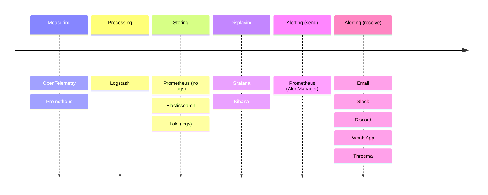

import Aside from 'src/components/Aside.astro';
import LoadTestingIntro from 'src/content/docs/get-started/run-in-the-cloud/_load-testing-intro.mdx';
import LoadTestingTips from 'src/content/docs/get-started/run-in-the-cloud/_load-testing-tips.mdx';

- [Overview](#overview)
	- [What Is Monitoring?](#what-is-monitoring)
- [What FusionAuth Metrics Can Be Monitored?](#what-fusionauth-metrics-can-be-monitored)
	- [Log Files](#log-files)
	- [Application Logging](#application-logging)
	- [Log File Formats](#log-file-formats)
	- [Application Events](#application-events)
	- [Metrics](#metrics)
		- [Prometheus Endpoint](#prometheus-endpoint)
- [Overview Of Popular Monitoring Tools And Services](#overview-of-popular-monitoring-tools-and-services)
	- [What Is OpenTelemetry?](#what-is-opentelemetry)
	- [What Is Prometheus?](#what-is-prometheus)
	- [What Is Grafana?](#what-is-grafana)
	- [What Is Grafana Loki?](#what-is-grafana-loki)
	- [What Are Elasticsearch, Logstash, and Kibana (ELK)?](#what-are-elasticsearch-logstash-and-kibana-elk)
	- [What Are OpenSearch And OpenSearch Dashboard?](#what-are-opensearch-and-opensearch-dashboard)
	- [What Are Jaeger, Zipkin, and Grafana Tempo?](#what-are-jaeger-zipkin-and-grafana-tempo)
	- [What Tools Are Available To Send Alerts To Administrators?](#what-tools-are-available-to-send-alerts-to-administrators)
	- [Monitoring Tools Compared](#monitoring-tools-compared)
- [Which Tools Should You Use For Monitoring?](#which-tools-should-you-use-for-monitoring)
- [Load Testing](#load-testing)
	- [Tips](#tips)

## Overview

Once you've installed FusionAuth and your applications use it for authentication, you have to ensure FusionAuth remains online and usable. There is an ecosystem of tools, protocols, and paid services to monitor applications and provide telemetry (remote measurement) that you need to understand.

This overview article will introduce you to various metrics (measurements) you can extract from FusionAuth, common monitoring tools to process, store, and visualize them, and explain which tools and services to choose for your requirements. Your needs will depend on how much information you need about the state of FusionAuth, how much time you are willing to spend setting up and maintaining your monitoring system, and how much you are willing to pay for monitoring cloud services.

### What Is Monitoring?

The aim of monitoring FusionAuth is to be able to see at any time if the service is alive (Docker container is running) and functioning correctly (e.g., users can sign in and logs have no errors), and to be alerted (by email or chat app) if either of these conditions is not met.

A complete monitoring system involves five activities:
- Measuring — Getting operational data about FusionAuth and Docker.
- Processing — Filtering, indexing, and aggregating data into counts and booleans that represent if the system is working correctly.
- Storing — Storing metrics, logs, and aggregates.
- Displaying — Showing the information in a dashboard. (A query language might do the aggregation here instead of the processing step.)
- Alerting — Notifying administrators when services degrade or fail.

While you can use stock Docker monitoring apps to monitor Docker containers and collect logs, you always need to write custom code or [webhooks](https://fusionauth.io/docs/apis/webhooks) to get FusionAuth specific information, like numbers of successful logins.

## What FusionAuth Metrics Can Be Monitored?

The table below lists metadata FusionAuth offers for monitoring purposes.

| Name | Contains | Ingestion Options | More Information |
| --- | --- | --- | --- |
| Metrics | System metrics, such as JVM buffers, memory and threads.  | Can be consumed via API and available in Prometheus compatible format.  | [More info](/docs/operate/secure-and-monitor/monitor#metrics) |
| System Logs | Exceptions, stack traces, database connection issues, Elasticsearch connection issues. Minimal tracing capability unless debug logging is enabled. Logs are also written to the Docker standard output (terminal). | Can be exported as a zip file via API.  | [More info](/docs/operate/troubleshooting/troubleshooting#system-log-ui) |
| Audit Logs | Created by the admin user interface actions. This is just an API, so a customer can also call this API. This is a free form API, and the audit log contents are whatever you put in.  | This can be consumed via web hook or API.  | [More info](/docs/apis/audit-logs) |
| Event Logs | Debug information for external integrations with IdPs, SMTP etc. In general, runtime errors that are typically not caused by FusionAuth and cannot be communicated well at runtime. Examples: a template rendering error in a custom theme, an exception connecting to SMTP due to bad credentials, a failure in a SAML exchange, a connection to a webhook is failing.  | This can be consumed via web hook or API.  | [More info](/docs/operate/troubleshooting/troubleshooting#event-log) |
| Login records | Each successful login is recorded here. Includes IP information, application, user, and timestamp.  | Can be consumed via API. This record itself is not sent through a webhook, but a login success or login failure can be consumed via a web hook.  | [More info](/docs/apis/login#export-login-records) |
| Webhooks | Triggered by events as documented, sending is configurable. Contains IP and location information when available.  | Can be sent to an HTTP endpoint or a Kafka topic.  | [More info](/docs/extend/events-and-webhooks/) |

Most of the items above are given as a ZIP file when requested by an API call. Webhooks are different — they are pushed from FusionAuth to a URL you specify, not called in an API by a monitoring tool.

The next few subsections give more detail about each item above.

### Log Files

The system log files will be placed in the `logs` directory under the FusionAuth installation unless you are running FusionAuth in a container. In the latter case, the log output will be sent to STDOUT by default.
You may also set up a [Docker logging driver](https://docs.docker.com/config/containers/logging/configure/) to direct log files elsewhere.

System logs running in non-containerized instances can also be exported via the [Export System Logs API](/docs/apis/system#export-system-logs).

[Learn more about FusionAuth log files](/docs/operate/troubleshooting/troubleshooting#logs).

### Application Logging

There are a few different APIs exposing FusionAuth application specific information you may want to ingest into your monitoring system:

* [FusionAuth administrative user interface audit logs](/docs/apis/audit-logs)
* [Logs and errors from asynchronous code execution](/docs/apis/event-logs)
* [Login records](/docs/apis/login#export-login-records)

In general these are APIs you will have to poll to ingest.

### Log File Formats

| Log Type | Export Format | Timezone | Date Format | API Docs |
| --- | --- | --- | --- | --- |
| Audit Logs | Zipped CSV | Specified by the `zoneId` parameter | Specified by the `dateTimeSecondsFormat` parameter, defaults to `M/d/yyyy hh:mm:ss a z` | [API](/docs/apis/audit-logs) |
| Event Logs | JSON | UTC | [Instant](/docs/reference/data-types#instants) | [API](/docs/apis/event-logs) |
| Login Records | Zipped CSV | Specified by the `zoneId` parameter | Specified by the `dateTimeSecondsFormat` parameter, defaults to `M/d/yyyy hh:mm:ss a z` | [API](/docs/apis/login#export-login-records) |
| System Logs | Zipped directory of files. Log entries separated by newlines, but may be unstructured (stack traces, etc).  | For log entries, the timezone of the server. The `zoneId` parameter, if provided, is used to build the filename.  | `yyyy-MM-dd h:mm:ss.SSS a` | [API](/docs/apis/system#export-system-logs) |

<Aside type="note">
There are currently no plugins for ingesting FusionAuth logs into a log management system. A polling script using a [client library](/docs/sdks/) is usually sufficient. Please [file an issue](https://github.com/FusionAuth/fusionauth-issues/issues) if this does not meet your use case.
</Aside>

### Application Events

There are a number of events, such as a failed authentication or an account deletion, that you may want to ingest into your monitoring system. These are available as webhooks.

Here's [the list of all available events](/docs/extend/events-and-webhooks/events/).

### Metrics

You can pull system metrics from the [System API](/docs/apis/system#retrieve-system-status). The format of these metrics are evolving and thus are not documented.

You can also enable JMX metrics as outlined in the [Troubleshooting documentation](/docs/operate/troubleshooting/troubleshooting#enabling-jmx).

#### Prometheus Endpoint

The default system metrics are also available in a Prometheus compatible form. [This tutorial](/docs/operate/secure-and-monitor/prometheus) explains how to set up Prometheus to monitor FusionAuth metrics.

## Overview Of Popular Monitoring Tools And Services

This section introduces the most common monitoring tools. At the end of the section is a table showing where each tool fits in the five activities (measuring, processing, storing, displaying, alerting).

### What Is OpenTelemetry?

[OpenTelemetry](https://opentelemetry.io/docs) is an open-source framework (suite of apps) and a protocol for collecting information about a running application.

You can either use an OpenTelemetry library as a module in your code, which you call manually to send it application-specific metrics (instrumentation), or you can use a stock OpenTelemetry instrumentation agent, like the Java Virtual Machine agent, that collects general information about your application as it runs.

You could also collect metrics about your application another way and send them to an OpenTelemetry Collector service through OTLP (OpenTelemetry Protocol), a standardized way of exchanging telemetry data between services. The Collector acts a central point to receive all metrics, potentially do some simple filtering, and forward the metrics to other services.

OpenTelemetry does not handle storage, data aggregation (counting things), or visualization (dashboards).

For example, you could run the OpenTelemetry Java agent before running your app. The agent would monitor RAM use of your app as a metric and send it to an OpenTelemetry collector, which would forward the metric to another service for saving, counting, and displaying in a dashboard.

There is a guide to monitoring FusionAuth with OpenTelemetry [here](/docs/operate/secure-and-monitor/opentelemetry).

### What Is Prometheus?

[Prometheus](https://prometheus.io/docs/introduction/overview) is a database specifically designed to store metrics efficiently, as well as provide data through a custom query language. Prometheus also provides alerts through its [AlertManager](https://github.com/prometheus/alertmanager) and simplistic charts, but for proper dashboards you need Grafana. Prometheus also provides some instrumentation tools to obtain metrics for networks, machines, and some [programming languages](https://prometheus.io/docs/instrumenting/clientlibs/).

Prometheus should [not be used to store logs](https://prometheus.io/docs/introduction/faq/#how-to-feed-logs-into-prometheus).

For example, you could run the Prometheus network monitoring agent, which would monitor the amount of data travelling your network every second as a metric, and save it to the Prometheus database. You could then run an ad hoc query to visualize the network usage in the last hour as a chart with the Prometheus web interface.

### What Is Grafana?

[Grafana](https://grafana.com/grafana) is an open-source dashboard app, that can be self-hosted, or cloud-hosted with a fee. Grafana does not aggregate or process data itself, but can call data providers to get your metrics with aggregation, if the provider supports a query language that does aggregation. Grafana can also trigger [alerts](https://grafana.com/docs/grafana/latest/alerting/fundamentals/).

For example, you could create a dashboard in Grafana that queries Prometheus every few seconds to get the network usage over the last hour and display it as a chart.

### What Is Grafana Loki?

Although Grafana does not store data, Grafana [Loki](https://grafana.com/oss/loki/), a separate tool that is part of the Grafana brand, does store data. Loki receives and stores logs. It has a similar purpose to Elasticsearch.

Unlike Logstash, Loki does not do significant processing to logs it receives. So it can run faster, but provides less data for indexed searching.

For example, you could redirect the output of your app's logs from the Docker container standard output to Loki for storing.

### What Are Elasticsearch, Logstash, and Kibana (ELK)?

Elasticsearch is a database to store indexed non-relational data, which provides a query tool to search the data. You can either save logs directly to Elasticsearch or first process and index them by sending the logs to Logstash, which forwards the processed logs to Elasticsearch for saving.

Both tools are managed by the Elastic company, and are designed to integrate with the Elastic dashboard tool, Kibana.

You could use Elasticsearch similarly to both Prometheus and Loki, in the same way as their examples.

### What Are OpenSearch And OpenSearch Dashboard?

[OpenSearch and OpenSearch Dashboard](https://opensearch.org/faq) are the open source versions of the ElasticSearch and Kibana tools. OpenSearch was forked from Elastic at version 7.10 and is maintained by AWS. Note that while not strictly open source for all uses, Elastic products are both free for almost all use and the code is available (gratis and libre). Only reselling Elastic products as a hosted service in competition with Elastic Cloud is disallowed.

### What Are Jaeger, Zipkin, and Grafana Tempo?

[Jaeger](https://www.jaegertracing.io/docs/1.59/) is an open source monitoring tool made by [Uber](https://www.uber.com/en-IE/blog/distributed-tracing) to understand user requests across distributed microservices. You don't need to use Jaeger with FusionAuth since FusionAuth is a single service.

[Zipkin](https://zipkin.io/) is similar, except made by Twitter, and it's older than Jaeger. [Grafana Tempo](https://grafana.com/oss/tempo/) is also similar, but it's the most modern of the three distributed tracing options.

### What Tools Are Available To Send Alerts To Administrators?

Some of monitoring components discussed in the previous sections are able to send system administrators alerts when their apps fail. There are three general places an alert can be sent to:
- Email: for which you will probably need you to pay a subscription to a mail sender service, unless your Internet provider allows you access the SMTP protocol.
- Computer chat apps: of which the most popular are Slack and Discord. They can be used to receive alert messages in a specific chat channel for free. Slack and Discord clients can be installed on your phone to be sure you never miss an alert.
- Phone chat apps: of which the most popular are WhatsApp and Threema. While WhatsApp requires a phone number to sign up, Threema needs no phone number, but requires you to buy the mobile app for a small once-time fee. Both services charge a fee for business to send messages to users.

### Monitoring Tools Compared

## Which Tools Should You Use For Monitoring?

There are FusionAuth guides on monitoring FusionAuth with dedicated monitoring services like Elastic Cloud and Splunk.

The simplest would be to run Elastic Docker monitoring agent and make an alert in Elastic to post to Slack. But cloud-hosted is not cheap and self-hosted is not simple.

If you want zero cost then:

If you want to monitor the FA Docker container you have to have the monitor outside its container, or the monitor will die when FA dies. So a little script in a separate container that checks on the health of the FA container and messages Slack if FA container dies.

You can't really monitor from inside FA app using webhooks (for e.g. login success), because that Slack channel will be a wall of text. There needs to be an interface service to filter and aggregrate the data. So you have to have a separate a web service container that gets info like logins

## Load Testing

{/* shared with cloud guide */}
<LoadTestingIntro />

### Tips

{/* shared with cloud guide */}
<LoadTestingTips />
