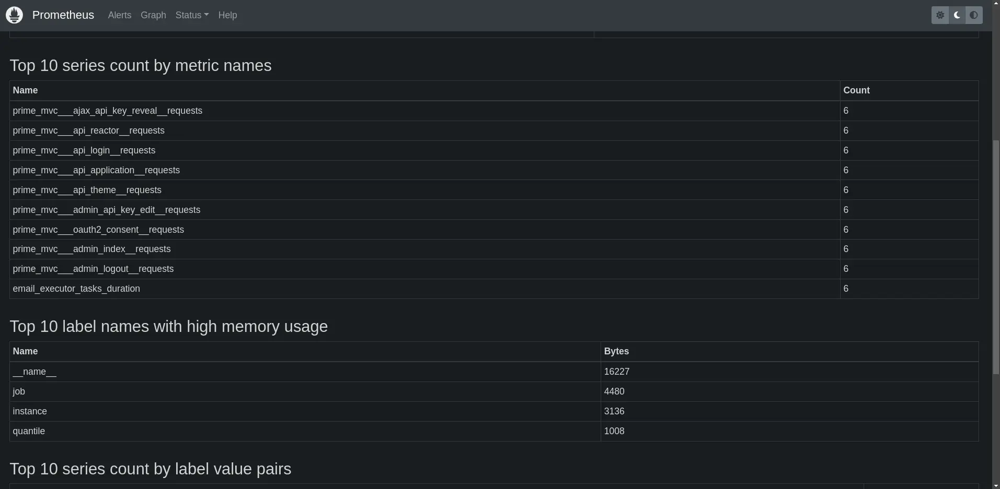

import Aside from 'src/components/Aside.astro';
import IconButton from 'src/components/IconButton.astro';
import Breadcrumb from 'src/components/Breadcrumb.astro';
import InlineField from 'src/components/InlineField.astro';
import InlineUIElement from 'src/components/InlineUIElement.astro';
import WhatIsOpenTelemetry from 'src/components/docs/operate/secure-and-monitor/whatIsOpentelemetry.astro';
import Diagram1 from 'src/components/docs/operate/secure-and-monitor/opentelemetryDiagram1.astro';

## Introduction

This guide explains how to monitor FusionAuth metrics with the open-source tool and ecosystem [OpenTelemetry](https://opentelemetry.io).

<WhatIsOpenTelemetry></WhatIsOpenTelemetry>

Please read the [FusionAuth monitoring overview](/docs/operate/secure-and-monitor/monitor) before proceeding. The overview explains what FusionAuth metrics are, what activities comprise a complete monitoring workflow, and what tools complement OpenTelemetry, such as Prometheus and Elastic (there are FusionAuth guides for them). Review [alternative monitoring services](/docs/operate/secure-and-monitor/monitor#overview-of-popular-monitoring-tools) in the overview to ensure that OpenTelemetry is the right tool for your needs.

## Architecture To Include OpenTelemetry With FusionAuth

Running FusionAuth and PostgreSQL in Docker usually looks like the diagram below (you might also run OpenSearch in another Docker container).

<Diagram1></Diagram1>

This diagram shows three components that could die and need monitoring: the PostgreSQL database, FusionAuth, and your app (web server) that directs users to FusionAuth for login. In this guide, you will monitor only FusionAuth.

There are two types of OpenTelemetry components you need, with each probably in its own container:
- An **exporter** to monitor a container or application and produce metrics about it.
- A **collector** to gather the metrics from exporters and route them to monitoring apps and dashboards, possibly changing the data format along the way.

There are three ways you can use OpenTelemetry to export metrics about FusionAuth:
- Run an OpenTelemetry exporter in its own Docker container on your host. The OpenTelemetry container needs to have administrative permissions to the Docker engine to get metrics about the status of the FusionAuth container. This will allow you to know if FusionAuth is up, and basic metrics about the health of the container, like CPU and RAM use.
- Run an OpenTelemetry exporter inside the FusionAuth Docker container to monitor the JVM (Java Virtual Machine) in which FusionAuth runs. The FusionAuth team does not recommend this approach. You have to alter the provided Docker image to include the Java agent, and alter image every time FusionAuth releases an update. The metrics the JVM provides also do not provide any useful information beyond that provided by monitoring the container itself.
- Write a custom script to request metrics from the FusionAuth API and forward them to an OpenTelemetry collector. This will allow you to monitor specific FusionAuth metrics, like application errors and user login rates.

OpenTelemetry is a communication protocol for transferring metrics, and a set of tools. But it doesn't allow you to view or analyze metrics. For that, you need a tool like Prometheus or Elasticsearch. It's also common for cloud-hosted monitoring tools, like ElasticCloud or Splunk, to receive OpenTelemetry metrics, or provide their own OpenTelemetry exporting tools. (There are guides to these cloud services in the documentation sidebar).

If you are not using a paid cloud service, you will need to install Prometheus to view the OpenTelemetry metrics. That installation is explained briefly in this guide, but please also work through the [Prometheus monitoring guide](./prometheus.mdx) too. Note that you don't need OpenTelemetry to monitor FusionAuth with Prometheus — FusionAuth natively exports metrics on an URL Prometheus can poll.

So why use OpenTelemetry if you are not using a paid monitoring service, and could just use Prometheus by itself? For most FusionAuth users, there probably isn't any reason to use OpenTelemetry — Prometheus alone should be enough to monitor that FusionAuth is up, and running correctly. The only advantage running an OpenTelemetry collector brings is to allow you write a script that requests custom metrics (like user login counts) from the FusionAuth API and send them through the OpenTelemetry collector to Prometheus. This allows you to get more detail about specific FusionAuth processes that you can't get from Prometheus alone. Finally, know that OpenTelemetry, being newer than Prometheus, can accept metrics in the Prometheus format — allowing you to point an OpenTelemetry collector directly to the FusionAuth Prometheus metrics endpoint.

Use an [OpenTelemetry Java monitoring agent](https://github.com/open-telemetry/opentelemetry-java-instrumentation) to send information about FusionAuth to Elastic. This is similar to the previous point - OpenTelemetry won't provide any useful information that container monitoring doesn't already. Using OpenTelemetry is also shown in the [FusionAuth Splunk guide](./splunk). Elastic has a guide to Java [here](https://www.elastic.co/guide/en/observability/8.14/apm-open-telemetry.html) that you can use with the Splunk guide.

To do so, you will add Prometheus to monitor your FusionAuth instance. Prometheus will poll FusionAuth every fifteen seconds to see if any errors have occurred.

In the following sections of this guide you will run: an OpenTelemetry collector in Docker that polls the FusionAuth Prometheus endpoint, a bash script in another container that polls the FusionAuth API to get data about user logins, and Prometheus in a final container that receives both the OpenTelemetry metrics, and

<Diagram2></Diagram2>

## Run OpenTelemetry With Docker To Monitor FusionAuth


Clone the sample [FusionAuth kickstart repository](https://github.com/FusionAuth/fusionauth-example-docker-compose) with the command below.

```sh
git clone https://github.com/FusionAuth/fusionauth-example-docker-compose.git
cd light
```

Add a new service to the bottom of `docker-compose.yaml` before the `volumes:` section, with the code below.

```yaml
  prometheus:
    image: ubuntu/prometheus:2.52.0-22.04_stable
    container_name: faProm
    depends_on:
      - fa
    ports:
      - 9090:9090
    volumes:
      - ./prometheusConfig.yml:/etc/prometheus/prometheus.yml
      - ./prometheusDb:/prometheus
```

This service says that Prometheus will start after FusionAuth, that you can browse to it on port 9090, and that it will save its database and configuration file in persistent directories on your machine.


The FusionAuth kickstart configuration files created a superuser API key that Prometheus uses as `password`. In production to be more secure, rather create an API key that has only the `GET` permission for the `/api/prometheus/metrics` endpoint.

Run all the containers with `docker compose up`. You should be able to log in to FusionAuth at http://localhost:9011 with email address `admin@example.com` and password `password`, and to Prometheus at http://localhost:9090.

```sh
docker exec -it faProm /bin/bash

promtool check config /etc/prometheus/prometheus.yml

exit
```




## Next Steps

promemetheus, grafana, loki, elastic

## Further Reading

- [FusionAuth monitoring overview](/docs/operate/secure-and-monitor/monitor)
- [FusionAuth metrics](/docs/operate/secure-and-monitor/monitor#metrics)
