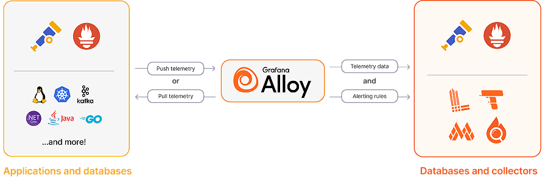

import Aside from 'src/components/Aside.astro';
import IconButton from 'src/components/IconButton.astro';
import Breadcrumb from 'src/components/Breadcrumb.astro';
import InlineField from 'src/components/InlineField.astro';
import InlineUIElement from 'src/components/InlineUIElement.astro';
import WhatIsOpenTelemetry from 'src/components/docs/operate/secure-and-monitor/whatIsOpentelemetry.astro';
import Diagram1 from 'src/components/docs/operate/secure-and-monitor/opentelemetryDiagram1.astro';

- [Introduction](#introduction)
- [Architecture To Include OpenTelemetry With FusionAuth](#architecture-to-include-opentelemetry-with-fusionauth)
- [Run OpenTelemetry With Docker To Monitor FusionAuth](#run-opentelemetry-with-docker-to-monitor-fusionauth)
- [Run A Bash Script To Send Custom Metrics To OT Collector](#run-a-bash-script-to-send-custom-metrics-to-ot-collector)
- [Which Custom Metrics To Monitor?](#which-custom-metrics-to-monitor)
- [Next Steps](#next-steps)
- [Further Reading](#further-reading)
- [TODO](#todo)


## Introduction

This guide explains how to monitor FusionAuth metrics with the open-source tool and ecosystem [OpenTelemetry](https://opentelemetry.io).

<WhatIsOpenTelemetry></WhatIsOpenTelemetry>

Please read the [FusionAuth monitoring overview](/docs/operate/secure-and-monitor/monitor) before proceeding. The overview explains what FusionAuth metrics are, what activities comprise a complete monitoring workflow, and what tools complement OpenTelemetry, such as Prometheus and Elastic (there are FusionAuth guides for them). Review [alternative monitoring services](/docs/operate/secure-and-monitor/monitor#overview-of-popular-monitoring-tools) in the overview to ensure that OpenTelemetry is the right tool for your needs.

## Architecture To Include OpenTelemetry With FusionAuth

Running FusionAuth and PostgreSQL in Docker usually looks like the diagram below (you might also run OpenSearch in another Docker container).

<Diagram1></Diagram1>

This diagram shows three components that could die and need monitoring: the PostgreSQL database, FusionAuth, and your app (web server) that directs users to FusionAuth for login. In this guide, you will monitor only FusionAuth.

There are two types of OpenTelemetry components you need, with each probably in its own container:
- An **exporter** to monitor a container or application and produce metrics about it.
- A **collector** to gather the metrics from exporters and route them to monitoring apps and dashboards, possibly changing the data format along the way.

There are three ways you can use OpenTelemetry to export metrics about FusionAuth:
- Run an OpenTelemetry exporter in its own Docker container on your host. The OpenTelemetry container needs to have administrative permissions to the Docker engine to get metrics about the status of the FusionAuth container. This will allow you to know if FusionAuth is up, and basic metrics about the health of the container, like CPU and RAM use.
- Run an OpenTelemetry exporter inside the FusionAuth Docker container to monitor the JVM (Java Virtual Machine) in which FusionAuth runs. The FusionAuth team does not recommend this approach. You have to alter the provided Docker image to include the Java agent, and alter image every time FusionAuth releases an update. The metrics the JVM provides also do not provide any useful information beyond that provided by monitoring the container itself.
- Write a custom script to request metrics from the FusionAuth API and forward them to an OpenTelemetry collector. This will allow you to monitor specific FusionAuth metrics, like application errors and user login rates.

OpenTelemetry is a communication protocol for transferring metrics, and a set of tools. But it doesn't allow you to store, view, or analyze metrics. For that, you need a tool like Prometheus or Elasticsearch. It's also common for cloud-hosted monitoring tools, like ElasticCloud or Splunk, that receive OpenTelemetry metrics to provide their own OpenTelemetry exporting tools. (There are guides to these cloud services in the documentation sidebar).

If you are not using a paid cloud service, you will need to install Prometheus to view the OpenTelemetry metrics. That installation is explained briefly in this guide, but please also work through the [Prometheus monitoring guide](./prometheus.mdx) too. Note that you don't need OpenTelemetry to monitor FusionAuth with Prometheus — FusionAuth natively exports metrics on an URL Prometheus can poll.

OpenTelemetry also monitors more than Prometheus — OpenTelemetry can trace an entire web request across services, instead of recording only a metric at a point in time.

So why use OpenTelemetry if you are not using a paid monitoring service, do not need to trace requests inside FusionAuth, and could just use Prometheus by itself? For most FusionAuth users, there probably isn't any reason to use OpenTelemetry — Prometheus alone should be enough to monitor that FusionAuth is up, and running correctly. The only advantage running an OpenTelemetry collector brings is to allow you write a script that requests custom metrics (like user login counts) from the FusionAuth API and send them through the OpenTelemetry collector to Prometheus. This allows you to get more detail about specific FusionAuth processes that you can't get from Prometheus alone. Finally, know that OpenTelemetry, being newer than Prometheus, can accept metrics in the Prometheus format — allowing you to point an OpenTelemetry collector directly to the FusionAuth Prometheus metrics endpoint.

<Aside type="note">
If you're wondering how Prometheus can poll the OT Collector for metrics if the Collector doesn't store metrics, it's because the Collector does keep recent metrics it received in RAM. The Collector doesn't store them for long however, and does not persist metrics to disk.
</Aside>

Use an [OpenTelemetry Java monitoring agent](https://github.com/open-telemetry/opentelemetry-java-instrumentation) to send information about FusionAuth to Elastic. This is similar to the previous point - OpenTelemetry won't provide any useful information that container monitoring doesn't already. Using OpenTelemetry is also shown in the [FusionAuth Splunk guide](./splunk). Elastic has a guide to Java [here](https://www.elastic.co/guide/en/observability/8.14/apm-open-telemetry.html) that you can use with the Splunk guide.

To do so, you will add Prometheus to monitor your FusionAuth instance. Prometheus will poll FusionAuth every fifteen seconds to see if any errors have occurred.

In the following sections of this guide you will run: an OpenTelemetry collector in Docker that polls the FusionAuth Prometheus endpoint, a bash script in another container that polls the FusionAuth API to get data about user logins, and Prometheus in a final container that receives both the OpenTelemetry metrics, and


This guide focuses on OpenTelemetry, not Prometheus and Grafana, and so uses the OpenTelemetry Collector. However, as of 2024, Grafana has released their own open-source version of an OpenTelemetry collector, called [Alloy](https://grafana.com/oss/alloy-opentelemetry-collector), that supports all Prometheus protocols and all OpenTelemetry protocols. It is component-based and has features that OT Collector does not. You might well prefer to use Alloy instead of OT Collector in your project.



## Run OpenTelemetry With Docker To Monitor FusionAuth

In this section you will run FusionAuth, poll metrics from it with OpenTelemetry, and store those metrics in Prometheus.

Clone the sample [FusionAuth kickstart repository](https://github.com/FusionAuth/fusionauth-example-docker-compose) with the command below.

```sh
git clone https://github.com/FusionAuth/fusionauth-example-docker-compose.git
cd light
```

The `docker-compose.yml` file currently starts FusionAuth and its database.

Add the two new services to the bottom of `docker-compose.yml` before the `volumes:` section, with the code below.

```yml
  otel:
    image: otel/opentelemetry-collector
    container_name: faOtel
    platform: linux/amd64
    depends_on:
      - fa
    ports:
      - 8889:8889
      - 4318:4318
    volumes:
      - ./collectorConfig.yml:/etc/otel-collector-config.yml
    networks:
      - db_net
    command: ["--config=/etc/otel-collector-config.yml"]

  prometheus:
    image: ubuntu/prometheus:2.52.0-22.04_stable
    container_name: faProm
    platform: linux/amd64
    depends_on:
      - otel
    ports:
      - 9090:9090
    volumes:
      - ./prometheusConfig.yml:/etc/prometheus/prometheus.yml
      - ./prometheusDb:/prometheus
    networks:
      - db_net
```

This service says that the [Prometheus image](https://hub.docker.com/r/ubuntu/prometheus) will start after OT Collector, that you can browse to Prometheus on port `9090`, and that it will save its database and configuration file in persistent directories on your machine.

The OT image comes from https://hub.docker.com/r/otel/opentelemetry-collector. There is also a [contrib](https://hub.docker.com/r/otel/opentelemetry-collector-contrib) image you can use instead. The image is bigger, and contains more components that interoperate with other OT tools you might want to use.

The `ports` exposed in the configuration are `8889`, which is where Prometheus pulls metrics from OT Collector, and `4138`, which will be used in the next section for the Collector to receive custom metrics.

All containers in the configuration file are on the same network `db_net`.

The `volumes` and `command` lines provide a configuration file to the Collector. Let's make that file, `collectorConfig.yml`, now, with the content below.

```yml
receivers:
  prometheus:
    config:
      scrape_configs:
        - job_name: 'fusionauth'
          scrape_interval: 15s
          scheme: http
          metrics_path: api/prometheus/metrics
          static_configs:
            - targets: ['fa:9011']
          basic_auth:
            username: "apikey"
            password: "33052c8a-c283-4e96-9d2a-eb1215c69f8f-not-for-prod"

exporters:
  prometheus:
    endpoint: "0.0.0.0:8889"

service:
  pipelines:
    metrics:
      receivers: [prometheus]
      exporters: [prometheus]
```

The Collector describes pulling metrics from apps it monitors (`receivers`) and allowing other apps to pull from it (`exporters`). In this case, the Collector pulls metrics from FusionAuth in the Prometheus format every 15 seconds on `http://fa:9011/api/prometheus/metrics` using the API key set in the kickstart configuration file. Only one exporter is exposed — metrics in the Prometheus format on port `8889`. For more information see the [documentation](https://opentelemetry.io/docs/collector/configuration/).

The FusionAuth kickstart configuration files created a superuser API key. In production to be more secure, rather create an API key that has only the `GET` permission for the `/api/prometheus/metrics` endpoint.

The last step is to create `prometheusConfig.yml` with the content below, which tells Prometheus to pull metrics from the Collector every fifteen seconds.

```yml
global:
  evaluation_interval: 30s
scrape_configs:
  - job_name: otel
    scrape_interval: 15s
    static_configs:
      - targets: ['otel:8889']
```

Run all the containers with `docker compose up`. You should be able to log in to FusionAuth at http://localhost:9011 with email address `admin@example.com` and password `password`, and to Prometheus at http://localhost:9090.

To check that metrics are being pulled correctly, enter `up` on the Prometheus graph page and see if any values appear after a minute. If you see nothing, check the Docker log files in the terminal.


## Run A Bash Script To Send Custom Metrics To OT Collector

8888 exposes OT Collector own metrics

todo

local debug for your own script

chmod +x app.sh

otel -> localhost
fa -> localhost

count_over_time(login_event[5h])

sum(count_over_time(login_event{exported_job="fusionauth", instance="otel:8889", job="otel"}[5h]))
sum without(user_id) (count_over_time(login_event{exported_job="fusionauth", instance="otel:8889", job="otel"}[5h]))
/5

`app.sh`

```sh
#!/bin/sh

# exit on error
set -e

# get login records from fusionauth
otelUrl="http://otel:4318/v1/metrics"
faUrl="http://fa:9011/api/system/login-record/export"
faKey="33052c8a-c283-4e96-9d2a-eb1215c69f8f-not-for-prod"
appId="3c219e58-ed0e-4b18-ad48-f4f92793ae32"
dateFormat=$(echo -n "yyyy-MM-dd'T'HH:mm:ss.SSS" | jq -sRr @uri)
end=$(date +%s)000
start=$(($end - 60000))  # milliseconds
params="applicationId=${appId}&dateTimeSecondsFormat=${dateFormat}&start=${start}&end=${end}"
url="${faUrl}?${params}"
echo "curl -H \"Authorization: ${faKey}\" -o record.zip \"$url\""
curl -H "Authorization: ${faKey}" -o record.zip "$url"
unzip -o record.zip
cat login_records.csv

# for each record, get the user and  unix time in ms
tail -n +2 login_records.csv | while IFS=',' read -r userId time rest; do
  userId=$(echo "$userId" | tr -d ' "' )
  time=$(echo "$time" | tr -d ' "')                      # 2024-06-21T05:14:56.123
  time=$(echo "$time" | tr 'T' ' ')                      # 2024-06-21 05:14:56.123
  sec="$(date -d "$(echo $time | cut -d '.' -f 1)" +%s)" # 1718946896
  ms="$(echo $time | cut -d '.' -f 2)"                   # 123

  # Make OTLP JSON payload
   json_payload=$(cat <<EOF
{
  "resource_metrics": [{
    "resource": {
      "attributes": [
        {"key": "service.name", "value": {"stringValue": "fusionauth"}},
        {"key": "host", "value": {"stringValue": "fusionauth"}}
      ]
    },
    "scope_metrics": [{
      "metrics": [{
        "name": "login_event",
        "gauge": {
          "dataPoints": [{
            "asInt": 1,
            "timeUnixNano": "${sec}${ms}000000",
            "attributes": [
                {"key": "user_id", "value": {"stringValue": "$userId"}}
            ]
          }]
        }
      }]
    }]
  }]
}
EOF
)

  # Send data to OTEL Collector
  curl -X POST -H "Content-Type: application/json" -d "$json_payload" $otelUrl
done
```

`Dockerfile`

```sh
FROM --platform=linux/amd64 alpine:3.19
RUN apk add --no-cache curl nano jq bash docker-cli
COPY app.sh /app.sh
CMD watch -t -n 60 /app.sh
```

- Build the image with the command below.
  ```sh
  docker build --platform linux/amd64 -t scriptimage .
  ```

`collectorConfig.yml`

```yml
receivers:
  otlp:
    protocols:
      http:
        endpoint: 0.0.0.0:4318
  prometheus:
    config:
      scrape_configs:
        - job_name: 'fusionauth'
          scrape_interval: 15s
          scheme: http
          metrics_path: api/prometheus/metrics
          static_configs:
            - targets: ['fa:9011']
          basic_auth:
            username: "apikey"
            password: "33052c8a-c283-4e96-9d2a-eb1215c69f8f-not-for-prod"

exporters:
  prometheus:
    endpoint: "0.0.0.0:8889"

service:
  pipelines:
    metrics:
      receivers: [prometheus, otlp]
      exporters: [prometheus]
```

`docker-compose.yml`

```yml
  script:
    image: scriptimage
    container_name: faScript
    platform: linux/amd64
    depends_on:
      - fa
      - otel
    networks:
      - db_net
```

## Which Custom Metrics To Monitor?

## Next Steps

promemetheus, grafana, loki, elastic

## Further Reading

- [FusionAuth monitoring overview](/docs/operate/secure-and-monitor/monitor)
- [FusionAuth metrics](/docs/operate/secure-and-monitor/monitor#metrics)
- [OT Collector configuration documentation](https://opentelemetry.io/docs/collector/configuration)

## TODO
OT