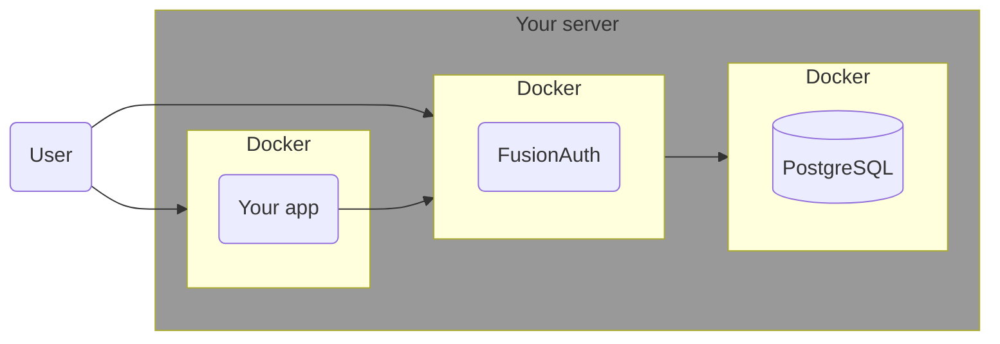
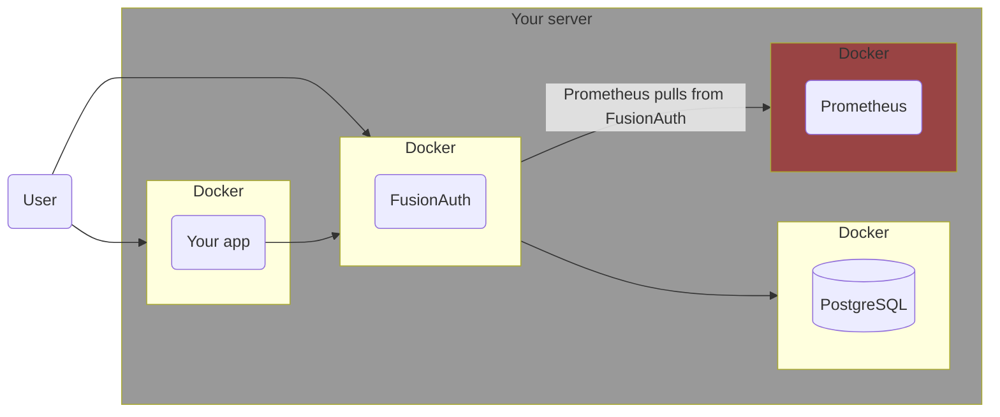
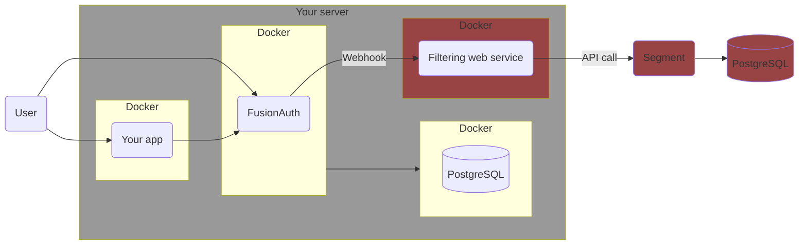

import Aside from 'src/components/Aside.astro';
import IconButton from 'src/components/IconButton.astro';
import Breadcrumb from 'src/components/Breadcrumb.astro';
import InlineField from 'src/components/InlineField.astro';
import InlineUIElement from 'src/components/InlineUIElement.astro';
import PrometheusJvmGauges from 'src/content/docs/_shared/_prometheus-jvm-gauges.mdx';
import Diagram1 from 'src/components/docs/operate/secure-and-monitor/prometheusDiagram1.astro';

## Introduction

This guide explains how monitor FusionAuth events and logs with the open-source tools [Prometheus](https://prometheus.io/docs/introduction/overview) and [Loki](https://grafana.com/oss/loki), as well as create a dashboard with [Grafana](https://grafana.com/grafana), and send you alerts when problems occur.

Please read the [FusionAuth monitoring overview](/docs/operate/secure-and-monitor/monitor) before proceeding. The overview explains what FusionAuth metrics are, what activities comprise a complete monitoring workflow, and what Prometheus, Loki, and Grafana are.. Review [alternative monitoring services](/docs/operate/secure-and-monitor/monitor#overview-of-popular-monitoring-tools) in the overview to ensure that Prometheus is the right tool for your needs.

While in this guide you set up Prometheus in Docker containers on your local machine, there is also a paid cloud-hosted alternative at [Grafana Cloud](https://grafana.com/auth/sign-up/create-user).

## Architecture

Running FusionAuth and PostgreSQL in Docker usually looks like the diagram below (you might also run OpenSearch in another Docker container).

This diagram shows three components that could die and need monitoring: the PostgreSQL database, FusionAuth, and your app (web server) that directs users to FusionAuth for login. In this guide, you will monitor only FusionAuth and PostgreSQL, but you can use similar techniques to monitor your app too.

## Send Custom FusionAuth Metrics To The Elasticsearch API

### Which Metrics To Monitor

FusionAuth has too [many metrics](/docs/operate/secure-and-monitor/monitor#metrics) to discuss in this article. You will need to decide which are important for you to monitor by reading the documentation.

In addition to the metrics available through the various FusionAuth APIs, you can create your own metrics using any event that can trigger a [webhook](/docs/extend/events-and-webhooks). This webhook can call another Docker container you create that listens for incoming events and forwards them to Elastic.

A useful metric to start with is login counts. If this number drops from the average, it's a good sign something might be wrong with your system. In this guide, you'll learn how to create a program that uses the FusionAuth API to get the login count, then upload it to Elastic.

You can add any other metrics you want to this service.

## Final System Architecture

A relatively simple but adequate monitoring architecture with Elastic might look as follows.

In this design, Elastic Agent monitors all Docker infrastructure and the FusionAuth logs, while the custom metric service provides fine-grained FusionAuth data to Elastic to monitor the app itself.

## Next Steps

Now that you can monitor FusionAuth in Elastic, you should enable Elastic [alerts](https://www.elastic.co/kibana/alerting) to notify you by email or in Slack if something goes wrong, like a massive decrease in login rates, a Docker container restarting, or a log output containing `error`. slack, ntfy.sh, discord

## Further Reading

- [Monitoring overview](/docs/operate/secure-and-monitor/monitor)
- [FusionAuth metrics](/docs/operate/secure-and-monitor/monitor#metrics)
- [Prometheus](https://prometheus.io/docs/introduction/overview)
- [Loki](https://grafana.com/oss/loki)
- [Grafana](https://grafana.com/grafana)
- [Grafana Cloud](https://grafana.com/auth/sign-up/create-user)