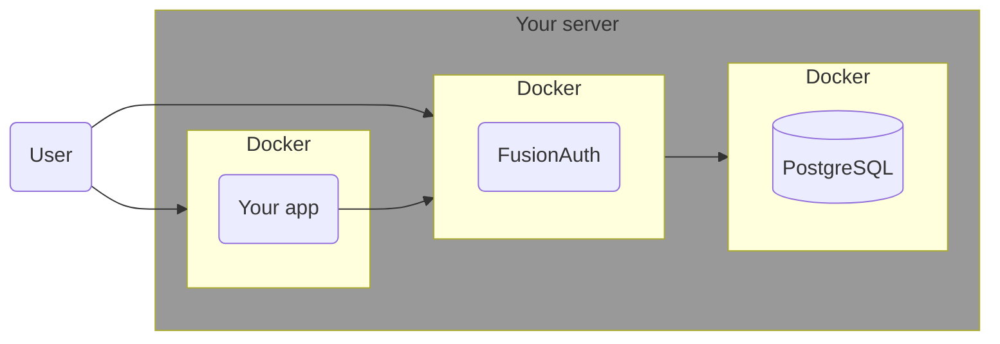
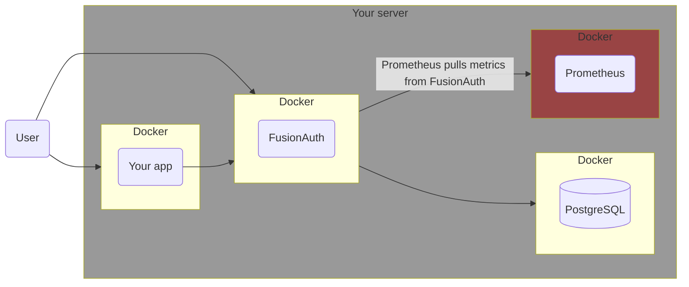
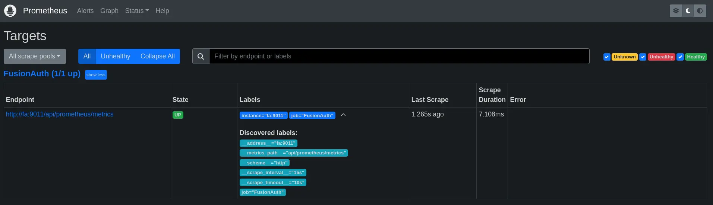
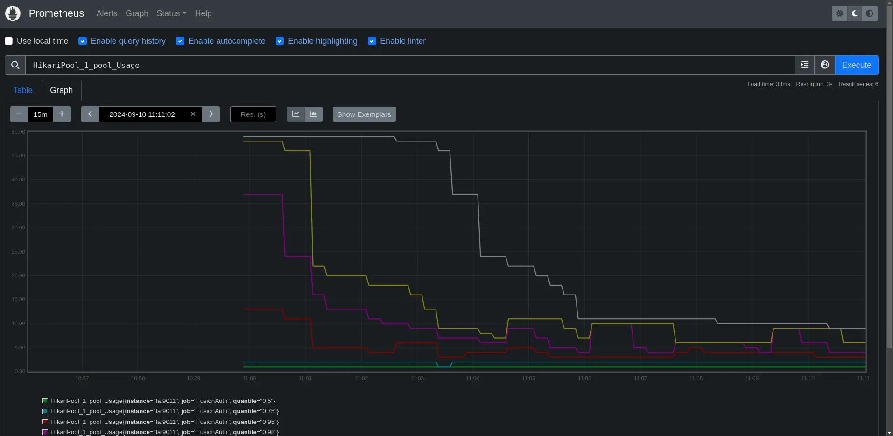
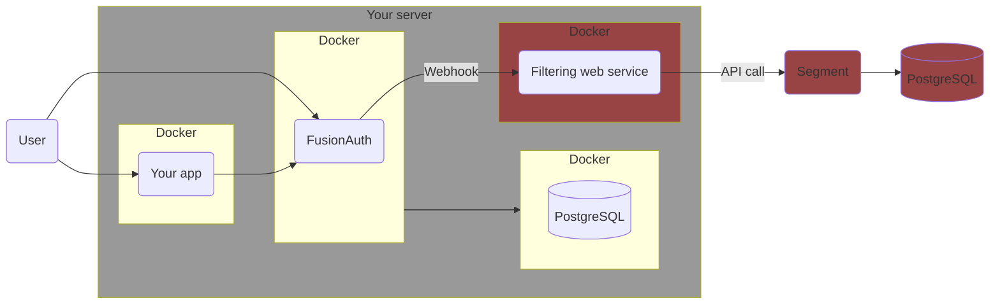

import Aside from 'src/components/Aside.astro';
import IconButton from 'src/components/IconButton.astro';
import Breadcrumb from 'src/components/Breadcrumb.astro';
import InlineField from 'src/components/InlineField.astro';
import InlineUIElement from 'src/components/InlineUIElement.astro';
import PrometheusJvmGauges from 'src/content/docs/_shared/_prometheus-jvm-gauges.mdx';
import Diagram1 from 'src/components/docs/operate/secure-and-monitor/prometheusDiagram1.astro';

## Introduction

This guide explains how monitor FusionAuth events and logs with the open-source tools [Prometheus](https://prometheus.io/docs/introduction/overview) and [Loki](https://grafana.com/oss/loki), as well as create a dashboard with [Grafana](https://grafana.com/grafana), and send you alerts when problems occur.

Please read the [FusionAuth monitoring overview](/docs/operate/secure-and-monitor/monitor) before proceeding. The overview explains what FusionAuth metrics are, what activities comprise a complete monitoring workflow, and what Prometheus, Loki, and Grafana are.. Review [alternative monitoring services](/docs/operate/secure-and-monitor/monitor#overview-of-popular-monitoring-tools) in the overview to ensure that Prometheus is the right tool for your needs.

While in this guide you set up Prometheus in Docker containers on your local machine, there is also a paid cloud-hosted alternative at [Grafana Cloud](https://grafana.com/auth/sign-up/create-user).

## Architecture

Running FusionAuth and PostgreSQL in Docker usually looks like the diagram below (you might also run OpenSearch in another Docker container).



This diagram shows three components that could die and need monitoring: the PostgreSQL database, FusionAuth, and your app (web server) that directs users to FusionAuth for login. In this guide, you will monitor only FusionAuth and PostgreSQL, but you can use similar techniques to monitor your app.



## Run Prometheus With Docker

Clone the sample [FusionAuth kickstart repository](https://github.com/FusionAuth/fusionauth-example-docker-compose) with the command below.

```sh
git clone https://github.com/FusionAuth/fusionauth-example-docker-compose.git
cd light
```

Add three new services to the bottom of `docker-compose.yaml` before the `volumes:` section, with the code below. You are using the Docker images from Docker Hub for [Prometheus](https://hub.docker.com/r/ubuntu/prometheus), Loki, and Grafana.

The metrics FA exposes to Prometheus change over time. There are some basic Java Virtual Machine (JVM) metrics listed [here](https://fusionauth.io/docs/apis/system#retrieve-system-metrics-using-prometheus). To see exactly what is available on your instance of FusionAuth, run the command below.

```sh
curl -u "apikey:33052c8a-c283-4e96-9d2a-eb1215c69f8f-not-for-prod" 0.0.0.0:9011/api/prometheus/metrics

# Output:

# HELP HikariPool_1_pool_MinConnections Generated from Dropwizard metric import (metric=HikariPool-1.pool.MinConnections, type=com.zaxxer.hikari.metrics.dropwizard.CodaHaleMetricsTracker$$Lambda$292/0x0000000100449e40)
# TYPE HikariPool_1_pool_MinConnections gauge
HikariPool_1_pool_MinConnections 10.0
# HELP jvm_memory_heap_committed Generated from Dropwizard metric import (metric=jvm.memory.heap.committed, type=com.codahale.metrics.jvm.MemoryUsageGaugeSet$8)
# TYPE jvm_memory_heap_committed gauge
jvm_memory_heap_committed 5.36870912E8
# HELP prime_mvc___api_key_generate__requests Generated from Dropwizard metric import (metric=prime-mvc.[/api/key/generate].requests, type=com.codahale.metrics.Timer)
# TYPE prime_mvc___api_key_generate__requests summary
prime_mvc___api_key_generate__requests{quantile="0.5",} 0.2392109
prime_mvc___api_key_generate__requests{quantile="0.75",} 0.2392109
prime_mvc___api_key_generate__requests{quantile="0.95",} 0.2392109
prime_mvc___api_key_generate__requests{quantile="0.98",} 0.2392109
prime_mvc___api_key_generate__requests{quantile="0.99",} 0.2392109
prime_mvc___api_key_generate__requests{quantile="0.999",} 0.2392109
prime_mvc___api_key_generate__requests_count 1.0
...
```

If you get no response, add `-v` to the command to see what error occurs. If you see `401`, it is likely that your API key is incorrect.

Configure Prometheus https://prometheus.io/docs/prometheus/latest/configuration/configuration.

Menu -> Status -> Targets
http://localhost:9090/targets



Menu -> Status -> TSDB Status
(http://localhost:9090/tsdb-status)

TSDB is a time-series database.


Menu -> Graph
(http://localhost:9090/graph?g0.expr=HikariPool_1_pool_Usage&g0.tab=0&g0.display_mode=lines&g0.show_exemplars=0&g0.range_input=15m&g0.end_input=2024-09-10%2011%3A11%3A02&g0.moment_input=2024-09-10%2011%3A11%3A02)




<Aside type="tip">
At this point you have set up Prometheus and can monitor FusionAuth successfully, and you can stop here. In the rest of this guide, you'll enhance this system by including alerts, logs, and a better dashboard.
</Aside>

## Send Alerts To ntfy.sh

Let's set up a service to notify you whenever errors occur in FusionAuth. To do this, you'll check if the counter `prime_mvc_____errors_total` has increased in the last minute. If it has, then FusionAuth will send a message to a channel that your company can monitor.

This channel could be Discord, Slack, email, or SMS. But the simplest and cheapest alert service is [ntfy.sh](https://ntfy.sh/). It's free, but all channels are public, so don't broadcast secrets.

To see how it works, run the command below in a terminal.

```sh
curl -H "Title: Error" -d "A FusionAuth error occured in the last minute" ntfy.sh/fusionauthprometheus
```

Browse to the channel to be notified of errors at https://ntfy.sh/fusionauthprometheus.

Now let's configure Prometheus to do this.

The Prometheus documentation doesn't say it explicitly, but the Prometheus AlertManager is **not** included with Prometheus. You need to run AlertManager separately. Again, you'll use the [Ubuntu Docker container](https://hub.docker.com/r/ubuntu/alertmanager). This container has a `/prometheus` directory, but the container doesn't run Prometheus.


`increase(prime_mvc_____errors_total[1m])`

```sh
docker exec -it faProm /bin/bash
```

## Send Custom FusionAuth Metrics To The Elasticsearch API

### Which Metrics To Monitor

FusionAuth has too [many metrics](/docs/operate/secure-and-monitor/monitor#metrics) to discuss in this article. You will need to decide which are important for you to monitor by reading the documentation.

In addition to the metrics available through the various FusionAuth APIs, you can create your own metrics using any event that can trigger a [webhook](/docs/extend/events-and-webhooks). This webhook can call another Docker container you create that listens for incoming events and forwards them to Elastic.

A useful metric to start with is login counts. If this number drops from the average, it's a good sign something might be wrong with your system. In this guide, you'll learn how to create a program that uses the FusionAuth API to get the login count, then upload it to Elastic.

You can add any other metrics you want to this service.

## Final System Architecture

A relatively simple but adequate monitoring architecture with Elastic might look as follows.



In this design, Elastic Agent monitors all Docker infrastructure and the FusionAuth logs, while the custom metric service provides fine-grained FusionAuth data to Elastic to monitor the app itself.


## Next Steps

Now that you can monitor FusionAuth in Elastic, you should enable Elastic [alerts](https://www.elastic.co/kibana/alerting) to notify you by email or in Slack if something goes wrong, like a massive decrease in login rates, a Docker container restarting, or a log output containing `error`. slack, ntfy.sh, discord

## Further Reading

- [Monitoring overview](/docs/operate/secure-and-monitor/monitor)
- [FusionAuth metrics](/docs/operate/secure-and-monitor/monitor#metrics)
- [FusionAuth Prometheus API](https://fusionauth.io/docs/apis/system#retrieve-system-metrics-using-prometheus)
- [Prometheus](https://prometheus.io/docs/introduction/overview)
- [Prometheus alerts](https://prometheus.io/docs/alerting/latest/overview/)
- [Loki](https://grafana.com/oss/loki)
- [Grafana](https://grafana.com/grafana)
- [Grafana Cloud](https://grafana.com/auth/sign-up/create-user)
- [Ubuntu Prometheus Container](https://hub.docker.com/r/ubuntu/prometheus)
-