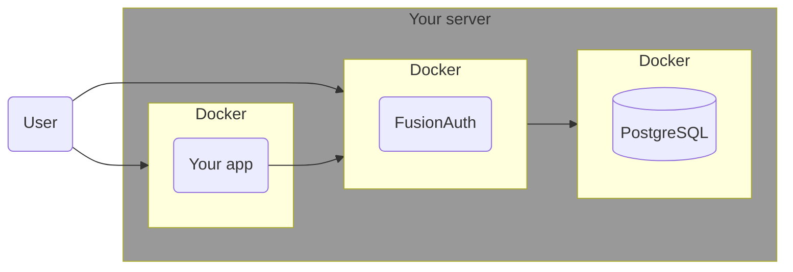
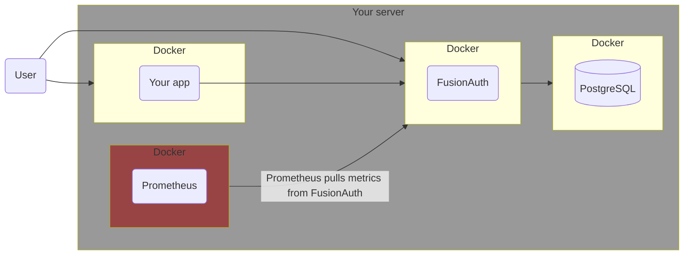
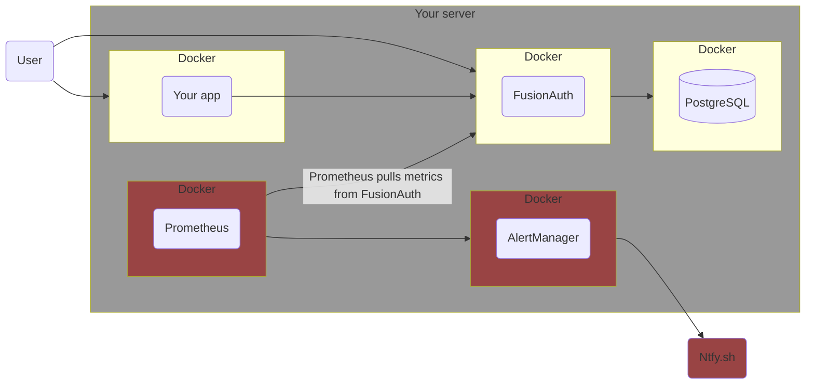
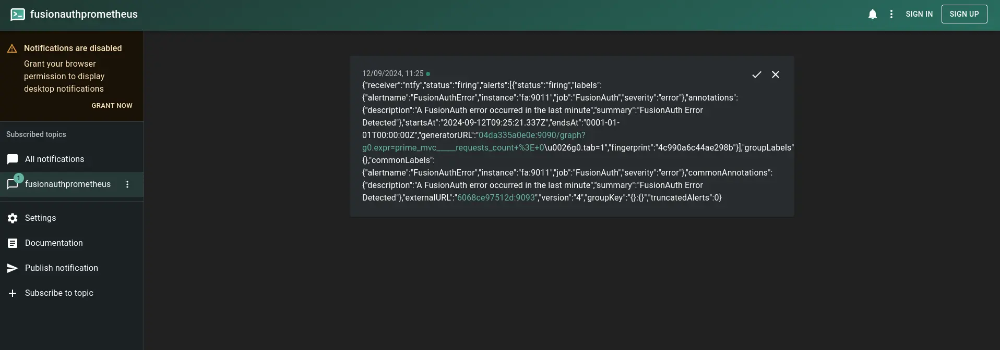
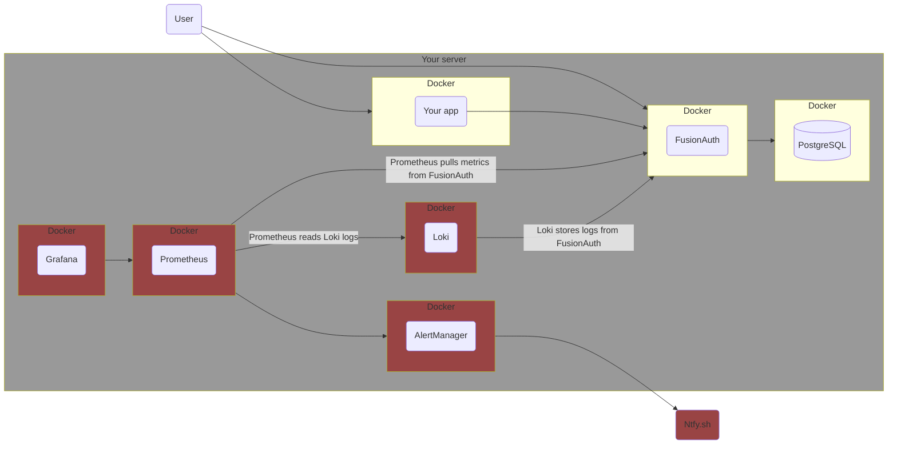

import Aside from 'src/components/Aside.astro';
import IconButton from 'src/components/IconButton.astro';
import Breadcrumb from 'src/components/Breadcrumb.astro';
import InlineField from 'src/components/InlineField.astro';
import InlineUIElement from 'src/components/InlineUIElement.astro';
import PrometheusJvmGauges from 'src/content/docs/_shared/_prometheus-jvm-gauges.mdx';
import Diagram1 from 'src/components/docs/operate/secure-and-monitor/prometheusDiagram1.astro';

## Introduction

This guide explains how monitor FusionAuth events and logs with the open-source tools [Prometheus](https://prometheus.io/docs/introduction/overview) and [Loki](https://grafana.com/oss/loki), as well as create a dashboard with [Grafana](https://grafana.com/grafana), and send you alerts when problems occur.

Please read the [FusionAuth monitoring overview](/docs/operate/secure-and-monitor/monitor) before proceeding. The overview explains what FusionAuth metrics are, what activities comprise a complete monitoring workflow, and what Prometheus, Loki, and Grafana are.. Review [alternative monitoring services](/docs/operate/secure-and-monitor/monitor#overview-of-popular-monitoring-tools) in the overview to ensure that Prometheus is the right tool for your needs.

While in this guide you set up Prometheus in Docker containers on your local machine, there is also a paid cloud-hosted alternative at [Grafana Cloud](https://grafana.com/auth/sign-up/create-user).

## Architecture

Running FusionAuth and PostgreSQL in Docker usually looks like the diagram below (you might also run OpenSearch in another Docker container).



This diagram shows three components that could die and need monitoring: the PostgreSQL database, FusionAuth, and your app (web server) that directs users to FusionAuth for login. In this guide, you will monitor only FusionAuth and PostgreSQL, but you can use similar techniques to monitor your app.

In this guide you will add Prometheus to monitor your FusionAuth instance. It will poll FusionAuth every fifteen seconds to see if any errors have occured.



## Run Prometheus With Docker

Clone the sample [FusionAuth kickstart repository](https://github.com/FusionAuth/fusionauth-example-docker-compose) with the command below.

```sh
git clone https://github.com/FusionAuth/fusionauth-example-docker-compose.git
cd light
```

Add a new service to the bottom of `docker-compose.yaml` before the `volumes:` section, with the code below. You are using the Docker image from Docker Hub for [Prometheus].

```yaml
  prometheus:
    image: ubuntu/prometheus:2.52.0-22.04_stable
    container_name: faProm
    depends_on:
      - fa
    ports:
      - 9090:9090
    volumes:
      - ./prometheusConfig.yml:/etc/prometheus/prometheus.yml
      - ./prometheusDb:/prometheus
```

This service says that PR will start after FA, that you can browse to it on port 9090, and that it will save its database and configuration file in persistent directories on your machine.

Create the Prometheus configuration file, called `prometheusConfig.yml`, containing the content below:

```yaml
global:
  evaluation_interval: 30s
scrape_configs:
  - job_name: FusionAuth
    scrape_interval: 15s
    scheme: http
    metrics_path: api/prometheus/metrics
    static_configs:
      - targets: ["fa:9011"]
    basic_auth:
      username: "apikey"
      password: "33052c8a-c283-4e96-9d2a-eb1215c69f8f-not-for-prod"
```

This configuration says that metrics will be gathered from FA every fifteen seconds. PR will evaluate the metrics only every thirty seconds however. This evaluation triggers things like alerts (shown later). The FA kickstart configuration files created an API key that PR can use.

<Aside type="note">
To learn more about configuring Prometheus, see the [documentation](https://prometheus.io/docs/prometheus/latest/configuration/configuration).
</Aside>

Run everything with `docker compose up`. You should be able to log in to FusionAuth at http://localhost:9011 with email address `admin@example.com` and password `password`, and to Prometheus at http://localhost:9090.

If you want to check that Prometheus has accepted your configuration file as valid, you can enter the container and use `promtool` to validate the YAML file.

```sh
docker exec -it faProm /bin/bash

promtool check config /etc/prometheus/prometheus.yml

exit
```

The metrics FA exposes to Prometheus change over time. There are some basic Java Virtual Machine (JVM) metrics listed [here](https://fusionauth.io/docs/apis/system#retrieve-system-metrics-using-prometheus). To see exactly what is available on your instance of FusionAuth, run the command below.

```sh
curl -u "apikey:33052c8a-c283-4e96-9d2a-eb1215c69f8f-not-for-prod" 0.0.0.0:9011/api/prometheus/metrics

# Output:

# HELP HikariPool_1_pool_MinConnections Generated from Dropwizard metric import (metric=HikariPool-1.pool.MinConnections, type=com.zaxxer.hikari.metrics.dropwizard.CodaHaleMetricsTracker$$Lambda$292/0x0000000100449e40)
# TYPE HikariPool_1_pool_MinConnections gauge
HikariPool_1_pool_MinConnections 10.0
# HELP jvm_memory_heap_committed Generated from Dropwizard metric import (metric=jvm.memory.heap.committed, type=com.codahale.metrics.jvm.MemoryUsageGaugeSet$8)
# TYPE jvm_memory_heap_committed gauge
jvm_memory_heap_committed 5.36870912E8
# HELP prime_mvc___api_key_generate__requests Generated from Dropwizard metric import (metric=prime-mvc.[/api/key/generate].requests, type=com.codahale.metrics.Timer)
# TYPE prime_mvc___api_key_generate__requests summary
prime_mvc___api_key_generate__requests{quantile="0.5",} 0.2392109
prime_mvc___api_key_generate__requests{quantile="0.75",} 0.2392109
prime_mvc___api_key_generate__requests{quantile="0.95",} 0.2392109
prime_mvc___api_key_generate__requests{quantile="0.98",} 0.2392109
prime_mvc___api_key_generate__requests{quantile="0.99",} 0.2392109
prime_mvc___api_key_generate__requests{quantile="0.999",} 0.2392109
prime_mvc___api_key_generate__requests_count 1.0
...
```

If you get no response, add `-v` to the command to see what error occurs. If you see `401`, it is likely that your API key is incorrect.

Check what metrics PR scraped from FA in the [PR web interface](http://localhost:9090/tsdb-status) by browsing to <Breadcrumb>Menu -> Status -> TSDB Status</Breadcrumb> (time-series database).


Check that FA is running in the [PR web interface](http://localhost:9090/targets) by browsing to <Breadcrumb>Menu -> Status -> Targets</Breadcrumb>.


See charts of FA metrics in the [PR web interface](http://localhost:9090/graph?g0.expr=HikariPool_1_pool_Usage&g0.tab=0&g0.display_mode=lines&g0.show_exemplars=0&g0.range_input=15m&g0.end_input=2024-09-10%2011%3A11%3A02&g0.moment_input=2024-09-10%2011%3A11%3A02) by browsing to <Breadcrumb>Menu -> Graph</Breadcrumb>. In the text box you can push <kbd>Ctrl + Spacebar</kbd> to view all metrics and functions available to you. Try entering `HikariPool_1_pool_Usage` and clicking <InlineUIElement>Execute</InlineUIElement>.


To monitor all FA errors, use the expression `prime_mvc_____errors_total`.

<Aside type="tip">
At this point you have set up Prometheus and can monitor FusionAuth successfully, and you can stop here. In the rest of this guide, you'll enhance this system by including alerts, logs, and a better dashboard.
</Aside>

## Send Alerts To ntfy.sh

Let's set up a service to notify you whenever errors occur in FusionAuth. To do this, you'll check if the counter `prime_mvc_____errors_total` has increased in the last minute. If it has, then FusionAuth will send a message to a channel that your company can monitor.

This channel could be Discord, Slack, email, or SMS. But the simplest and cheapest alert service is [ntfy.sh](https://ntfy.sh/). It's free, but all channels are public, so don't broadcast secrets.

To see how Ntfy works, run the command below in a terminal.

```sh
curl -H "Title: Error" -d "A FusionAuth error occured in the last minute" ntfy.sh/fusionauthprometheus
```

Browse to the channel to see errors at https://ntfy.sh/fusionauthprometheus.

Now let's configure Prometheus to send errors automatically. To do so, you'll use the Prometheus component called [AlertManager](https://prometheus.io/docs/alerting/latest/overview).

The Prometheus documentation doesn't say it explicitly, but the Prometheus AlertManager is not included with Prometheus. You need to run AlertManager separately. Again, you'll use the [Ubuntu Docker container](https://hub.docker.com/r/ubuntu/alertmanager).

<Aside type="warning">
At the time of writing, FusionAuth found an error in the the Ubuntu container documentation. The AlertManager configuration file path is actually `/etc/alertmanager/alertmanager.yml` not `/etc/prometheus/alertmanager.yml`
</Aside>

Below is a diagram of the system design with the new components.



Update your `docker-compose.yml` file to include the new AlertManager container, and point the existing Prometheus container to it, with the code below.

```yaml
  alertmanager:
    image: ubuntu/alertmanager:0.27.0-22.04_stable
    container_name: faAlert
    ports:
      - 9093:9093
    volumes:
      - ./prometheusAlertConfig.yml:/etc/alertmanager/alertmanager.yml

  prometheus:
    image: ubuntu/prometheus:2.52.0-22.04_stable
    container_name: faProm
    depends_on:
      - fa
      - alertmanager
    ports:
      - 9090:9090
    volumes:
      - ./prometheusConfig.yml:/etc/prometheus/prometheus.yml
      - ./prometheusRules.yml:/etc/prometheus/rules.yml
      - ./prometheusDb:/prometheus
```

Update `prometheusConfig.yml` too, as Prometheus needs to know the URL of the AlertManager service, and the rules around when to send alerts.

```yaml
global:
  evaluation_interval: 30s
scrape_configs:
  - job_name: FusionAuth
    scrape_interval: 15s
    scheme: http
    metrics_path: api/prometheus/metrics
    static_configs:
      - targets: ["fa:9011"]
    basic_auth:
      username: "apikey"
      password: "33052c8a-c283-4e96-9d2a-eb1215c69f8f-not-for-prod"
rule_files:
  - rules.yml
alerting:
  alertmanagers:
    - static_configs:
        - targets:
            - "alertmanager:9093"
```

Create the `prometheusRules.yml` file below. (The `expr`ession checks for requests to FA, not errors, as you want to ensure that a notification is sent in this prototype. In reality you could use `increase(prime_mvc_____errors_total[1m]) > 0`.)

```yaml
groups:
  - name: fusionauthAlerts
    rules:
      - alert: FusionAuthError
        expr: prime_mvc_____requests_count > 0
        for: 30s
        labels:
          severity: error
        annotations:
          summary: FusionAuth Error Detected
          description: A FusionAuth error occurred in the last minute
```

Finally, create a configuration file for the AlertManager, called `prometheusAlertConfig.yml`.

```yaml
route:
  receiver: ntfy
  repeat_interval: 1m
receivers:
  - name: ntfy
    webhook_configs:
      - url: http://ntfy.sh/fusionauthprometheus
```

<Aside type="tip">
You can rename all these configuration files, as long as you update the filenames in the `docker-compose.yaml` file too.
</Aside>

Push <kbd>Ctrl + C</kbd> in the terminal and run `docker compose up` again to start everything. Check in the terminal logs that the alert manager started successfully. If not, check the configuration file carefully, and try to restart the service individually with `docker compose up alertmanager`.

Check that the alert manager can connect to Ntfy manually by running the command below in a new terminal.

```sh
curl -X POST -H "Content-Type: application/json" -d '[{"labels":{"alertname":"TestAlert"}}]' http://localhost:9093/api/v2/alerts
```

If you browse to http://localhost:9093, you should see the alert has arrived. You should also browse to the Status page to check that AlertManager has successfully loaded your configuration file.


If you wait a minute then browse to https://ntfy.sh/fusionauthprometheus, you should see that Prometheus scraped FusionAuth, saw that requests were greater than zero, sent an alert to AlertManager, and AlertManager sent the alert to Ntfy.



AlertManager sent raw JSON to Ntfy, that includes the `annotations` fields from the `prometheusRules.yml` configuration. If you want a neater looking notification, read about [templates](https://prometheus.io/docs/alerting/latest/notifications) in Prometheus.


## TODO

custom metrics
loki
grafana

## Send Custom FusionAuth Metrics To The Elasticsearch API

### Which Metrics To Monitor

FusionAuth has too [many metrics](/docs/operate/secure-and-monitor/monitor#metrics) to discuss in this article. You will need to decide which are important for you to monitor by reading the documentation.

In addition to the metrics available through the various FusionAuth APIs, you can create your own metrics using any event that can trigger a [webhook](/docs/extend/events-and-webhooks). This webhook can call another Docker container you create that listens for incoming events and forwards them to Elastic.

A useful metric to start with is login counts. If this number drops from the average, it's a good sign something might be wrong with your system. In this guide, you'll learn how to create a program that uses the FusionAuth API to get the login count, then upload it to Elastic.

You can add any other metrics you want to this service.

## Final System Architecture

A relatively simple but adequate monitoring architecture with Elastic might look as follows.



In this design, Elastic Agent monitors all Docker infrastructure and the FusionAuth logs, while the custom metric service provides fine-grained FusionAuth data to Elastic to monitor the app itself.

## Next Steps

Now that you can monitor FusionAuth in Elastic, you should enable Elastic [alerts](https://www.elastic.co/kibana/alerting) to notify you by email or in Slack if something goes wrong, like a massive decrease in login rates, a Docker container restarting, or a log output containing `error`. slack, ntfy.sh, discord

## Further Reading

- [Monitoring overview](/docs/operate/secure-and-monitor/monitor)
- [FusionAuth metrics](/docs/operate/secure-and-monitor/monitor#metrics)
- [FusionAuth Prometheus API](https://fusionauth.io/docs/apis/system#retrieve-system-metrics-using-prometheus)
- [Prometheus](https://prometheus.io/docs/introduction/overview)
- [Configure Prometheus](https://prometheus.io/docs/prometheus/latest/configuration/configuration)
- [Prometheus alerts](https://prometheus.io/docs/alerting/latest/overvie/)
- [Prometheus alert templates](https://prometheus.io/docs/alerting/latest/notifications)
- [Loki](https://grafana.com/oss/loki)
- [Grafana](https://grafana.com/grafana)
- [Grafana Cloud](https://grafana.com/auth/sign-up/create-user)
- [Ubuntu Prometheus Container](https://hub.docker.com/r/ubuntu/prometheus)

## TODO
- FA
- PR
<InlineUIElement></InlineUIElement>
<kbd></kbd>