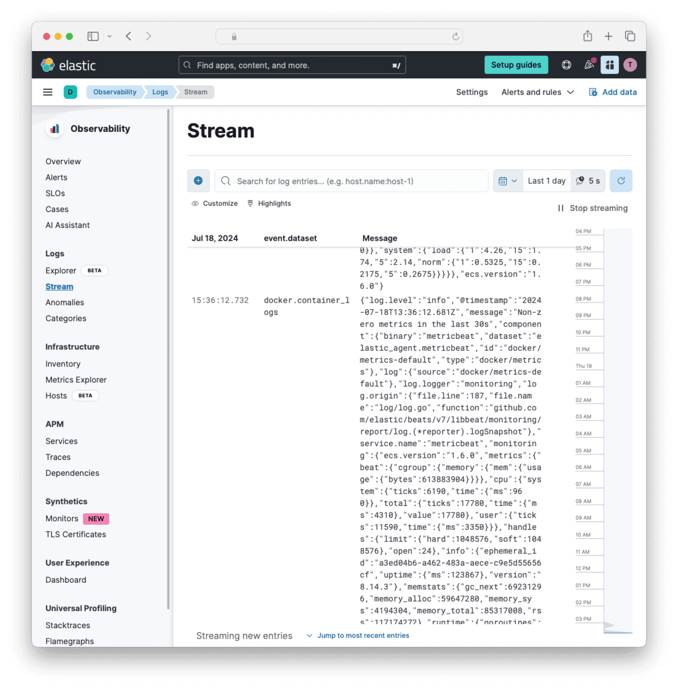
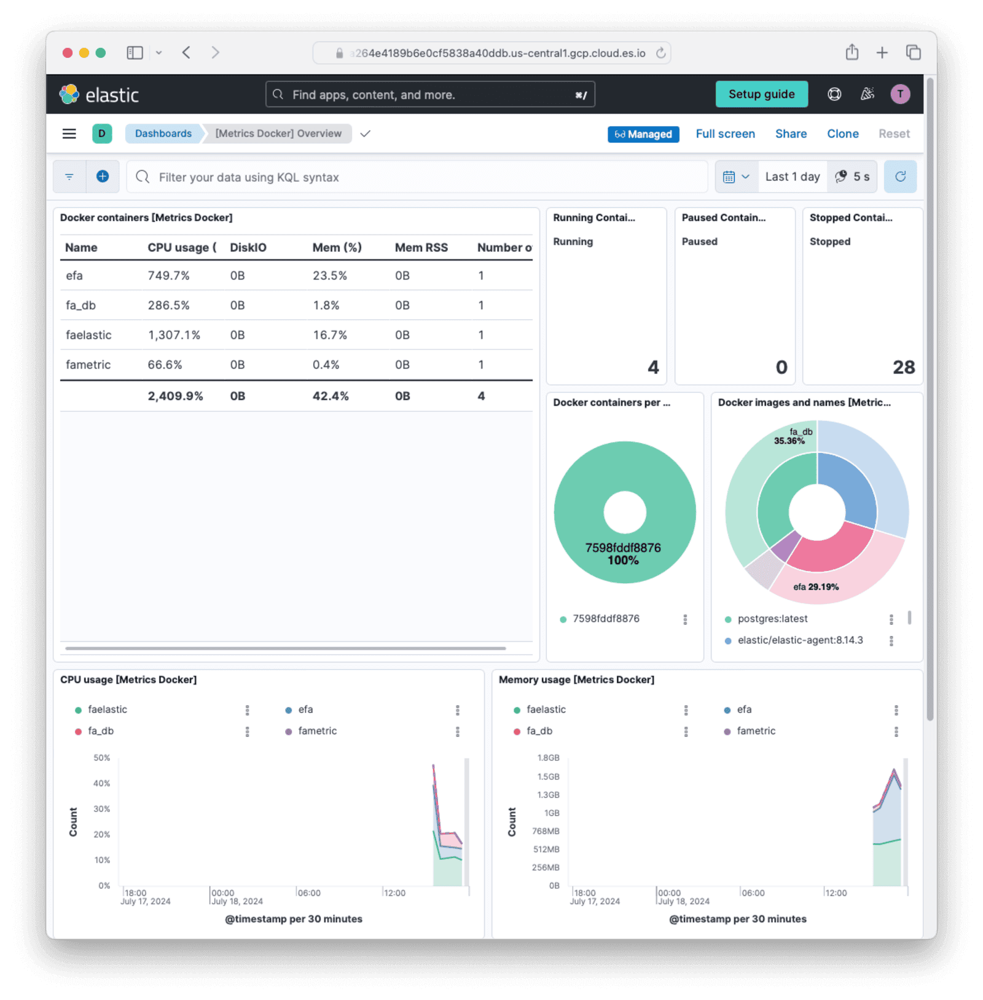
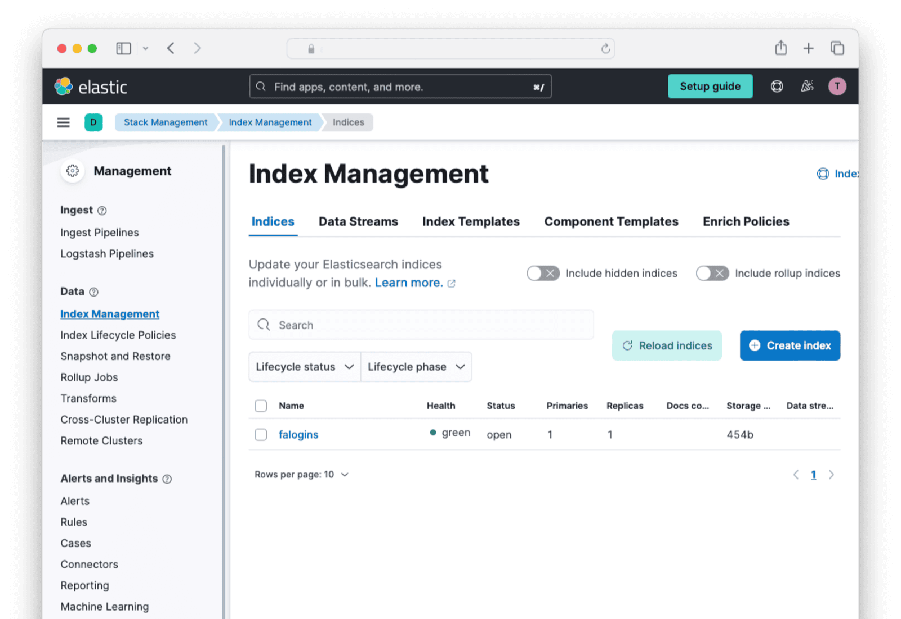
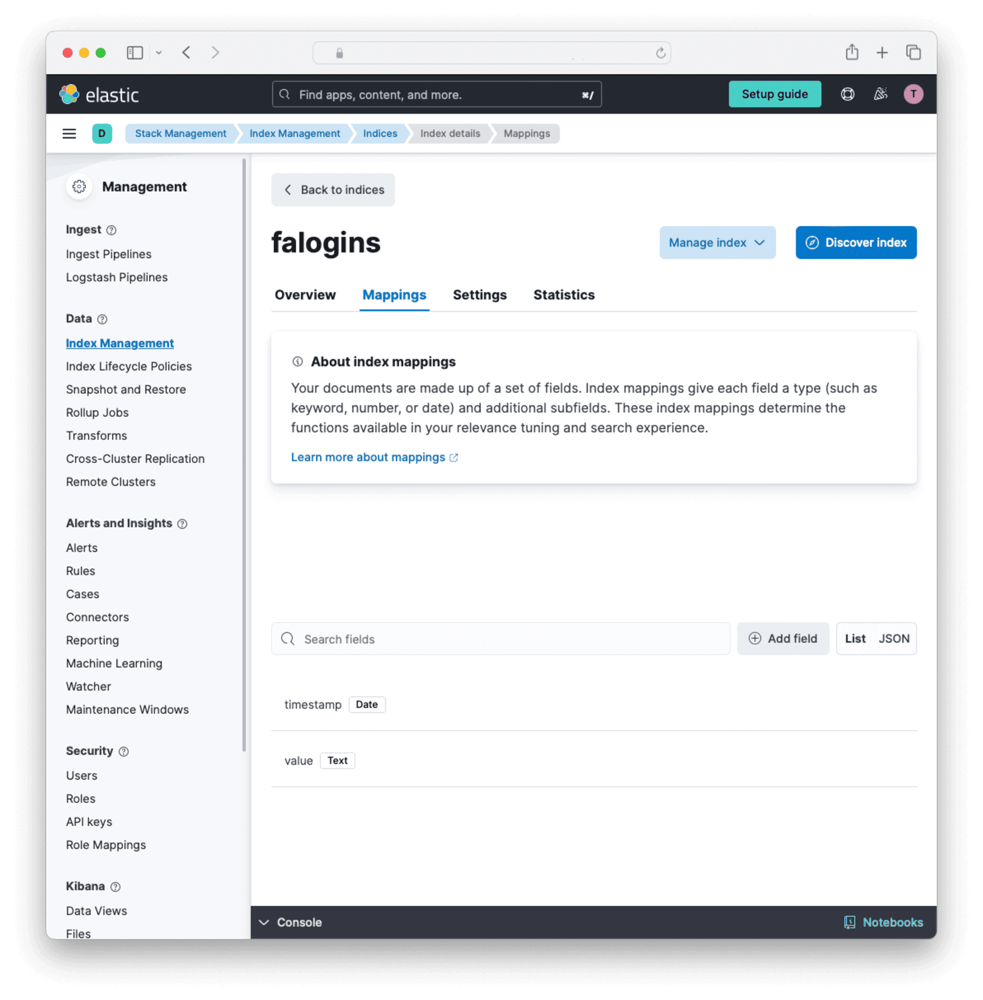
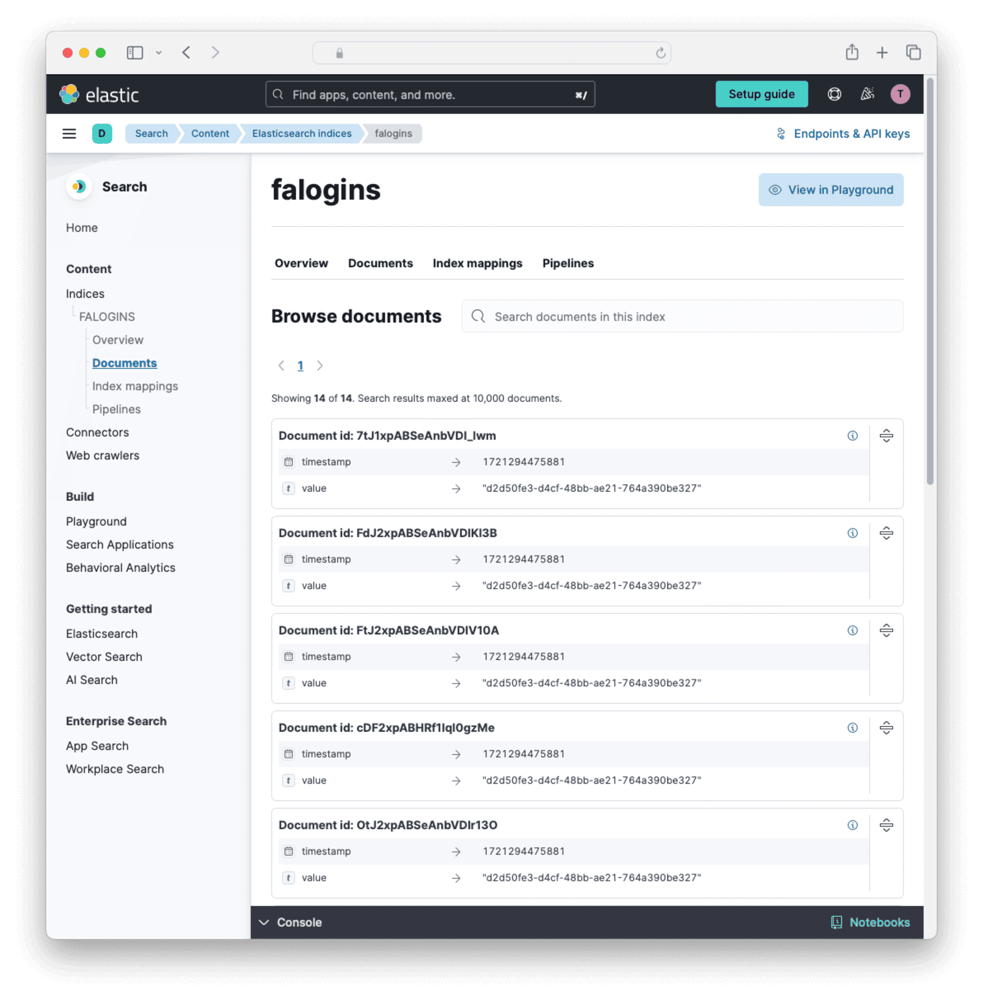
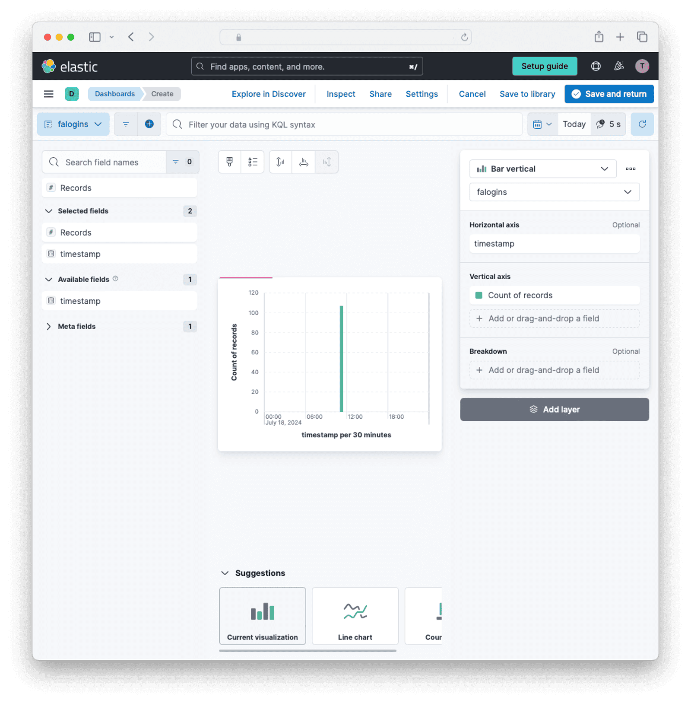

import Aside from 'src/components/Aside.astro';
import IconButton from 'src/components/IconButton.astro';
import Breadcrumb from 'src/components/Breadcrumb.astro';
import InlineField from 'src/components/InlineField.astro';
import InlineUIElement from 'src/components/InlineUIElement.astro';
import Diagram1 from 'src/components/docs/operate/secure-and-monitor/slackDiagram1.astro';
import Diagram2 from 'src/components/docs/operate/secure-and-monitor/slackDiagram2.astro';

## Todo

- https://preview.ritza.co/codecapsules/tutorials/build-slackbot-with-node
- https://grafana.com/docs/grafana/latest/alerting/configure-notifications/manage-contact-points/integrations/configure-slack/

## Introduction To Slack

[Slack](https://slack.com) is a private chat app you can configure for your organization. To send alerts to Slack, create a dedicated channel (chatroom) in the app, add your system administrators to it, and send messages to the channel using the Slack API.

This guide explains the process in detail, and how to create a simple web service in JavaScript to monitor FusionAuth and call Slack if FusionAuth has errors.

Before continuing with this guide, please read the [FusionAuth guide to monitoring](/docs/operate/secure-and-monitor/monitor) to get an overview of the available metrics and choose the ones relevant to your needs. Sending alerts to Slack is also a small component of what comprehensive monitoring involves. The overview guide explains where Slack fits in the monitoring flow, as well as alternative apps to Slack for receiving alerts.

Pricing of Slack is available [here](https://slack.com/intl/en-ie/pricing). The free tier allows you to integrate Slack with other applications, but does not allow you to [build workflows](https://slack.com/intl/en-ie/features/workflow-automation). The Pro (lowest paid) tier has all the features you need for using Slack with outside apps. Higher priced tiers have no features you need for integration.

A workflow is a set of custom triggers, data, and logic you organize into a sequence of steps. The [logic can be code](https://api.slack.com/automation/functions/custom), written in TypeScript or JavaScript. Workflows can also use [stock connectors to outside services](https://api.slack.com/automation/connectors).

## Understand The System Design

Running FusionAuth and PostgreSQL in Docker usually looks like the diagram below (you might also run OpenSearch in another Docker container).

```mermaid
graph LR
  subgraph I[Your server]
    direction TB
    subgraph G[Docker]
      H[(PostgreSQL)]
    end
    subgraph C[Docker]
      A(FusionAuth)
    end
    subgraph E[Docker]
      F(Your app)
    end
  end
  D(🧑‍💻 User)
  D --> F
  D --> A
  C --> G
  F --> A
  style I fill:#999
```

<Diagram1></Diagram1>



In this guide you are going to create a tiny web service in its own container to monitor FusionAuth. It will call Slack if the FusionAuth logs API is not contactable, or if the logs contain an error message. The new design will look like the diagram below.

```mermaid
graph LR
  X(Slack)
  subgraph I[Your server]
    subgraph G[Docker]
      H[(PostgreSQL)]
    end
    subgraph C[Docker]
      A(FusionAuth)
    end
    subgraph E[Docker]
      B(Custom web service monitor)
    end
    subgraph J[Docker]
      F(Your app)
    end
  end
  D(🧑‍💻 User)
  K(👩‍🚒 Administrator)
  D --> F
  D --> A
  C --> G
  F --> A
  B --> |API call| C
  B --> |API call| X
  K --> X
  style I fill:#999
  style E fill:#944
  style X fill:#944
```

<Diagram2></Diagram2>



## Create A Slack Account

First, register for a Slack account:

- Register for a new workspace at https://slack.com/intl/en-ie/get-started#/createnew. You don't need to create a password.
- Verify your confirmation code in the email Slack sends you.
- Create a workspace called `fa`.
- Create a [channel](https://slack.com/intl/en-ie/help/articles/360017938993-What-is-a-channel) called `fa-alert`. The channel is public by default, meaning it is usable for every member of your workspace.
- Right-click the `fa-alert` channel and click <InlineUIElement>View channel details</InlineUIElement>. Record the <InlineField>Channel ID</InlineField> value for later use.

## Create A Slack App

To be able to send messages to Slack, you need an API key. To get an API key, you need to create a [Slack app](https://api.slack.com/tutorials/tracks/posting-messages-with-curl).

- Browse to https://api.slack.com/tutorials/tracks/posting-messages-with-curl and click <InlineElement>Create app</InlineElement>. (If this tutorial page doesn't exist in the future, create an app in the [apps homepage](https://api.slack.com/apps).)
- Choose the `fa` workspace and click <InlineElement>Next</InlineElement>.
- Click <InlineElement>Edit Configurations</InlineElement>.
- Change the <InlineField>name</InlineField> and <InlineField>display_name</InlineField> to `fabot`.
- Click <InlineElement>Next</InlineElement>.
- Click <InlineElement>Create</InlineElement>.
- You should now be in the apps homepage.
- Click <InlineElement>Install to Workspace</InlineElement>.
- On the page that opens, click <InlineElement>Allow</InlineElement>. (Back in your Slack chat app page, the `fabot` app should now be visible in the user list.)
- Click <InlineElement>OAuth & Permissions</InlineElement> in the sidebar.
- Note your <InlineElement>Bot User OAuth Token</InlineElement> (`xoxb-something`) for later use.
- Check that your bot has permissions for `chat:write` and `chat:write.public`.

Open a terminal and run the command below, using your bot token and channel ID. The response should start with `"ok"`.

```sh
curl -d "text=Test alert from FusionAuth." -d "channel=C123456" -H "Authorization: Bearer xoxb-something" -X POST https://slack.com/api/chat.postMessage

# Result:
# {"ok":true,"channel":"C123456","ts":"1721743117.410499","message":{"user":"U07DNJ4R0","type":"message","ts":"1721743117.410499","bot_id":"B07FNAHNX","app_id":"A07QSG5","text":"Test alert from FusionAuth.","team":"T07E2VGQ","bot_profile":{"id":"B07DHNX","app_id":"A0G5","name":"fabot","icons":{"image_36":"https:\/\/a.slack-edge.com\/80588\/img\/plugins\/app\/bot_36.png","image_48":"https:\/\/a.slack-edge.com\/80588\/img\/plugins\/app\/bot_48.png","image_72":"https:\/\/a.slack-edge.com\/80588\/img\/plugins\/app\/service_72.png"},"deleted":false,"updated":1721740273,"team_id":"T07Q"},"blocks":[{"type":"rich_text","block_id":"XL+","elements":[{"type":"rich_text_section","elements":[{"type":"text","text":"Test alert from FusionAuth."}]}]}]}}
```


You now have a token you can use in a web service that monitors FusionAuth to post a message to Slack if FusionAuth fails.

## Run FusionAuth

In this section you are going to run FusionAuth.

- Install [Docker](https://docs.docker.com/get-docker/) if you don't have it on your machine.
- Use the modified `docker-compose-yaml` file from the FusionAuth [five-minute guide](/docs/quickstarts/5-minute-setup-guide) to have the content below.
  ```yaml
  services:
    fa_db:
      image: postgres:latest
      container_name: fa_db
      ports:
        - "5432:5432"
      environment:
        PGDATA: /var/lib/postgresql/data/pgdata
        POSTGRES_USER: ${POSTGRES_USER}
        POSTGRES_PASSWORD: ${POSTGRES_PASSWORD}
      healthcheck:
        test: [ "CMD-SHELL", "pg_isready -U postgres" ]
        interval: 5s
        timeout: 5s
        retries: 5
      networks:
        - db_net
      volumes:
        - db_data:/var/lib/postgresql/data

    fa:
      image: fusionauth:latest
      container_name: fa
      depends_on:
        db:
          condition: service_healthy
      environment:
        DATABASE_URL: jdbc:postgresql://db:5432/fusionauth
        DATABASE_ROOT_USERNAME: ${POSTGRES_USER}
        DATABASE_ROOT_PASSWORD: ${POSTGRES_PASSWORD}
        DATABASE_USERNAME: ${DATABASE_USERNAME}
        DATABASE_PASSWORD: ${DATABASE_PASSWORD}
        FUSIONAUTH_APP_MEMORY: ${FUSIONAUTH_APP_MEMORY}
        FUSIONAUTH_APP_RUNTIME_MODE: ${FUSIONAUTH_APP_RUNTIME_MODE}
        FUSIONAUTH_APP_URL: http://fusionauth:9011
        SEARCH_TYPE: database
      networks:
        - db_net
      ports:
        - 9011:9011
      volumes:
        - fusionauth_config:/usr/local/fusionauth/config

    fa_mon:
      image: famonimage
      container_name: fa_mont
      networks:
        - db_net

  networks:
    db_net:
      driver: bridge

  volumes:
    db_data:
    fusionauth_config:
  ```
- Also create a `.env` file with the default content below.
  ```text
  DATABASE_USERNAME=fusionauth
  DATABASE_PASSWORD=hkaLBM3RVnyYeYeqE3WI1w2e4Avpy0Wd5O3s3
  FUSIONAUTH_APP_MEMORY=512M
  FUSIONAUTH_APP_RUNTIME_MODE=development
  OPENSEARCH_JAVA_OPTS="-Xms512m -Xmx512m"
  POSTGRES_USER=postgres
  POSTGRES_PASSWORD=postgres
  ```

Notice the last service in the compose file, `fa_mon`, doesn't exist yet. This is the monitoring web app you will build in the next section.

- Run the FusionAuth database with `docker compose up fa_db`.
- Run the FusionAuth database with `docker compose up fa`.
- Browse to http://localhost:9011 and check you can log in with username `admin` and password `password`.

## Write A Web Service To Monitor FusionAuth

TODO


---
---
---


---


- When you return to the Slack web interface it should now say "Agent enrollment confirmed".
- You should also see the agent appear in the Fleet dashboard and the status should change to `Healthy`.
    
- In the sidebar, browse to <strong>Analytics -> Dashboards</strong>. Search for and display `Host overview`.
  

You have successfully installed a monitoring agent for your FusionAuth machine and can now monitor it online.

### How To Debug The Container

If you get errors when running FusionAuth, or the Agent does not appear in Fleet, you will need to open a terminal in the container to find the problem.

Change the last line of the Dockerfile to the line below, to stop FusionAuth and the Agent starting, so you can test manually.

```sh
CMD tail -f /dev/null
```

To rebuild the Dockerfile after changes, run the command below.

```sh
docker rm fa; docker rm efa; docker rmi efaimage; docker build --platform linux/amd64 -t efaimage -f elastic.dockerfile .
```

To run the container and enter it as root, use the command below.

```sh
docker run -it --user root --name efa efaimage bash
```

Start the Agent with `/opt/Slack/Agent/elastic-agent run` and use `cat /var/log/elastic-agent.err` to look for errors. If you see the agent trying to connect to `127.0.0.1:9200`, it is not because the URL is configured incorrectly. The 127 address is just a fallback when the Agent cannot connect to the server, usually due to it not running as root.

## Monitor FusionAuth With Slack In Another Container

Running Slack Agent and FusionAuth in the same container required altering the FusionAuth Dockerfile, which means you have to alter the file and rebuild the image every time you want to use a new version of FusionAuth.

If you run Slack Agent in a separate container you avoid this problem, but you need to have full control over the machine running Docker in order to give Slack Agent access to restricted Docker data (the Docker socket). This may not be possible on some cloud hosts.

Running Slack Agent in a separate container to FusionAuth is shown in the diagram below.

<Diagram4></Diagram4>

Below are the instructions to implement this design. They follow from the work you did in the previous section.

- Browse to the Slack web interface.
- Click "Add integrations". Search for and add Docker.
- Give it the name `fadocker`.
- At the bottom of the page, name the new policy `fadockerpolicy`.
- Click "Save and continue".
- Click "Add Slack Agent to your hosts". You need the URL and token given on the page that shows, but you won't need the installation commands. Slack already provides a prebuilt Docker image you can use instead.
- Change the Docker compose file you used in the previous section to replace the custom `efa` image with the normal FusionAuth image.
  ```yaml
  fa:
    image: fusionauth/fusionauth-app:latest
  ```
  - Note that you could continue using the `efa` image if you wanted to. Slack allows you to run as many agents as you want, and will collect data from all of them.
- Add a new service to the compose file for the Slack Agent image. Replace your URL and enrollment token in the markup below from the values on the Slack web page.
  ```yaml
  faelastic:
    image: elastic/elastic-agent:8.14.3
    container_name: faelastic
    user: root
    networks:
      - db_net
    environment:
      - FLEET_ENROLL=1
      - FLEET_ENROLLMENT_TOKEN=YTRBMBa1RvUQ==
      - FLEET_URL=https://905ec5.fleet.us-central1.gcp.cloud.es.io:443
    volumes:
      - /var/run/docker.sock:/var/run/docker.sock:ro    # `ro` makes the folder readonly in the container to protect your real machine
      - /var/lib/docker/containers:/var/lib/docker/containers:ro
  ```
  - `/var/run/docker.sock` allows Slack Agent to view Docker metrics about other containers. It will work on Linux and Macos hosts, but might not work on Windows. If you encounter socket problems on Windows, please read [this article](https://tomgregory.com/aws/running-docker-in-docker-on-windows/) and try prefixing your local socket path with an extra slash.
  - `/var/lib/docker/containers` allows Slack Agent to read the logs of other containers.
- Run the Slack Agent container first, so that it will see some log information from other containers when they start. First run `docker compose up faelastic`.
- In the Slack Cloud web interface, browse to the sidebar and then <strong>Observability -> Stream</strong>.
- Run the other Docker containers with `docker compose up db fa`
- You should be able to see the FusionAuth log output appearing in the Slack web interface.
  
- Browse to the sidebar and then <strong>Analytics -> Dashboards -> [Metrics Docker]Overview</strong>. You should be able to see details about all your Docker containers now.
  

## Monitor the FusionAuth Application Directly With Slack

You've learnt how to monitor the FusionAuth container now in two different ways. Since a Docker container will exit if the process it runs exits, this monitoring will tell you if FusionAuth dies, which might be enough for you to know. But if you want to monitor details about the FusionAuth app itself, there are various approaches:
- Use an [Slack APM (application perfomance monitoring) app for Java](https://www.elastic.co/guide/en/observability/current/_step_3_install_apm_agents.html) inside the FusionAuth container to monitor the Java Virtual Machine. Since monitoring Java won't give you any useful information that monitoring the container doesn't already, you can ignore this idea. There is a guide to running FusionAuth with a Java monitoring app by altering the Dockerfile in the [FusionAuth Splunk guide](./splunk) if you would like to try.
- Use an [OpenTelemetry Java monitoring agent](https://github.com/open-telemetry/opentelemetry-java-instrumentation) to send information about FusionAuth to Slack. This is similar to previous point - OpenTelemetry won't provide any useful information that container monitoring doesn't already. Using OpenTelemery is also shown in the [FusionAuth Splunk guide](./splunk). Slack has a guide to Java [here](https://www.elastic.co/guide/en/observability/8.14/apm-open-telemetry.html) that you can use in conjunction with the Splunk guide.
- Use a specialized Slack service, like Heartbeat, to connect to the FusionAuth HTTP server and see if it returns correctly. You can install Heartbeat in a container, like we did for Slack Agent in the previous section, and point it to the FusionAuth URL. A guide on Heartbeat is [here](https://www.elastic.co/guide/en/beats/heartbeat/current/heartbeat-overview.html).
- Send custom metrics from FusionAuth to Slack. This is the most complex option, as you need to write a custom service to request FusionAuth metrics, extract them from the given zip file, and upload them to Slack through their API. However, this is the only way to get precise information about FusionAuth if you want that level of detail. This option will be discussed in the next section.

## Send Custom FusionAuth Metrics To The Slacksearch API

There are three possible ways to send custom data to Slack:
- Write your own service to run continuously, get data, and send it by calling the Slacksearch API.
- Build a custom private module for [MetricBeat](https://www.elastic.co/beats/metricbeat) in Go, compile the module with MetricBeat, and deploy the output to a container. MetricBeat is similar to Slack Agent. It is a Slack service that runs continuously, calling whatever integration it's configured with. To write a custom module (integration), follow the [Slack developer documentation](https://www.elastic.co/guide/en/beats/devguide/current/metricbeat-dev-overview.html).
- Deploy MetricBeat with the stock [HTTP module](https://www.elastic.co/guide/en/beats/metricbeat/current/metricbeat-module-http.html) in a container. The HTTP module can call any custom API you want. Write a little web service in another container as an interface between MetricBeat and FusionAuth. This service will get whatever metrics you want from FusionAuth and return them in the HTTP response.

Each option has disadvantages. While calling the API directly is the least code, it is low level work that moves away from using the Slack components as intended. And it requires you to configure values to group your custom data with other data from Slack Agent in the dashboard. Using MetricBeat is Slack's recommended solution, but requires writing and compiling Go code for every service change, or running an additional Docker container with its own web service.

For simplicity’s sake you will use option one in this guide. In this section you will create a custom service in Docker to call the FusionAuth API and send the metrics to Slack API directly.

The design looks like the diagram below.

<Diagram5></Diagram5>

### Which Metrics To Monitor

FusionAuth has too [many metrics](/docs/operate/secure-and-monitor/monitor#metrics) to discuss in this article. You will need to decide which are important for you to monitor by reading the documentation.

In addition to the metrics available through the various FusionAuth APIs, you can create your own metrics using any event that can trigger a [webhook](/docs/extend/events-and-webhooks). This webhook can call another Docker container you create that listens for incoming events and forwards them to Slack.

A useful metric to start with is login counts. If this number drops from the average, it's a good sign something might be wrong with your system. In this guide, you'll learn how to create a program that uses the FusionAuth API to get the login count, then upload it to Slack.

You can add any other metrics you want to this service.

### Create A Slack API Key

Earlier you used an enrollment token tied to a specific Agent Policy to configure your Slack Agent. Now to call the Slacksearch API directly you need an API key.

- In the Slack Cloud web interface, open the sidebar and browse to <strong>Search -> Slacksearch</strong>.
- Click "Endpoints & API keys"
- Note your endpoint and cloud ID values.
- Click "New API key".
- Give it a name and enable "Security Privileges" and "Metadata".
- Click "Create API Key".
- Save the key securely for later use. Never to commit the key to git, which can expose it on the Internet.

### Create A Slacksearch Index

To prepare Slacksearch for data upload, open a terminal and run the three commands below, after setting your API key and URL for the first two commands. The API key is the value of the `encoded` field from the JSON in Slack, not the `api_key` field.

```sh
export elasticKey="WGdLQ=="
export elasticUrl="https://c301.us-central1.gcp.cloud.es.io:443"
curl -X PUT "${elasticUrl}/falogins" -H "Authorization: ApiKey ${elasticKey}" -H "Content-Type: application/json" -d'
{
  "mappings": {
    "properties": {
      "timestamp": { "type": "date" },
      "value": { "type": "text" }
    }
  }
}'

# Result:
# {"acknowledged":true,"shards_acknowledged":true,"index":"logins"}
```

These commands should have created an index (think of an index as a database table) to which you can upload FusionAuth metrics. If you receive an authentication or 404 error please check your URL and API key settings.

Check that the index exists by running the command below.

```sh
curl "${elasticUrl}/falogins" -H "Authorization: ApiKey "${elasticKey}"" -H "Content-Type: application/json"

# Result:
# {"falogins":{"aliases":{},"mappings":{"properties":{"timestamp":{"type":"date"},"value":{"type":"integer"}}},"settings":{"index":{"routing":{"allocation":{"include":{"_tier_preference":"data_content"}}},"number_of_shards":"1","provided_name":"falogins","creation_date":"1721213253232","number_of_replicas":"1","uuid":"JXwp3mzBTJqkQH6sNkEvPg","version":{"created":"8505000"}}}}}
```

Let's review the index in Slack Cloud.

- Browse to the web interface, open the sidebar, and browse to <strong>Management -> Stack Management -> Index Management</strong>.
  
- You should see "falogins" in the list. Click it.
- Click the "Mappings" tab.
  

You can now see the type of data that the index will accept. You can create indexes manually instead of using the API if you like. Creating mappings manually will show you all the types of fields that Slacksearch supports.

### Write A Custom Service To Send Data To The API

Let's get the login records every ten seconds and send them to Slack. All the FusionAuth APIs that give you event data are documented [here](/docs/apis). The login records API is documented [here](/docs/apis/login#request-6). Note that the documentation says the date format is the standard Java type, but some constants like `ISO_LOCAL_DATE_TIME` are not supported. You need to enter the format string you want manually.

Unfortunately, all the APIs export events as zip files — you will not get JSON or YAML data in memory. So you will need to create a script that gets the zip file, extracts it, reads it, formats the entries for Slack, and uploads them.

Browse to FusionAuth, which is at http://localhost:9011 if you are running through the default Docker setup. Log in and look for your application Id in <Breadcrumb>System -> Login Records</Breadcrumb>.

Next, create an API key by navigating to <Breadcrumb>Settings -> API Keys</Breadcrumb> and clicking the <IconButton icon="plus" color="green" /> button. Enter a <InlineField>Description</InlineField> for the API key and click on the <IconButton icon="save" color="blue" /> button to save the API key. On the API Keys list page, click the red lock <IconButton icon="lock" color="red" /> next to the newly generated key to reveal the key value and copy and save it.

Create a file called `app.sh`. Insert the content below, replacing your FusionAuth API key, FusionAuth application Id, and your Slack API key and Slack URL.

```sh
#!/bin/sh

# exit on error
set -e

# get login records from fusionauth
faUrl="http://fa:9011/api/system/login-record/export" # use "http://localhost:9011... for testing this script outside of Docker
faKey="33052c8a-c283-4e96-9d2a-eb1215c69f8f-not-for-prod"
faAppId="3c219e58-ed0e-4b18-ad48-f4f92793ae32"
elasticKey="WGdNxOUkwQQ=="
elasticUrl="https://c36cbc1.us-central1.gcp.cloud.es.io:443"
dateFormat=$(echo -n "yyyy-MM-dd'T'HH:mm:ss.SSS" | jq -sRr @uri)
end=$(date +%s)000
start=$(($end - 3600000))
params="applicationId=${faAppId}&dateTimeSecondsFormat=${dateFormat}&start=${start}&end=${end}"
url="${faUrl}?${params}"
echo "curl -H \"Authorization: ${faKey}\" -o record.zip \"$url\""
curl -H "Authorization: ${faKey}" -o record.zip "$url"
unzip -o record.zip
cat login_records.csv

# for each record, get the user and  unix time in ms
tail -n +2 login_records.csv | while IFS=',' read -r userId time rest; do
  userId=$(echo "$userId" | tr -d ' "' )
  time=$(echo "$time" | tr -d ' "')                      # 2024-06-21T05:14:56.123
  time=$(echo "$time" | tr 'T' ' ')                      # 2024-06-21 05:14:56.123
  sec="$(date -d "$(echo $time | cut -d '.' -f 1)" +%s)" # 1718946896
  ms="$(echo $time | cut -d '.' -f 2)"                   # 123

  # make the POST data
  data=$(cat <<EOF
{
  "timestamp": ${sec}${ms},
  "value": "${userId}"
}
EOF
)

  # send data to Slack API
  curl -X POST "${elasticUrl}/falogins/_doc" -H "Authorization: ApiKey ${elasticKey}" -H "Content-Type: application/json" -d "$data"

done
```

This script gets all login records in the last hour to be sure the zip file has some data. In reality, replace 3600000 with 10000 so that when the script runs every ten seconds, it gets only the latest records. Note that FusionAuth uses milliseconds instead of the epoch standard of seconds, so the script has to append `000` to the normal Unix time.

The file returned from FusionAuth unzips to `login_records.csv`, which looks like the data below.

| "User Id "                           | "Time "                 | "Application Id "                    | "IP Address " | "City " | "Country " | "Zipcode " | "Region " | "Latitude " | "Longitude " |
|--------------------------------------|-------------------------|--------------------------------------|---------------|---------|------------|------------|-----------|-------------|--------------|
| ba81f3e2-3b0f-4d64-930f-38298de9dc0d | 2024-06-21T05:14:56.123 | 3c219e58-ed0e-4b18-ad48-f4f92793ae32 | 172.20.0.1    |         |            |            |           |             |              |
| ba81f3e2-3b0f-4d64-930f-38298de9dc0d | 2024-06-21T05:07:06.406 | 3c219e58-ed0e-4b18-ad48-f4f92793ae32 | 172.20.0.1    |         |            |            |           |             |              |

The records in this file look different from those in the FusionAuth console. Only Ids are given here, not email addresses or application names.

The second half of the script reads in the CSV file, discards the header, and sends the user ID and the time of each login to Slack.

Create a file called `metricDockerfile`. Insert the content below.

```
FROM --platform=linux/amd64 alpine:3.19
RUN apk add --no-cache curl jq nano
COPY app.sh /app.sh
RUN chmod +x app.sh
CMD watch -t -n 10 /app.sh
```

Build the container with the command below.

```sh
docker build -f metricDockerfile.yaml --platform linux/amd64 -t metricimage .
```

Edit your `docker-compose.yaml` file and add the new service as follows.

```
  fametric:
    image: metricimage
    container_name: fametric
    networks:
      - db_net
```

Now run all the containers with `docker compose up`.

The output should be as below. Since you logged in in the last hour, there will be one row in the exported file and one value will be sent to Slack. If you don't see any rows displayed on the screen, log in to FusionAuth again.

```sh
curl -H "Authorization: 33052c8a-c283-4e96-9d2a-eb1215c69f8f-not-for-prod" -o record.zip "http://fa:9011/api/system/login-record/export?applicationId=3c219e58-ed0e-4b18-ad48-f4f92793ae32&dateTimeSecondsFormat=yyyy-MM-dd%27T%27HH%3Amm%3Ass.SSS&start=1721215014000&end=1721218614000"
fametric  |   % Total    % Received % Xferd  Average Speed   Time    Time     Time  Current
fametric  |                                  Dload  Upload   Total   Spent    Left  Speed
100   319    0   319    0     0  42962      0 --:--:-- --:--:-- --:--:-- 45571
fametric  | Archive:  record.zip
fametric  |   inflating: login_records.csv
fametric  | "User Id ","Time ","Application Id ","IP Address ","City ","Country ","Zipcode ","Region ","Latitude ","Longitude "
fametric  | 00000000-0000-0000-0000-000000000001,2024-07-17T05:26:05.740,3c219e58-ed0e-4b18-ad48-f4f92793ae32,172.21.0.1,,,,,,
fametric  | 00000000-0000-0000-0000-000000000001,2024-07-17T05:25:59.800,3c219e58-ed0e-4b18-ad48-f4f92793ae32,172.21.0.1,,,,,,

```

If the metric has not uploaded correctly, you can debug the container by running `docker exec -it fametric sh` in a new terminal. Once in the container, you can alter the script with `nano /app.sh`. Add `-v` to the `curl` command to see verbose output. Run the script with `/app.sh`.

If you have trouble calling the FusionAuth API, review the [troubleshooting tips](/docs/apis/#troubleshooting).

If you alter `app.sh` in your host machine and want to rerun the containers, use the command below.

```sh
clear; docker build -f metricDockerfile --platform linux/amd64 -t metricimage .; docker compose up
```

You can follow the process described here to add other FusionAuth API calls to `app.sh` to get other metrics to send to Slack.

### View The Metrics In Kibana

The final step to use your metrics is to create a dashboard to view them in Kibana. You are going to show recent logins on a timeline to indicate the health of FusionAuth. Since the `UserId` field is free text and thus not aggregatable, you will not be able to visualize it, but it will be available for search if you need to run queries against users in Slacksearch.

- In the Slack Cloud web interface, open the sidebar and browse to <strong>Search -> Slacksearch -> Indices -> falogins -> Documents</strong>. You should see data in the table. If not, please run `app.sh` manually and debug where it is failing, paying attention to all API keys and URLs.
  
- In the sidebar browse to <strong>Analytics -> Dashboards -> Create visualization</strong>.
- In the index combobox in the top left, change from `logs-*` to `falogins`.
- Click the "+" button next to "timestamp" to add it to the dashboard.
- Change the time in the top right to "Today".
- Change the visualization type to "Bar vertical".
  
- Click "Save and return".
- Click "Save"
- Give the dashboard a name like `FusionAuth login rate` and save.

You now have a dashboard to monitor the health of FusionAuth. Following the process in this section, you can extract any metrics you want from the FusionAuth API, create an index for them in Slack, upload the metrics in a Docker container, and create a dashboard for them in Kibana.

## Final System Architecture

A relatively simple but adequate monitoring architecture with Slack might look as follows.

<Diagram6></Diagram6>

In this design, the Slack Agent monitors all Docker infrastructure and the FusionAuth logs, while the custom metric service provides fine-grained FusionAuth data to Slack to monitor the app itself.

## Next Steps

Now that you are able to monitor FusionAuth in Slack, you should enable Slack [alerts](https://www.elastic.co/kibana/alerting) to notify you by email or in Slack if something goes wrong, like a massive decrease in login rates, a Docker container restarting, or a log output containing `error`.

## Further Reading

- [FusionAuth metrics](/docs/operate/secure-and-monitor/monitor#metrics)
- [Getting started with Docker and Slack](https://www.elastic.co/blog/getting-started-with-the-elastic-stack-and-docker-compose)
- [Slacksearch REST API](https://www.elastic.co/guide/en/elasticsearch/reference/current/docs-index_.html)


<InlineUIElement></InlineUIElement>
<InlineField></InlineField>
<Breadcrumb></Breadcrumb>