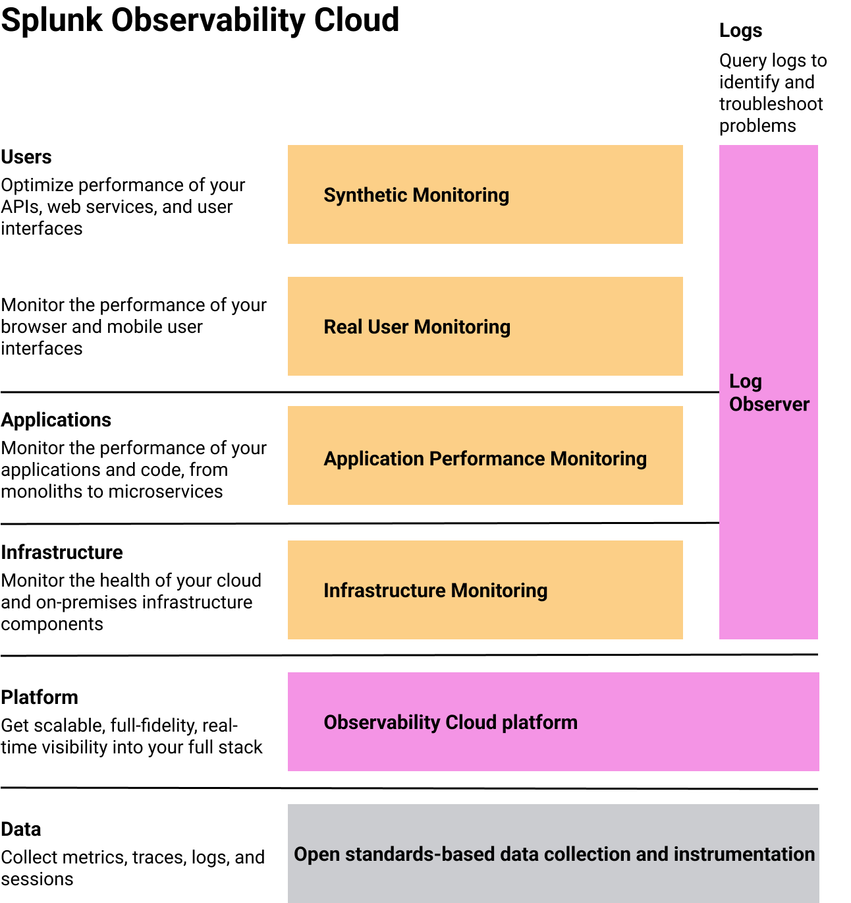
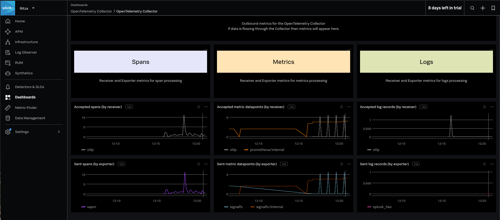

import Aside from 'src/components/Aside.astro';
import InlineField from 'src/components/InlineField.astro';

- [Introduction](#introduction)
- [Splunk Setup](#splunk-setup)
- [Import Data To Splunk With The API](#import-data-to-splunk-with-the-api)
- [Import Data To Splunk With The OpenTelemetry Linux Collector](#import-data-to-splunk-with-the-opentelemetry-linux-collector)
  - [OpenTelemetry Dashboard](#opentelemetry-dashboard)
- [FusionAuth Metrics](#fusionauth-metrics)
- [Mapping FusionAuth Metrics To Splunk Metrics](#mapping-fusionauth-metrics-to-splunk-metrics)
- [Write A Custom Service To Send Data To The API](#write-a-custom-service-to-send-data-to-the-api)
- [Import Data To Splunk With Logs](#import-data-to-splunk-with-logs)
- [Further Reading](#further-reading)
- [TODO](#todo)
  - [Audit Log](#audit-log)
  - [The Event Log](#the-event-log)
  - [Login Records](#login-records)
  - [Logs](#logs)


## Introduction

This guide explains how to connect FusionAuth to Splunk through Docker with the OpenTelemetry Connector and using the SplunkAPI, as well as which FusionAuth metrics map to what categories in Splunk and how to create a simple dashboard to them.

> [Splunk Observability Cloud is a Software as a Service (SaaS) solution for infrastructure monitoring (Splunk IM), application performance monitoring (Splunk APM), real user monitoring (Splunk RUM), and synthetic monitoring (Splunk Synthetic Monitoring). Splunk Observability Cloud also provides a direct integration with logs ingested in Splunk Cloud Platform and Splunk Enterprise through Log Observer Connect.](https://docs.splunk.com/observability/en/get-started/service-description.html)

Before reading this guide, please read the [FusionAuth guide to monitoring](https://fusionauth.io/docs/operate/secure-and-monitor/monitor) to understand what metrics are available.

## Splunk Setup

- Don't sign up for Splunk on their homepage[https://www.splunk.com/en_us/download/splunk-cloud.html]. This is **not** the correct site. Splunk divides its products into completely separate dashboards.
- Register for the Observability Cloud trial at https://www.splunk.com/en_us/download/o11y-cloud-free-trial.html.
- Verify your email address with the link in the email they send you. This should also log you in to the Observability dashboard.
- In the future, you can log in to the dashboard at https://login.signalfx.com.

Documentation for Splunk Observability is at https://docs.splunk.com/observability/en/get-started/welcome.html.

Pricing is at https://www.splunk.com/en_us/products/pricing/observability.html. Infrastructure monitoring, Log observer connect, and Synthetic uptime monitoring are included in the Splunk Infrastructure monthly fee. Each Splunk product has a separate 14 day trial.



## Import Data To Splunk With The API

Using the Splunk API to import metrics is documented [here](https://docs.splunk.com/observability/en/gdi/other-ingestion-methods/rest-APIs-for-datapoints.html#rest-api-ingest).

<Aside type='note'>
[To authenticate API requests that send data to Splunk Observability Cloud, you must use an organization access token, not a user API access token.](https://docs.splunk.com/observability/en/admin/authentication/authentication-tokens/api-access-tokens.html)
</Aside>

- Log in to your Observability account at https://login.signalfx.com.
- Click the logo at the top left to expand the menu labels.
- Click <strong>Settings -> View Profile -> Organizations</strong>
  - Note your realm and endpoints, for instance `us1`, `https://api.us1.signalfx.com`, `https://ingest.us1.signalfx.com`
- Get an [access token](https://docs.splunk.com/observability/en/admin/authentication/authentication-tokens/org-tokens.html#admin-org-tokens) (also called organization token).
  - Click <strong>Settings -> Access Tokens</strong>
  - Expand the `Default` access token
  - Click <InlineField>Show Token</InlineField> and note the token

Test that you can import data with the terminal command below.
  - Replace `<ORG_TOKEN>` with your token and `<REALM>` with your realm.

```sh
curl --request POST \
  --header "Content-Type: application/json" \
  --header "X-SF-TOKEN: <ORG_TOKEN>" \
  --data \
  '{
      "gauge": [
          {
              "metric": "memory.free",
              "dimensions": { "host": "server1" },
              "value": 42
          }
      ]
  }' \
  https://ingest.<REALM>.signalfx.com/v2/datapoint
```

The response should be `"OK"`.

- Return to the Observability dashboard home.
- Browse to <strong>Metric Finder</strong>.
- Enter `memory` in the text box and click <InlineField>Search metrics</InlineField>
- Click <InlineField>memory.free</InlineField>
- You should see the data point created by the command above on the chart. If you can't, try switching to the Column chart view, or run the command again with a different value.

In a later section you'll learn how to use this API to import data from your FusinAuth instance.

## Import Data To Splunk With The OpenTelemetry Linux Collector

Instead of sending metrics manually to Splunk, you can send them automatically with OpenTelemetry. OpenTelemetry is a protocol and software that is dedicated to monitoring, measuring, processing, collecting, and sending metrics.

Running FusionAuth and Postgresql in Docker looks like the diagram below.

```mermaid
graph LR
  subgraph I[Your server]
    direction LR
    subgraph G[Docker]
      H[(Postgresql)]
    end
    subgraph C[Docker]
      direction BT
      A(FusionAuth)
    end
  end
  C --> G
  style I fill:#111
```



(You might also run ElasticSearch in another Docker container, but it's unnecessary.)

You can also start FusionAuth inside Docker with [OpenTelemetry for Java](https://github.com/open-telemetry/opentelemetry-java-instrumentation) (FusionAuth is a Java application). OpenTelemetry (or Otel) sends the metrics it reads to a collector. The OpenTelemetry collector runs in a separate Docker container, and in turn sends the metrics to Splunk for recording. This follows the Docker principle of one process per container.

This architecture is shown in the diagram below.

```mermaid
graph LR
  subgraph I[Your server]
    direction LR
    subgraph G[Docker]
      H[(Postgresql)]
    end
    subgraph C[Docker]
      direction BT
      D(OpenTelemetry for Java) --> A(FusionAuth)
    end
    subgraph E[Docker]
      B(Splunk OpenTelemetry collector)
    end
  end
  C --> G
  C --> E
  E --> F(Splunk web server)
  style I fill:#111
```



Splunk's [OpenTelementry Linux collector tutorial](https://docs.splunk.com/observability/en/gdi/opentelemetry/collector-linux/collector-configuration-tutorial/about-collector-config-tutorial.html#about-collector-configuration-tutorial) is designed for a physical machine running systemd. Docker containers don't use systemd as they are designed to host a single process only.

Instead, you'll use the OpenTelemetry collector inside the Docker image Splunk has prepared.

First you need to modify the official FusionAuth Docker image to download the OpenTelemetry Java agent and change the script that starts FusionAuth. Configuration values for Java OpenTelemetry are described [here](https://opentelemetry.io/docs/languages/java/configuration).

Save the `Dockerfile` from the [FusionAuth official image](https://github.com/FusionAuth/fusionauth-containers/blob/master/docker/fusionauth/fusionauth-app/Dockerfile) to your computer. Edit the file. Above the paragraph labelled `###### Start FusionAuth App`, insert the code below.

```Dockerfile
##### NEW FOR OPENTELEMETRY #################################
RUN mkdir -p /var/lib/apt/lists/partial \
    && chmod 755 /var/lib/apt/lists/partial \
    && apt update \
    && apt install -y ca-certificates \
    && cd /usr/local/fusionauth \
    && curl -L -o otel.jar https://github.com/open-telemetry/opentelemetry-java-instrumentation/releases/latest/download/opentelemetry-javaagent.jar \
    && (head -n -1 /usr/local/fusionauth/fusionauth-app/bin/start.sh; echo 'exec "${JAVA_HOME}/bin/java" -javaagent:/usr/local/fusionauth/otel.jar -Dotel.resource.attributes=service.name=fusionauth -Dotel.traces.exporter=otlp -Dotel.exporter.otlp.endpoint=http://otel:4318 -cp "${CLASSPATH}" ${JAVA_OPTS} io.fusionauth.app.FusionAuthMain <&- >> "${LOG_DIR}/fusionauth-app.log" 2>&1') > temp.sh \
    && mv temp.sh /usr/local/fusionauth/fusionauth-app/bin/start.sh;
RUN chown fusionauth:fusionauth /usr/local/fusionauth/otel.jar /usr/local/fusionauth/fusionauth-app/bin/start.sh \
    && chmod +x /usr/local/fusionauth/fusionauth-app/bin/start.sh
```

This code edits `start.sh`, which is the command run when the container starts, to start FusionAuth using OpenTelemetry. The command takes the head of the file (all lines except the last), and writes the new command to the end of the file.

By default, the OpenTelemetry Java agent sends data to the OpenTelemetry collector at http://localhost:4317. You changed it to send data to the Splunk container, at http://otel:4318. (Splunk uses 4317 for RPC, not HTTP).

Build the Dockerfile into a new image to use in place of the official FusionAuth one.

```sh
docker build --platform linux/amd64 -t faimage .
```

Modify the `docker-compose-yaml` file from the FusionAuth [five-minute guide](/docs/quickstarts/5-minute-setup-guide) to have the content below. You are now including the [Splunk OpenTelemetry](https://docs.splunk.com/observability/en/gdi/opentelemetry/collector-linux/install-linux-manual.html#linux-docker) container in your compose file. Replace the API key and realm with yours in the `otel` service.

```docker-compose
services:
  db:
    image: postgres:latest
    container_name: fa_db
    ports:
      - "5432:5432"
    environment:
      PGDATA: /var/lib/postgresql/data/pgdata
      POSTGRES_USER: ${POSTGRES_USER}
      POSTGRES_PASSWORD: ${POSTGRES_PASSWORD}
    healthcheck:
      test: [ "CMD-SHELL", "pg_isready -U postgres" ]
      interval: 5s
      timeout: 5s
      retries: 5
    networks:
      - db_net
    volumes:
      - db_data:/var/lib/postgresql/data

  fa:
    # image: fusionauth/fusionauth-app:latest
    image: faimage
    container_name: fa
    depends_on:
      db:
        condition: service_healthy
    environment:
      DATABASE_URL: jdbc:postgresql://db:5432/fusionauth
      DATABASE_ROOT_USERNAME: ${POSTGRES_USER}
      DATABASE_ROOT_PASSWORD: ${POSTGRES_PASSWORD}
      DATABASE_USERNAME: ${DATABASE_USERNAME}
      DATABASE_PASSWORD: ${DATABASE_PASSWORD}
      FUSIONAUTH_APP_MEMORY: ${FUSIONAUTH_APP_MEMORY}
      FUSIONAUTH_APP_RUNTIME_MODE: ${FUSIONAUTH_APP_RUNTIME_MODE}
      FUSIONAUTH_APP_URL: http://fusionauth:9011
      SEARCH_TYPE: database
      FUSIONAUTH_APP_KICKSTART_FILE: ${FUSIONAUTH_APP_KICKSTART_FILE}
    networks:
      - db_net
    ports:
      - 9011:9011
    volumes:
      - fusionauth_config:/usr/local/fusionauth/config
      - ./kickstart:/usr/local/fusionauth/kickstart
    extra_hosts:
      - "host.docker.internal:host-gateway"

  otel:
    image: quay.io/signalfx/splunk-otel-collector:latest
    container_name: fa_otel
    environment:
      SPLUNK_ACCESS_TOKEN: "abSG5G6ZAK4K32h1b-qXxy"
      SPLUNK_REALM: "us1"
      SPLUNK_LISTEN_INTERFACE: "0.0.0.0"
      SPLUNK_MEMORY_LIMIT_MIB: "1000"
      SPLUNK_CONFIG: /config.yaml
    volumes:
      - ./config.yaml:/config.yaml
    networks:
      - db_net
    # no host ports are needed as communication is inside the docker network
    # ports:
    #   - "13133:13133"
    #   - "14250:14250"
    #   - "14268:14268"
    #   - "4317:4317"
    #   - "4318:4318"
    #   - "6060:6060"
    #   - "7276:7276"
    #   - "8888:8888"
    #   - "9080:9080"
    #   - "9411:9411"
    #   - "9943:9943"

networks:
  db_net:
    driver: bridge

volumes:
  db_data:
  fusionauth_config:
```

Save the [sample Splunk configuration file](https://github.com/signalfx/splunk-otel-collector/blob/main/cmd/otelcol/config/collector/gateway_config.yaml) to `config.yaml` on your computer in the same folder as `docker-compose.yaml`. You are using the Splunk Collector in [gateway mode (data forwarding), not agent mode (host monitoring)](https://docs.splunk.com/observability/en/gdi/opentelemetry/opentelemetry.html#collector-intro-deploy).

This configuration file path was added as an [environment variable](https://docs.splunk.com/observability/en/gdi/opentelemetry/environment-variables.html#collector-env-var) into the Docker compose file.

First check if the OpenTelemetry container can send data to Splunk. After running the command below, see if any data are visible when you search for `otel` in the <strong>Metric Finder</strong> section of the Splunk website.

```sh
docker compose up otel
```

If not, correct your secret key and realm in the compose file.

Now that you are sure the Splunk connection works, stop the otel container and run `docker compose up` to start all three containers.

### OpenTelemetry Dashboard

Create a dashboard to view all the data from FusionAuth.

Browse to https://app.us1.signalfx.com/#/dashboards. Choose the OpenTelemetry Collector dashboard. At the top, set time to past day to ensure that you see all possible values while testing.

While FusionAuth is running, you should see like the image below.




## FusionAuth Metrics

Now you know how to send Splunk Java metrics with OpenTelemetry and custom metrics with the API. Let's next consider what custom metrics you would want to send, how to map them to the various Splunk metric categories, and how to write code that uploads the metrics automatically while FusionAuth is running.

Unfortunately FusionAuth has too [many metrics](https://fusionauth.io/docs/operate/secure-and-monitor/monitor#metrics) to discuss in this article. You will need to decide which are important for you to monitor by reading the documentation.

In this guide, you'll learn how to create a program that uses the FusionAuth API to get a metric, then upload it to Splunk. You can add any other metrics you want to this system.

## Mapping FusionAuth Metrics To Splunk Metrics

Splunk has two sets of documentation, the [primary](https://docs.splunk.com/observability/en) and the [developer](https://dev.splunk.com/observability/docs). You need to read only the primary to use Splunk with FusionAuth. The only exception is the [documentation on the data format](https://dev.splunk.com/observability/reference/api/ingest_data/latest#endpoint-send-metrics) expected by Splunk if you're uploading data with their REST API.

[TODO](https://docs.splunk.com/observability/en/metrics-and-metadata/metric-types.html#metric-types)

## Write A Custom Service To Send Data To The API

Earlier you used a new Docker container to run an OpenTelemetry collector to receive data from FusionAuth. In this section you are going to create another Docker contained to call the FusionAuth API and send the metrics to Splunk.

The system looks like the diagram below.

```mermaid
graph TD
  subgraph I[Your server]
    direction LR
    subgraph G[Docker]
      H[(Postgresql)]
    end
    subgraph C[Docker]
      A(FusionAuth)
    end
    subgraph E[Docker]
      B(Custom metric getter code)
    end
  end
  C --> G
  E -- API call --> C
  E -- API call --> F(Splunk web server)
  style I fill:#111
```



All the APIs that give you event data are documented [here](https://fusionauth.io/docs/apis). Let's get the login records every ten seconds and them to Splunk. The login API is documented [here](https://fusionauth.io/docs/apis/login#request-6). Note that the documentation says the date format is the standard Java type, but it actually doesn't support the constants like `ISO_LOCAL_DATE_TIME`. You have to manually enter the format string you want.

Unfortunately all the APIs export events as ZIP files — you can't get JSON or YAML data in memory. So you are going to have to create a script that gets the zip file, extracts it, reads it, formats the entries for Splunk, and uploads them.

Browse to FusionAuth, which if you are running through the default Docker setup is at http://localhost:9011. Log in and look for your application Id in <strong>System -> Login Records</strong>.

Next, reveal and note the default unrestricted API key at <strong>Settings -> API Keys</strong>.

Create a file called `app.sh`. Insert the content below, replacing your Splunk access token, Splunk realm, and FusionAuth application Id.

```sh
#!/bin/sh

# exit on error
set -e

# get login records from fusionauth
endpoint="http://fa:9011/api/system/login-record/export"
key="33052c8a-c283-4e96-9d2a-eb1215c69f8f-not-for-prod"
appId="3c219e58-ed0e-4b18-ad48-f4f92793ae32"
dateFormat=$(echo -n "yyyy-MM-dd'T'HH:mm:ss.SSS" | jq -sRr @uri)
end=$(date +%s)000
start=$(($end - 3600000))
params="applicationId=${appId}&dateTimeSecondsFormat=${dateFormat}&start=${start}&end=${end}"
url="${endpoint}?${params}"
echo "curl -H \"Authorization: ${key}\" -o record.zip \"$url\""
curl -H "Authorization: ${key}" -o record.zip "$url"
unzip record.zip -o
cat login_records.csv

# for each record, get the unix time
tail -n +2 login_records.csv | while IFS=',' read -r userId time rest; do
  userId=$(echo "$userId" | tr -d ' "' )

  time=$(echo "$time" | tr -d ' "')                      # 2024-06-21T05:14:56.123
  time=$(echo "$time" | tr 'T' ' ')                      # 2024-06-21 05:14:56.123
  echo "User $userId logged in at $time"
  sec="$(date -d "$(echo $time | cut -d '.' -f 1)" +%s)" # 1718946896
  ms="$(echo $time | cut -d '.' -f 2)"                   # 123

  # make the POST data
  data=$(cat <<EOF
{
	"counter": ["
		{"
			"metric": "login.success","
			"dimensions": { "host": "testServer" },"
			"value": "1"
			"timestamp": "$sec$ms"
        }"
    ]"
}
EOF
)

  # send data to Splunk API
  curl --request POST -H "X-SF-TOKEN: cmA" -H "Content-Type: application/json" -d "$data" "https://ingest.us1.signalfx.com/v2/datapoint"

done
```


https://docs.splunk.com/observability/en/gdi/other-ingestion-methods/rest-APIs-for-datapoints.html

This script gets all login records in the last 12 hours to be sure the zip file has some data. In reality, replace 3600000 by 10000 so that every ten seconds when the script runs it gets only the latest records. Note that FusionAuth uses milliseconds instead of the epoch standard of seconds, so the script has to append `000` to the normal Unix time.

The file returned from FusionAuth unzips to `login_records.csv`, which looks like the data below.

"User Id " | "Time " | "Application Id " | "IP Address " | "City " | "Country " | "Zipcode " | "Region " | "Latitude " | "Longitude "
---|---|---|---|---|---|---|---|---|---
00000000-0000-0000-0000-000000000001 | 2024-06-21T05:14:56.123 | 3c219e58-ed0e-4b18-ad48-f4f92793ae32 | 172.20.0.1 |  |  |  |  |  |
00000000-0000-0000-0000-000000000001 | 2024-06-21T05:07:06.406 | 3c219e58-ed0e-4b18-ad48-f4f92793ae32 | 172.20.0.1 |  |  |  |  |  |

The records in this file look different to those in the FusionAuth console. Only Ids are given here, not email addresses or application names.

The second half of the script reads in the CSV file, discards the header, and send the user Id and time of each login to Splunk.

Create a file called `metricDockerfile.yaml`. Insert the content below.

```dockerfile
FROM --platform=linux/amd64 alpine:3.19
RUN apk add --no-cache curl jq vim
COPY app.sh /app.sh
RUN chmod +x app.sh
CMD watch -t -n 10 /app.sh
```

Build the container with the command below.

```sh
docker build -f metricDockerfile.yaml --platform linux/amd64 -t metricimage .
```

TODO docker compose file

If you have trouble calling the FusionAuth API, review the [troubleshooting tips](https://fusionauth.io/docs/apis/#troubleshooting).

## Import Data To Splunk With Logs

TODO

## Further Reading

- FusionAuth metrics — https://fusionauth.io/docs/operate/secure-and-monitor/monitor#metrics
- OpenTelemetry documentation — https://opentelemetry.io/docs/what-is-opentelemetry
- OpenTelemetry Java documentation — https://github.com/open-telemetry/opentelemetry-java-instrumentation
- Splunk OpenTelemetry Java documentation — https://docs.splunk.com/observability/en/gdi/get-data-in/application/java/get-started.html#get-started-java
- Splunk REST API - https://dev.splunk.com/observability/reference/api/ingest_data/latest#endpoint-send-metrics
- https://github.com/FusionAuth/fusionauth-containers/blob/master/docker/fusionauth/fusionauth-app/Dockerfile
- Docker OpenTelemetryCollector - https://docs.splunk.com/observability/en/gdi/opentelemetry/collector-linux/install-linux-manual.html#linux-docker
- Ports exposed by OpenTelemetry container - https://docs.splunk.com/observability/en/gdi/opentelemetry/exposed-endpoints.html

## TODO

- Ritza brief - https://docs.google.com/document/d/1g5O1V4aHyHgqwJTt5lbPnz9rYRTJqRkYf3z2-KhcHiw/edit
- create splunk account (get richard@ritzademo.com login from richard cooke)
- read monitor docs and connect every single link - api, log files
  - What Fusionauth data makes sense in a Splunk context? Only metrics or also logs etc?
  - How does Fusionauth feed data to Splunk? Pull, Push? Both options?
  - https://dev.splunk.com/enterprise/docs/developapps/manageknowledge/custominputs/
- Create a basic Dashboard and show the Fusionauth metrics from fusionauth.ritza.co on Splunk
- Document everything
- images go in /astro/public/img/docs/operate/secure-and-monitor/splunk1.png


### Audit Log

The Audit Log contains changes to database tables. To see it, browse to <strong>System -> Audit Log</strong>. Below is an entry example:

```
Id:	47
Created:	5/16/2024 12:43 PM SAST
User:	workaddress/fa@simplelogin.com
Reason:	FusionAuth User Interface
Message:	Updated the tenant with Id [d7d09513-a3f5-401c-9685-34ab6c552453] and name [Default]
Old value: JSON
New value: JSON
```

### The Event Log

The Event Log contains errors. To see it, browse to <strong>System -> Event Log</strong>. Below is an entry example:

```
Id:	40
Created:	5/16/2024 12:43 PM SAST
Type:	Debug

Email debug information

5/16/2024 10:43:58 AM Z DEBUG: getProvider() returning jakarta.mail.Provider[TRANSPORT,smtp,org.eclipse.angus.mail.smtp.SMTPTransport,Oracle]
DEBUG SMTP: need username and password for authentication
DEBUG SMTP: protocolConnect returning false, host=smtp.sendgrid.net, user=apikey, password=<null>
DEBUG SMTP: useEhlo true, useAuth true
DEBUG SMTP: trying to connect to host "smtp.sendgrid.net", port 587, isSSL false
...
```

```
Id:	20
Created:	4/24/2024 02:04 PM SAST
Type:	Error

Webhook [https://webhook.site/60a036f9-a2a2-4646-bf58-c60778eea20d] returned response code [404] when sending [AuditLogCreate] event with Id [d13865c7-f706-4896-a322-d3f7cc63441a].
 Response:
null
```

### Login Records

<strong>System -> Login Records</strong> lists all user logins to FusionAuth.

User | User Id | Application | Application Id | Time | Location | IP address
---|---|---|---|---|---|---
workaddress/fa@simplelogin.com | 00000000-0000-0000-0000-000000000001 | FusionAuth | 3c219e58-ed0e-4b18-ad48-f4f92793ae32 | 6/4/2024 11:17 AM SAST | – | 172.20.0.1

### Logs

<strong>System -> Logs</strong> show nothing if you are running Docker. Instead, the logs are written to the terminal.

<strong></strong>
<InlineField></InlineField>