import Aside from 'src/components/Aside.astro';
import InlineField from 'src/components/InlineField.astro';
import PrometheusJvmGauges from 'src/content/docs/_shared/_prometheus-jvm-gauges.mdx';

- [TODO](#todo)
- [Introduction](#introduction)
- [FusionAuth Metrics](#fusionauth-metrics)
  - [Audit Log](#audit-log)
  - [The Event Log](#the-event-log)
  - [Login Records](#login-records)
  - [Logs](#logs)
- [Splunk Setup](#splunk-setup)
- [Import Data To Splunk With The API](#import-data-to-splunk-with-the-api)
- [Import Data To Splunk With Logs](#import-data-to-splunk-with-logs)
- [Import Data To Splunk With OpenTelemetry And Java](#import-data-to-splunk-with-opentelemetry-and-java)
- [Import Data To Splunk With The OpenTelemetry Linux Collector](#import-data-to-splunk-with-the-opentelemetry-linux-collector)
- [Further Reading](#further-reading)


## TODO

- brief - https://docs.google.com/document/d/1g5O1V4aHyHgqwJTt5lbPnz9rYRTJqRkYf3z2-KhcHiw/edit
- create splunk account
- connect fusionauth docker to splunk
- read monitor docs and connect every single link - api, log files
  - What Fusionauth data makes sense in a Splunk context? Only metrics or also logs etc?
  - How does Fusionauth feed data to Splunk? Pull, Push? Both options?
  - https://dev.splunk.com/enterprise/docs/developapps/manageknowledge/custominputs/
- Create a basic Dashboard and show the Fusionauth metrics from fusionauth.ritza.co on Splunk
- Document everything
- https://docs.splunk.com/observability/en/gdi/opentelemetry/collector-linux/collector-configuration-tutorial/collector-config-tutorial-start.html
- https://community.splunk.com/t5/Getting-Data-In/Cannot-create-token-or-find-realm/m-p/689536#M114771

## Introduction

> [Splunk Observability Cloud is a Software as a Service (SaaS) solution for infrastructure monitoring (Splunk IM), application performance monitoring (Splunk APM), real user monitoring (Splunk RUM), and synthetic monitoring (Splunk Synthetic Monitoring). Splunk Observability Cloud also provides a direct integration with logs ingested in Splunk Cloud Platform and Splunk Enterprise through Log Observer Connect.](https://docs.splunk.com/observability/en/get-started/service-description.html)

Splunk has two sets of docmentation, the [primary](https://docs.splunk.com/observability/en/) and the [developer](https://dev.splunk.com/observability/docs).

## FusionAuth Metrics

https://fusionauth.io/docs/operate/secure-and-monitor/monitor#metrics
- [Application events](https://fusionauth.io/docs/extend/events-and-webhooks/events/)
- [Metrics](https://fusionauth.io/docs/apis/system#retrieve-system-status)
- OpenTelemetry data

### Audit Log

The Audit Log contains changes to database tables. To see it, browse to <strong>System -> Audit Log</strong>. Below is an entry example:

```
Id:	47
Created:	5/16/2024 12:43 PM SAST
User:	workaddress/fa@simplelogin.com
Reason:	FusionAuth User Interface
Message:	Updated the tenant with Id [d7d09513-a3f5-401c-9685-34ab6c552453] and name [Default]
Old value: JSON
New value: JSON
```

### The Event Log

The Event Log contains errors. To see it, browse to <strong>System -> Event Log</strong>. Below is an entry example:

```
Id:	40
Created:	5/16/2024 12:43 PM SAST
Type:	Debug

Email debug information

5/16/2024 10:43:58 AM Z DEBUG: getProvider() returning jakarta.mail.Provider[TRANSPORT,smtp,org.eclipse.angus.mail.smtp.SMTPTransport,Oracle]
DEBUG SMTP: need username and password for authentication
DEBUG SMTP: protocolConnect returning false, host=smtp.sendgrid.net, user=apikey, password=<null>
DEBUG SMTP: useEhlo true, useAuth true
DEBUG SMTP: trying to connect to host "smtp.sendgrid.net", port 587, isSSL false
...
```

```
Id:	20
Created:	4/24/2024 02:04 PM SAST
Type:	Error

Webhook [https://webhook.site/60a036f9-a2a2-4646-bf58-c60778eea20d] returned response code [404] when sending [AuditLogCreate] event with Id [d13865c7-f706-4896-a322-d3f7cc63441a].
 Response:
null
```

### Login Records

<strong>System -> Login Records</strong> lists all user logins to FusionAuth.

User | User Id | Application | Application Id | Time | Location | IP address
---|---|---|---|---|---|---
workaddress/fa@simplelogin.com | 00000000-0000-0000-0000-000000000001 | FusionAuth | 3c219e58-ed0e-4b18-ad48-f4f92793ae32 | 6/4/2024 11:17 AM SAST | – | 172.20.0.1

### Logs

<strong>System -> Logs</strong> show nothing if you are running Docker. Instead, the logs are written to the terminal.

## Splunk Setup

- Sign up for Splunk at https://www.splunk.com/en_us/download/splunk-cloud.html with an email address at a custom domain.
- Splunk will email you a link to another site with a username and password. Note that this is **not** the correct site. Splunk divides its products into completely separate dashboards.
- Register for the Observability Cloud trial at https://www.splunk.com/en_us/download/o11y-cloud-free-trial.html.
- Verify your email address with the link in the email they send you. This should also log you in to the Observability dashboard.
- In the future, you can log in to the dashboard at https://login.signalfx.com.

Documentation for Splunk Observability is at https://docs.splunk.com/observability/en/get-started/welcome.html.

Pricing is at https://www.splunk.com/en_us/products/pricing/observability.html. Infrastructure monitoring, Log observer connect, and Synthetic uptime monitoring are included in the Splunk Infrastructure monthly fee. Each Splunk product has a separate 14 day trial.


- Click <strong>Apps -> Discover Splunk Observability Cloud</strong>
- Click <InlineField>Connect Accounts</InlineField>

## Import Data To Splunk With The API

Using the Splunk API to import metrics is documented [here](https://docs.splunk.com/observability/en/gdi/other-ingestion-methods/rest-APIs-for-datapoints.html#rest-api-ingest).

[To authenticate API requests that send data to Splunk Observability Cloud, you must use an organization access token, not a user API access token.](https://docs.splunk.com/observability/en/admin/authentication/authentication-tokens/api-access-tokens.html)

- Log in to your Observability account at https://login.signalfx.com.
- Click the logo at the top left to expand the menu labels.
- Click <strong>Settings -> View Profile -> Organizations</strong>
  - Note your realm and endpoints, for instance `us1`, `https://api.us1.signalfx.com`, `https://ingest.us1.signalfx.com`
- Get an [access token](https://docs.splunk.com/observability/en/admin/authentication/authentication-tokens/org-tokens.html#admin-org-tokens) (also called organization token).
  - Click <strong>Settings -> Access Tokens</strong>
  - Expand the `Default` access token
  - Click <InlineField>Show Token</InlineField> and note the token

Test that you can import data with the terminal command below.
  - Replace `<ORG_TOKEN>` with your token and `<REALM>` with your realm.

```sh
curl --request POST \
  --header "Content-Type: application/json" \
  --header "X-SF-TOKEN: <ORG_TOKEN>" \
  --data \
  '{
      "gauge": [
          {
              "metric": "memory.free",
              "dimensions": { "host": "server1" },
              "value": 42
          }
      ]
  }' \
  https://ingest.<REALM>.signalfx.com/v2/datapoint
```

The response should be `"OK"`.

- Return to the Observability dashboard home.
- Browse to <strong>Metric Finder</strong>.
- Enter `memory` in the text box and click <InlineField>Search metrics</InlineField>
- Click <InlineField>memory.free</InlineField>
- You should see the data point created by the command above on the chart. If you can't, try switching to the Column chart view, or run the command again with a different value.

TODO map FusionAuth outputs to Splunk metric types:
https://docs.splunk.com/observability/en/metrics-and-metadata/metric-types.html#metric-types

## Import Data To Splunk With Logs


## Import Data To Splunk With OpenTelemetry And Java

https://docs.splunk.com/observability/en/gdi/get-data-in/application/java/get-started.html#get-started-java
https://docs.splunk.com/observability/en/gdi/opentelemetry/opentelemetry.html#otel-intro

## Import Data To Splunk With The OpenTelemetry Linux Collector

Running FusionAuth and Postgresql in Docker looks like the diagram below.

```mermaid
graph LR
  subgraph I[Your server]
    direction LR
    subgraph G[Docker]
      H[(Postgresql)]
    end
    subgraph C[Docker]
      direction BT
      A(FusionAuth)
    end
  end
  C --> G
  style I fill:#111
```



(You might also run ElasticSearch in another Docker container, but it's unnecessary.)

You can also start FusionAuth inside Docker with [OpenTelemetry for Java](https://github.com/open-telemetry/opentelemetry-java-instrumentation). OpenTelemetry (or Otel) sends the metrics it reads to a collector. The OpenTelemetry collector runs in a separate Docker container, and in turn sends the metrics to Splunk for recording. This follows the Docker principle of one process per container.

This architecture is shown in the diagram below.

```mermaid
graph LR
  subgraph I[Your server]
    direction LR
    subgraph G[Docker]
      H[(Postgresql)]
    end
    subgraph C[Docker]
      direction BT
      D(OpenTelemetry for Java) --> A(FusionAuth)
    end
    subgraph E[Docker]
      B(Splunk OpenTelemetry collector)
    end
  end
  C --> G
  C --> B
  E --> F(Splunk web server)
  style I fill:#111
```



Splunk's [OpenTelementry Linux collector tutorial](https://docs.splunk.com/observability/en/gdi/opentelemetry/collector-linux/collector-configuration-tutorial/about-collector-config-tutorial.html#about-collector-configuration-tutorial) is designed for a physical machine running systemd. Docker containers don't use systemd as they are designed to host a single process only.

Instead, you'll use the OpenTelemetry collector inside the Docker image Splunk has prepared.

First you need to modify the official FusionAuth Docker image to download OpenTelemetry and change the script that starts FusionAuth.

Create a `Dockerfile` in any directory on your computer and insert the following content (a modified copy of the [official image](https://github.com/FusionAuth/fusionauth-containers/blob/master/docker/fusionauth/fusionauth-app/Dockerfile)).

```Dockerfile
#
# FusionAuth App Dockerfile
#
# Build:
#   > docker pull ubuntu:jammy
#   > docker buildx build --platform=linux/arm64 -t fusionauth/fusionauth-app:1.51.0 .
#   > docker buildx build --platform=linux/arm64 -t fusionauth/fusionauth-app:latest .
#
# Note: Substitute your target platform architecture. The above example is targetting a 64-bit ARM platform.
#       To target an Intel based platform use --platform=linux/amd64.
#
# Run:
#  > docker run -p 9011:9011 -it fusionauth/fusionauth-app
#
# Publish:
#   > docker push fusionauth/fusionauth-app:1.51.0
#   > docker push fusionauth/fusionauth-app:latest
#

###### Setup the java and fusionauth-app base #####################################################
FROM --platform=$BUILDPLATFORM ubuntu:jammy as build

ARG BUILDPLATFORM
ARG FUSIONAUTH_VERSION=1.51.0
ARG JDK_MODULES=java.base,java.compiler,java.desktop,java.instrument,java.logging,java.management,java.naming,java.rmi,java.security.jgss,java.security.sasl,java.sql,java.xml.crypto,jdk.attach,jdk.crypto.ec,jdk.dynalink,jdk.jcmd,jdk.jdi,jdk.localedata,jdk.jpackage,jdk.unsupported,jdk.zipfs
ARG TARGETPLATFORM
ARG TARGETARCH
RUN printf "Building on ${BUILDPLATFORM} for ${TARGETPLATFORM} (${TARGETARCH})."
RUN case "${BUILDPLATFORM}" in \
    linux/arm64)\
        BUILD_JAVA_SUM="eefd3cf3b3dd47ff269fa5b5c10b5e096b163f4e9c1810023abdbc00dc6cc304";\
        BUILD_JAVA_URL="https://github.com/adoptium/temurin17-binaries/releases/download/jdk-17.0.8.1%2B1/OpenJDK17U-jdk_aarch64_linux_hotspot_17.0.8.1_1.tar.gz";\
        ;;\
    linux/amd64)\
        BUILD_JAVA_SUM="c25dfbc334068a48c19c44ce39ad4b8427e309ae1cfa83f23c102e78b8a6dcc0";\
        BUILD_JAVA_URL="https://github.com/adoptium/temurin17-binaries/releases/download/jdk-17.0.8.1%2B1/OpenJDK17U-jdk_x64_linux_hotspot_17.0.8.1_1.tar.gz";\
        ;;\
    *)\
        printf "Unsupported build platform arch: ${BUILDPLATFORM}";\
        exit 1;\
        ;;\
    esac \
    && case "${TARGETARCH}" in \
    arm64)\
        JAVA_SUM="eefd3cf3b3dd47ff269fa5b5c10b5e096b163f4e9c1810023abdbc00dc6cc304";\
        JAVA_URL="https://github.com/adoptium/temurin17-binaries/releases/download/jdk-17.0.8.1%2B1/OpenJDK17U-jdk_aarch64_linux_hotspot_17.0.8.1_1.tar.gz";\
        ;;\
    arm)\
        JAVA_SUM="b1f1d8b7fcb159a0a8029b6c3106d1d16207cecbb2047f9a4be2a64d29897da5";\
        JAVA_URL="https://github.com/adoptium/temurin17-binaries/releases/download/jdk-17.0.8.1%2B1/OpenJDK17U-jdk_arm_linux_hotspot_17.0.8.1_1.tar.gz";\
        ;;\
    ppc64le)\
        JAVA_SUM="00a4c07603d0218cd678461b5b3b7e25b3253102da4022d31fc35907f21a2efd";\
        JAVA_URL="https://github.com/adoptium/temurin17-binaries/releases/download/jdk-17.0.8.1%2B1/OpenJDK17U-jdk_ppc64le_linux_hotspot_17.0.8.1_1.tar.gz";\
        ;;\
    s390x)\
        JAVA_SUM="ffacba69c6843d7ca70d572489d6cc7ab7ae52c60f0852cedf4cf0d248b6fc37";\
        JAVA_URL="https://github.com/adoptium/temurin17-binaries/releases/download/jdk-17.0.8.1%2B1/OpenJDK17U-jdk_s390x_linux_hotspot_17.0.8.1_1.tar.gz";\
        ;;\
    amd64)\
        JAVA_SUM="c25dfbc334068a48c19c44ce39ad4b8427e309ae1cfa83f23c102e78b8a6dcc0";\
        JAVA_URL="https://github.com/adoptium/temurin17-binaries/releases/download/jdk-17.0.8.1%2B1/OpenJDK17U-jdk_x64_linux_hotspot_17.0.8.1_1.tar.gz";\
        ;;\
    *)\
        printf "Unsupported arch: ${TARGETARCH}";\
        exit 1;\
        ;;\
    esac \
    && apt-get update \
    && apt-get install -y curl unzip \
    && mkdir -p /tmp/openjdk \
    && mkdir -p /tmp/build/openjdk \
    && curl -LfsSo /tmp/build/openjdk.tar.gz "${BUILD_JAVA_URL}" \
    && echo "${BUILD_JAVA_SUM} */tmp/build/openjdk.tar.gz" | sha256sum -c - \
    && curl -LfsSo /tmp/openjdk.tar.gz "${JAVA_URL}" \
    && echo "${JAVA_SUM} */tmp/openjdk.tar.gz" | sha256sum -c - \
    && cd /tmp/build/openjdk \
    && tar -xf /tmp/build/openjdk.tar.gz --strip-components=1 \
    && cd /tmp/openjdk \
    && tar -xf /tmp/openjdk.tar.gz --strip-components=1 \
    && /tmp/build/openjdk/bin/jlink --compress=2 \
           --module-path /tmp/openjdk/jmods/ \
           --add-modules ${JDK_MODULES} \
           --output /opt/openjdk \
    && curl -LfsSo /tmp/fusionauth-app.zip https://files.fusionauth.io/products/fusionauth/${FUSIONAUTH_VERSION}/fusionauth-app-${FUSIONAUTH_VERSION}.zip \
    && mkdir -p /usr/local/fusionauth/fusionauth-app \
    && unzip -nq /tmp/fusionauth-app.zip -d /usr/local/fusionauth

###### Use Ubuntu latest and only copy in what we need to reduce the layer size ###################
FROM ubuntu:jammy
RUN apt-get update \
    && apt-get -y install --no-install-recommends curl \
    && apt-get -y upgrade \
    && apt-get -y clean \
    && rm -rf /var/lib/apt/lists \
    && useradd -d /usr/local/fusionauth -U fusionauth
COPY --chown=fusionauth:fusionauth --from=build /opt/openjdk /opt/openjdk
COPY --chown=fusionauth:fusionauth --from=build /usr/local/fusionauth /usr/local/fusionauth

###### Connect the log file to stdout #############################################################
RUN mkdir -p /usr/local/fusionauth/logs \
  && touch /usr/local/fusionauth/logs/fusionauth-app.log \
  && ln -sf /dev/stdout /usr/local/fusionauth/logs/fusionauth-app.log

##### NEW FOR OPENTELEMETRY !!! ###################################################################
RUN mkdir -p /var/lib/apt/lists/partial \
    && chmod 755 /var/lib/apt/lists/partial \
    && apt update
    && apt install -y ca-certificates \
    && cd /usr/local/fusionauth \
    && curl -L -o otel.jar https://github.com/open-telemetry/opentelemetry-java-instrumentation/releases/latest/download/opentelemetry-javaagent.jar \
    && (head -n -1 /usr/local/fusionauth/fusionauth-app/bin/start.sh; echo 'exec "${JAVA_HOME}/bin/java" -javaagent:/usr/local/fusionauth/otel.jar -Dotel.resource.attributes=service.name=fusionauth -Dotel.traces.exporter=otlp -Dotel.exporter.otlp.endpoint=http://otel:4317 -cp "${CLASSPATH}" ${JAVA_OPTS} io.fusionauth.app.FusionAuthMain <&- >> "${LOG_DIR}/fusionauth-app.log" 2>&1') > temp.sh \
    && mv temp.sh /usr/local/fusionauth/fusionauth-app/bin/start.sh;

###### Start FusionAuth App #######################################################################
LABEL description="Create an image running FusionAuth App. Installs FusionAuth App"
LABEL maintainer="FusionAuth <dev@fusionauth.io>"
EXPOSE 9011
USER fusionauth
ENV FUSIONAUTH_USE_GLOBAL_JAVA=1
ENV JAVA_HOME=/opt/openjdk
ENV PATH=$PATH:$JAVA_HOME/bin
CMD ["/usr/local/fusionauth/fusionauth-app/bin/start.sh"]
```

TODO build this image and use container in dockerfile

Modify the `docker-compose-yaml` file from the FusionAuth [five-minute guide](/docs/quickstarts/5-minute-setup-guide) to have the content below. You are now including the [Splunk OpenTelemetry](https://docs.splunk.com/observability/en/gdi/opentelemetry/collector-linux/install-linux-manual.html#linux-docker) container in your compose file. This file also overrides the default CMD in the FusionAuth Dockerfile that starts FusionAuth to instead start bash.

```docker-compose
todo copy from file and remove secrets
```

Run `docker compose up` to start all three containers and open a new terminal. In it, enter the commands below to attach to the [FusionAuth container](https://github.com/FusionAuth/fusionauth-containers/blob/master/docker/fusionauth/fusionauth-app/Dockerfile) and restart FusionAuth with OpenTelemetry running and configured to send data to the collector container. Attach to the container as the `root` user (the default user is `fusionauth`). Replace `fa` with your container name.

Below is the final command run in `/usr/local/fusionauth/fusionauth-app/bin/start.sh`.


```sh
docker exec -it -u root fa bash
mkdir -p /var/lib/apt/lists/partial
chmod 755 /var/lib/apt/lists/partial
apt update
apt install -y ca-certificates
cd /usr/local/fusionauth
curl -L -o otel.jar https://github.com/open-telemetry/opentelemetry-java-instrumentation/releases/latest/download/opentelemetry-javaagent.jar

# replace command in script
(head -n -1 /usr/local/fusionauth/fusionauth-app/bin/start.sh; echo 'exec "${JAVA_HOME}/bin/java" -javaagent:/usr/local/fusionauth/otel.jar -Dotel.resource.attributes=service.name=fusionauth -Dotel.traces.exporter=otlp -Dotel.exporter.otlp.endpoint=http://otel:4317 -cp "${CLASSPATH}" ${JAVA_OPTS} io.fusionauth.app.FusionAuthMain <&- >> "${LOG_DIR}/fusionauth-app.log" 2>&1') > temp.sh;
mv temp.sh /usr/local/fusionauth/fusionauth-app/bin/start.sh;


---

export FUSIONAUTH_APP_ADDITIONAL_JAVA_ARGS="-javaagent:/usr/local/fusionauth/otel.jar"
export OTEL_EXPORTER_OTLP_ENDPOINT=http://otel:1437
# export OTEL_EXPORTER_OTLP_HEADERS=x-honeycomb-team=$HONEYCOMB_API_KEY
export OTEL_TRACES_EXPORTER=otlp
export OTEL_SERVICE_NAME=fusionauth
export OTEL_TRACES_SAMPLER=traceidratio
export OTEL_TRACES_SAMPLER_ARG=0.5
export OTEL_RESOURCE_ATTRIBUTES=SampleRate=2
export OTEL_INSTRUMENTATION_HTTP_CAPTURE_HEADERS_CLIENT_REQUEST=X-FusionAuth-TenantId

java -javaagent:/usr/local/fusionauth/otel.jar \
     -Dotel.resource.attributes=service.name=your-service-name \
     -Dotel.traces.exporter=zipkin \
     -jar myapp.jar

java -javaagent:/usr/local/fusionauth/otel.jar \
     -Dotel.resource.attributes=service.name=fusionauth \
     -Dotel.traces.exporter=otlp \
     -Dotel.exporter.otlp.endpoint=http://otel:4317 \
     -jar myapp.jar


# original command
exec "${JAVA_HOME}/bin/java" -cp "${CLASSPATH}" ${JAVA_OPTS} io.fusionauth.app.FusionAuthMain <&- >> "${LOG_DIR}/fusionauth-app.log" 2>&1

# command with opentelemetry
exec "${JAVA_HOME}/bin/java" -javaagent:/usr/local/fusionauth/otel.jar -Dotel.resource.attributes=service.name=fusionauth -Dotel.traces.exporter=otlp -Dotel.exporter.otlp.endpoint=http://otel:4317 -cp "${CLASSPATH}" ${JAVA_OPTS} io.fusionauth.app.FusionAuthMain <&- >> "${LOG_DIR}/fusionauth-app.log" 2>&1

# replace command in script
(head -n -1 /usr/local/fusionauth/fusionauth-app/bin/start.sh; echo 'exec "${JAVA_HOME}/bin/java" -javaagent:/usr/local/fusionauth/otel.jar -Dotel.resource.attributes=service.name=fusionauth -Dotel.traces.exporter=otlp -Dotel.exporter.otlp.endpoint=http://otel:4317 -cp "${CLASSPATH}" ${JAVA_OPTS} io.fusionauth.app.FusionAuthMain <&- >> "${LOG_DIR}/fusionauth-app.log" 2>&1') > temp.sh;
mv temp.sh /usr/local/fusionauth/fusionauth-app/bin/start.sh;


exec "/opt/openjdk/bin/java" \
-javaagent:/usr/local/fusionauth/otel.jar -Dotel.resource.attributes=service.name=fusionauth -Dotel.traces.exporter=otlp -Dotel.exporter.otlp.endpoint=http://otel:4317 \
-cp "lib/HikariCP-5.0.1.jar:lib/angus-activation-2.0.1.jar:...:lib/zstd-jni-1.5.5-1.jar" \
-Dfusionauth.home.directory=/usr/local/fusionauth/fusionauth-app \
-Dfusionauth.config.directory=/usr/local/fusionauth/config \
-Dfusionauth.data.directory=/usr/local/fusionauth/data \
-Dfusionauth.log.directory=/usr/local/fusionauth/logs \
-Dfusionauth.plugin.directory=/usr/local/fusionauth/plugins \
-Djava.awt.headless=true \
-Dcom.sun.org.apache.xml.internal.security.ignoreLineBreaks=true \
--add-exports=java.base/sun.security.x509=ALL-UNNAMED \
--add-exports=java.base/sun.security.util=ALL-UNNAMED \
--add-opens=java.base/java.net=ALL-UNNAMED \
-Xmx512M -Xms512M \
io.fusionauth.app.FusionAuthMain <&- >> "/usr/local/fusionauth/logs/fusionauth-app.log" 2>&1


```

By default, the OpenTelemetry Java agent sends data to the OpenTelemetry collector at http://localhost:4317. You [changed this](https://opentelemetry.io/docs/zero-code/java/agent/configuration/) to send data to the otel container, at http://otel:4317.


todo remove old fa container commands below
```sh
apt install -y systemctl
apt install -y curl
apt install -y software-properties-common
apt install -y lsb-release
apt install -y systemd
apt install -y dialog


curl -sSL https://dl.signalfx.com/splunk-otel-collector.sh > /tmp/splunk-otel-collector.sh;
sh /tmp/splunk-otel-collector.sh --realm $SPLUNK_REALM --memory $SPLUNK_MEMORY_TOTAL_MIB -- $SPLUNK_ACCESS_TOKEN
# The Splunk OpenTelemetry Collector for Linux has been successfully installed.
```


```sh
exec "/opt/openjdk/bin/java" -cp "lib/HikariCP-5.0.1.jar:lib/angus-activation-2.0.1.jar:lib/angus-core-2.0.2.jar:lib/aopalliance-1.0.0.jar:lib/asm-9.5.0.jar:lib/btf-1.3.0.jar:lib/checker-qual-3.42.0.jar:lib/commons-codec-1.15.0.jar:lib/commons-codec-1.16.0.jar:lib/commons-csv-1.10.0.jar:lib/commons-logging-1.2.0.jar:lib/elasticsearch-rest-client-8.8.2.jar:lib/elasticsearch-rest-client-sniffer-8.8.2.jar:lib/error_prone_annotations-2.18.0.jar:lib/failureaccess-1.0.1.jar:lib/freemarker-2.3.32.jar:lib/fusionauth-2fa-2.1.0.jar:lib/fusionauth-app-1.49.2.jar:lib/fusionauth-database-1.49.2.jar:lib/fusionauth-jwt-5.3.2.jar:lib/fusionauth-plugin-api-1.49.2.jar:lib/fusionauth-samlv2-0.10.1.jar:lib/fusionauth-scim-2.2.1.jar:lib/graal-sdk-22.3.3.jar:lib/guava-32.1.2-jre.jar:lib/guice-6.0.0.jar:lib/httpasyncclient-4.1.5.jar:lib/httpclient-4.5.14.jar:lib/httpcore-4.4.16.jar:lib/httpcore-nio-4.4.16.jar:lib/icu4j-71.1.0.jar:lib/inversoft-api-authentication-0.27.0.jar:lib/inversoft-cache-0.6.0.jar:lib/inversoft-config-0.9.11.jar:lib/inversoft-database-0.10.0.jar:lib/inversoft-domain-0.4.0.jar:lib/inversoft-executor-0.3.0.jar:lib/inversoft-freemarker-0.2.1.jar:lib/inversoft-license-4.3.0.jar:lib/inversoft-maintenance-mode-0.22.1.jar:lib/inversoft-metrics-0.3.0.jar:lib/inversoft-migrator-0.3.0.jar:lib/inversoft-scheduler-0.3.0.jar:lib/inversoft-search-engine-5.4.0.jar:lib/inversoft-support-0.14.0.jar:lib/inversoft-tools-0.31.0.jar:lib/inversoft-validator-0.5.0.jar:lib/istack-commons-runtime-4.1.2.jar:lib/j2objc-annotations-2.8.0.jar:lib/jackson-annotations-2.15.3.jar:lib/jackson-core-2.15.3.jar:lib/jackson-coreutils-2.0.0.jar:lib/jackson-databind-2.15.3.jar:lib/jackson-dataformat-cbor-2.15.3.jar:lib/jackson5-3.0.1.jar:lib/jakarta.activation-2.0.1.jar:lib/jakarta.activation-api-2.1.2.jar:lib/jakarta.inject-api-2.0.1.jar:lib/jakarta.mail-api-2.1.2.jar:lib/jakarta.xml.bind-api-4.0.0.jar:lib/java-error-2.2.3.jar:lib/java-http-0.2.10.jar:lib/javax.inject-1.0.0.jar:lib/jaxb-core-4.0.3.jar:lib/jaxb-runtime-4.0.3.jar:lib/jcl-over-slf4j-2.0.5.jar:lib/js-22.3.3.jar:lib/json-patch-1.13.0.jar:lib/jsr305-3.0.2.jar:lib/kafka-clients-3.6.1.jar:lib/libphonenumber-8.13.18.jar:lib/listenablefuture-9999.0.0-empty-to-avoid-conflict-with-guava.jar:lib/logback-classic-1.4.14.jar:lib/logback-core-1.4.14.jar:lib/lz4-java-1.8.0.jar:lib/maxmind-db-2.0.0.jar:lib/metrics-core-3.2.6.jar:lib/metrics-healthchecks-3.2.6.jar:lib/metrics-jvm-3.2.6.jar:lib/msg-simple-1.2.0.jar:lib/mybatis-3.5.15.jar:lib/mybatis-guice-3.18.0.jar:lib/postgresql-42.7.2.jar:lib/prime-email-0.21.0.jar:lib/prime-mvc-4.22.1.jar:lib/regex-22.3.3.jar:lib/restify-4.2.0.jar:lib/savant-version-2.0.0-RC.6.jar:lib/simpleclient-0.16.0.jar:lib/simpleclient_common-0.16.0.jar:lib/simpleclient_dropwizard-0.16.0.jar:lib/simpleclient_tracer_common-0.16.0.jar:lib/simpleclient_tracer_otel-0.16.0.jar:lib/simpleclient_tracer_otel_agent-0.16.0.jar:lib/slf4j-api-2.0.7.jar:lib/smtp-2.0.2.jar:lib/snappy-java-1.1.10+5.jar:lib/spotbugs-annotations-4.7.3.jar:lib/truffle-api-22.3.3.jar:lib/txw2-4.0.3.jar:lib/zstd-jni-1.5.5-1.jar"  -Dfusionauth.home.directory=/usr/local/fusionauth/fusionauth-app -Dfusionauth.config.directory=/usr/local/fusionauth/config -Dfusionauth.data.directory=/usr/local/fusionauth/data -Dfusionauth.log.directory=/usr/local/fusionauth/logs -Dfusionauth.plugin.directory=/usr/local/fusionauth/plugins -Djava.awt.headless=true -Dcom.sun.org.apache.xml.internal.security.ignoreLineBreaks=true --add-exports=java.base/sun.security.x509=ALL-UNNAMED --add-exports=java.base/sun.security.util=ALL-UNNAMED --add-opens=java.base/java.net=ALL-UNNAMED -DfusionAuthApp87AFBG16 -Xmx512M -Xms512M io.fusionauth.app.FusionAuthMain <&- >> "/usr/local/fusionauth/logs/fusionauth-app.log" 2>&1

exec "/opt/openjdk/bin/java" -cp "lib/HikariCP-5.0.1.jar:lib/angus-activation-2.0.1.jar:lib/angus-core-2.0.2.jar:lib/aopalliance-1.0.0.jar:lib/asm-9.5.0.jar:lib/btf-1.3.0.jar:lib/checker-qual-3.42.0.jar:lib/commons-codec-1.15.0.jar:lib/commons-codec-1.16.0.jar:lib/commons-csv-1.10.0.jar:lib/commons-logging-1.2.0.jar:lib/elasticsearch-rest-client-8.8.2.jar:lib/elasticsearch-rest-client-sniffer-8.8.2.jar:lib/error_prone_annotations-2.18.0.jar:lib/failureaccess-1.0.1.jar:lib/freemarker-2.3.32.jar:lib/fusionauth-2fa-2.1.0.jar:lib/fusionauth-app-1.49.2.jar:lib/fusionauth-database-1.49.2.jar:lib/fusionauth-jwt-5.3.2.jar:lib/fusionauth-plugin-api-1.49.2.jar:lib/fusionauth-samlv2-0.10.1.jar:lib/fusionauth-scim-2.2.1.jar:lib/graal-sdk-22.3.3.jar:lib/guava-32.1.2-jre.jar:lib/guice-6.0.0.jar:lib/httpasyncclient-4.1.5.jar:lib/httpclient-4.5.14.jar:lib/httpcore-4.4.16.jar:lib/httpcore-nio-4.4.16.jar:lib/icu4j-71.1.0.jar:lib/inversoft-api-authentication-0.27.0.jar:lib/inversoft-cache-0.6.0.jar:lib/inversoft-config-0.9.11.jar:lib/inversoft-database-0.10.0.jar:lib/inversoft-domain-0.4.0.jar:lib/inversoft-executor-0.3.0.jar:lib/inversoft-freemarker-0.2.1.jar:lib/inversoft-license-4.3.0.jar:lib/inversoft-maintenance-mode-0.22.1.jar:lib/inversoft-metrics-0.3.0.jar:lib/inversoft-migrator-0.3.0.jar:lib/inversoft-scheduler-0.3.0.jar:lib/inversoft-search-engine-5.4.0.jar:lib/inversoft-support-0.14.0.jar:lib/inversoft-tools-0.31.0.jar:lib/inversoft-validator-0.5.0.jar:lib/istack-commons-runtime-4.1.2.jar:lib/j2objc-annotations-2.8.0.jar:lib/jackson-annotations-2.15.3.jar:lib/jackson-core-2.15.3.jar:lib/jackson-coreutils-2.0.0.jar:lib/jackson-databind-2.15.3.jar:lib/jackson-dataformat-cbor-2.15.3.jar:lib/jackson5-3.0.1.jar:lib/jakarta.activation-2.0.1.jar:lib/jakarta.activation-api-2.1.2.jar:lib/jakarta.inject-api-2.0.1.jar:lib/jakarta.mail-api-2.1.2.jar:lib/jakarta.xml.bind-api-4.0.0.jar:lib/java-error-2.2.3.jar:lib/java-http-0.2.10.jar:lib/javax.inject-1.0.0.jar:lib/jaxb-core-4.0.3.jar:lib/jaxb-runtime-4.0.3.jar:lib/jcl-over-slf4j-2.0.5.jar:lib/js-22.3.3.jar:lib/json-patch-1.13.0.jar:lib/jsr305-3.0.2.jar:lib/kafka-clients-3.6.1.jar:lib/libphonenumber-8.13.18.jar:lib/listenablefuture-9999.0.0-empty-to-avoid-conflict-with-guava.jar:lib/logback-classic-1.4.14.jar:lib/logback-core-1.4.14.jar:lib/lz4-java-1.8.0.jar:lib/maxmind-db-2.0.0.jar:lib/metrics-core-3.2.6.jar:lib/metrics-healthchecks-3.2.6.jar:lib/metrics-jvm-3.2.6.jar:lib/msg-simple-1.2.0.jar:lib/mybatis-3.5.15.jar:lib/mybatis-guice-3.18.0.jar:lib/postgresql-42.7.2.jar:lib/prime-email-0.21.0.jar:lib/prime-mvc-4.22.1.jar:lib/regex-22.3.3.jar:lib/restify-4.2.0.jar:lib/savant-version-2.0.0-RC.6.jar:lib/simpleclient-0.16.0.jar:lib/simpleclient_common-0.16.0.jar:lib/simpleclient_dropwizard-0.16.0.jar:lib/simpleclient_tracer_common-0.16.0.jar:lib/simpleclient_tracer_otel-0.16.0.jar:lib/simpleclient_tracer_otel_agent-0.16.0.jar:lib/slf4j-api-2.0.7.jar:lib/smtp-2.0.2.jar:lib/snappy-java-1.1.10+5.jar:lib/spotbugs-annotations-4.7.3.jar:lib/truffle-api-22.3.3.jar:lib/txw2-4.0.3.jar:lib/zstd-jni-1.5.5-1.jar"  -Dfusionauth.home.directory=/usr/local/fusionauth/fusionauth-app -Dfusionauth.config.directory=/usr/local/fusionauth/config -Dfusionauth.data.directory=/usr/local/fusionauth/data -Dfusionauth.log.directory=/usr/local/fusionauth/logs -Dfusionauth.plugin.directory=/usr/local/fusionauth/plugins -Djava.awt.headless=true -Dcom.sun.org.apache.xml.internal.security.ignoreLineBreaks=true --add-exports=java.base/sun.security.x509=ALL-UNNAMED --add-exports=java.base/sun.security.util=ALL-UNNAMED --add-opens=java.base/java.net=ALL-UNNAMED -DfusionAuthApp87AFBG16 -Xmx512M -Xms512M io.fusionauth.app.FusionAuthMain <&- >> "/usr/local/fusionauth/logs/fusionauth-app.log" 2>&1
```

- https://docs.splunk.com/observability/en/gdi/get-data-in/compute/linux.html#get-started-linux

## Further Reading

- https://opentelemetry.io/docs/what-is-opentelemetry/
- https://github.com/open-telemetry/opentelemetry-java-instrumentation
- https://github.com/FusionAuth/fusionauth-containers/blob/master/docker/fusionauth/fusionauth-app/Dockerfile

<strong></strong>
<InlineField></InlineField>