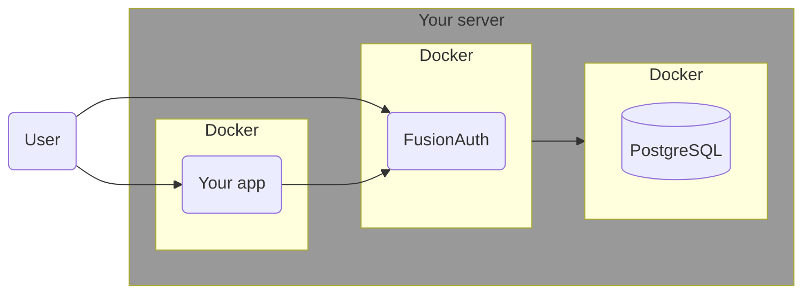
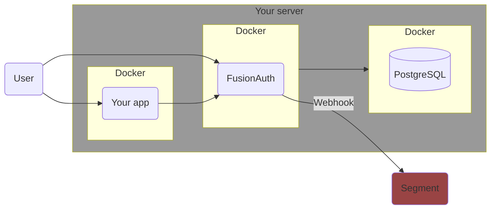

import Aside from 'src/components/Aside.astro';
import IconButton from 'src/components/IconButton.astro';
import Breadcrumb from 'src/components/Breadcrumb.astro';
import InlineField from 'src/components/InlineField.astro';
import InlineUIElement from 'src/components/InlineUIElement.astro';
import Diagram1 from 'src/components/docs/operate/secure-and-monitor/SegmentDiagram1.astro';
import Diagram2 from 'src/components/docs/operate/secure-and-monitor/SegmentDiagram2.astro';

## Todo

- Move this article into docs/Extend? It's not security or monitoring.

## Overview

[Twilio Segment](https://segment.com) is an online service that consolidates information about your users from multiple sources. For instance, you might collect purchasing information from your website, interaction patterns from your mobile app, customer feedback through your support channels, and engagement data from email marketing.

This guide shows you how to send FusionAuth data to Segment. Specifically, when a new user signs up to FusionAuth, they are added to Segment. And for any FusionAuth user whose email address matches an email address in Segment, when the user updates their profile in FusionAuth, the information is sent to Segment.

## Understand The System Design

Running FusionAuth and PostgreSQL in Docker usually looks like the diagram below (you might also run OpenSearch in another Docker container).



In this guide, you will use webhooks to send data from FusionAuth to Segment. This design looks like the diagram below.



## Create A Segment Account

First, register for a Segment account:

- Register for a new workspace at https://segment.com/signup.
- https://app.segment.com.
- <Breadcrumb>Connections - Sources</Breadcrumb>.
- <InlineUIElement>Add source</InlineUIElement>.
- Choose <InlineUIElement>HTTP API</InlineUIElement>. (The API is documented [here](https://segment.com/docs/connections/sources/catalog/libraries/server/http-api)).
- Give it the <InlineUIElement>Name</InlineUIElement> `fa`.
- <InlineUIElement>Add Source</InlineUIElement>.
- Note your <InlineUIElement>Write Key</InlineUIElement>. Keep it secret and do not commit it to GitHub.

## Run FusionAuth

Now run FusionAuth.

- Install [Docker](https://docs.docker.com/get-docker/) if you don't have it on your machine.
- Clone the [FusionAuth example Docker Compose repository](https://github.com/FusionAuth/fusionauth-example-docker-compose) to your computer.
- In your terminal, navigate to the `light` directory in the repo.
- Run FusionAuth with `docker compose up`.
- Browse to http://localhost:9011/admin and check you can log in with `admin@example.com` and `password`.

This FusionAuth installation will already be configured with an API key you can use to call the FusionAuth API as defined in the `kickstart/kickstart.json` file. But in a new installation, you will need to create your own API key. Create an API key by navigating to <Breadcrumb>Settings -> API Keys</Breadcrumb> and clicking the <IconButton icon="plus" color="green" /> button. Enter a <InlineField>Description</InlineField> for the API key and click on the <IconButton icon="save" color="blue" /> button to save the API key. On the API Keys list page, click the red lock <IconButton icon="lock" color="red" /> next to the newly generated key to reveal the key value and copy and save it.

## Write A Service To Monitor FusionAuth

The monitoring overview explains what metadata you can get from FusionAuth. For alerts, you are interested only in errors. Errors are obtained in two places:
- System logs. These cannot be obtained from an [API call](/docs/apis/system#export-system-logs) because FusionAuth writes the system logs to the Docker standard out when running in Docker, instead of to a file. The system logs expose fundamental errors, like FusionAuth missing a database connection.
- Event logs. These contain more complicated errors relating to lambda functions, SMTP, email templates, and webhooks. Event logs can be called through [the Event Logs API](/docs/apis/event-logs#search-event-logs).

Let's write a script that runs every 30 seconds to get the system and event logs from the last 31 seconds. If either set of logs contains an error or an error occurs in getting the logs, an alert will be sent to Segment.

Create a file called `app.sh`. Insert the content below, using your FusionAuth and Segment API keys and Segment channel ID at the top.

```bash
#!/bin/bash

# settings
alertKey="xoxb-something"
alertChannelID="C0T7"
faUrl="http://fa:9011"
faKey="33052c8a-c283-4e96-9d2a-eb1215c69f8f-not-for-prod"

# send an alert if this script errors
trap 'handleError' ERR
handleError() {
  curl -d "text=Monitor cannot connect to FusionAuth" -d "channel=$alertChannelID" -H "Authorization: Bearer $alertKey" -X POST https://Segment.com/api/chat.postMessage
}

# get system logs with error or exception in the last 31 seconds. take first line.
systemLogs=$(docker logs fa --since 31s)
errorLog=$(echo "$systemLogs" | grep -i 'error\|exception' | head -n 1)

# alert Segment if there is an error log
if [ ! -z "$errorLog" ]; then
  curl -d "text=System log has error:  $errorLog" -d "channel=$alertChannelID" -H "Authorization: Bearer $alertKey" -X POST https://Segment.com/api/chat.postMessage
fi

# get event logs with errors in the last 31 seconds
end=$(date +%s)000
start=$(($end - 31000))
params="message=%2A&start={$start}&end={$end}&type=Error"  # %2A is *
url="${faUrl}/api/system/event-log/search?${params}"
eventLogs=$(curl -sS -H "Authorization: ${faKey}" "$url")

# alert Segment if getting event logs failed
if [[ "$eventLogs" != "{\"eventLogs\":"* ]]; then
    curl -d "text=Monitor cannot get event logs" -d "channel=$alertChannelID" -H "Authorization: Bearer $alertKey" -X POST https://Segment.com/api/chat.postMessage
    exit 1
fi

# alert Segment if there is an error log
total=$(echo "$eventLogs" | jq '.total')
if [[ $total -gt 0 ]]; then
  curl -d "text=Event log has error:  $eventLogs" -d "channel=$alertChannelID" -H "Authorization: Bearer $alertKey" -X POST https://Segment.com/api/chat.postMessage
fi
```

The script above first gets system logs by reading the `fa` container's output from Docker (exposed in the Dockerfile `/var/run/docker.sock:/var/run/docker.sock:ro`). If there is any log containing `error` or `exception`, the script uses `curl` to send a message to Segment.

The script then gets the event logs of type `Error` and messages Segment if it finds any. Note that FusionAuth uses milliseconds instead of the epoch standard of seconds, so the script has to append `000` to the normal Unix time.

If any general error occurs while the script runs, the error is caught by `trap` and the script messages Segment.

Create a file called `Dockerfile`. Insert the content below.

```sh
FROM --platform=linux/amd64 alpine:3.19
RUN apk add --no-cache curl nano jq bash docker-cli
COPY app.sh /app.sh
RUN chmod +x /app.sh
CMD watch -t -n 30 /app.sh # run this script every 30 seconds forever
```

Build the container with the command below.

```sh
docker build -f Dockerfile --platform linux/amd64 -t famonimage .
```

Edit your `docker-compose.yml` file and add the `fa_mon` service below.

```yaml
  fa_mon:
    image: famonimage
    container_name: fa_mon
    networks:
      - db_net
    volumes:
      - /var/run/docker.sock:/var/run/docker.sock:ro # allow readonly access to fa docker logs
```

Now run all the containers with `docker compose down; docker compose up`.

To force an error to check whether the service works, run `docker compose down fa`. You should see a message in Segment that the monitor could not reach FusionAuth. If not, debug the script by running it on your physical machine instead of inside Docker with `./app.sh`. Change the FusionAuth URL at the top from `fa` to `localhost` when doing so. If you have trouble calling the FusionAuth API, review the [troubleshooting tips](/docs/apis/#troubleshooting).

### Example Errors

Below are some example errors that the monitoring script will alert you to.

- First, the administrator says he is going to turn off FusionAuth. When the monitor runs, it cannot connect to FusionAuth and alerts Segment.
- Then the administrator starts FusionAuth, but with an incorrect database connection string. Now the monitor can reach FusionAuth, but alerts Segment that FusionAuth fails to return logs when asked.
- Finally, an event log error is shown when a faulty webhook occurs.


## Next Steps

Now that you have a simple way to check that FusionAuth is error-free and alert you if it's not, there are a few ways to make the system more sophisticated.

- Change the monitoring service from a simple bash script to a web service in your favorite programming language. This will improve error handling and make it more easily maintainable for your team.
- Have the monitor check the PostgreSQL container logs in addition to the FusionAuth logs.
- Create a `monitor-up` channel the service writes to every time it runs, so you know it's up. Currently, if the service dies, you'll never know. If you are on a paid Segment subscription, to avoid becoming desensitized to a spam channel that tells you the service is running every 30 seconds, create a workflow that writes to the alert channel if the `monitor-up` channel hasn't received a message in the last minute.
- If you want visibility into the performance of FusionAuth, not just errors, you'll need a comprehensive monitoring service. Please read the FusionAuth guides to Elastic or Prometheus to make one.

## Further Reading

- [FusionAuth metrics](/docs/operate/secure-and-monitor/monitor#metrics)


<InlineUIElement></InlineUIElement>
<Breadcrumb></Breadcrumb>