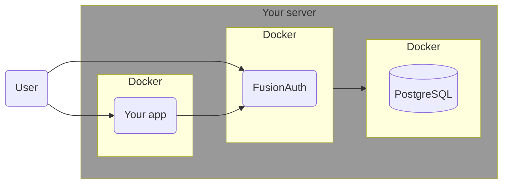
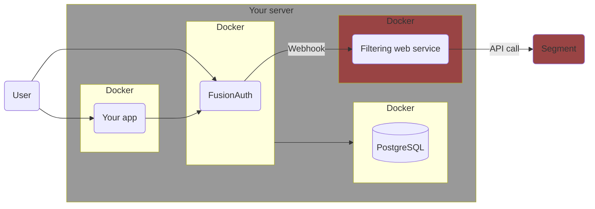

import Aside from 'src/components/Aside.astro';
import IconButton from 'src/components/IconButton.astro';
import Breadcrumb from 'src/components/Breadcrumb.astro';
import InlineField from 'src/components/InlineField.astro';
import InlineUIElement from 'src/components/InlineUIElement.astro';
import Diagram1 from 'src/components/docs/operate/secure-and-monitor/SegmentDiagram1.astro';
import Diagram2 from 'src/components/docs/operate/secure-and-monitor/SegmentDiagram2.astro';

## Todo

- Move this article into docs/Extend? It's not security or monitoring. https://fusionauth.io/docs/extend/examples

## Overview

[Twilio Segment](https://segment.com) is an online service that consolidates information about your users from multiple sources. For instance, you might collect purchasing information from your website, interaction patterns from your mobile app, customer feedback through your support channels, and engagement data from email marketing.

This guide shows you how to send FusionAuth data to Segment. Specifically, when a new user signs up to FusionAuth, they are added to Segment. When the user logs in to FusionAuth, the event is saved in Segment. And for any FusionAuth user whose email address matches an email address in Segment, when the user updates their profile in FusionAuth, the information is sent to Segment.

## Understand The System Design

Running FusionAuth and PostgreSQL in Docker usually looks like the diagram below (you might also run OpenSearch in another Docker container).



In this guide, you will use [webhooks](/docs/extend/events-and-webhooks) to send data from FusionAuth to Segment. Unfortunately, FusionAuth does not allow you to set which events trigger which webhooks. Instead, any event will trigger **all** webhooks. So you have to write an adapter web service that receives the webhook call from FusionAuth, checks what event caused the call, and forwards the appropriate information to Segment. This design looks like the diagram below.



## Create A Segment Account

First, register for a Segment account:

- Register for a new workspace at https://segment.com/signup.
- https://app.segment.com.
- <Breadcrumb>Connections - Sources</Breadcrumb>.
- <InlineUIElement>Add source</InlineUIElement>.
- Choose <InlineUIElement>HTTP API</InlineUIElement>. (The API is documented [here](https://segment.com/docs/connections/sources/catalog/libraries/server/http-api)).
- Give it the <InlineUIElement>Name</InlineUIElement> `fa`.
- <InlineUIElement>Add Source</InlineUIElement>.
- Note your <InlineUIElement>Write Key</InlineUIElement>. Keep it secret and do not commit it to GitHub.

## Run FusionAuth

Now run FusionAuth.

- Install [Docker](https://docs.docker.com/get-docker/) if you don't have it on your machine.
- Clone the [FusionAuth example Docker Compose repository](https://github.com/FusionAuth/fusionauth-example-docker-compose) to your computer.
- In your terminal, navigate to the `light` directory in the repo.
- Run FusionAuth with `docker compose up`.
- Browse to http://localhost:9011/admin and check you can log in with `admin@example.com` and `password`.

TODO DELETE THIS PARAGRAPH This FusionAuth installation will already be configured with an API key you can use to call the FusionAuth API as defined in the `kickstart/kickstart.json` file. But in a new installation, you will need to create your own API key. Create an API key by navigating to <Breadcrumb>Settings -> API Keys</Breadcrumb> and clicking the <IconButton icon="plus" color="green" /> button. Enter a <InlineField>Description</InlineField> for the API key and click on the <IconButton icon="save" color="blue" /> button to save the API key. On the API Keys list page, click the red lock <IconButton icon="lock" color="red" /> next to the newly generated key to reveal the key value and copy and save it.

## Enable Webhooks

- In FusionAuth web interface, browse to Tenants.
- Edit the Default tenant.
- Click the Webhooks tab.
- Enable the webhooks for the events:
  - [x] user.create.complete
  - [x] user.email.update
  - [x] user.login.success
  - [x] user.registration.create.complete
  - [x] user.registration.update.complete
  - [x] user.update.complete
- Click Save at the top right of the page.
- Browse to Settings -> Webhooks.
- Click the + at the top right.
- Enter Id `9a99c2f2-4c3c-4501-8b4f-c394bc896f63`.
- Enter URL `http://fa_seg`.
- Click Save at the top right. All events are enabled by default and you don't need to worry about security because the receiving service will run on the same Docker network as FusionAuth.
- You can click Test on the created webhook now to see example JSON for all the events that will be sent.

## Send FusionAuth Webhook Data To Segment

Write a web service that receives the webhook calls from FusionAuth, filters them by event, and forwards relevant ones to Segment, by following the steps below.

- Create a file called `app.js` in the same directory as your `docker-compose.yml` file from the FusionAuth kickstart example project. You are going to use Node.js for the adapter web service in this guide, but the code is simple enough for you to change it to your favorite language easily.
- Add the content below to `app.js`.
  ```js

  ```
- Edit the `docker-compose.yml` file from the FusionAuth kickstart example project to have the new service below.
  ```yaml
  fa_seg:
    image: segimage
    container_name: fa_seg
    networks:
      - db_net
  ```
- Create the file `Dockerfile` with the content below.
  ```sh
  FROM --platform=linux/amd64 alpine:3.19
  RUN apk add --no-cache curl nano node bash # docker-cli jq
  RUN mkdir /app; cd /app; npm install express;
  COPY app.js /app.js
  CMD /app.js
  ```
- Run
  ```sh
  docker build --no-cache --platform linux/amd64 -t segimage .
  ```


- The Segment API endpoint URL will differ depending on whether you created your workspace in the USA or EU. Either https://events.eu1.segmentapis.com or https://api.segment.io/v1.
- writeKey authentication
  ```sh
	curl --location 'https://api.segment.io/v1/track' \
	--header 'Content-Type: application/json' \
	--data-raw '{
		"event": "happy-path-a3ef8a6f-0482-4694-bc4d-4afba03a0eab",
		"email": "test@example.org",
		"userId": "123",
		"writeKey": "DmBXIN4JnwqBnTqXccTF0wBnLXNQmFtk"
	}'
  ```
- Segment [API returns a successful status code even for most errors](https://segment.com/docs/connections/sources/catalog/libraries/server/http-api/#errors). Check the debugger log on the Segment website if your data is not showing in the Segments events list.


## Next Steps


## Further Reading


<InlineUIElement></InlineUIElement>
<Breadcrumb></Breadcrumb>