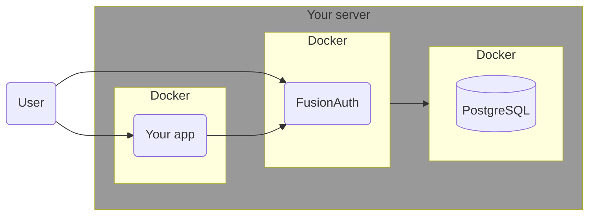
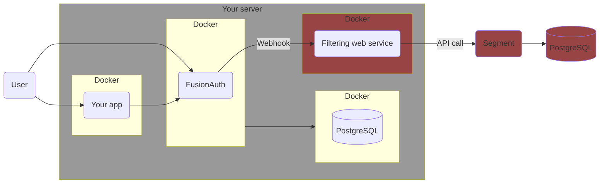
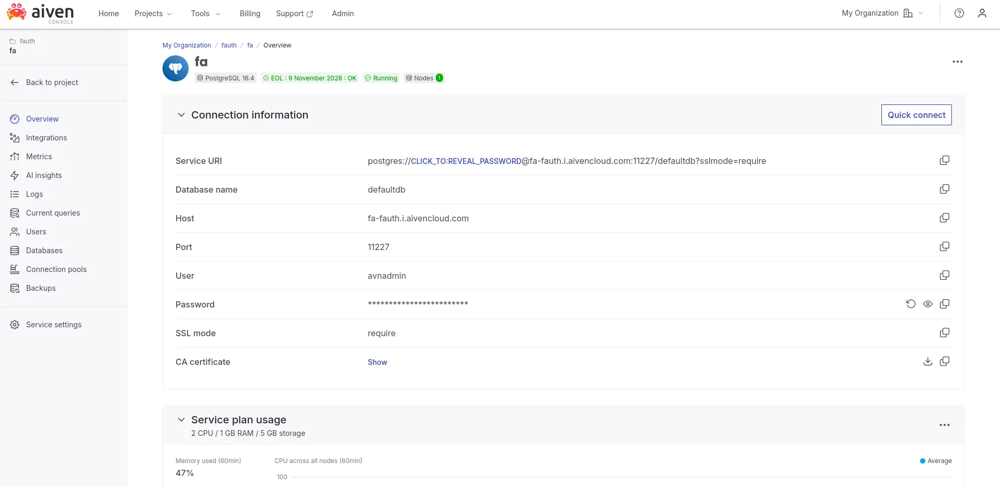
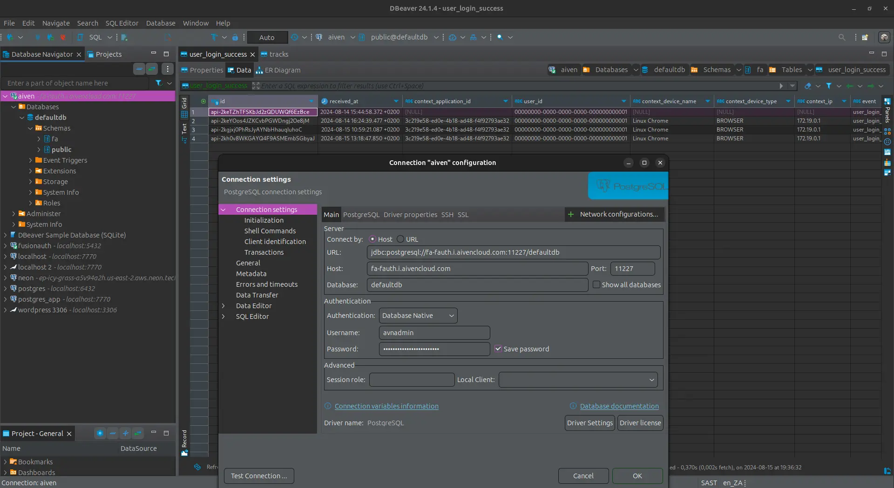
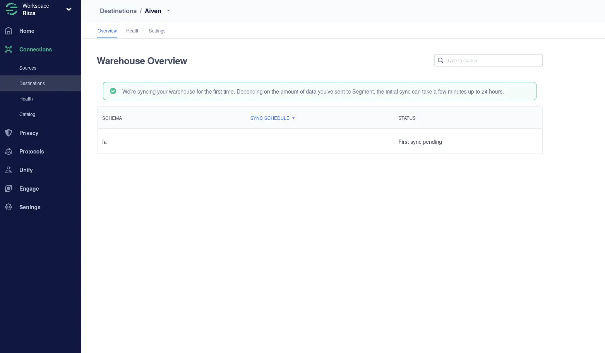

import Aside from 'src/components/Aside.astro';
import IconButton from 'src/components/IconButton.astro';
import Breadcrumb from 'src/components/Breadcrumb.astro';
import InlineField from 'src/components/InlineField.astro';
import InlineUIElement from 'src/components/InlineUIElement.astro';
import Diagram1 from 'src/components/docs/operate/secure-and-monitor/SegmentDiagram1.astro';
import Diagram2 from 'src/components/docs/operate/secure-and-monitor/SegmentDiagram2.astro';

## Todo

- Move this article into docs/Extend? It's not security or monitoring. https://fusionauth.io/docs/extend/examples

## Overview

[Twilio Segment](https://segment.com) is an online service that consolidates information about your users from multiple sources. For instance, you might collect purchasing information from your website, interaction patterns from your mobile app, customer feedback through your support channels, and engagement data from email marketing.

This guide shows you how to send FusionAuth data to Segment. Specifically, when a new user signs up to FusionAuth, they are added to Segment. When the user logs in to FusionAuth, the event is saved in Segment. And for any FusionAuth user whose email address matches an email address in Segment, when the user updates their profile in FusionAuth, the information is sent to Segment.

## Understand The System Design

Running FusionAuth and PostgreSQL in Docker usually looks like the diagram below (you might also run OpenSearch in another Docker container).



In this guide, you will use [webhooks](/docs/extend/events-and-webhooks) to send data from FusionAuth to Segment. Unfortunately, FusionAuth does not allow you to set which events trigger which webhooks. Instead, any event will trigger **all** webhooks. So you have to write an adapter web service that receives the webhook call from FusionAuth, checks what event caused the call, and forwards the appropriate information to Segment.

While Segment stores all the events you sent it, you can't query Segment's store to extract information. Instead, Segment is intended as a communications hub, that receives data from multiple **sources**, filters, adjusts, and merges the data, and sends it to multiple **destinations**. The easiest destination to configure is a PostgreSQL database.

This design looks like the diagram below.



If you already use Segment, you will have your own data warehouse configured, and that's fine. Once you've finished following this guide, using a fresh warehouse for testing, you can add your production warehouse as a destination to the new FusionAuth source.

You're going to follow the following steps in the next sections:
- Create a free cloud-hosted PostgreSQL database.
- Create a Segment account and connect the database as a destination and FusionAuth as a source.
- Create a filtering web service to receive FusionAuth webhooks and forward some event types to Segment.
- Run FusionAuth, create a new user, and log in with that user to test the whole system.

## Create An Aiven.io PostgreSQL database

In this section you'll create a free fresh database to act as a Segment destination. If you already have a server with a public IP address and PostgreSQL installed, you can use that instead.

- Browse to https://aiven.io and click <InlineUIElement>Get started for free</InlineUIElement>.
- Sign up for a new account and create a new database. Follow the wizard to the end and wait for the new database instance to start.
- The screenshot belows a project called <InlineField>fauth</Inlinefield> and a database called <InlineField>fa</InlineField>.
  
- The Aiven overview page shown above lists all the details you need to create a PostgreSQL connection: host, port, database, username, and password. You can test your connection in a cross-platform database IDE like [DBeaver](https://dbeaver.io/download). The details shown in the new connection window below match the ones in the Aiven list above, and will be similar for your database.
- 

This is all you need for a Segment destination.

There are other options, but FusionAuth doesn't recommend them:
- Neon.tech created a database that had connection errors from Segment ("Endpoint ID does not exist").
- Render.com needs you to enter credit card details.
- Google Sheets can be used as a destination, but requires you to manually create multiple mappings between your source event types and the flat format requirement for a spreadsheet. It's far more tedious than using an automated relational database.

## Create A Segment Account

If you don't have a Segment account, register for one:

- Register for a new workspace at https://segment.com/signup.
- Browse to https://app.segment.com.

Add FusionAuth as a source:

- Click <Breadcrumb>Connections -> Sources</Breadcrumb> in the sidebar.
- Click <InlineUIElement>Add source</InlineUIElement>.
- Choose <InlineUIElement>HTTP API</InlineUIElement>. (The Segment API is documented [here](https://segment.com/docs/connections/sources/catalog/libraries/server/http-api)).
- Give it the <InlineUIElement>Name</InlineUIElement> `fa`.
- Click <InlineUIElement>Add Source</InlineUIElement>.
- Note your <InlineUIElement>Write Key</InlineUIElement>. Keep it secret and do not commit it to GitHub.

Add PostgreSQL as a destination:

- Click <Breadcrumb>Connections -> Destinations</Breadcrumb> in the sidebar.
- Click <InlineUIElement>Add destination</InlineUIElement>.
- Choose PostgreSQL
- Add your connection details from Aiven and test the connection.
- Save and continue.



## Create A Filtering Web Service

Now you'll write a web service that receives the webhook calls from FusionAuth, filters them by event, and forwards relevant ones to Segment, by following the steps below.

- Create a file called `app.mjs`. You are going to use Node.js for the adapter web service in this guide, but the code is simple enough for you to easily code it in your favorite language.
- Add the content below to `app.mjs`. Set your `_writeKey` from Segment.
  ```js
  import express from 'express';
  import axios   from 'axios';

  const _writeKey = '8iVzf647lDo07';
  const _apiUrl   = 'https://api.segment.io';

  const app = express();
  app.use(express.json());

  app.post('/', (req, res) => {
      try {
          console.log(`Received event of type: ${req.body.event.type}`);
          if (req.body.event.type == 'user.create.complete') callSegmentIdentify(req.body);
          if (req.body.event.type == 'user.email.update')    callSegmentIdentify(req.body);
          if (req.body.event.type == 'user.login.success')   callSegmentTrack(req.body);
          if (req.body.event.type == 'user.update.complete') callSegmentIdentify(req.body);
          res.send('Event processed');
      }
      catch (error) {
          console.log('Invalid request data');
          console.dir(error);
          res.status(500).send('Internal server error');
      }
  });

  app.listen(80, '0.0.0.0', () => {console.log('Server running on port 80');});

  function convertToDate(timestamp) {
      if (!timestamp) return '';
      return new Date(timestamp).toISOString();
  }

  async function callSegmentIdentify(body) {
      const data = {
          'writeKey': _writeKey,
          'event': body.event.type,
          'userId': body.event.user.id,
          "timestamp": convertToDate(body.event.createInstant),
          "context": {
              'ip': body.event.ipAddress,
              'deviceName': body.event.info.deviceName,
              'deviceType': body.event.info.deviceType,
              'userAgent': body.event.info.userAgent,
          },
          "traits": {
              'data': body.event.data,
              "email": body.event.user.email,
              "firstName": body.event.user.firstName,
              "lastName": body.event.user.lastName,
              'active': body.event.user.active,
              'birthDate': body.event.user.birthDate,
              'connectorId': body.event.user.connectorId,
              'insertInstant': body.event.user.insertInstant,
              'lastLoginInstant': body.event.user.lastLoginInstant,
              'lastUpdateInstant': body.event.user.lastUpdateInstant,
              'memberships': body.event.memberships,
              'passwordChangeRequired': body.event.user.passwordChangeRequired,
              'passwordLastUpdateInstant': body.event.user.passwordLastUpdateInstant,
              'preferredLanguages': body.event.preferredLanguages,
              'registrations': body.event.registrations,
              'tenantId': body.event.user.tenantId,
              'twoFactor': body.event.twoFactor,
              'usernameStatus': body.event.user.usernameStatus,
              'verified': body.event.user.verified,
              'verifiedInstant': body.event.user.verifiedInstant
          },
      };
      await axios.post(`${_apiUrl}/v1/identify`, data, { headers: { 'Content-Type': 'application/json' } })
          .catch(error => console.dir(error));
  }

  async function callSegmentTrack(body) {
    const data = {
        'writeKey': _writeKey,
        'event': body.event.type,
        'userId': body.event.user.id,
        "timestamp": convertToDate(body.createInstant),
        "properties": { /* none yet */ },
        "context": {
            'ip': body.event.ipAddress,
            'deviceName': body.event.info.deviceName,
            'deviceType': body.event.info.deviceType,
            'userAgent': body.event.info.userAgent,
            'applicationId' : body.event.applicationId,
        },
    };
    await axios.post(`${_apiUrl}/v1/track`, data, { headers: { 'Content-Type': 'application/json' } })
        .catch(error => console.dir(error));
  }
  ```
- The Segment API endpoint URL might differ depending on whether you created your workspace in the USA or EU. Either https://events.eu1.segmentapis.com or https://api.segment.io/v1.

The code above has three important functions:
- An Express.js POST method that listens to all incoming FusionAuth webhooks, but responds only to ones you care about, like the line: `(req.body.event.type == 'user.create.complete') `
- `callSegmentIdentify()`, which calls the Segment `identify` method to update user information. The call is made only FusionAuth update completed webhooks.
- `callSegmentTrack()`, which calls the Segment `track` method to associate an event with user. In this script you're tracking only logins, but you could add any event you want.

If you want to test sending an event to Segment manually, you can run the curl command below, using your `writeKey`.
  ```sh
  curl --location 'https://api.segment.io/v1/track' \
  --header 'Content-Type: application/json' \
  --data-raw '{
    "event": "happy-path-a3ef8a6f-0482-4694-bc4d-4afba03a0eab",
    "email": "test@example.org",
    "userId": "123",
    "writeKey": "DmBXIN4JnwqBnTqXccT"
  }'
  ```

Segment [API returns a successful status code even for most errors](https://segment.com/docs/connections/sources/catalog/libraries/server/http-api/#errors). Check the debugger log on the Segment website if your data is not showing in the Segments events list.

## Run FusionAuth

Now that Segment is prepared and you have a script to send events, you can finally start FusionAuth and begin testing.

TODO here down:

- Install [Docker](https://docs.docker.com/get-docker/) if you don't have it on your machine.
- Clone the [FusionAuth example Docker Compose repository](https://github.com/FusionAuth/fusionauth-example-docker-compose) to your computer.
- In your terminal, navigate to the `light` directory in the repo.
- You will work in this directory for the rest of this guide, creating files and running terminal commands.
- Edit the `docker-compose.yml` file from the FusionAuth kickstart example project to have the new service below.
  ```yaml
  fa_seg:
    image: segimage
    container_name: fa_seg
    networks:
      - db_net
  ```
- Create the file `Dockerfile` with the content below.
  ```sh
  FROM --platform=linux/amd64 alpine:3.19
  RUN apk add --no-cache curl nano node bash # docker-cli jq
  RUN mkdir /app; cd /app; npm install express;
  COPY app.js /app.js
  CMD /app.js
  ```
- Run
  ```sh
  docker build --no-cache --platform linux/amd64 -t segimage .
  ```

## Enable Webhooks

- Run `docker compose up` to start FusionAuth and the webhook service.
- Browse to http://localhost:9011/admin and check you can log in with `admin@example.com` and `password`.
- In FusionAuth web interface, browse to Tenants.
- Edit the Default tenant.
- Click the Webhooks tab.
- Enable the webhooks for the events:
  - [x] user.create.complete
  - [x] user.email.update
  - [x] user.login.success
  - [x] user.update.complete
- Click Save at the top right of the page.
- Browse to Settings -> Webhooks.
- Click the + at the top right.
- Enter Id `9a99c2f2-4c3c-4501-8b4f-c394bc896f63`.
- Enter URL `http://fa_seg`.
- Click Save at the top right. All events are enabled by default and you don't need to worry about security because the receiving service will run on the same Docker network as FusionAuth.
- You can click Test on the created webhook now to see example JSON for all the events that will be sent.


## Next Steps

 docker build -t segimage .; docker rm segbox; docker run -it -p 80:80 --name segbox segimage bash;
 http://host.docker.internal
 http://fa_seg
 node /app/app.mjs

  clear; curl -v --location 'https://api.segment.io/v1/track'   --header 'Content-Type: application/json'   --data-raw '{
      "event": "user.login.success",
      "userId": "00000000-0000-0000-0000-000000000001",
      "writeKey": "8iVzf6"
  }'


## Further Reading


<InlineField></Inlinefield>
<InlineUIElement></InlineUIElement>
<Breadcrumb></Breadcrumb>