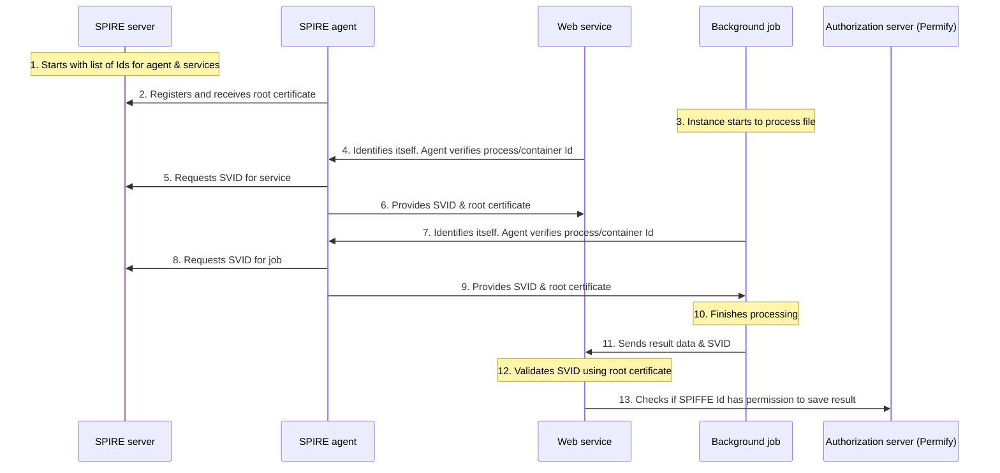
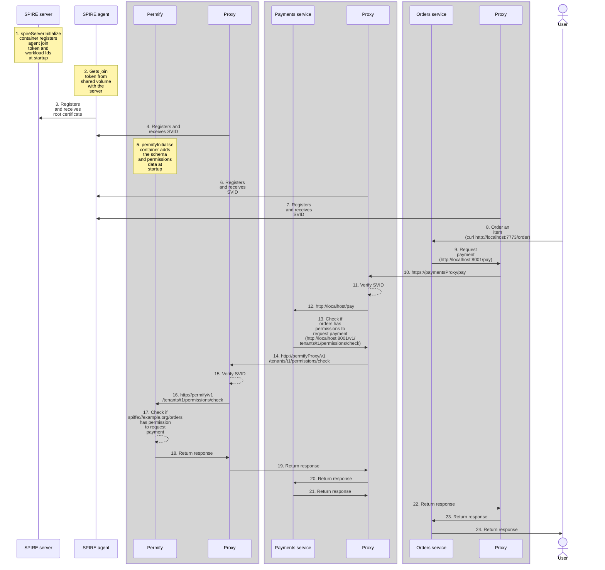

import RemoteCode from 'src/components/RemoteCode.astro';
import Aside from 'src/components/Aside.astro';


This guide shows you how to combine Permify for authorization (permissions) with SPIFFE for authentication (identity) to allow services in your organization to communicate with trust. You'll learn how SPIFFE works and run a functional example project using some JavaScript microservices in Docker.

<Aside type="note">
[SPIFFE](https://spiffe.io/docs/latest/spiffe-about/overview), the Secure Production Identity Framework For Everyone, is a protocol that allows a microservice to authenticate itself to other microservices, without using a shared password or fixed network address.
<br />
[SPIRE](https://spiffe.io/docs/latest/spire-about/spire-concepts) is an open-source implementation (an actual application) of the SPIFFE specification that provides the authentication certificates to the microservices.
</Aside>

If you've used SPIFFE before, you can skip over the explanation of how it works and head straight to the [example Permify application](#a-microservice-example-with-spire-permify-envoy-and-docker).


## How Did Auth Work Before SPIFFE?

Before the rise of cloud computing and Docker containers (**cloud native** systems), your software system might have been a database, some background jobs, and some web services running on a couple of corporate servers. How did a web service know if a background job had permissions to save information to the database?

There were a few options.
- **Network Rules**: The web service would allow any job that calls from a specific IP address on the network.
- **A Password, API key, or SSH key**: The job would send a secret token with its request to the web service. (For SSH, the job would create a tunnel to the service, but the effect was the same.)
- **Mutual Transport Layer Security (mTLS) X.509 Certificates**: This approach was similar to a password, except the job would first request a TLS certificate from a certification server using the password, then send that certificate to the web service instead of the password.
- **Kerberos**: This was a complicated system, but basically the job would use its password to request a short-lived ticket from the Kerberos server, which the job would then pass to the web service, which would verify the ticket using the service's private password (which Kerberos already had).


## What Are the Problems with Early Auth?

The options above had problems.
- **Conflation of Authorization and Authentication**: The previous headings used the abbreviation **auth** instead of using **authentication** (proving identity) and **authorization** (proving permissions) separately. In fact, early systems often conflated authentication and authorization. Sending a password to a service provides authentication, but then the web service itself has to know which permissions a job has (authorization). It was possible for the web service to use the received username from the job to query an external authorization server, but many systems didn't reach this level of complexity.
- **Dynamic Network Addresses**: A cloud system with hundreds of stopping and starting containers constantly has new IP addresses, across multiple networks. This is normal when using automated load balancing systems like Docker Swarm and Kubernetes. However, with such systems, it is impossible to use network rules for authentication, since location is no longer static.
- **Slow Speeds**: Container churn also causes speed problems. Recreating TLS certificates or requesting Kerberos authorization can be slow in older systems. Kerberos cryptography also relied on closely synchronized machine clocks. If clocks drifted, errors occurred. Solving this problem required a new, robust protocol that could handle container boot authentication in milliseconds.
- **Password Security Management Risks**: All the password-based authorization systems stored passwords on disk in a configuration file, which poses a security risk. If a hacker gains access to a password, she can use it to endlessly generate new security certificates or tickets. Similarly, certificates are generally long-lived. Companies maintained certificate revocation lists (CRLs), but if security compliance was poor, programmers would ignore the lists. Trying to improve password security by instead using certificates is an example of the **secret zero** problem. No matter how many layers you use, you eventually need to hard-code a password somewhere that your service can access to obtain a certificate.

In summary, SPIFFE was designed to overcome the following challenges:
- Separating authorization and authentication.
- Dynamic locations.
- Storing secrets.
- Long-lived authentication.
- Slow speeds.


## A Brief SPIFFE Example

The following example demonstrates how SPIFFE solves the problems above.

### The Components

This example involves four components:
- The background job.
- The web service the job wants to call.
- A SPIRE server.
- A SPIRE agent (client).

### The Process

1. The SPIRE server starts, and is given a list of Ids for the SPIRE agent and services that want to register to use SPIFFE.
1. The SPIRE agent starts. It already has access to the server where the services run, so it registers itself with the SPIRE server and gets the certificate of the SPIRE server.

    This certificate is the root of all trust from now on, and allows services and agents to verify service Ids without calling the SPIRE server again.

1. An instance of the background job starts to process a file.
1. When the job starts and needs its identity, it calls the SPIRE agent.
1. The SPIRE agent then does the following, in order:
    - It checks the identity of the calling process (for example, through its process Id or Docker container label). 
    - It requests a SPIFFE Verifiable Identity Document (an **SVID**) from the SPIRE server on the job's behalf. (The SVID is like a passport for the job.)
    - It receives an X.509 certificate (or JWT) from the server. (The server returns this extremely quickly.)
    - It returns this certificate to the background job, and the SVID identifies the job with an identifier like `spiffe://example.org/infrastructure/file-processor`. (The `example.org` portion is the **trust domain**, a label for your organization or environment that all workloads in the same SPIRE deployment share.)
    - It also gives the service the SPIRE server certificate.

1. The job finishes executing and wants to send its result to the web service. The job calls the service, sending the service both the result data and its SVID, which it uses to authenticate itself.
1. When the service receives the request from the job, it can check the SVID validity internally using the SPIRE server certificate and any library that handles TLS cryptography (such libraries are available for any programming language). This validation method means the service doesn't need to call the SPIRE agent or server.
1. The service has now authenticated the job, but has not authorized it. SPIFFE doesn't handle authorization at all, so the service calls an authorization server (like Permify) to check if the job with the Id `spiffe://example.org/infrastructure/file-processor` has permission to save its result.

The following diagram represents this process.




## How Does SPIFFE Solve Authentication Problems?

You may have noticed some clear ways this SPIFFE example differs from older authorization protocols:

- **No Authorization**: SPIFFE handles only authentication. It completely ignores which permissions a service might have. Permissions must be handled elsewhere. This mandates a clear separation of concerns.
- **Authentication by Attestation**: Services don't have to keep passwords anymore. Instead, a SPIFFE agent running on the same machine as the service (or on the Docker host) physically checks the process and user Ids of the service at the operating system level. This is called **attestation**.
- **Speed**: After attestation, the agent obtains a short-lived **SVID** (usually an X.509 certificate, but could be a JWT) for the service from the SPIFFE server very quickly. Refreshing an SVID is also fast. The agent doesn't need to contact the SPIFFE server to verify an SVID, which reduces network use.
- **Location Independence**: Since the SPIFFE agent runs on the same machine as the service, that machine can be anywhere on the network with any IP address. As long as the SPIFFE agent knows the address of the SPIFFE server and can complete node attestation, it can obtain SVIDs for any services running on that machine.
- **Short-Lived SVIDs**: SVIDs are quick to generate, so refreshing them frequently doesn't incur any cost. This eliminates the need for certificate revocation lists.

Switching to SPIFFE frees your programmers from having to manage secrets, massively reduces the risk of a hacker gaining access to your network or service password (since there isn't one), increases authentication speed and simplicity, and scales to any number of containers in any number of locations.


## SPIFFE Terminology and Some More Detail

Now that you know the basics of SPIFFE, there are a few more details to learn in order to understand the practical example that follows.


### Workloads and Services

With SPIFFE, services and jobs are called **workloads**. A workload might be a database, a web service, a bash script, or an entire external company's system wrapped in a single SVID. A workload is any instance of an app that does some work. (This guide refers to an app "instance" because a single app might be running dozens of times as different containers.)

The word workload is confusing at first because the word's standard meaning is a "set of tasks" and not a "doer of tasks." So you can think of a workload as a "service" if you prefer. But technically, a workload is more varied than a service. A "service" implies other services can call it, which is not possible with a bash script, for example.


### Humans Aren't Workloads (Except When They Are)

SPIRE attests the identity of a workload by verifying its details at the operating system level. This implies that any entity that needs a password to identify itself cannot be attested by SPIRE. So for example, a human that logs in with a password cannot be given an SVID.

However, in addition to attestation, you can configure SPIFFE to accept and exchange tokens from other authentication providers. For example, a human could log in to any system that returns an OIDC token (like FusionAuth, Facebook, or Keycloak), and then use that token to obtain an SVID from the SPIRE server. From then on, the human could pretend to be a workload, which might be useful for running debugging commands.

The possibilities here are complex: allowing multiple federated SPIRE servers, inter-company SPIRE trust, and chains of authentication between SPIRE and other identity providers. This guide won't discuss these possibilities, but if your company needs flexible authentication, SPIFFE can probably handle it.


### What Can Be a Workload?

SPIRE can attest the following types of workloads.

- **Linux Processes**: Identified by user Id (UID), group Id (GID), or the file path of the binary (for example, `/usr/bin/python3`).
- **Docker Containers**: Identified by image Id, container labels, or environment variables.
- **Kubernetes Pods**: Identified by namespace, service account, or pod labels.
- **Systemd Services**: Any background service managed by systemd (like a database or web server), identified by their specific service unit name.
- **Cloud Instances**: A whole VM in AWS, Azure, or GCP, usually identified by instance identity document (IID).
- **OIDC**: For example, FusionAuth and many other authentication gateways.

These mechanisms of workload attestation are called **selectors** in the SPIRE server configuration.

Through its plugin architecture, SPIRE can also validate and exchange external credentials for SVIDs, such as OIDC tokens (for example, from FusionAuth, Facebook, or Keycloak), legacy Kerberos tickets, or SSH keys.

HashiCorp Vault (a secret store) used to be just another workload accessible with SVIDs, but as of the end of 2025, it is now a SPIFFE server implementation itself (like SPIRE). Similar secrets services, like OpenBao, Infisical, and Conjur, can accept SVIDs but not generate them.


### Control Plane

Programmers comply with the separation of concerns principle by dividing code into layers for UI, logic, and data access. Similarly, you can divide system architecture into separate "planes". SPIRE works on the **control plane**, where it governs who can talk to whom. The data actually passed around by the workloads is part of the **data plane**.


## A Microservice Example with SPIRE, Permify, Envoy, and Docker

To run the example system accompanying this guide, you need to have [Docker](https://docs.docker.com/engine/install) installed. All components and services are run safely isolated inside Docker, and cannot access the files on the rest of your computer.

➡️ Use Git to clone the example <a href={frontmatter.repository}>repository</a>, or download and unzip it.

➡️ Open a terminal in the repository directory and run the command below.

```console
docker compose up
```

<Aside type="note">
To restart the project, run `docker compose down -v` before running `docker compose up` again. If you restart with `docker compose up` alone, the SPIRE agent will fail to connect because its cached trust bundle no longer matches the server's new certificate.
</Aside>

➡️ Once all containers are running, open a new terminal and run the commands below to test authentication and authorization from end to end.

```console
curl http://localhost:7773/order  # allowed

curl http://localhost:7775/audit  # denied
```

The request to the orders service above triggers a call to the payments service. The payments service calls Permify with the orders service's SPIFFE Id to see if orders is authorized to request a payment. Permify says the orders service has permission, so the payments service prints `allowed`.

The second request, to the audit service, also triggers a call to the payments service. This time Permify does not find any permissions for the audit service to make requests to the payments service, and denies the request.

<Aside type="note">
To completely remove the Docker volumes and images, run the command below.

```console
docker compose down -v
docker rmi ghcr.io/spiffe/spire-server:1.14.4
docker rmi ghcr.io/spiffe/spire-agent:1.14.4
docker rmi ghcr.io/permify/permify:v1.6.8
docker rmi denoland/deno:alpine-2.7.11
docker rmi envoyproxy/envoy:v1.37.2
```
</Aside>


## Example System Overview

This section, and the following ones, describe how the example system works, and which alternative choices you might make in your system.

The example Docker Compose file has containers for a SPIRE server, a SPIRE agent, and Permify, as well as three TypeScript services: Payments, Audit, and Orders. Every container except the two SPIRE containers also has a corresponding proxy container running Envoy.

The following diagram depicts the full process. You can refer to it as you read the explanation of each section in the rest of the guide.




<Aside type="tip" title="Docker, Kubernetes, and cloud providers">
Using Docker is the best way to show a minimal example like this one. It's easy to run, and you can see exactly how each component is linked in the Compose file. However, most companies run SPIFFE in Kubernetes (through [Istio](https://istio.io)) or using the native identity services of the big three cloud providers (AWS, Azure, and GCP). While Docker is simpler in general than the other options, it is actually more complicated to use Docker for SPIFFE than it is to use Kubernetes.

- **Workload Attestation**: Docker requires manual "join token" management, whereas Kubernetes uses automatic API-based attestation.
- **Request Routing**: Services in Docker need manual path routing (Envoy cannot do this dynamically). Istio can handle transparent dynamic proxying from service to service.
- **Sockets**: Docker SPIRE agents need manual socket management for communication. Kubernetes doesn't.
- **Sidecars**: In Docker, each service needs an Envoy sidecar container with a configuration file. Kubernetes doesn't have the same requirement.

Since you probably won't use Docker in production, this guide won't discuss configuring proxies in Envoy and Docker. You should rather spend time investigating Istio, or SPIFFE in your cloud provider, once you understand the fundamentals of SPIFFE presented here.
</Aside>


## Example SPIRE Configuration

The following code shows the first section of the Compose file, handling SPIRE.

<RemoteCode
    url={frontmatter.codeRoot + "/docker-compose.yml"}
    lang="yml"
    tags="a" />

All the containers are on the `spireNetwork` network so they can talk to one another.

The named volumes, `serverBin` and `agentBin`, expose the SPIRE binary files from the server and agent containers for other containers to use. Since the SPIRE containers do not have a shell (`sh` or `bash`), you need to interact with the containers (such as performing setup commands) from somewhere else. For example, the `spireServerInitialize` container uses the binary files from the server to register workloads. If the binary files were not exposed, you would have to install the SPIRE binaries on your host machine and run the setup commands from your host after starting Docker.

The `spireServer` container itself uses two more volumes: **a configuration file** and the named volume, **sockets**:

1. The `config/spireServer.conf` configuration file (shown below this bullet point) specifies a few basic settings:
  - `bind_address = "0.0.0.0"` ensures the server listens to requests from outside the container.
  - `socket_path` must match the socket path in the Compose file.
  - `DataStore` and `KeyManager` settings tell the server where to manage its data.
  - `NodeAttestor "join_token"` is important. This allows the SPIRE agent to register itself with the server, so it can begin authorizing workloads.
  <RemoteCode
    url={frontmatter.codeRoot + "/config/spireServer.conf"}
    lang="js" />
2. A socket is a shared file on disk that processes can use to communicate. Unlike a TCP port, which any process can call, only a process with permission to a file can see it, making a socket more secure than a port. A process can also ask the operating system for details about the process on the other end of a socket, allowing SPIRE to perform attestation. The socket files are shared in the named volume, `sockets`. Before the `spireServer` container starts, an ephemeral container (`createSocketsNamedVolumeWithCorrectPermissions`) runs to set permissions on the shared `sockets` volume (named volumes are created owned by root, and SPIRE needs to write into the directory).

    The `spireServerInitialize` container uses the `registration.sock` socket. This helper container's only job is to create registration entries in the server for the agent and workloads. The first two entries register the agent (with Id `spiffe://example.org/agent`) and create a "join token" — a secret password exposed in a shared volume that the SPIRE agent can give to the server to authenticate itself when starting. The next four registration entries for the services and Permify don't need tokens, because the agent will authenticate them. Note that the SPIFFE Id domain name, like `example.org`, matches the domain in the server configuration file.

The SPIRE agent's configuration is simpler than the server, using only the following command:

```console
command: ["run", "-config", "/etc/spire/agent.conf", "-joinTokenFile", "/opt/spire/sockets/agent_token"]
```

This command configures the agent using `spireAgent.conf` (shown below) and authenticates the agent with the SPIRE server using the shared join token created earlier.

<RemoteCode
    url={frontmatter.codeRoot + "/config/spireAgent.conf"}
    lang="js" />

- `insecure_bootstrap = true` tells the agent to trust the identity of the SPIRE server, which saves time in this example. You should **not** do this in production, as a malicious service could masquerade as the server; rather, manually pass the server's certificate into the agent at initialization.
- `docker_socket_path = "unix:///var/run/docker.sock"` tells the agent where to find the Docker socket (which, in turn, is exposed to the container in the Compose file in the line, `/var/run/docker.sock:/var/run/docker.sock:ro`), which the agent can query to attest the identity of the various services running as Docker containers.
- `NodeAttestor "join_token"` tells the agent to use the join token to authenticate itself with the server.


## Example Permify Configuration

There are three Permify containers shown below: `permify`, `permifyHealthcheck`, and `permifyInitialize`.

<RemoteCode
    url={frontmatter.codeRoot + "/docker-compose.yml"}
    lang="yml"
    tags="b" />

The Permify container has default settings.

The `permifyHealthcheck` container is necessary because the Permify image has no native health check for Docker and no shell in which to run commands. So to check when Permify is ready, the health check container runs a shell script that exits only when `http://localhost:3000/healthz` responds successfully.

The `permifyInitialize` container runs a script to configure the Permify schema and data for the services in the rest of the Docker Compose file. (This script could be moved into `permifyHealthcheck` if you wanted fewer containers.) The script itself, `permifyInitialize.ts`, is two JavaScript HTTPS calls to the Permify container. It sends the following Permify JSON schema:

```json
entity user {} // compulsory but does nothing

entity service {
    relation mayDebit @service
    action debit = mayDebit
}
```

In this schema, the services (audit, orders, and payments) are not independent entities. Instead, they are each of the `service` entity type shown above. The `action` (or `permission`) `debit` is available on all services, which the payments service uses to know whether another service may debit. However, in Permify, an entity may not be given a direct permission. Instead, an entity can only be set as a relation to another entity. In other words, fine-grained authorization (FGA) is achieved through relationship-based access control (ReBAC). So this schema must have the `mayDebit` relation available, in addition to the `debit` action. The `mayDebit` relation acts as a list of services that may perform the `debit` action on another service.

To add the orders service's actual SPIFFE Id, the initialization container adds the following datum to Permify.

```js
tuples: [{
    entity: { type: "service", id: "spiffe:__example.org_payments" },
    relation: "mayDebit",
    subject: { type: "service", id: "spiffe:__example.org_orders" },
}],
```

This code says that the orders service, identified by `spiffe:__example.org_orders` and of the `service` type, has the `mayDebit` relation on the payments service. The SPIFFE Ids shown above are unusual. The format of the official Id in SPIRE is `spiffe://example.org/orders` (note the `/` instead of `_`). Since Permify does not allow `/` as an Id character, the payments service (shown later) replaces the `/` characters before sending the Id to Permify.

There is a practical problem with the schema above. If your system has many services with many different permissions, the `service` entity will be filled with hundreds of permissions across dozens of services, and be difficult to read and maintain. Instead, you can model each service as its own entity, with its permissions grouped inside. That hypothetical model would look like the following for this example's three services.


```json
entity user {}

entity auditService {
	relation isAuditor @user
    relation isManager @user

    action audit        = isAuditor
    action requestAudit = isManager
}

entity ordersService {
	relation isClient @user

	action createOrder = isClient
    action editOrder  = isClient
}

entity paymentsService {
	relation isAuditService @auditService
    relation isOrdersService @ordersService
    relation isManager @user

	action debit = isOrdersService
    action view  = isAuditService or isManager
}
```

Now in `paymentsService`, the `spiffe:__example.org_orders` Id will be a member of the `isOrdersService` relation, and so will have rights to the `debit` action. You would create that datum as follows (only the `relation` value has changed from the original example):

```json
[
	{
		"entity": { "type": "paymentsService", "id": "spiffe:__example.org_payments" },
		"relation": "isOrdersService",
		"subject": { "type": "ordersService", "id": "spiffe:__example.org_orders" }
	}
]
```

In production, you should use a persistent volume to save Permify data to disk, and not an initialization container that rewrites the schema and objects on every run.


## Example Envoy Sidecar Configuration

At this point you might think that using Docker for microservices and SPIFFE is simple enough for a basic system. That changes once you start trying to configure workloads to actually integrate SVIDs and talk to the SPIRE agent.

There are three design options for authenticating your workload.
1. **Add Logic To Handle SVIDs (X.509) to Your Workloads Directly**: For this approach, your programming language has to support X.509, and something needs to copy into the container the workload's SVID (from the agent) and the server root certificate (for SVID validation). This has the following problems.
   - Control plane logic is mixed into the data plane (violating separation of concerns).
   - Some languages (like a simple bash script) can't handle X.509.
   - You're going to need a support (sidecar) container that has access to the SPIRE server, agent, and workload containers to copy around certificates (making permissions management tricky).
2. **Use a Simple Sidecar Proxy, like [Ghostunnel](https://ghostunnel.dev/docs/spiffe-workload-api), for Every Workload**: In this design, the workload knows nothing about SPIRE. Instead, the design uses a proxy container for every workload, and SPIRE treats the proxy as the object to be authenticated instead of the workload. The agent attests the proxy's identity and gives the proxy an SVID certificate. The proxy automatically wraps every request from the workload with HTTPS using the SVID, and checks every incoming request's SVID, which enables mutual transport layer security (mTLS).

    Since Ghostunnel handles incoming and outgoing requests differently, you'll need to use one container with two instances of Ghostunnel running, as shown below in an example sidecar proxy for the orders service. Since Ghostunnel supports SPIFFE natively, this solution is as simple as adding the `--use-workload-api` flag. However, Ghostunnel does not pass the HTTPS details (the SVID certificate) to the target workload, so there is no way for a service to get the SPIFFE Id of the service that called it. No SPIFFE Id means no way to check permissions in Permify. For simple microservice systems that need authentication but not authorization, use Ghostunnel.
    ```yml
      ordersProxy:
    image: ghostunnel/ghostunnel:v1.9.2-alpine
    container_name: ordersProxy
    labels:
      app: "orders"
    volumes:
      - ./spire/sockets:/opt/spire/sockets:ro
    environment:
      - SPIFFE_ENDPOINT_SOCKET=unix:///opt/spire/sockets/agent.sock
    entrypoint: ["/bin/sh", "-c"]
    command:
      - |
        while [ ! -S /opt/spire/sockets/agent.sock ]; do sleep 1; done
        ghostunnel server \
          --listen 0.0.0.0:8443 \
          --target localhost:8000 \
          --use-workload-api \
          --allow-all &
        exec ghostunnel client \
          --listen 127.0.0.1:8001 \
          --target payments:8443 \
          --use-workload-api \
          --override-server-name spiffe://example.org/payments \
          --verify-uri spiffe://example.org/payments
    depends_on:
      orders:
        condition: service_started
    pid: "service:spireAgent"
    network_mode: "service:orders"
    ```
3. **Use [Envoy](https://www.envoyproxy.io/docs/envoy/v1.37.2/configuration/configuration) as a Proxy (or Switch to Kubernetes and Istio)**: Envoy is the design used in this guide. It works as a proxy in the same way as Ghostunnel, but is a leap in complexity, requiring large configuration files. Envoy automatically handles all SVID management, mTLS checking, and can forward SPIFFE Ids to the workloads.

Below is the example Compose file section for the `permifyProxy` container running Envoy. Every other workload has an almost identical container: `ordersProxy`, `auditProxy`, and `paymentsProxy`.

<RemoteCode
    url={frontmatter.codeRoot + "/docker-compose.yml"}
    lang="yml"
    tags="c" />

The `labels:  app: "permify"` section is crucial. This tells Docker the type of service that the container identifies as. The SPIRE agent checks this label when using Docker for attestation.

The proxy needs to run as part of the same network as the workload to handle requests: `network_mode: "service:permify"`. The Envoy configuration files also do static routing. Below is an example.

```yml
- name: egressService
domains: ["*"]
routes:
    - match:
        prefix: "/"
    route:
        cluster: paymentsCluster
        host_rewrite_literal: "payments"
```

Here, all requests from the workload ("egress") are routed to the `payments` container. You could use other paths, like `/orders`, to add new routes. But it is impossible to dynamically route a request from a workload to another workload without manually adding a path and rewrite setting. This is another reason that although Kubernetes is far more complicated than Docker, it is a better choice in the long term.


## Example Workload Configuration

The workloads are the easiest part of the system to configure, since you've already done all the SPIRE work. Below is an example configuration for the payments service.

<RemoteCode
    url={frontmatter.codeRoot + "/docker-compose.yml"}
    lang="yml"
    tags="d" />

The service communicates with the proxy using localhost (`- permifyUrl=http://localhost:8001`), as the proxy shares the service's network. The path routing shown earlier decides where service requests go.

In this example, the three workloads are simple JavaScript web services. Below is the payments service code with only two functions: an HTTP request handler and `checkPermissionInPermify`.

<RemoteCode
    url={frontmatter.codeRoot + "/services/payments.ts"}
    lang="js" />

The request handler extracts the caller's SPIFFE Id from the request (`req.headers.get("spiffeId")`). The check permissions function uses the handler to call Permify (`${permifyUrl}/v1/tenants/t1/permissions/check`), remembering to replace the Id slashes with underscores: `id: callerId.replace(/\//g, "_")`.

The code for the orders and audit services is even simpler. As they only send requests, they have no SPIFFE code at all, and are each merely a single small function to call the payments service.


## Summary and Next Steps

In this guide you learned that SPIFFE is an excellent tool for simplifying your microservice architecture by avoiding passwords. You can integrate Permify for authorization with SPIRE for authentication by replacing the `/` in SPIFFE Ids with `_`.

Model large systems in Permify schemas with a separate entity and permissions for each service, as below.

```json
entity paymentsService {
	relation isAuditService @auditService
    relation isOrdersService @ordersService
    relation isManager @user

	action debit = isOrdersService
    action view  = isAuditService or isManager
}
```

Handle the control plane and mTLS logic in a proxy outside of your workloads.

If you want to build a small system, you can extend the example repository in this guide and continue using Envoy. But for most use cases, switching to Kubernetes is ultimately less complex over the long term. Check out [Istio](https://istio.io/latest/docs/overview/what-is-istio) to learn more.

To learn how to model permissions in Permify, see the [documentation](/permify-docs/permify-overview/intro). Finally, if you want to include users as well as services in your design, consider managing them with [FusionAuth](/docs), the partner application to Permify that handles user authentication.
