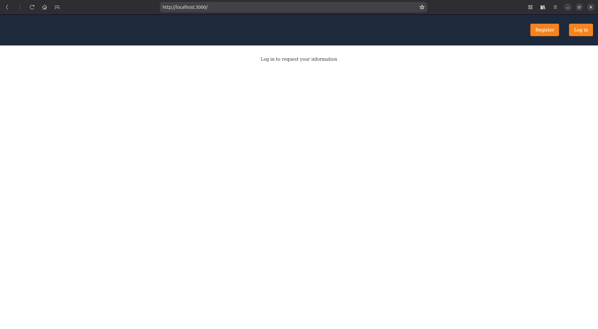

import Aside from '/src/components/Aside.astro';
import DockerSpinup from '/src/components/quickstarts/DockerSpinup.astro';
import DownloadWidget from 'src/components/download/DownloadWidget.astro';
import HostedBackendWarning from 'src/content/docs/_shared/_hosted-backend-warning.md';
import {RemoteCode} from '@fusionauth/astro-components';

## Overview

FusionAuth enables you to easily add login, registration, single sign-on (SSO), and multifactor authentication (MFA) to your app. This quickstart is your first step in discovering just how easy that can be.

You’ll create a simple React application, add login, and display user details. You’ll also install and run a local instance of FusionAuth — all in 15 minutes.

Only a static web server will be used, as FusionAuth provides a [hosted backend](https://fusionauth.io/docs/apis/hosted-backend) for purely frontend apps.

## Prerequisites

[Docker](https://www.docker.com) is all you need to run FusionAuth and the React app.

If you prefer to run Node version [22](https://nodejs.org/en) directly on your computer, you can use that to run the React app.

If you want to view the final app created in this tutorial, you can download [the repository](https://github.com/ritza-co/fusionauth-quickstart-javascript-react-web/draft_overhaulReactQuickstart), but it is not necessary.

You need no particular skills to follow this tutorial, but the explanations assume you have basic familiarity with developing single page apps in JavaScript.

## Create A React App With No Authentication

Let's start by creating a React app with no authentication. It will consist of three components:
- `index.tsx`, which is a container for the app and provides routing from one page to another.
- `home.tsx`, which is the login page.
- `account.tsx`, which shows the logged-in user's details.

▶️ Create `index.html` with the content below.

<RemoteCode url="https://raw.githubusercontent.com/ritza-co/fusionauth-quickstart-javascript-react-web/draft_overhaulReactQuickstart/1_noAuthentication/index.html" lang="tsx"/>

All this file does is load the React app found in `src="/index.tsx"`, which you'll create next.

▶️ Create `index.tsx` with the content below.

<RemoteCode url="https://raw.githubusercontent.com/ritza-co/fusionauth-quickstart-javascript-react-web/draft_overhaulReactQuickstart/1_noAuthentication/index.tsx" lang="tsx"/>

This landing component creates and `App` component that routes `/account` to the account component, and `/` and all other URLs to the home component. The code then uses React to insert the app into the page as the `root` element.

Next, let's create the home and account pages.

▶️ Create `home.tsx` with the content below.

<RemoteCode url="https://raw.githubusercontent.com/ritza-co/fusionauth-quickstart-javascript-react-web/draft_overhaulReactQuickstart/1_noAuthentication/home.tsx" lang="tsx"/>

▶️ Create `account.tsx` with the content below.

<RemoteCode url="https://raw.githubusercontent.com/ritza-co/fusionauth-quickstart-javascript-react-web/draft_overhaulReactQuickstart/1_noAuthentication/account.tsx" lang="tsx"/>

These two pages are placeholders for any content you want to add in future, with buttons that redirect the user from one page to the other with no authentication.

The last file you need to create is a stylesheet.

▶️ Create `index.css` with the content below.

<RemoteCode url="https://raw.githubusercontent.com/ritza-co/fusionauth-quickstart-javascript-react-web/draft_overhaulReactQuickstart/1_noAuthentication/index.css" lang="css"/>

Now the app is ready to run. Let's start it.

▶️ Open a terminal in the directory where you created the files above.

▶️ Run the command below to start a Docker container with Node, or skip this step if you want to run Node directly on your computer.

```sh
docker run --init -it --rm -p 3000:3000 --name "app" -v ".:/app" -w "/app" node:22.18-alpine3.21 sh
```

▶️ Run the commands below in the Docker terminal you just opened (or in a normal terminal on your computer).

```sh
npm install  @fusionauth/react-sdk@~2.5.1  react@~19.1.1  react-dom@~19.1.1  react-router-dom@~7.8.1

npm install --save-dev  @eslint/js@~9.33.0  @types/react@~19.1.10  @vitejs/plugin-react@~5.0.1  eslint@~9.33.0  typescript@~5.9.2  typescript-eslint@~8.40.0  vite@~7.1.3

npx vite --host 0.0.0.0 --port 3000
```

The commands above install the Node packages for React and the start the app server with Vite.

▶️ Browse to http://localhost:3000 to see the site. You can use the button at the top right to move freely between the home and account pages.



## Download And Run FusionAuth

Before you can add authentication to the web app, you need to start FusionAuth on your computer.

▶️ Download and run FusionAuth with Docker using the widget below.

<DownloadWidget kickstartEnabled={true} kickstartName={"quickstart-spa"} />

▶️ Check that you can log into the FusionAuth web interface at http://localhost:9011/admin with username `admin@example.com` and password `password`.

FusionAuth has already been configured in this example to communicate with an app on http://localhost:3000, which is where your example React app is running.

## Add Authentication To The App With FusionAuth

Now that FusionAuth is running, let's update the `.tsx` files to authenticate with it.

▶️ Overwrite `index.tsx` with the content below.

<RemoteCode url="https://raw.githubusercontent.com/ritza-co/fusionauth-quickstart-javascript-react-web/draft_overhaulReactQuickstart/2_withAuthentication/index.tsx" lang="tsx"/>

A new section, `FusionAuthProviderConfig`, is added, which tells the `@fusionauth/react-sdk` where it can talk to FusionAuth. Since this is a client-side app, not server-side, you don't need to worry about hiding any secrets in this section.

At the bottom of the code, you can see that the app is now wrapped in `<FusionAuthProvider {...config}>`, which adds authentication features to all components inside the app. To use those features, you need to add a few lines to redirect the user to FusionAuth for login, and check if they are logged in.

▶️ Overwrite `home.tsx` with the content below.

<RemoteCode url="https://raw.githubusercontent.com/ritza-co/fusionauth-quickstart-javascript-react-web/draft_overhaulReactQuickstart/2_withAuthentication/home.tsx" lang="tsx"/>

The `useFusionAuth()` line provides some helper functions to your code. The user is redirected to the account page if `isLoggedIn` is true. And the login button now has authentication in a single line with `startLogin`. That's all you need to add to an app to provide authentication with FusionAuth.

▶️ Overwrite `account.tsx` with the content below.

<RemoteCode url="https://raw.githubusercontent.com/ritza-co/fusionauth-quickstart-javascript-react-web/draft_overhaulReactQuickstart/2_withAuthentication/account.tsx" lang="tsx"/>

The changes to the account page are almost the same as the home page. But the logout button has `startLogout()`. And user details are provided on the page using the `userinfo` object.

▶️ Browse again to the app at http://localhost:3000, click the login button and log in with use `richard@example.com` and password `password`. Don't click <InlineUIElement>Keep me signed in</InlineUIElement>, or you won't be able to test logout without using an incognito browser window.


You can see that if you change the URL in the address bar to browse to the account or home page, you'll be redirected back again based on whether you're logged in or not.


## Next Steps

If you enjoyed how simple it is to add authentication to your app with FusionAuth and want to learn more, read the [get started guide](/docs/get-started). If you'd like to know exactly what features are available in the different editions of FusionAuth (most of which are free), check the [pricing page](https://fusionauth.io/pricing). And if you have any other questions, please ask on the FusionAuth [forum](https://fusionauth.io/community/forum).