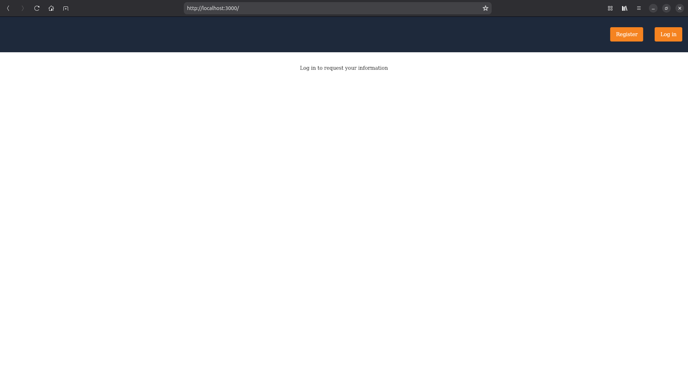
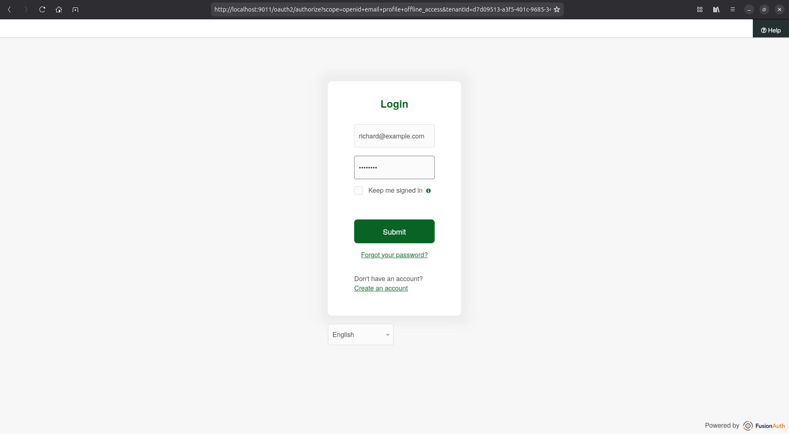
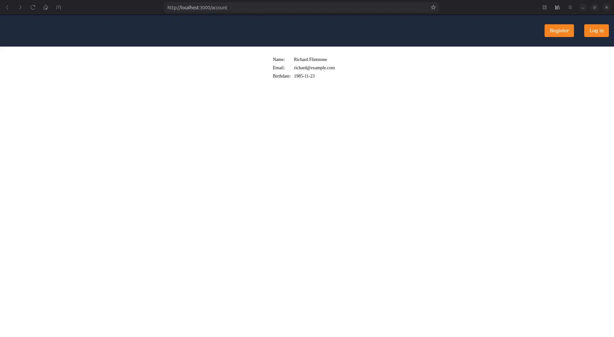

import Aside from '/src/components/Aside.astro';
import NextSteps from '/src/components/quickstarts/NextSteps.astro';
import DownloadWidget from 'src/components/download/DownloadWidget.astro';
import HostedBackendWarning from 'src/content/docs/_shared/_hosted-backend-warning.md';
import InlineUIElement from 'src/components/InlineUIElement.astro';
import {RemoteCode} from '@fusionauth/astro-components';

Learn to create a simple React application that uses FusionAuth for login and displaying user information.

## Overview

Add login, registration, multifactor authentication (MFA), single sign-on (SSO), and much more to your apps in days, not months, using FusionAuth.

This quickstart guides you through creating a React Single-Page App (SPA) in four stages:

- Create a basic app.
- Add a public homepage and a protected account page.
- Add registration, login, and logout.
- Add a button to the account page to refresh the user's information.

## Before you start

To use this quickstart you need:

- [Docker](https://www.docker.com) version 23 or later to run the container with FusionAuth.
- [Node.js](https://nodejs.org/en) version 22 or later to run the React app.
- A project directory to work in.

The <a href={frontmatter.codeRepository}>repository for this quickstart</a> includes the code for the different stages in four directories:

- **`01_start`:** Adds empty placeholder files that you populate in stage two.
- **`02_noAuthentication`:** Adds the example app with static pages and no authentication.
- **`03_withAuthentication`:** Adds authentication that uses FusionAuth.
- **`04_callTheServer`:** Adds refreshing the user details to the account page.

You can navigate between the directories to review the application code at each stage of development.

## Create a React application without authentication

The initial React app has three components:

- **`index.tsx`:** The app container, which also provides routing from one page to another.
- **`home.tsx`:** The login page.
- **`account.tsx`:** The account page, which shows the user's details.

### Create index.tsx

Create `index.tsx` with the following content:

<RemoteCode url="https://raw.githubusercontent.com/ritza-co/fusionauth-quickstart-react/draft_overhaulReactQuickstart/02_noAuthentication/index.tsx" lang="tsx"/>

This landing page creates an `App` component. The `<Routes>` section routes `/account` to the account component, and routes `/` and all other URLs to the home component. In the last section, the code uses React to insert the app into the page as the `root` element.

### Create the homepage

Create the public homepage, `home.tsx`, with the following content:

<RemoteCode url="https://raw.githubusercontent.com/ritza-co/fusionauth-quickstart-react/draft_overhaulReactQuickstart/02_noAuthentication/home.tsx" lang="tsx"/>

### Create the account page

Create the protected account page, `account.tsx`, with the following content:

<RemoteCode url="https://raw.githubusercontent.com/ritza-co/fusionauth-quickstart-react/draft_overhaulReactQuickstart/02_noAuthentication/account.tsx" lang="tsx"/>

The homepage and the account page are placeholders for future content. The buttons redirect the user from one page to the other without authentication.

### Create the stylesheet

Create the stylesheet, `index.css`, with the following content:

<RemoteCode url="https://raw.githubusercontent.com/ritza-co/fusionauth-quickstart-react/draft_overhaulReactQuickstart/02_noAuthentication/index.css" lang="css"/>

### Create index.html

In your project directory, create `index.html` with the following content:

<RemoteCode url="https://raw.githubusercontent.com/ritza-co/fusionauth-quickstart-react/draft_overhaulReactQuickstart/02_noAuthentication/index.html" lang="tsx"/>

This page loads the React code for the app container created earlier (1) and the CSS.

### Run the base app

1. Navigate to the project directory in a terminal window.
2. Install the Node.js packages for React with the following commands:

    ```sh
    npm install  @fusionauth/react-sdk@~2.5.1  react@~19.1.1  react-dom@~19.1.1  react-router-dom@6.7.0

    npm install --save-dev  @eslint/js@~9.33.0  @types/react@~19.1.10  eslint@~9.33.0  typescript@~5.9.2  typescript-eslint@~8.40.0  parcel@~2.15.4
    ```

3. Start the web server with the following command:

    ```sh
    npx parcel index.html --host 0.0.0.0 --port 3000
    ```

4. Open a web browser and view http://localhost:3000 to see the site.

    

    You're able to use the login button to open the account page because the app has no authentication or protected URLs.

## Download and run FusionAuth

Set up FusionAuth as the authentication provider by installing and running a preconfigured version of FusionAuth in a Docker container.

<DownloadWidget kickstartEnabled={true} kickstartName={"quickstart-spa"} />

<Aside type="note">
In this example, FusionAuth has already been configured to communicate with an app on http://localhost:3000, where the example React app is running. [Kickstart](/docs/get-started/download-and-install/development/kickstart) does this configuration and sets up example user accounts.

Your React app needs only a static web server because FusionAuth provides a [hosted backend](/docs/apis/hosted-backend) for frontend apps.
</Aside>

## Add authentication to the app with FusionAuth

In this section, you update the `.tsx` files to use FusionAuth authentication by redirecting the user to FusionAuth for login and checking whether the user is logged in.

### Edit index.tsx

1. Add the FusionAuth [React SDK](/docs/sdks/react-sdk) to the app by inserting the following code into the imports at the top of the file:

    <RemoteCode url="https://raw.githubusercontent.com/ritza-co/fusionauth-quickstart-react/draft_overhaulReactQuickstart/03_withAuthentication/index.tsx" lang="tsx" tags="a"/>

2. Add the FusionAuth configuration by inserting the following code after the `import` statements:

    <RemoteCode url="https://raw.githubusercontent.com/ritza-co/fusionauth-quickstart-react/draft_overhaulReactQuickstart/03_withAuthentication/index.tsx" lang="tsx" tags="b"/>

    The `FusionAuthProviderConfig` configures the `@fusionauth/react-sdk` to connect with FusionAuth on the correct domain and port.

    <Aside type="note">
    Normally, you would configure the authentication on the server and need to hide secrets from the public. In this case, you don't need to protect the `clientId` because the app uses the FusionAuth hosted backend.
    </Aside>

3. Hide the page during user login by changing the following code in the `App()` function:

    <RemoteCode url="https://raw.githubusercontent.com/ritza-co/fusionauth-quickstart-react/draft_overhaulReactQuickstart/03_withAuthentication/index.tsx" lang="tsx" tags="c"/>

4. Enable FusionAuth functionality in the React app by changing the `React.Dom.createRoot` function to include the FusionAuth wrapper.

    <RemoteCode url="https://raw.githubusercontent.com/ritza-co/fusionauth-quickstart-react/draft_overhaulReactQuickstart/03_withAuthentication/index.tsx" lang="tsx" tags="d"/>

### Edit home.tsx

1. Update the home component imports by adding the following code to the top of the file:

    <RemoteCode url="https://raw.githubusercontent.com/ritza-co/fusionauth-quickstart-react/draft_overhaulReactQuickstart/03_withAuthentication/home.tsx" lang="tsx" tags="a"/>

2. Add authentication logic to the homepage code by changing the `Home()` function as follows:

    <RemoteCode url="https://raw.githubusercontent.com/ritza-co/fusionauth-quickstart-react/draft_overhaulReactQuickstart/03_withAuthentication/home.tsx" lang="tsx" tags="b"/>

    The `useFusionAuth()` line adds helper functions to the homepage code. The user is redirected to the account page if `isLoggedIn` is true.

3. Update the login button by adding the following click handler to it:

    <RemoteCode url="https://raw.githubusercontent.com/ritza-co/fusionauth-quickstart-react/draft_overhaulReactQuickstart/03_withAuthentication/home.tsx" lang="tsx" tags="c"/>

    The `startLogin()` line adds authentication to the login button.

### Edit account.tsx

1.  Update the account component imports by adding the following code to the top of the file:

    <RemoteCode url="https://raw.githubusercontent.com/ritza-co/fusionauth-quickstart-react/draft_overhaulReactQuickstart/03_withAuthentication/account.tsx" lang="tsx" tags="a"/>

2. Add authentication logic to the account page by changing the top of the `Account()` function as follows:

    <RemoteCode url="https://raw.githubusercontent.com/ritza-co/fusionauth-quickstart-react/draft_overhaulReactQuickstart/03_withAuthentication/account.tsx" lang="tsx" tags="b"/>

    The `useFusionAuth()` line adds the helper functions and the `startLogout()` line adds authentication to the logout button.

3. Add the user's info to the page by overwriting the HTML with the following code:

    <RemoteCode url="https://raw.githubusercontent.com/ritza-co/fusionauth-quickstart-react/draft_overhaulReactQuickstart/03_withAuthentication/account.tsx" lang="tsx" tags="c"/>

### Test the authentication

Reopen the app at http://localhost:3000. Click the login button and log in with these user credentials:

- **Username:** `richard@example.com`
- **Password:** `password`

The app uses redirection to FusionAuth for login. The port number changes in the URL before FusionAuth (on port 9011) returns you to the app (on port 3000).





Authentication protects your private pages, such as the account page. If you change the URL in the address bar to browse to the public homepage or protected account page, you're redirected based on whether you're logged in or not.

## Call FusionAuth only when authenticated

Once a user has successfully logged in, FusionAuth stores an `http-only` cookie in the user's browser. In future, if you use a full web server instead of this example's static file host, you can check for the `http-only` cookie to verify that the user is authenticated.

For calls to the FusionAuth API, you need an API key. To keep the key secret, you need to make the calls from a server instead of the browser. Since this example doesn't use a server, the app can make almost no calls to the FusionAuth API.

To illustrate calling FusionAuth from the browser only when you're logged in, in this section you add a call to [refresh the user's data](/docs/apis/hosted-backend#me).

### Add refresh functionality

Change the bottom of the `Account()` function before the `return` statement in `account.tsx` to match the following:

<RemoteCode url="https://raw.githubusercontent.com/ritza-co/fusionauth-quickstart-react/draft_overhaulReactQuickstart/04_callTheServer/account.tsx" lang="tsx" tags="a"/>

This code calls the FusionAuth endpoint at `/app/me` to get the latest user data, which may have changed since the user logged in.

### Update the account page UI

Overwrite the `userInfoGrid` section at the bottom of `account.tsx` with the following code:

<RemoteCode url="https://raw.githubusercontent.com/ritza-co/fusionauth-quickstart-react/draft_overhaulReactQuickstart/04_callTheServer/account.tsx" lang="tsx" tags="b"/>

This code uses the latest user info from FusionAuth in the HTML, instead of using the old user info from the time of login.

### Test the refresh functionality

Browse to the account page and click the refresh button to see the latest user info.


## Next steps

This is a quick introduction to using FusionAuth. To learn more about using FusionAuth with your product, see [Get Started](/docs/get-started).

FusionAuth has many features, most of which are free. Some require other versions. For details, see the [pricing page](https://fusionauth.io/pricing).

For more general questions, please ask in [the FusionAuth forum](https://fusionauth.io/community/forum).
