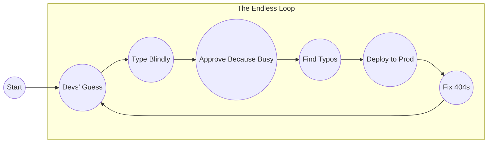

When running a local docs build or preview docs build, this page serves as a stand-in for the real [fusionauth.io](https://fusionauth.io) site. The following diagram explains the FusionAuth software documentation lifecycle:

This page will never ship, but it is a nice way for us documentarians to curate a list of important pages for easy access:

* [Docs](/docs/)
* [QuickStarts](/docs/get-started/quickstarts/)
* [Articles](/articles/)
* [Download Widget](/docs/download-widget)
* [Blog](/blog/)
* [Direct Download](/direct-download)
* [Help](/help)

## The usual suspects

Pages worth spot-checking after infra work and dependency upgrades because they're slightly overcomplicated and more brittler than most pages:

* [Docs index](/docs/)
* [JWT debugger](/docs/dev-tools/jwt-decoder)
* [QuickStarts landing](/docs/get-started/quickstarts)
* [React QuickStart](/docs/get-started/quickstarts/spa/react)
* [Ruby on Rails QuickStart](/docs/get-started/quickstarts/api/quickstart-ruby-on-rails-api)
* [Android SDK](/docs/sdks/android-sdk)
* [Apple identity provider API](/docs/apis/identity-providers/apple)
* [OAuth token endpoint API](/docs/apis/oauth/token)
* [Tenants](/docs/get-started/core-concepts/tenants)
* [Applications](/docs/get-started/core-concepts/applications)
* [Email template replacement variables](/docs/customize/email-and-messages/email-templates-replacement-variables)
* [Multi-factor authentication](/docs/lifecycle/authenticate-users/multi-factor-authentication)
* [Troubleshooting](/docs/operate/troubleshooting)
* [Release notes](/docs/release-notes)
* [Advanced themes API](/docs/apis/themes/advanced-themes)
* [Auth0 migration guide](/docs/lifecycle/migrate-users/provider-specific/auth0)
