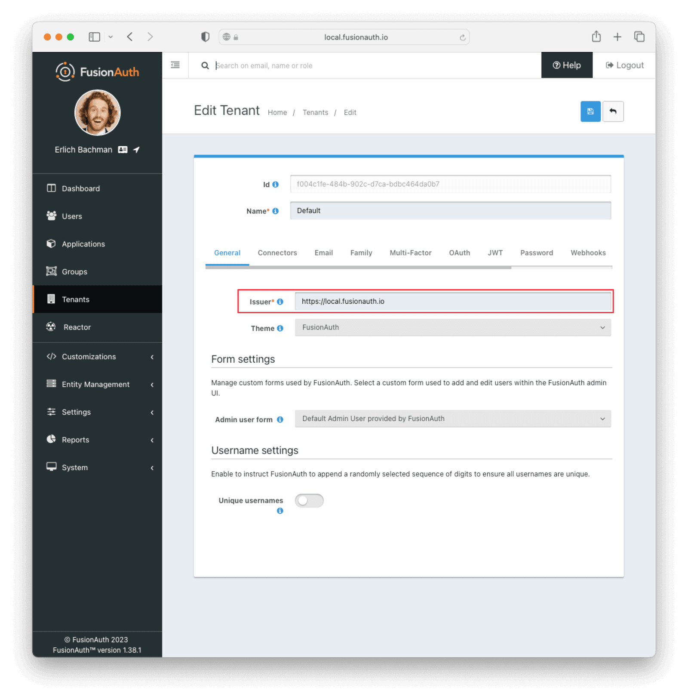
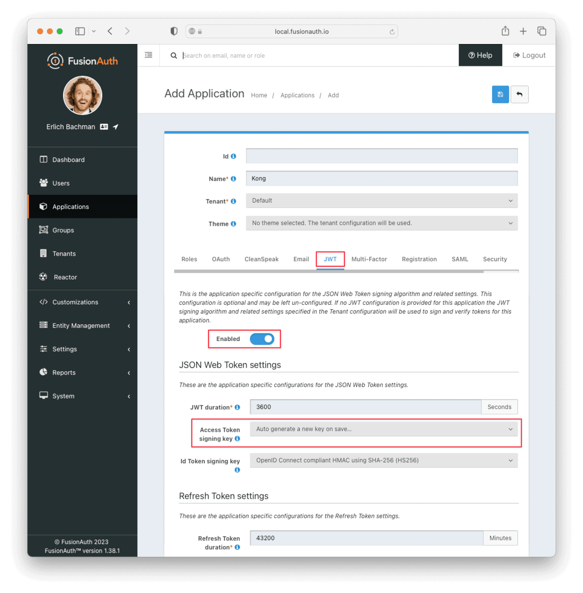
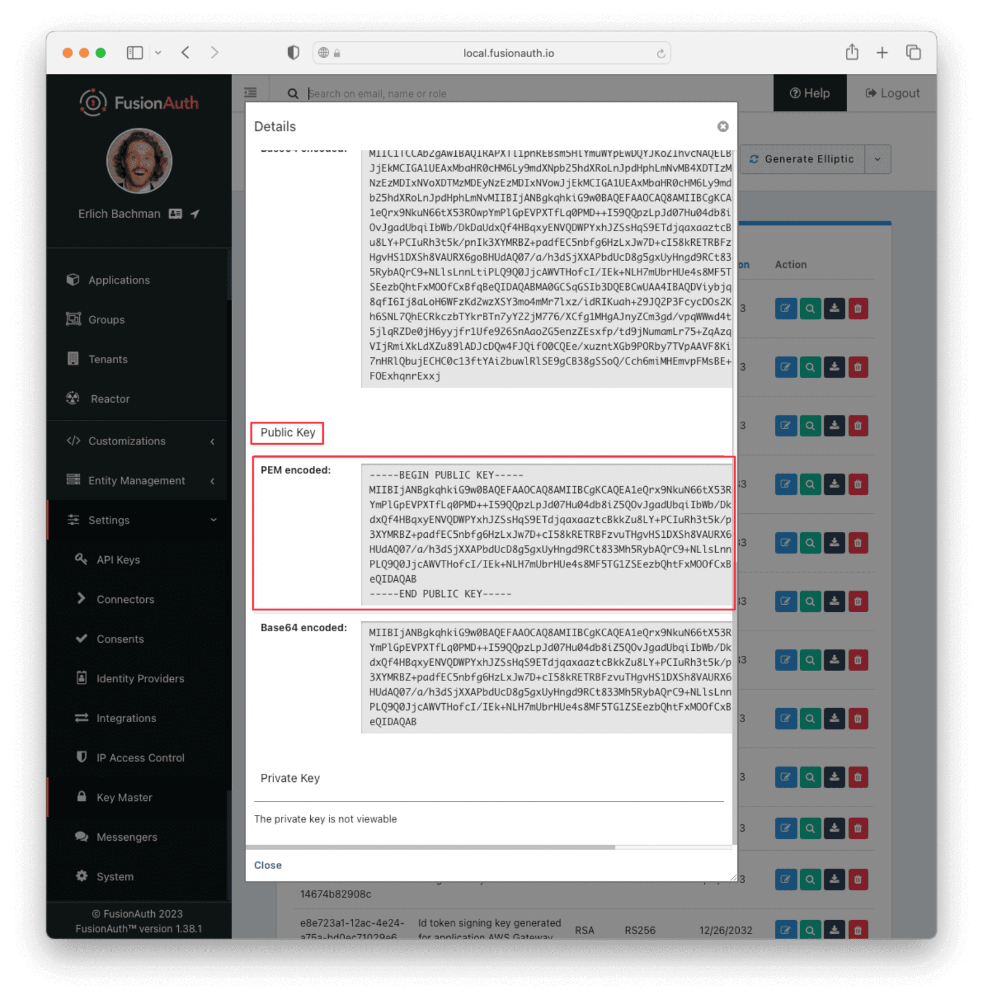
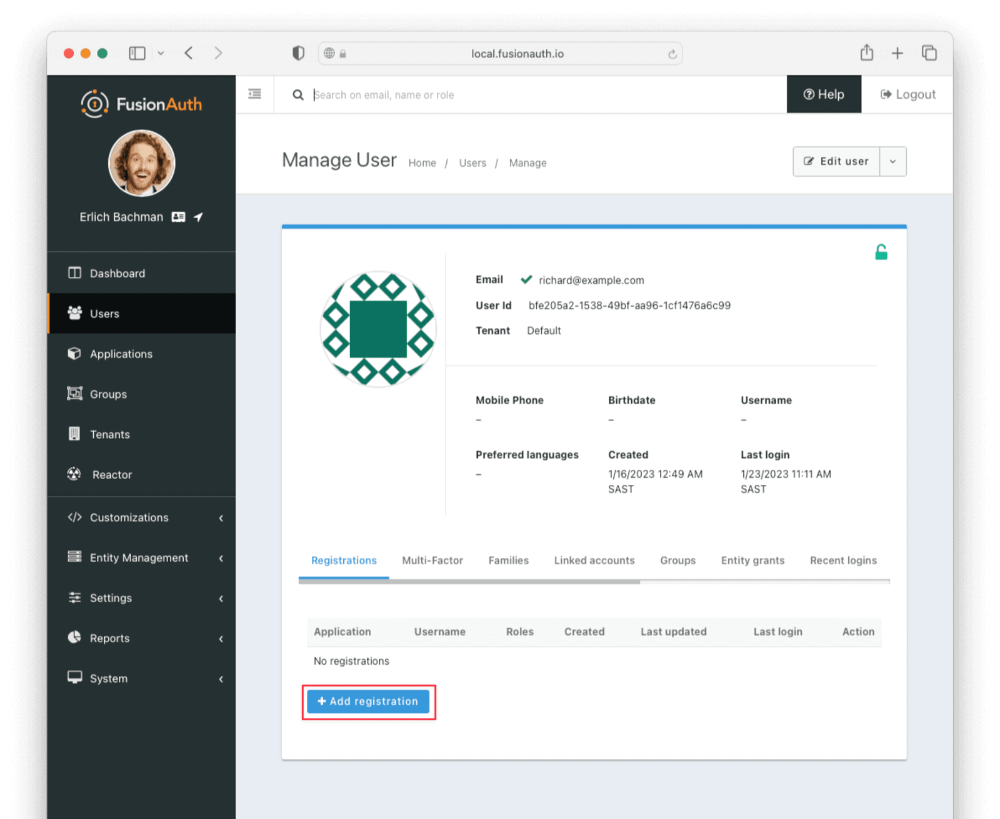
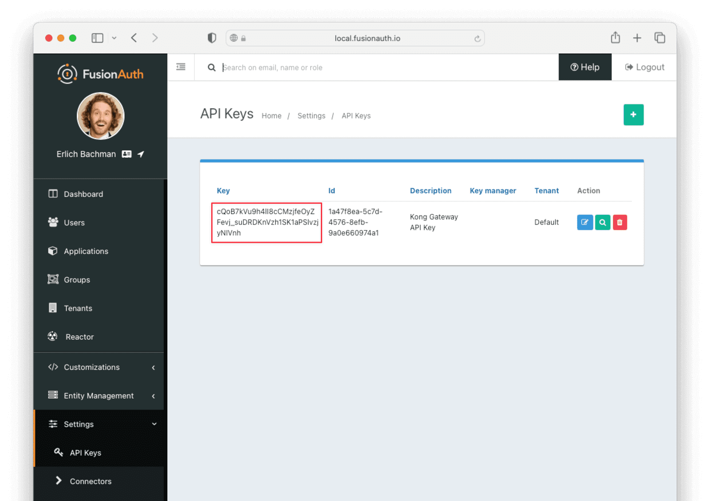

== Overview

Kong Gateway is an API management tool that allows you to connect client API calls to the appropriate services. 

You can configure Kong Gateway to handle authorization to the resource through JSON Web Tokens (JWTs) issued on behalf of a user by an identity provider.

In this document, you'll learn how to set up Kong Gateway and FusionAuth as the identity provider to protect a simple HTTP service running on your Kong instance.

== Prerequisites

* A FusionAuth instance running on a publicly accessible URL. You can spin up a link:/pricing[basic FusionAuth Cloud instance] or link:/docs/v1/tech/installation-guide/[install it on any server].
* A Kong Gateway instance, with service routes. You can follow the Kong quickstart guide at link:https://docs.konghq.com/gateway/3.1.x/get-started/[to setup Kong locally]. You should complete both the link:https://docs.konghq.com/gateway/3.1.x/get-started/[Get Kong] and link:https://docs.konghq.com/gateway/3.1.x/get-started/services-and-routes/[Services and Routes] sections. 
** Note: if the terminal seems to hang after outputting `Debugging info logged to 'kong-quickstart.log'`, it may be having trouble connecting to Docker. Try link:<todo>[resetting Docker to factory defaults] to solve this issue.

== Restrict access to your Kong Gateway service

After following the Kong Quickstart Guide above, you can execute the following command in the terminal.
[source,shell,title,cURL to test Kong setup]
----
curl -I http://localhost:8000/mock/requests
----

If you have correctly set up Kong Gateway, this command will return `+HTTP/1.1 200 OK+`, indicating a successful connection to the service. 

Now, you can restrict access to the service by requiring a JWT. To do this, add a JWT plugin with the following command.

[source,shell,title,restrict access with JWT]
----
curl -X POST http://localhost:8001/services/example_service/plugins \
    --data "name=jwt" 
----

At this point, the service is, for all intents and purposes, inaccessible. You can execute

[source,shell,title,cURL to test Kong setup, part two]
----
curl -I http://localhost:8000/mock/requests
----

again to confirm this. This time, the command will return `+HTTP/1.1 401 Unauthorized+`.

== Set Up FusionAuth

Navigate to your FusionAuth instance.

First, you need to make sure the JWT issuer setting is correct. Navigate to [breadcrumb]#Tenants -> Your Tenant# and change the issuer to the URL of your FusionAuth instance. For example, `\https://local.fusionauth.io`. Record this value, because we will use it later when generating the JWT.

Next, you need to configure an application which will issue tokens to access the Amazon API Gateway project.

Navigate to [breadcrumb]#Applications# and then create a new Application. Fill out the [field]#Name# field, then click the [breadcrumb]#OAuth# tab.

Make sure that the [field]#Enabled grants# checkboxes have the `Authorization Code` and `Refresh Token` grants enabled.

Your application should look like this.

image::../../../../../assets/img/docs/api-gateways/kong-gateway/kong-gateway-enabled-grants.png[The FusionAuth example configuration,width=1200]

You also need to enable the application to issue JWTs. Click the [breadcrumb]#JWT# tab and toggle the [field]#Enable# switch. You can select `+Auto generate a new key on save...+` for the [field]#Access Token signing key# field. This will generate an RS256 asymmetric key pair specifically for this application.

Click the `Save` button.

Now, navigate to [breadcrumb]#Settings -> Key Master#. You will see the Access key that you've just created in this list. By default, it has the name `+Access token signing key generated for application <NAME_OF_APPLICATION>+`. View that key and copy the entire contents of the [field]#Public Key -> PEM encoded# field into your current working directory in the terminal. Name the file something like `+public.pem+`

You will use FusionAuth's API to generate a JWT for your application. To do this, you need an API Key with POST access to the `+/api/login+` endpoint. Go to [breadcrumb]#Settings -> API Keys# to add such a key. Make sure the appropriate [field]#tenant# is selected.

Finally, make sure there is at least one user registered to your application. You can create a new user by navigating to [breadcrumb]#User -> Add user#. Untoggle the [field]#Send email to set up password# switch to manually enter a password. Here, the password chosen is `+password+`.

After saving this user, you can click [breadcrumb]#Manage -> Add Registration# to register the user to your application

== Add a consumer in Kong

Now that FusionAuth has all the requisite information to create a JWT, you can configure your Kong Gateway to provide access based on it. 

Execute the following command in your terminal.

[source,shell,title,Create a consumer]
----
curl -i -X POST http://localhost:8001/consumers \
  --data "username=fusionauth" 
----

This creates a consumer with the username `+fusionauth+`. This consumer will handle the authentication information that you supply to it, namely the the public key and issuer name from FusionAuth. You can enable this with the following command.

[source,shell,title,Supply key to consumer]
----
curl -i -X POST http://localhost:8001/consumers/<CONSUMER_USERNAME>/jwt \
  -F "algorithm=RS256" \
  -F "rsa_public_key=@./<PUBLIC_KEY_FILENAME>" \
  -F "key=<YOUR_FUSIONAUTH_URL>"
----

Here, `+YOUR_FUSIONAUTH_URL+` should exactly match the [field]#issuer# field from [breadcrumb]#Tenants -> Your Tenant#, `+CONSUMER_USERNAME+` should match the username that you supplied to the consumer in the step prior, and `+PUBLIC_KEY_FILENAME+` should match the name of the file that you saved the public key to from the [breadcrumb]#Key Master# page. 

Using the example names from this guide, the command will appear as follows:

[source,shell,title,Supply key to consumer with example values]
----
curl -i -X POST http://localhost:8001/consumers/fusionauth/jwt \
  -F "algorithm=RS256" \
  -F "rsa_public_key=@./public.pem" \
  -F "key=https://local.fusionauth.io"
----

== Creating and using the JWT

You can now generate the JWT to access your Kong Gateway service using FusionAuth's login API. Execute the following command in your terminal.

[source,shell,title,Get JWT from FusionAuth]
----
curl --location --request POST '<YOUR_FUSIONAUTH_URL>/api/login' \
--header 'Authorization: <API_KEY>' \
--header 'Content-Type: application/json' \
--data-raw '  {
    "loginId": "<USER_EMAIL>",
    "password": "<USER_PASSWORD>",
    "applicationId": "<APPLICATION_ID>",
    "noJWT" : false
  }'
----

Here, again, `+YOUR_FUSIONAUTH_URL+` is the issuer name. `+API_KEY+` is the key you set up on the [breadcrumb]#Settings -> API Keys# page, 

`+APPLICATION_ID+` is the id of your FusionAuth application, 

and `+USER_EMAIL+` and `+USER_PASSWORD+` are the username and password of the user that you registered to that application.

Using the example names from this guide, the command will appear as follows:

[source,shell,title,Get JWT from FusionAuth with example values]
----
curl --location --request POST 'https://local.fusionauth.io/api/login' \
--header 'Authorization: cQoB7kVu9h4lI8cCMzjfeOyZFevj_suDRDKnVzh1SK1aPSlvzjyNIVnh' \
--header 'Content-Type: application/json' \
--data-raw '  {
    "loginId": "richard@example.com",
    "password": "password",
    "applicationId": "6245b444-bd51-4be2-9260-7dc825adbcb6",
    "noJWT" : false
  }'
----

The return response from FusionAuth should look similar to the following:

[source,json,title="Return token from the API call"]
----
{
    "token": "eyJhbGciOiJSUzI1NiIsInR5cCI6IkpXVCIsImtpZCI6ImhDUjA4X3daR2s0OUFlYUFmRDY5ZmJKWmRGTSJ9.eyJhdWQiOiI2M2I3M2Y3Ni03NDAwLTQ4N2QtYjEyMi01NzA1Yjg0OGRhODAiLCJleHAiOjE2NzMzNjYyMDQsImlhdCI6MTY3MzM2MjYwNCwiaXNzIjoiaHR0cHM6Ly9mdXNpb25hdXRoLnJpdHphLmNvIiwic3ViIjoiMzk2MzAwMGYtNjg2ZC00MTY5LWI2MjgtOWM5YzQ1MzRiNzgwIiwianRpIjoiZDk3ZGIyZWYtZjExNS00ZDIxLWFlOTQtMDIyN2RmMGU4YzI5IiwiYXV0aGVudGljYXRpb25UeXBlIjoiUEFTU1dPUkQiLCJlbWFpbCI6ImJvYkBhd3MuY29tIiwiZW1haWxfdmVyaWZpZWQiOnRydWUsInByZWZlcnJlZF91c2VybmFtZSI6ImJvYmF3cyIsImFwcGxpY2F0aW9uSWQiOiI2M2I3M2Y3Ni03NDAwLTQ4N2QtYjEyMi01NzA1Yjg0OGRhODAiLCJyb2xlcyI6W10sImF1dGhfdGltZSI6MTY3MzM2MjYwNCwidGlkIjoiZjAwNGMxZmUtNDg0Yi05MDJjLWQ3Y2EtYmRiYzQ2NGRhMGI3In0.m7gzXhNLToPNVE1p5Vo2pLgP6WBcPNfS_zZJnJ81mdEgi6-orViz-tU8j0L8wva0-8KlMdy54cq_XjnDnYJ0aX90O4ZE_QVU5NuDDfzXH14wQtKQoIIydsB6ZvQoBt8JNFUHJb9ANLCGnfn6FVQKqPIzye18Gx_7wYSVokw3eLNFyzrq9dwOD5Q8V9gvZmXV2pTokQAtA7qFaadb2dIeFlSEB7wamKiZLXILjeWAeMbbvAAMQZWFh46UJjwr06QTd8PxQmRwDWWznJy1Vs8EAgZA4vkRSWnn3IbiaCtOaL1ANuEex6il7q32ahxj0Ncm9wn0DbDsQE9NB0CCNTSIhA",
    "tokenExpirationInstant": 1673366204805,
    "user": {
        ....
    }
}
----

Copy the `+token+` value out. You can now gain access to your Kong Gateway service by passing this value as a bearer token.

[source,shell,title, gain access with JWT]
----
curl -I http://localhost:8000/mock/requests \
-H 'Authorization: Bearer <TOKEN>' 
----

Where `+TOKEN+` is the value of the JWT that you copied from the `+api/login+` call.

This command should return `+HTTP/1.1 200 OK+`, indicating successful authorization to the Kong Gateway service. 

=== Next Steps

<todo>
