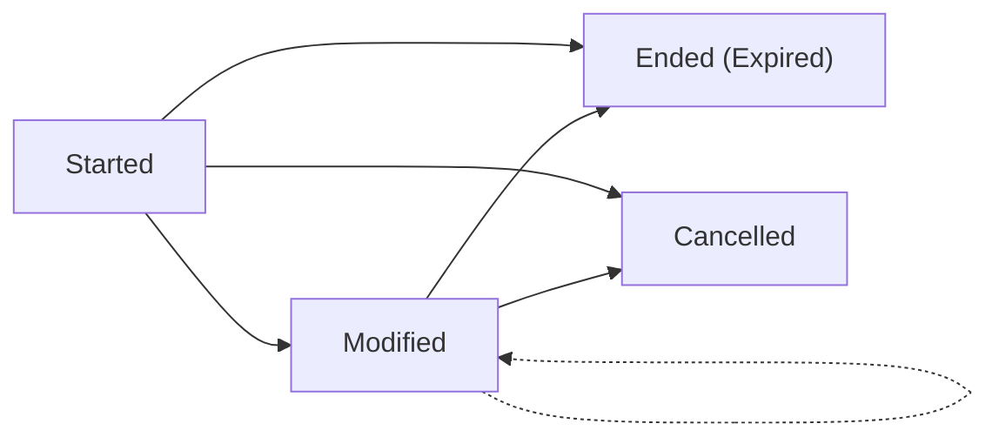
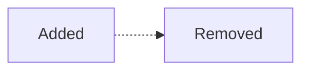
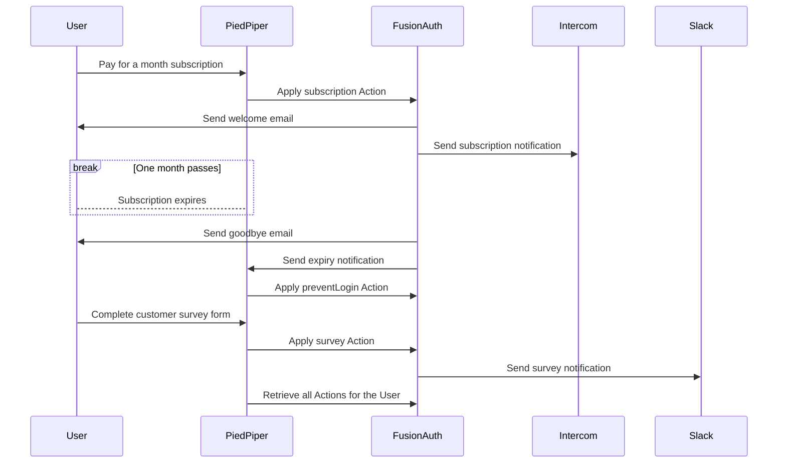

## Introduction
User Actions in FusionAuth are ways to interact with, reward, and discipline users. For example, you could use them to email a user, call another application when a user does something, or temporarily disable a user's login.

This guide refers to User Actions simply as Actions. In the first half you'll learn about all the parts of an Action and their sequences of events. In the second half you'll learn ways to create and apply Actions.

- [Introduction](#introduction)
- [PART 1 - THEORY OF FUSIONAUTH ACTIONS](#part-1---theory-of-fusionauth-actions)
- [Definitions](#definitions)
- [Types of Actions and Their Purpose](#types-of-actions-and-their-purpose)
  - [Temporal Actions](#temporal-actions)
    - [Subscription Example](#subscription-example)
  - [Instantaneous Actions](#instantaneous-actions)
    - [Survey Example](#survey-example)
- [Applying an Action Automatically](#applying-an-action-automatically)
- [PART 2 - A TUTORIAL EXAMPLE USING ACTIONS](#part-2---a-tutorial-example-using-actions)
- [The Action APIs](#the-action-apis)
  - [Action Parameters](#action-parameters)
  - [Action Reason Parameters](#action-reason-parameters)
  - [Action Instance Parameters](#action-instance-parameters)
- [Starting the PiedPiper Newspaper Company](#starting-the-piedpiper-newspaper-company)
- [FusionAuth Work](#fusionauth-work)
  - [Create a Mock Email Service](#create-a-mock-email-service)
    - [Configuring localhost access on Docker](#configuring-localhost-access-on-docker)
  - [Create PiedPiper Application](#create-piedpiper-application)
  - [Create an Administrative User (Actioner)](#create-an-administrative-user-actioner)
  - [Create an Subscriber User (Actionee)](#create-an-subscriber-user-actionee)
  - [Create an API key](#create-an-api-key)
  - [Subscription Work](#subscription-work)
    - [Create Welcome Email Template](#create-welcome-email-template)
    - [Create Expiry Email Template](#create-expiry-email-template)
    - [Configure email server](#configure-email-server)
    - [Create Reasons](#create-reasons)
    - [Create Signup Webhook to Intercom](#create-signup-webhook-to-intercom)
    - [Create Expiry Webhook to PiedPiper](#create-expiry-webhook-to-piedpiper)
    - [Enable Webhooks in Tenants](#enable-webhooks-in-tenants)
    - [Create Subscription Action](#create-subscription-action)
    - [Create Preventlogin Action](#create-preventlogin-action)
  - [Survey Work](#survey-work)
    - [Create Thanks Email Template](#create-thanks-email-template)
    - [Create Survey Webhook to Slack](#create-survey-webhook-to-slack)
    - [Create Survey Action with Options with Localizations](#create-survey-action-with-options-with-localizations)
- [PiedPiper Work](#piedpiper-work)
  - [Create Mock Intercom API](#create-mock-intercom-api)
  - [Create Mock Slack API](#create-mock-slack-api)
  - [Create PiedPiper API to Listen for Expiry and Call PreventLogin Action](#create-piedpiper-api-to-listen-for-expiry-and-call-preventlogin-action)
- [Testing](#testing)
  - [Start PiedPiper](#start-piedpiper)
  - [Apply Subscription Action](#apply-subscription-action)
  - [Check Welcome and Expiry Emails Arrive](#check-welcome-and-expiry-emails-arrive)
  - [Check Intercom Is Called](#check-intercom-is-called)
  - [Check PreventLogin Action Was Created](#check-preventlogin-action-was-created)
  - [Apply Survey Action](#apply-survey-action)
  - [Check Slack Is Called](#check-slack-is-called)
  - [Check Negative Survey Response Was Sent to Slack](#check-negative-survey-response-was-sent-to-slack)
  - [Retrieve All Survey Action Instances for This User](#retrieve-all-survey-action-instances-for-this-user)
- [Further reading](#further-reading)
- [Todos](#todos)

## PART 1 - THEORY OF FUSIONAUTH ACTIONS

## Definitions
Below are the terms you'll encounter when working with Actions. They are listed in order of increasing understanding, not alphabetically.

- Action — Can be created on FusionAuth at **Settings**—**User Actions**. An Action is a state or event that can be applied to User. It is reusable for many Users in many Applications. Actually applying Action to a specific User is called an Action instance. This is similar to programming, where you have classes (Actions) and objects (Action instances).

    At its most simple, an Action is just a name, and an Action instance comprises: one User applying the Action on another User, the time of the Action, and the name of the Action.
- Actionee — The user on whom Action is taken.
- Actioner — The user that applies the Action. Every Action has to have an Actioner, even if the instance is automatically applied, in which case the Actioner can be set to the Application's administrator.
- Reason — A text description of why an Action was taken. You don't have to set a Reason when applying an Action, but it's useful for auditing. Reasons can be created on FusionAuth at **Settings**—**User Actions** by clicking the **Reasons** button at the top right.
- Webhook — A webhook is another name for sending a single HTTP request to an API. It's used to inform an external system of some event, and can be triggered by an Action. An example is FusionAuth calling a customer-support service, like _Intercom.com_, to start the customer onboarding process when the user has verified their email in FusionAuth. Another example would be posting a message to a _Slack.com_ channel whenever a new customer signs up. Webhooks can be managed in FusionAuth at **Settings** — **Webhooks** and can be triggered by Actions.

    The webhook/API terminology can be confusing. Note that most web companies, including FusionAuth, call a trigger to _send_ data a _webhook_, but when they _receive_ data they call it an _API_. So if you're looking for a destination for a FusionAuth webhook in an external system, you won't find it under their webhook documentation; you'll find it under API documentation. This is why they are sometimes known as a _reverse API_. However, some companies, like _Slack_, also call incoming requests "incoming webhooks".
- Temporal Actions — Temporal, or time-based, Actions have a duration, as opposed to instantaneous Actions, which have only a start time. Once a temporal Action expires, meaning that it ends automatically as opposed to being cancelled, it will no longer be considered active and will not affect the user. However, you can apply a temporal Action to a user indefinitely by setting a very distant end date. An Action that prevents login must be temporal.

    A temporal Action may be cancelled or modified, unlike an instantaneous Action, which cannot be. An example of an instantaneous Action would be a reward, such as sending a user a discount coupon.
- Active — An active Action can be applied to Users. In contrast, an inactive Action is like a deleted Action, meaning it cannot be applied, but it is still viewable in the list of inactive Actions in FusionAuth. An inactive Action can be reactivated if you want to use it again.

    If a temporal Action instance has ended we do not say that it is not active. _Active_ relates to the Action definition, and _expiry_ relates to a particular instance of the Action.
- Option — A custom text field that you can add to an instantaneous Action, but not to temporal Actions. You can add multiple options to an Action definition, but choose only one for an instance of the Action. Options can be sent through emails and webhooks.
- Localization — A text field with an associated language. It's a way of providing more information to users and administrators who speak different languages. Localizations can be added for an Action name, Reason, and Options.
- Tenant — You can make an Action available to all Tenants or just a few. Below is a visual reminder of [Tenants, Groups, and Applications](https://fusionauth.io/docs/v1/tech/core-concepts/).

    ```mermaid
    flowchart BT
        User-->Tenant
        Application-->Tenant
        Group-->Tenant
        Role-->Application
        User-->Group
        Registration-->User
        Registration-->Application
        User-->Role
        Entity-->Application
    ```

## Types of Actions and Their Purpose
There are two main types of Actions: temporal Actions and instantaneous Actions with options. They are summarized below.

| Type | Purpose | Example of use
| ----------- | ----------- | -----------
| Temporal | When you want to apply a state to a user for a period of time. | Subscription access · Expiring software trial · Forum ban
| Instantaneous (with options) | When you want to apply a state to a user at a single point in time, recording who did so, perhaps with comments. | User surveyed and was happy/indifferent/frustrated · User has earned a sufficient level of trust on your forum and been given an award (possibility increasing their access rights)

You might be wondering why you cannot create a temporal Action that also has Options available. Unfortunately that isn't possible currently in FusionAuth.

The general process to use an Action is to
- create the Action in the FusionAuth website,
- create any Reasons that you might want to link to the Action instance on the website,
- apply the Action to a User using the User Action API, possibly giving it an expiry date.

You'll see some detailed examples of this process later in this guide.

> FusionAuth's primary purpose is to simplify authentication (verifying a user's identity) and authorization (giving your app a user's roles). Actions are an additional feature that you might want to use in your app. Think of them as a premade way for you to store extra user fields in FusionAuth instead of your own database, at a specified time, and notify people or systems if these fields change. But FusionAuth has no way to receive payments, and no automated subscription features. So you need to decide carefully if you want to write the code you need to manage such features in FusionAuth using Actions, or in your own app with custom code, or using an external system that specializes in that process, if your needs are complex.

### Temporal Actions
Temporal action instances have four states they can be in. Each state can trigger a webhook or an email to the user.



#### Subscription Example
Let's take a temporal Action example where a user purchases a month's subscription to a newspaper website that you manage. Assume you have already created a temporal Action named "Subscription" in FusionAuth. Once the user has made their purchase (either on your newspaper site or through some payment gateway) your code will call the FusionAuth API to apply the Action to the User, and give the Action instance an end-date one month from now. The user will now have access to read the newspaper when authenticated on your site with FusionAuth.

The creation of this Action instance will be the **Started** event shown above. You can set it to trigger the welcome email template that is sent to the user, and a webhook that sends the user's information to another subscription site you manage. That site could then use that email address to advertise to the user, or for targeting Facebook adverts.

Once the Action instance expires (the **Ended** event) it will trigger a goodbye email to the user, and any webhooks that you configured. To prevent the user accessing your site after this date you could either
- check the subscription state of the Action for the User in FusionAuth from your site's code when the user attempts to log in,
- use a webhook at the end of the Action to change the User's Role in FusionAuth and disallow that role in your site,
- or use a webhook at the end of the Action to call your code to create another temporal Action in FusionAuth with an indefinite end date and `preventLogin` set to true.

The last option is probably the simplest and most idiomatic way to use FusionAuth in most cases. In fact, using an Action to prevent login is the most common use case for Actions.

### Instantaneous Actions
An instantaneous Action instance has an Option that can be chosen from a list, but no temporal states. Once you set the Action for a User it is either remains or is removed.



#### Survey Example
Let's take an instantaneous Action example where a user gives feedback on their interaction with customer support by assigning a rating and giving a comment.

Assume you have already created an instantaneous Action named "Feedback" in FusionAuth, with Options of "Bad", "Neutral", and "Good". Your user chooses "Good" in your application's form and enters the comment "Problem solved quickly". When saving the form your code will call the Action API and create an Action instance for the User with the option "Good" and populate the `comment` field. The `actioner` of the instance will be set to the support User who helped the customer.

At any point in the future you can use the API to retrieve this saved Action instance and create a report of the customer support agent's performance, or your app's approval ratings in general. You could also use a webhook to send this data immediately to an external system when the Action was created.

## Applying an Action Automatically
You have seen that you can apply an Action using the API. FusionAuth can also automatically apply a temporary `preventLogin` Action to a User in the case of repeatedly failing authentication. For more information see this [guide](https://fusionauth.io/docs/v1/tech/tutorials/gating/setting-up-user-account-lockout).

## PART 2 - A TUTORIAL EXAMPLE USING ACTIONS
The remainder of this guide will demonstrate a practical example of using Actions that you can follow. Let's start with a brief tour of the APIs that you'll use in the example.

## The Action APIs
Three separate APIs manage Actions. Each has its own documentation.
- [Actions](https://fusionauth.io/docs/v1/tech/apis/user-actions) — Defines an Action, updates it, and deletes it. The API path is `/api/user-action`.
- [Action Reasons](https://fusionauth.io/docs/v1/tech/apis/user-action-reasons) — Defies the reason an Action can be taken. The API path is `/api/user-action-reason`.
- [Action instances](https://fusionauth.io/docs/v1/tech/apis/actioning-users) — Applies an existing Action to a User, optionally with a Reason. Can also update or cancel the Action instance. The API path is `/api/user/action`.

Actions and Actions Reasons can be managed on the FusionAuth website. Only Action instances require you to use their API — you cannot apply an Action to a User on the website.

It is faster to use FusionAuth's API wrappers rather than make HTTP calls directly. You can read how to use them in the [client library guide](https://fusionauth.io/docs/v1/tech/client-libraries/) before continuing. This guide uses the Typescript client library.

The Actions API reference documentation is long, and repeats the same parameters for each type of request. For easier understanding, the parameters listed there are grouped and summarized below for each API. Parameters, such as Ids and names, whose purpose is obvious from the earlier [Definitions](#definitions) section are not described here.

### Action Parameters
These are used when creating an Action definition.
- `userActionId`
- `name`, `localizedNames`
- `startEmailTemplateId`, `cancelEmailTemplateId`, `modifyEmailTemplateId`, `endEmailTemplateId`, — The Id of the email template that is used when the Action starts, is cancelled, is modified, or expires. Temporal Actions have all four events, whereas instantaneous Actions have only the start event.
- `includeEmailInEventJSON` — Whether to include the email information in the JSON that is sent to the webhook when an Action is taken.
- `options`, `options[x].name`, `options[x].localizedNames`
- `preventLogin` — User may not log in if true until the Action expires.
- `sendEndEvent` — Whether to call webhooks when this Action instance expires.
- `temporal` — if the Action is temporal.
- `userEmailingEnabled`, `userNotificationsEnabled` — notify doesn't contact the user, it just adds a `notifyUser` field to JSON sent to webhooks.

### Action Reason Parameters
These are used when creating an Action Reason.
- `userActionReasonId`
- `text`, `localizedTexts` — The description of the Reason that a human can understand, possibly in many languages.
- `code` — A short text string to categorize the Reason for software to process.

### Action Instance Parameters
These are used when applying an Action to a User, possibly with a Reason.
- `userActionId`
- `actioneeUserId`
- `actionerUserId`
- `applicationIds` — The Action can be applied to the actionee for multiple Applications.
- `broadcast` — Should the Action trigger webhooks
- `comment` — A note by the Actioner if they want to add information in addition to the Reason.
- `emailUser` — Should the user be emailed at instance creation.
- `expiry` — Time after which this temporal Action should end. This is not a duration, but a [moment in time](https://fusionauth.io/docs/v1/tech/reference/data-types#instants).
- `notifyUser` — Should the literal text value, `notifyUser`, be sent to webhooks, for them to act on as they wish.
- `option` — The option the Actioner chose for this instance of the Action.
- `reasonId`

## Starting the PiedPiper Newspaper Company
You are now going to create the subscription and survey examples described earlier, for a paid newspaper website called _PiedPiper_.

The subscription Action will email the user and trigger a webhook to Intercom. When the Action instance expires, FusionAuth will email the user goodbye, and trigger a webhook to PiedPiper to create a `preventLogin` Action. The survey Action will trigger a webhook to Slack.

Below is a diagram of this process.



## FusionAuth Work
This guide assumes you have installed FusionAuth by following the [5 minute getting started guide](https://fusionauth.io/docs/v1/tech/getting-started/5-minute-docker). You should be able to log in to FusionAuth at http://localhost:9011/admin and your Node.js test app at http://localhost:3000.

> You can't use the [online FusionAuth sandbox](https://sandbox.fusionauth.io/admin) for this tutorial because you need to point the webhooks and emails to fake localhost services.

### Create a Mock Email Service
The first task is to configure email for FusionAuth. You'll use _maildev_ — a Node.js mock SMTP server.

- Open a new terminal window. It doesn't matter where, but your test application folder is a neat place.
    ```bash
    npm install maildev &&
    npx maildev -v;
    ```
- Leave it running until you have finished this tutorial. Run other commands in a different terminal.
- Browse to http://localhost:1080/ so that you can see emails arrive as we test Actions.

If you're running FusionAuth through Docker complete the next subsection. If you're running FusionAuth directly on your localhost you can skip it.

---

#### Configuring localhost access on Docker
You need to use Docker version 18 or greater on Mac or Windows. Version 20 is needed on Linux to support `host.docker.internal`, which allows Docker services to call out to your localhost.

- Open the `docker-compose.yml` file for FusionAuth and add the following text to the `fusionauth:` section, just below, and on the same indentation level as, `volumes:`.
    ```dockerfile
    extra_hosts:
      - "host.docker.internal:host-gateway"
    ```
- Run the following code in a new terminal in the folder to restart FusionAuth with mail capabilities. Be warned - this might delete your existing FusionAuth database.
    ```bash
    docker-compose down && docker-compose up;
    ```

---

- Browse to FusionAuth — **Tenants** — **Edit** `Default`
- **Email** tab and enter the values
  - **Host** — `host.docker.internal`
  - **Port** — `1025`
- **Send test email** should now work and arrive in the maildev website.
- **Save**

### Create PiedPiper Application
- Continue on the FusionAuth website and perform the following steps.
- **Applications** — **Add**
- Enter the values:
  - **Id** — `e26304d6-0f93-4648-bbb0-8840d016847d`
  - **Name** — `PiedPiper`
  - **Add Role**
    - **Name** — `admin`
    - **Super Role** — enable
  - **Add Role**
    - **Name** — `customer`
- Switch to the **OAuth** tab
- Add the following **Authorized redirect URLs**
  - `http://localhost:3000/oauth-redirect`
  - Note that you have to enter the text, wait for a popup to appear, then click it to confirm the entry.
- Add the following **Logout URL**
  - http://localhost:3000/logout
  - You do not need to click a popup here as the field can take only one value.
- Record the **Client secret** value for later use.
- **Save** the new Application

> You can leave the **Id**s of new objects in FusionAuth blank to have them autogenerated, but you'll need to know their values to call them in the API.

### Create an Administrative User (Actioner)
- **Users** — **Add**
- Enter the values:
  - **Email** — `admin@example.com`
  - **Send email to set up password** — Disable
  - **Password** — `password`
  - **Confirm** — `password`
- **Save**
- **Add registration**
  - **Application** — `PiedPiper`
  - **Roles** — `admin`
  - **Save**
- **Add registration**
  - **Application** — `FusionAuth`
  - **Roles** — `GlobalAdmin`
  - **Save**
- **Save the user**

### Create an Subscriber User (Actionee)
- **Users** — **Add**
- Enter the values:
  - **Email** — `reader@example.com`
  - **Send email to set up password** — Disable
  - **Password** — `password`
  - **Confirm** — `password`
- **Save**
- **Add registration**
  - **Application** — `PiedPiper`
  - **Roles** — `customer`
- **Save**

Return to both the users you just created and record their user Ids for use later. Unfortunately you cannot specify them when creating the users.

### Create an API key
You now have an Application with two Users.

In order to apply Actions using the API we need to create an API Key. In reality to be secure, you should grant as few privileges to a Key as possible. This is called the principle of least privilege. But to save time in this long tutorial you'll make a skeleton key.

- **Settings** — **API Keys** — **Add**
- **Id** - `cbf34b5f-cb45-4c97-9b7c-5fda3ad8f08c`
- **Key** - `FTQkSoanK7ObbNjOoU69WDVclfTx8L_zfEJbdR8M0xu-jKotV0iQZiQh`
- (Leave all endpoints disabled to give the key super access.)
- **Save**

More information on keys is available [here](https://fusionauth.io/docs/v1/tech/apis/authentication#managing-api-keys).

### Subscription Work
The following steps will create the parts needed to handle subscriptions.

#### Create Welcome Email Template
First create two email templates, one for an email sent to the user when they subscribe, and one for when their subscription ends. More information on email templates is available [here](https://fusionauth.io/docs/v1/tech/email-templates/email-templates#overview). (The templates in this tutorial do not use variables, such as the user's name, but you should in reality.)

- **Customizations** — **Email Templates** — **Add**
- Enter the values:
  - **Id** — `ae080fe4-5650-484f-807b-c692e218353d`
  - **Name** — `Welcome`
  - **Default Subject** — `Welcome`
  - **HTML Template** — **Default HTML** —
    - `Welcome to PiedPiper. Your subscription is valid for one month of reading.`
  - **Text Template** — **Default Text** — Add the same text as the HTML.
- **Save**

#### Create Expiry Email Template
- **Customizations** — **Email Templates** — **Add**
- Enter the values:
  - **Id** — `1671beff-78ed-420d-9e13-46b4d7d5c00d`
  - **Name** — `Goodbye`
  - **Default Subject** — `Goodbye`
  - **HTML Template** — **Default HTML** —
    - `Your subscription has expired and you may no longer read the news. Goodbye.`
  - **Text Template** — **Default Text** — Add the same text as the HTML.
- **Save**

#### Configure email server
You're going to use a mock SMTP server.
- **Tenants** — **Edit** `Default`
- **Email** tab — Set the following values.
  - **Port** — `1025`


#### Create Reasons
Now create two Reasons for applying Actions to the subscriber. Remember that Reasons are optional. They are most useful in reality when a single Action could have multiple Reasons, such as a subscription given as a free trial, competition win, part of a bundle, or for normal payment.

- **Settings** — **User Actions** — **Reasons**
- **Add**
  - **Id** — `ae080fe4-5650-484f-807b-c692e218353d`
  - **Text** — `Paid Subscription`
  - **Code** — `PS`
- **Save**
- **Add**
  - **Id** — `28b0dd40-3a65-48ae-8eb3-4d63d253180a`
  - **Text** — `Expired Subscription`
  - **Code** — `ES`
- **Save**

#### Create Signup Webhook to Intercom
Since your Actions will rely on calling Webhooks, you're going to create the webhooks first. Your first webhook will notify _Intercom_ that a new user has subscribed, and should be sent the onboarding series of emails that explain how to use all the paid features of PiedPiper. All our webhooks in this tutorial are sent to fake localhost versions of these real companies.

- **Settings** — **Webhooks**
- **Add**
  - **Id** — `55934340-3c92-410a-b361-40fb324ed412`
  - **URL** — `http://host.docker.internal:3000/intercom`
  - Scroll down and ensure that the **user.action** event is enabled.
- **Save**

> More information on webhooks is available [here](https://fusionauth.io/docs/v1/tech/events-webhooks/#overview).

#### Create Expiry Webhook to PiedPiper
The next webhook calls PiedPiper to notify it once the user's subscription expires.

- **Settings** — **Webhooks**
- **Add**
  - **Id** — `fa76b458-e0a0-438a-a5c8-26ca487e473e`
  - **URL** — `http://host.docker.internal:3000/expire`
  - Scroll down and ensure that the **user.action** event is enabled.
- **Save**

#### Enable Webhooks in Tenants
- Navigate to **Tenants**
- **Edit** the `Default` tenant.
  - **Webhooks**
  - (Note that the two webhooks you just created are enabled in the checkbox list.)
  - Scroll down and enable **user.action**.
  - **Save**

Enabling the webhooks in two places gives you fine-grained control across tenants.

#### Create Subscription Action
You're now ready to create the actual subscription and banning Actions that we'll apply to the user in our PiedPiper code. They're both temporal actions.

> You'll continue using the FusionAuth website to create objects in this tutorial. If you think it would be faster in future create Actions in code, see this previous [guide](https://fusionauth.io/blog/2023/04/20/using-user-actions#creating-the-user-action) demonstrating it in the terminal.

- **Settings** — **User Actions**
- **Add**
  - **Id** — `38bf18dd-6cbc-453d-a438-ddafe0daa1b0`
  - **Name** — `Subscribe`
  - **Time-based** — **Enable**
  - **Email** tab
    - **Email user** — **Enable**
    - **Send to Webhook** — **Enable**
    - **Start template** — `Welcome`
    - **Modify template** — `Goodbye`
    - **Cancel template** — `Goodbye`
    - **End template** — `Goodbye`
- **Save**

Note that our workflow never modifies nor cancels a user subscription, and these emails will never be sent. Nevertheless, FusionAuth requires a template to be chosen for every possibility if you enable **Email user**.

#### Create Preventlogin Action
This next Action will prevent the User from logging in after the subscription expires.

- **Settings** — **User Actions**
- **Add**
  - **Id** — `b96a0548-e87c-42dd-887c-31294ca10c8b`
  - **Name** — `Ban`
  - **Time-based** — **Enable**
  - **Prevent login** — **Enable**
- **Save**

This Action will not email or notify anyone. That was handled earlier.

### Survey Work
You have completed the FusionAuth work needed to manage subscriptions. Now you'll do similar work for the survey, but using Options Actions instead of temporal Actions.

#### Create Thanks Email Template
The final email template you'll create thanks the user for completing the survey.

- **Customizations** — **Email Templates** — **Add**
- Enter the values:
  - **Id** — `9006bb3c-b13b-4238-b858-d7a97e054a8d`
  - **Name** — `Thanks`
  - **Default Subject** — `Thanks`
  - **HTML Template** — **Default HTML** —
    - `Thank you for your survey feedback. It helps us improve. If your experience was negative we'll contact you shortly.`
  - **Text Template** — **Default Text** — Add the same text as the HTML.

#### Create Survey Webhook to Slack
- **Settings** — **Webhooks**
- **Add**
  - **Id** — `d86e097a-f23f-459b-80c5-8b47bae182ee`
  - **URL** — `http://host.docker.internal:3000/slack`
  - Scroll down and ensure that the **user.action** event is enabled.
- **Save**

#### Create Survey Action with Options with Localizations
In this last Action you are going to add Options that represent the response the user had to the survey. You are also going to add a translation (localization) to each Option so that administrators on Slack who don't speak English can understand the response.

- **Settings** — **User Actions**
- **Add**
  - **Id** — `8e6d80df-74bb-4cb8-9caa-c9a2dafc6e57`
  - **Name** — `Survey`
  - Leave all temporal, email, and notification settings disabled
  - **Options** — **Add option**
    - **Name** — `Good`
    - **Add localization**
    - **Locale** — **Esperanto**
    - **Text** — `Bona`
    - **Submit**
  - **Add option**
    - **Name** — `Neutral`
    - **Add localization**
    - **Locale** — **Esperanto**
    - **Text** — `Meza`
    - **Submit**
  - **Add option**
    - **Name** — `Bad`
    - **Add localization**
    - **Locale** — **Esperanto**
    - **Text** — `Malbona`
    - **Submit**
- **Save**

## PiedPiper Work
Your Javascript code will act as PiedPiper, Intercom, and Slack, all in one. You'll use the `fusionauth-example-5-minute-guide` Node.js app as the base to start from. If you have not worked through [that guide](https://fusionauth.io/docs/v1/tech/getting-started/5-minute-docker) and have the code available, please do so before continuing.

- Set the `CLIENT_ID` and `CLIENT_SECRET` in your `.env` file to the values you recorded for the new PiedPiper Application in this [section](#create-piedpiper-application).
- Note in the `package.json` file that the `@fusionauth/typescript-client` library is available for use. This is what will be calling the FusionAuth API to create Action instances.

### Create Mock Intercom API
In the `fusionauth-example-5-minute-guide` Node.js app, open `app.js`.
You'll add a new route that pretends to be Intercom and will listen for new subscribers to start their onboarding process. In this tutorial the API will just print the webhook to the console so you can see what it looks like.

Below the line `app.use('/', indexRouter);` add the following.

```js
app.post('/intercom', function(req, res) {
  console.log('Incoming Request to Intercom:');
  console.log(req.body);
  console.log('');
  res.sendStatus(200);
});
```

### Create Mock Slack API
Now make a similar API to mock Slack by adding the following paragraph below the one above.

```js
app.post('/slack', function(req, res) {
  console.log('Incoming Request to Slack:');
  console.log(req.body);
  console.log('');
  res.sendStatus(200);
});
```

This will be called by FusionAuth in a webhook only if the user's survey response Option was `Negative`. In this case administrators monitoring PiedPiper on Slack can immediately contact the user to help them.

### Create PiedPiper API to Listen for Expiry and Call PreventLogin Action
The final piece of code you'll add to `app.js` is a little more complex. The `expire` route below is called by FusionAuth when the user's subscription Action instance ends. To ban the user from logging in after this time PiedPiper applies the `preventLogin` Action to the user by calling FusionAuth's API.

```js
app.post('/expire', function(req, res) {
  console.log('Incoming Request to PiedPiper Expiry:');
  console.log(req.body);
  console.log('');
  TODO call action preventlogin
  res.sendStatus(200);
});
```

## Testing
In this last section you'll see how Actions work by applying them and watching the emails and webhooks get triggered.

### Start PiedPiper
Start the PiedPiper Node.js app by typing in another terminal.

```bash
npm run start
```

### Apply Subscription Action
Let's start testing by applying the subscription Action to the user. In reality, your app would do this in code once the user has paid, but for now we'll do it in a new terminal.

> If you are using Windows you'll need to install `curl`

In the following code you need to replace the values of `actioneeUserId` and `actionerUserId` with the values you recorded earlier for the reader and administrator users.

You also aren't going to wait a month for the subscription to expire. From the [FusionAuth Date-Time tool](https://fusionauth.io/dev-tools/date-time) copy the **Milliseconds** value, add `30000` (30 seconds) to it, and paste it into the expiry field below. This will ensure the subscription action expires immediately.

<!--
for testing use this command:
echo $(($(date +%s) * 1000 + 30000))
-->

```bash
curl -i --location --request POST 'http://localhost:9011/api/user/action' \
  --header 'Authorization: FTQkSoanK7ObbNjOoU69WDVclfTx8L_zfEJbdR8M0xu-jKotV0iQZiQh' \
  --header 'Content-Type: application/json' \
  --data-raw '{
  "broadcast": true,
  "action": {
    "actioneeUserId": "223515c6-6be5-4027-ac4f-4ebdcded2af9",
    "actionerUserId": "a1b4962f-0480-437c-9bb1-856fa2acabed",
    "comment": "Paid for the news",
    "emailUser": true,
    "expiry": 1690205462000,
    "userActionId": "38bf18dd-6cbc-453d-a438-ddafe0daa1b0"
  }
 }'
```

You should receive a 200 status code and a response that looks like the following.

```json
{
  "action":
  {
    "actioneeUserId":"223515c6-6be5-4027-ac4f-4ebdcded2af9",
    "actionerUserId":"a1b4962f-0480-437c-9bb1-856fa2acabed",
    "applicationIds":[],
    "comment":"Paid for the news",
    "emailUserOnEnd":true,
    "endEventSent":false,
    "expiry":1690204666927,
    "id":"ad07e697-1583-4c2e-922e-8038945b3c09",
    "insertInstant":1690204662349,
    "localizedName":"Subscribe",
    "name":"Subscribe",
    "notifyUserOnEnd":false,
    "userActionId":"38bf18dd-6cbc-453d-a438-ddafe0daa1b"
  }
}
```

TODO setup email in system settings and check why it, nor webhooks, are being triggered

### Check Welcome and Expiry Emails Arrive
### Check Intercom Is Called
Show example of what webhook would look like when received

### Check PreventLogin Action Was Created
### Apply Survey Action
### Check Slack Is Called
### Check Negative Survey Response Was Sent to Slack
### Retrieve All Survey Action Instances for This User

## Further reading

## Todos
- screenshots
- how do we know which action triggers which webhook?? there's no link to configure. does every action trigger every webhook?
- add sections from last user actions doc
- review the fusionauth stylesheet readme in this repo
- use chatgpt to format adoc/jekyll/fusion/plant/liquid
- what does Dan mean? "but note that the email template is pulled based on the users preferred email"